# devlog

開發過程的思維紀錄。

## 目錄

- [專案起跑](#devlog-project-kickoff)
- [專案管理前置作業：建立 Backlog 與 Workflow](#devlog-project-management-setup)
- [梳理業務規則](#devlog-domain-rules)
- [事件風暴會議模擬](#devlog-event-storming-simulation)

### 專案起跑

基於某種深植於靈魂的呼喚，我深深的被軟體工程所吸引。我不是資訊領域背景的，也不是甚麼天賦異稟的奇才，我只是**喜歡**這件事，從我第一個專案開始，我就意識到，軟體開發過程中不可避免的混亂，都會體現在程式碼中，最終化成埋藏在專案裡深處的地雷，在未來的某個時間點引爆。因此，在我連迴圈都寫得零零落落的菜鳥時期，我就在思考程式碼的結構、命名，乃至團隊開發流程等議題。

總之，這份動力驅使我在節奏緊湊的軟體產業裡摸爬滾打直到如今，我也何其有幸探索到諸如 [XP](../tech-base/xp.md)、[Scrum](../tech-base/scrum.md)、[Domain Modeling](../tech-base/domain-modeling.md)、[BDD](../tech-base/bdd.md)（[TDD](../tech-base/tdd.md)、[ATDD](../tech-base/atdd.md)）等深刻而優美的軟體工程的解決方案。在如今 AI 賦能的浪潮下，就像是終於為這顆運轉不休的引擎找到了合適的汽車，我終於可以開始親手實踐這些東西。

於是，這個專案就這樣誕生了。不知道這個專案能持續運作到甚麼時候，我看著那些靜靜躺在我的 [GitHub repo](../tech-base/github-repository.md) 的七十幾個專案，也許這個專案也是一樣，沒更新過幾次，就又會被新一輪生活忙亂攪起的渾水淤泥給掩埋，沉積在時間的長河裡。

也或許一切會有所不同。

特別感謝 [泰迪軟體](https://teddysoft.tw/) 的啟發，泰迪老師對知識的嚴謹和熱愛，以及不吝分享的個性，讓我得以深深體會到軟體工程領域的趣味。這個專案裡面提到的許多的軟體工程的知識和技術，也都是在泰迪的部落格、YouTube，或者工作坊裡面學到的。

歡迎所有熱愛軟體工程的夥伴們，一起討論各式各樣的議題。

那我們就開始吧。

2026/04/25 02:53。

### 專案管理前置作業：建立 [Backlog](../tech-base/backlog.md) 與 [Workflow](../tech-base/workflow.md)

在我對敏捷初淺的理解內，[Backlog](../tech-base/backlog.md) 大致等同於待辦清單，把一個專案分解成若干個待辦事項，可以更清楚的掌握專案進度，如果使用 [Kanban](../tech-base/kanban.md) 等方式管理專案，更可以統計出每個流程的 [WIP](../tech-base/wip.md)，更能夠確認是哪個環節是瓶頸，進而挹注必要資源，提升產能。

至於 [Backlog](../tech-base/backlog.md) 裡面要寫甚麼，一個簡單的指標是「所有可能讓產品更接近目標的工作收斂到一個可排序、可討論、可取捨的清單裡」。

因此 [Backlog](../tech-base/backlog.md) 是服膺於某個目標之下的，在和 AI 討論過後，我先將目標暫定為「建立 RonFlow 的最小可用開源版本，使使用者可以自架系統，建立專案、建立任務，並透過簡單的 [看板](../tech-base/kanban.md) 追蹤任務狀態。同時，專案本身要展現清楚的 [.NET](../tech-base/dotnet.md) 架構、測試策略、開發紀錄與架構決策」。

從上述目標可以得知，RonFlow v0.1 至少會包含幾種工作類型：

- 產品功能，例如 Project、Task、[Kanban Board](../tech-base/kanban.md)
- 工程建設，例如 [.NET](../tech-base/dotnet.md) solution、[分層架構](../tech-base/layered-architecture.md)、測試專案、資料庫設定
- 架構決策，例如技術選型、專案結構、[Domain Model](../tech-base/domain-model.md) 邊界
- 測試與驗收，例如 [ATDD](../tech-base/atdd.md)、[Acceptance Criteria](../tech-base/acceptance-criteria.md)、[Integration Test](../tech-base/integration-test.md)
- 文件與開發紀錄，例如 README、tech-base、devlog、[ADR](../tech-base/adr.md)

接著，我需要替這些工作項目設計一個簡單的 [Workflow](../tech-base/workflow.md)。第一版暫定如下：

- `Backlog`：值得保存，但尚未準備執行的想法或工作項目。
- `Ready`：已經足夠清楚，可以被放進近期 [Sprint](../tech-base/sprint.md) 或直接開始處理的項目。
- `In Progress`：目前正在進行的工作。
- `Review`：已完成初步處理，等待檢查、補文件、整理測試或確認是否符合完成條件。
- `Done`：符合 [Definition of Done](../tech-base/definition-of-done.md)，可以視為完成的項目。

配合這次想導入的 [ATDD](../tech-base/atdd.md) 與 [Outside-In](../tech-base/outside-in.md) 開發模式，功能型 Backlog Item 會盡量依照以下方式推進：

- 定義需求與驗收條件
- 撰寫驗收測試
- 從使用者介面或 [API](../tech-base/api.md) 入口開始設計
- 推進到 [Application Layer](../tech-base/application-layer.md)
- 調整 [Domain Model](../tech-base/domain-model.md)
- 補足 [Infrastructure](../tech-base/infrastructure.md) 實作
- 補上必要的開發紀錄

不過，這套流程不會被機械式套用到所有工作項目。像是文件、研究、架構決策或專案結構調整，可能會有不同的完成方式。對我來說，[Workflow](../tech-base/workflow.md) 的目的不是製造儀式感，而是讓工作狀態可以被看見，讓我知道自己現在正在做什麼、卡在哪裡，以及下一步該往哪裡推進。

在和 AI 討論後，AI 推薦我直接使用 [GitHub Project](../tech-base/github-project.md)，對目前的專案進行管理。

按下新增之後，跳出的視窗，依照我這個專案開發的需求，選擇"kanban"feature。

會問你要不要把 issue 匯入。

建立完成就會跑到這個畫面。

透過 Add Item 來建立項目(底下會跳出輸入框讓你輸入 Item 的標題，但操作上沒有那麼直觀)

不知道為什麼，要選擇 [repo](../tech-base/github-repository.md)

大致上工作了一下。

至此，我們就完成了專案管理的前置作業。

2026/04/25 09:09。

### 梳理業務規則-事件風暴01

接下來，我打算透過 [Event Storming](../tech-base/event-storming.md) 來梳理專案管理工具的業務規則，在這一步，通常會有所謂的領域專家一同參與，釐清流程。

我不是專家，但 AI 可以是啊。尤其軟體開發這個領域並不是封閉的，AI 有足夠的文本可以訓練。

當然，AI 可能會出錯，就像現實中任何的領域專家一樣。而軟體之所以「軟」，就是因為試錯、糾正的成本相對於硬體是低的，所以我認為 AI 的專業程度在開發初期絕對夠用。

事件風暴的進行方式，我先暫時整理成以下步驟：

1. 先定義本次 [Event Storming](../tech-base/event-storming.md) 的範圍。
2. 找出「已經發生的業務事實」，也就是候選的 [Domain Event](../tech-base/domain-event.md)。
3. 再反推出「是誰觸發的」，例如 actor + command。
4. 再找出「觸發前需要什麼條件」，也就是 condition。
5. 再整理出「哪些模型負責這些規則」，也就是 entity。
6. 最後才進一步形成流程、邊界與系統設計。

#### 事件風暴會議模擬

接下來，這一輪會由 AI 模擬一段 [Event Storming](../tech-base/event-storming.md) 的工作過程，參與人物如下：

- Facilitator / 主持人：負責控制討論節奏，提醒大家只找事件，不急著進入解決方案。
- Domain Expert / 領域專家：假設是一位有多年專案管理經驗的人，熟悉任務如何從需求、開發、測試到完成。
- PM / Project Manager：關注專案進度、任務狀態、可追蹤性、交付節奏。
- PO / Product Owner：關注任務是否能承載產品價值、需求是否被正確表達、完成是否代表可交付。
- RD / Developer：關注任務是否能拆解、狀態是否清楚、哪些事件對系統建模有意義。
- QA / Tester：關注驗收、退回、完成條件、例外情境。
- UX / Designer：關注任務在畫面與使用流程中如何被理解，但本輪不深入 UI。

每個參與事件風暴的人，都被要求在事前先閱讀相關文件 [FirstEventStormDoc](../assets/FirstEventStormDoc.md)，對「專案管理」領域進行一定的了解。

#### 第一輪發散

##### 1. 領域專家提出基本任務生命週期

Domain Expert：

如果從任務開始，第一個一定是任務被建立。

我會先貼：

TaskCreated

Facilitator：

好，TaskCreated 是第一個事件。

Domain Expert：

任務建立後，內容可能還不完整，所以任務描述可能被更新。

TaskDescriptionUpdated

Domain Expert：

接著任務通常會被指派給某個人。

TaskAssigned

Domain Expert：

被指派的人開始處理後，任務就進入進行中。

TaskStarted

Domain Expert：

最後任務被完成。

TaskCompleted

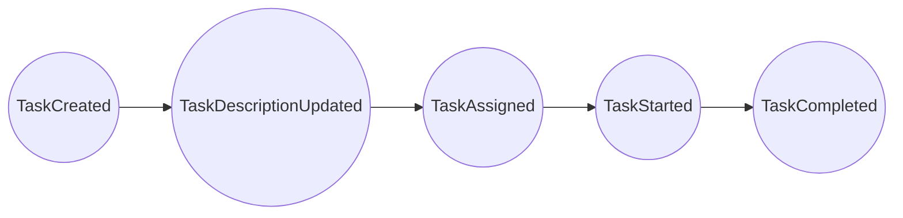

##### 2. PM 補充狀態與阻塞

PM：

我會關注任務狀態。任務不只是開始與完成，中間可能會有狀態變化。

例如從 Todo 到 In Progress，再到 Done。

我覺得應該有：

TaskStatusChanged

RD：

那 TaskStarted 會不會只是 TaskStatusChanged 的一種？

Facilitator：

這是很好的問題，但本輪先不合併事件。我們先保留兩者，後面整理時再判斷。

PM：

任務也可能被阻塞，例如等人回覆、等資料、等環境。

TaskBlocked

阻塞解除後：

TaskUnblocked
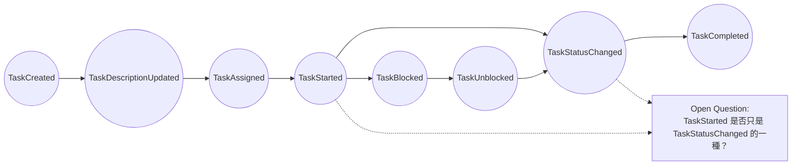

##### 3. PO 補充需求釐清與任務拆分

PO：

從產品角度，我在意任務是否有清楚的需求。

有些任務一開始只有很模糊的描述，後來需求才被釐清。

我會加：

TaskRequirementClarified

RD：

TaskDescriptionUpdated 和 TaskRequirementClarified 好像不完全一樣。

TaskDescriptionUpdated 比較像資料變更。

TaskRequirementClarified 比較像業務語意變清楚。

Facilitator：

很好，兩個先保留，後面再判斷是否都是真正的 [Domain Event](../tech-base/domain-event.md)。

PO：

任務有時候太大，會被拆成幾個比較小的任務。

TaskSplit

PM：

任務也可能依賴其他任務。

例如 A 任務完成後，B 任務才能開始。

TaskDependencyAdded

Facilitator：

這兩個可能超出 v0.1 核心流程，但先貼上，後面可放入 Future / Maybe。

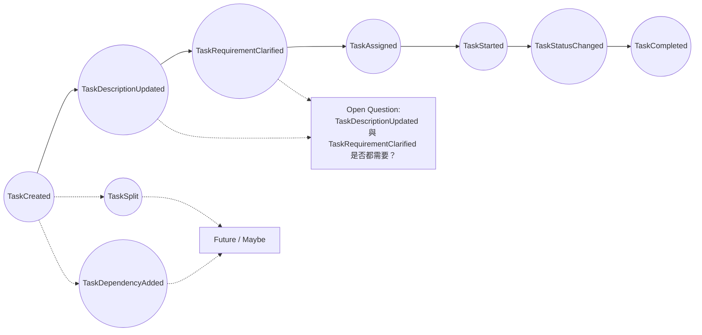

##### 4. RD 補充負責人異動

RD：

我想確認，任務建立後一定會被指派嗎？

還是可以先建立在 Backlog 裡，之後才指派？

Domain Expert：

很多工具都允許先建立未指派任務。

任務可能之後才被指派。

RD：

那除了 TaskAssigned，可能也會有取消指派。

TaskUnassigned

任務也可能從一個人改派給另一個人。

TaskReassigned

PM：

這對追蹤責任很重要。

Facilitator：

先保留。後面再判斷 TaskReassigned 是否可以用 TaskAssigned 表達。

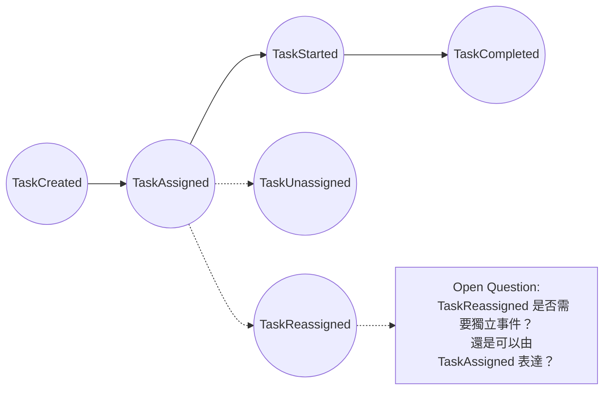

##### 5. QA 補充驗收、退回與重新開啟

QA：

如果只說 TaskCompleted，我會擔心太簡化。

很多任務不是做完就完成，可能要提交檢查或驗收。

我會補：

TaskSubmittedForReview

PO：

如果驗收通過，可能是任務被接受。

TaskAccepted

QA：

如果驗收不通過，任務會被退回。

TaskRejected

QA：

退回後任務可能重新被打開。

TaskReopened

PM：

但 v0.1 不一定要有 Review 流程。

Facilitator：

同意。這些事件先列為「完成語意相關事件」，不代表 v0.1 都會實作。

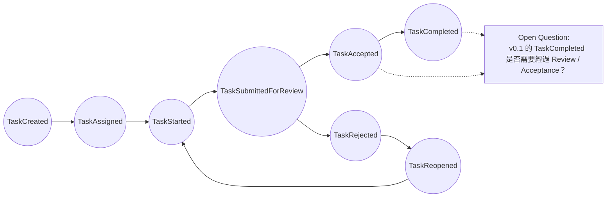

##### 6. UX 補充看板操作

UX：

從使用者角度，任務會在看板上被拖曳到不同欄位。

這對使用者來說是一個很明確的事件。

可以叫：

TaskMovedOnBoard

RD：

如果看板欄位代表任務狀態，那 TaskMovedOnBoard 可能只是 TaskStatusChanged。

PM：

但在同一欄裡調整任務順序，就不是狀態變更。

UX：

那應該還有：

TaskOrderChanged

Facilitator：

很好。先保留兩個事件，後面再釐清它們和狀態變更的關係。

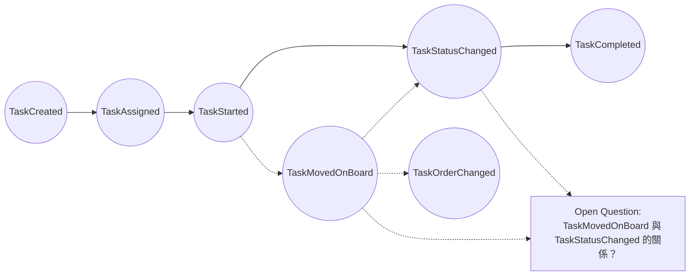

##### 7. 領域專家補充任務內容異動

Domain Expert：

任務標題可能會被修改。

TaskTitleChanged

任務優先度可能會被調整。

TaskPriorityChanged

截止日可能被設定。

TaskDueDateSet

截止日也可能被修改。

TaskDueDateChanged

也可能被移除。

TaskDueDateRemoved

QA：

這些看起來比較像屬性變動，但可能會影響任務管理。

Facilitator：

本輪先記錄，後面再判斷哪些是 [Domain Event](../tech-base/domain-event.md)，哪些只是 [Audit Log](../tech-base/audit-log.md) 或 [Activity Log](../tech-base/activity-log.md)。

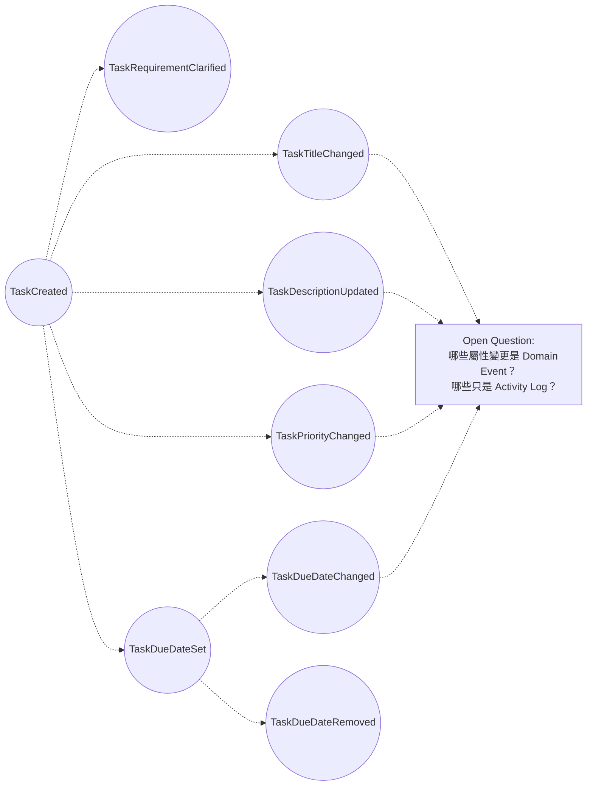

##### 8. QA 補充取消、刪除與封存

QA：

任務不一定會完成，也可能被取消。

TaskCanceled

PO：

任務也可能被刪除。

TaskDeleted

RD：

TaskDeleted 可能比較像資料管理操作，不一定是業務事件。

PM：

如果任務已經進行到一半，通常不應該直接刪除，而是取消或封存。

Domain Expert：

那應該也有：

TaskArchived

Facilitator：

三個都先保留，但後面要釐清語意。

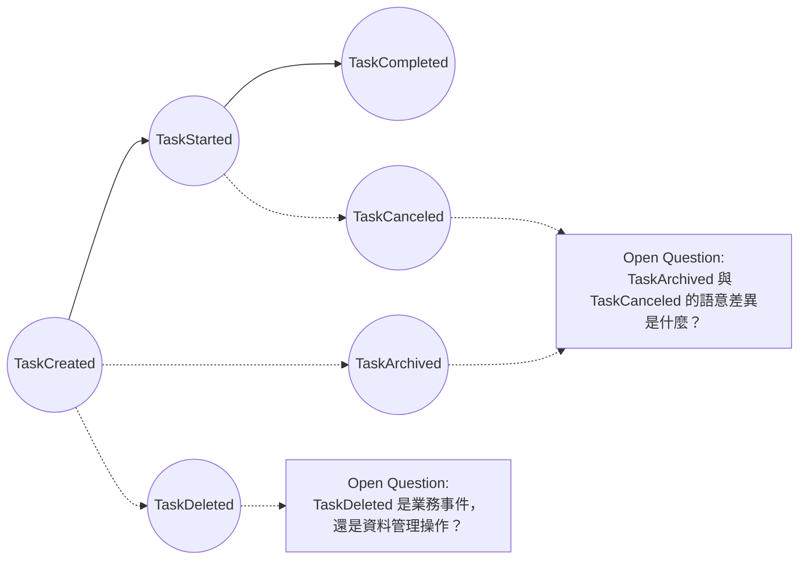

##### 9. PO 與 QA 補充驗收條件

PO：

有些任務在完成前，應該要有驗收條件。

也許有：

AcceptanceCriteriaAdded

QA：

驗收條件可能被更新。

AcceptanceCriteriaUpdated

而且驗收條件可能被確認通過。

AcceptanceCriteriaVerified

RD：

這可能會讓範圍變大，但它跟任務完成很相關。

Facilitator：

先放在「完成語意相關事件」。後續再判斷 v0.1 是否納入。

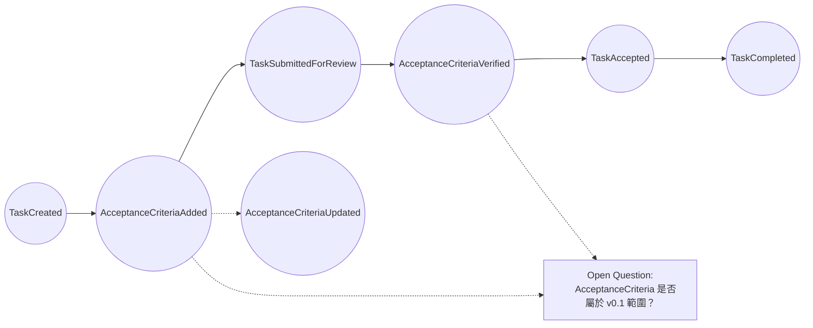

#### 第一輪完整白板

以下是本輪事件發散後的完整事件圖。

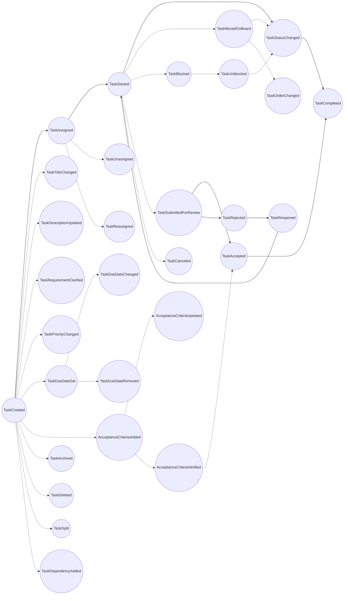

2026/04/25 13:30。

### 梳理業務規則-事件風暴02

Facilitator：

「我們開始第二輪事件風暴。」

「上一輪我們已經先發散出一批候選 Domain Events，例如：

TaskCreated
TaskAssigned
TaskStarted
TaskStatusChanged
TaskSubmittedForReview
TaskAccepted
TaskRejected
TaskReopened
TaskCompleted
TaskCanceled
TaskArchived
TaskDeleted
TaskBlocked
TaskUnblocked
TaskMovedOnBoard
TaskOrderChanged
」

「但在進入下一步之前，RD 提出了一個重要觀點：RonFlow 是一個專案管理工具，不是某個固定流程的內部系統。因此，我們不應該把所有狀態寫死。」

「也就是說，像這些事件：
TaskStarted
TaskSubmittedForReview
TaskCompleted
TaskBlocked

」

「可能不應該都成為固定的系統事件，而是要考慮是否能抽象成：」

TaskStateChanged

「再由使用者自訂的 Workflow State 來承載具體語意。」

「所以本輪目標不是繼續找更多事件，而是整理上一輪事件，並建立第一版任務生命週期時間線。」

「本輪要完成三件事：」

1. 排出 Task 從建立到完成的最小主流程。
2. 找出哪些具體事件應該被抽象成 TaskStateChanged。
3. 標記哪些事件暫時放到 Future / Open Questions。

Domain Expert：

「我同意這輪先整理流程。不過我想補充一下，雖然系統不一定要寫死 TaskStarted 或 TaskCompleted，但在真實專案管理裡，這些詞還是有業務意義。」

「例如：」

任務開始了
任務進入驗收
任務完成了
任務被退回了

「我也同意。RonFlow 應該允許不同團隊自己定義流程，但產品本身還是要知道某些狀態的大分類。」

「例如使用者可以把狀態命名為：」

開發中
處理中
施工中

「但系統可能需要知道它們都屬於：」

Active

「同樣地，使用者可以把完成狀態叫：」

Done
完成
已結案
已交付

「但系統可能需要知道它們都屬於：」

Done / Final

PM：

「從管理角度來看，我關心的是：」

任務是否尚未開始
任務是否正在進行
任務是否等待檢查
任務是否完成
任務是否被取消

「所以我不一定要求狀態名稱固定，但希望系統至少能判斷任務目前在哪一種管理階段。」

QA：

「那我會在意一件事：如果狀態可以自訂，我們怎麼判斷任務是否真的完成？」

「例如使用者可以建立一個狀態叫 Finished，也可以叫 Closed，也可以叫 已驗收。如果沒有狀態分類，測試和驗收會很難判斷。」

Facilitator：

「目前聽起來，本輪有一個初步共識：」

RonFlow 不應該寫死所有任務狀態名稱。
但 RonFlow 需要保留一些狀態語意分類，讓系統可以理解任務目前的大致階段。

「也就是可能需要類似：」

WorkflowState.Category

「例如：」

Backlog
Ready
Active
Review
Done
Canceled

「但這只是候選，這一輪先不定案。」

RD：

「上述這些我都同意。不過我想補充兩個問題。」

「第一個問題是：同一個任務狀態，對不同角色可能有不同含意。」

「例如需求尚未釐清時，對 RD 來說，這個任務可能是 not ready 或 blocked，因為 RD 無法開始開發；但對 PM 來說，這件事反而可能是 active，因為 PM 必須立刻協調人員、釐清需求，讓任務變得可執行。」

「同樣地，如果任務已經交付 QA 驗收，對 RD 來說可能是 done，因為 RD 的工作結束了；但對 QA 來說，這件事才剛進入 ready，因為 QA 的驗收工作準備開始。」

「第二個問題是：系統是否需要支援『緊急任務』或『插單』？」

「實務開發上，總是會遇到突如其來的緊急事件，例如 production bug、主管臨時交辦、客戶重大問題。這些任務會打斷原本的排序與 Sprint 節奏。」

「所以我想問：RonFlow 是否應該在任務上支援 urgent 標記？或者它其實不只是標記，而是會影響任務排序、WIP、目前進行中的工作，甚至影響 Sprint 承諾？」

Facilitator：

「這兩個問題都很重要，而且它們指出了同一件事：」

Task 的狀態不一定只有一條線。
同一個 Task 可能同時在不同角色、不同工作流、不同責任視角下呈現不同狀態。

「上一輪我們討論的是 TaskStateChanged，但現在 RD 提出：」

TaskState 可能不是單一狀態，而是與 Workflow / Role / Responsibility 有關。

「這代表我們需要小心，不要太早把 Task 設計成只有一個 CurrentStateId。」

Domain Expert：

「RD 的說法很真實。」

「在實務上，一個任務常常不是一個人完成，而是經過多個角色接力。」

「例如一張任務卡可能叫：」

建立登入功能

「但它背後可能包含：」

PM 釐清需求
RD 開發
QA 測試
PO 驗收

「所以如果只問『這個 Task 現在是什麼狀態』，答案可能會太粗。」

「比較真實的問法可能是：」

這個 Task 對哪個角色而言，現在處於什麼狀態？

PM：

「我會把它拆成兩個層次。」

「第一層是任務本身在整體流程中的狀態，例如：」

Backlog
Ready
In Progress
Review
Done

「第二層是目前誰需要採取行動。」

「例如需求未釐清時，任務整體可能還不是 Ready，但目前 action owner 是 PM。」

「所以對 PM 來說它是 active，但不是因為 Task 已經可以開發，而是因為 PM 有一個待處理責任。」

PO：

「我覺得 RD 提出的問題會導出一個很重要的模型區分。」

「我們可能不能只設計：」

Task.CurrentState

「而要區分：」

Task Workflow State
Responsibility / Assignment State

「例如：」

層次	問題
Task Workflow State	這張任務在整體流程中走到哪裡？
Responsibility State	現在輪到誰處理？
Role-specific View	對某個角色來說，這件事是 ready、active、done 還是 blocked？

QA：

「RD 說『交付 QA 對 RD 是 done，但對 QA 是 ready』，這個很精準。」

「如果系統只記錄 TaskCompleted，會誤導。」

「對 RD 來說，可能是：」

DevelopmentCompleted

「對 QA 來說，可能是：」

TestingReady

「對整個 Task 來說，可能只是：」

TaskEnteredReviewState

「所以我認為整體任務完成和某個角色的工作完成，應該分開。」

Facilitator：

「目前產生幾個候選概念，我先記在白板上，不代表定案。」

TaskState
WorkflowState
RoleViewState
Responsibility
ActionOwner
Urgency
Interruption

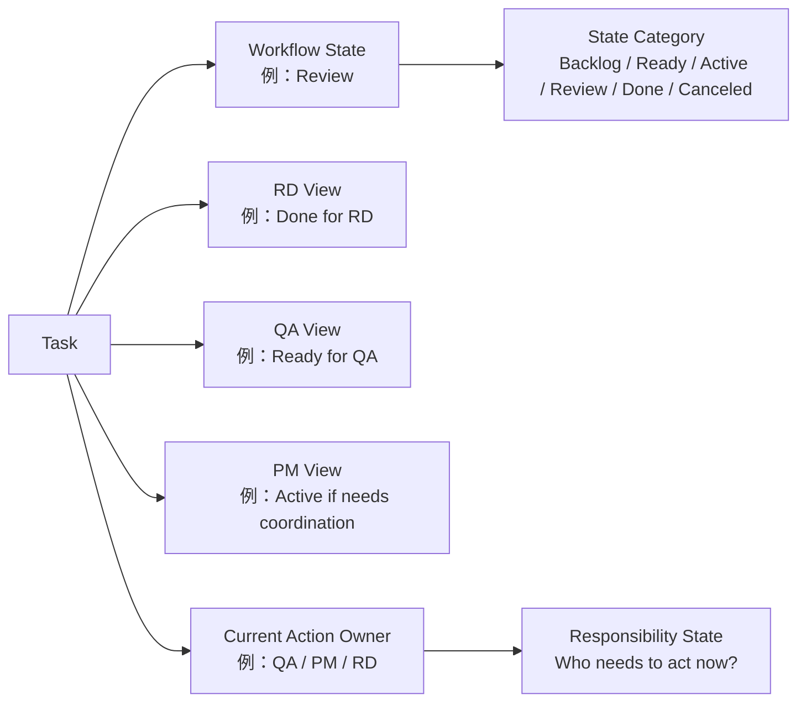

Facilitator：

「接著討論第二個問題：緊急任務或插單。」

「我們先不要急著決定 UI 上是不是一個紅色標籤。先問業務上發生了什麼。」

PM：

「緊急任務不只是 priority 高。」

「在實務上，緊急任務通常代表：」

原本的工作順序被打斷
原本的 Sprint 承諾被影響
某些正在進行中的任務可能被暫停
團隊需要重新分配人力

「所以如果只做一個 Priority = High，可能不夠。」

Domain Expert：

「實務上插單通常需要留下原因。」

「例如：」

Production issue
客戶重大問題
法規期限
主管指示
安全漏洞
資料錯誤

「否則一堆人都標 urgent，最後 urgent 就失去意義。」

QA：

「緊急不代表可以跳過驗收。」

「反而 emergency task 常常風險更高，因為它打斷流程、壓縮時間。」

「系統應該至少讓團隊知道：」

這是緊急任務
為什麼緊急
誰宣告緊急
是否影響原本工作
是否需要後續補測或補文件

PO：

「我會區分 Priority 和 Urgency。」

概念	意義
Priority	相對重要性，代表這件事和其他工作相比的產品價值或排序
Urgency	時間壓力，代表這件事需要立即處理
Interruption	對原本計畫造成中斷，需要調整工作流

「有些事情 priority 很高，但不一定 urgent。」

「有些事情 urgent，但長期產品價值不一定高，例如 production bug。」

RD：

「如果是緊急任務，技術上可能不只是把卡片排序拉到最上面。」

「它可能需要：」

建立任務
標記為緊急
記錄插單原因
中斷或暫停某些工作
重新安排 assignee
改變 Sprint Backlog

「這可能會產生一串事件，不只是一個欄位變更。」

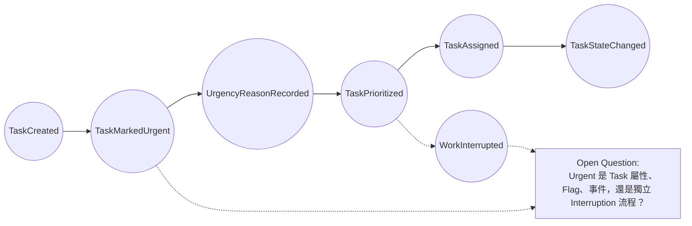

Facilitator：

「RD 的兩個問題讓我們發現，本輪不能只把上一輪事件全部粗暴合併成 TaskStateChanged。」

「我們需要保留幾個新的 Open Questions。」

1. Task 是否只有一個 CurrentState？
   還是需要區分整體 Workflow State 與 Role-specific State？

2. 同一個 Task 對不同角色的 ready / active / done 是否需要被系統建模？
   還是只是不同角色在看板上的 View？

3. 是否需要 Current Action Owner？
   用來表示現在輪到誰處理。

4. RD 的 done、QA 的 ready、整體 Task 的 review 是否應該用同一個 workflow 表達？

5. Urgent 是否只是 priority？
   還是獨立於 priority 的 urgency / interruption 概念？

6. 緊急插單是否需要留下原因與影響紀錄？

7. v0.1 是否要處理 urgent task？
   或先放入 Future / Maybe？

1. RonFlow 不應寫死 TaskStarted / TaskCompleted 等固定狀態事件。

2. 多數狀態變化可以先抽象成 TaskStateChanged。

3. 但 TaskStateChanged 背後可能需要 WorkflowState.Category，
   否則系統無法理解狀態的大致語意。

4. 同一個 Task 的狀態可能依角色視角不同而有不同含意。
   這可能導出 Current Action Owner、Role-specific View 或 Responsibility State。

5. 緊急任務不是單純 priority high。
   它可能是一種 urgency / interruption，會影響排序、責任分配與原本工作計畫。

6. v0.1 暫時不急著實作角色視角狀態與緊急插單，
   但應該在事件風暴中保留為重要設計議題。

   PO：

「我會先把 RonFlow v0.1 定位成：」

一個小團隊可以自架使用的最小專案管理工具。

「v0.1 的目標不是一次做出最完整的企業級流程，而是先讓使用者可以完成最基本的事情：」

建立 Project
建立 Task
把 Task 放進看板流程
改變 Task 狀態
看到 Task 是否完成
保留基本開發與管理紀錄

「所以我不希望 v0.1 太早進入複雜的角色視角狀態。」

「像 RD 說的：同一個 Task 對 RD 是 done、對 QA 是 ready，這是很真實的情境。但這可能意味著我們要處理：」

角色
責任轉移
工作交接
驗收階段
多角色 workflow

「這些對產品長期很重要，但對 v0.1 來說會太大。」

Domain Expert：

「我也同意這是真實業務問題。」

「在實際團隊裡，同一張任務卡確實常常同時對不同角色有不同意義。」

「例如：」

PM：需求待釐清，是 active
RD：需求不清楚，是 blocked / not ready
QA：尚未交付，是 not ready

「但如果我們是做第一版工具，我會建議先不要把每個角色的狀態都建成獨立 workflow。」

「比較務實的做法是：」

Task 有一個整體 Workflow State
再用 Assignee / Current Action Owner / Comment / Activity Log 輔助說明目前誰需要處理

「也就是說，v0.1 先回答：」

這張任務整體走到哪裡？

「未來再回答：」

這張任務對每個角色而言分別走到哪裡？

PM：

「我覺得 PO 和 Domain Expert 的方向合理。」

「但我會建議 v0.1 至少要保留一個概念：」

現在輪到誰處理？

「因為如果需求不清楚，Task 整體可能還在 Backlog 或 Ready 之前，但實務上 PM 正在處理。這時如果沒有任何欄位表示目前責任人，管理上會不清楚。」

「所以我會建議：」

v0.1 不做 Role-specific State。
但可以有 Current Action Owner 或 Assignee。

「不過如果 v0.1 只想更小，也可以先只做 Assignee，Current Action Owner 放到後面。」

QA：

「我可以接受 v0.1 先不做多角色狀態。」

「但我會要求一點：」

Done 的定義要清楚。

「如果 v0.1 允許使用者自己定義 workflow state，那至少要有 state category，否則系統不知道哪個狀態是完成。」

「例如使用者可以叫：」

Done
已完成
已結案
已驗收

「但系統至少要知道它屬於：」

Done

「不然測試、統計、完成率、看板篩選都會很難做。」

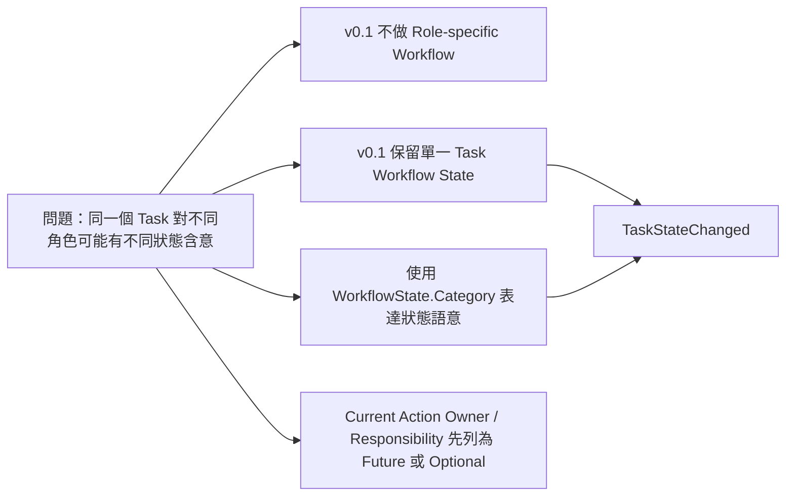

Facilitator：

「那緊急任務呢？PO，你認為 v0.1 要不要支援？」

PO：

「我認為緊急任務是實務上非常重要的情境。」

「但是，如果我們要完整處理插單，可能會牽涉到：」

Sprint 承諾變更
原任務中斷
人力重新分配
插單原因
影響評估
事後檢討

「這會變成另一個大功能。」

「所以我建議 v0.1 不做完整 Interruption Workflow，但可以做最小支援：」

Urgent flag
Urgency reason
Priority

「這樣至少可以讓使用者標記：」

這是一個緊急任務
為什麼緊急
它和普通高優先度任務不同

Domain Expert：

「我同意要做簡化版，但緊急不能只是勾選。」

「因為真實團隊裡很容易每個人都說自己的任務很急。」

「所以如果有 Urgent，至少應該要求：」

Urgency Reason

「例如：」

Production Bug
Security Issue
Customer Escalation
Legal Deadline
Data Correction
Manager Request

「不一定一開始就做完整分類，但至少要有文字原因。」

PM：

「我也建議 v0.1 區分 Priority 和 Urgent。」

Priority：相對重要性
Urgent：是否需要立即處理

「例如技術債可能 Priority 高，但不一定 urgent。」

「Production bug 可能 urgent，即使它不是產品路線圖中最有價值的項目。」

QA：

「我希望系統語意上不要暗示 urgent 可以跳過品質流程。」

「如果只是 Urgent flag，那還可以接受。」

「如果做完整 Interruption Workflow，就要處理緊急任務是否需要補測、補文件、補 review。這個 v0.1 先不要做。」

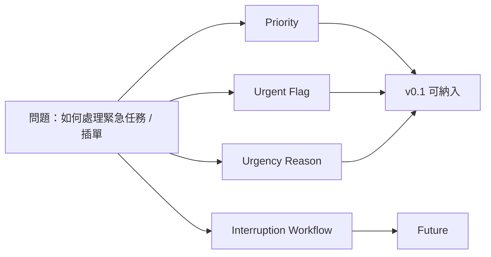

暫定產品決策
v0.1 支援基本 Urgent 標記。
Urgent 與 Priority 分開。
Urgent 需要留下原因。
v0.1 不做完整 Interruption Workflow。
完整插單影響分析、暫停原任務、Sprint 承諾變更，列為 Future。

Round 1 最終收斂結論
角色視角狀態
v0.1 不做 Role-specific Workflow。
v0.1 採用單一 Task Workflow State。
Workflow State 可由使用者命名。
但系統需要 WorkflowState.Category 來理解狀態語意。
Current Action Owner / Responsibility 先列為 Open Question 或 Future。
緊急任務
v0.1 支援 Priority。
v0.1 支援 Urgent flag。
Urgent 與 Priority 分開。
Urgent 需要 reason。
完整插單流程列為 Future。

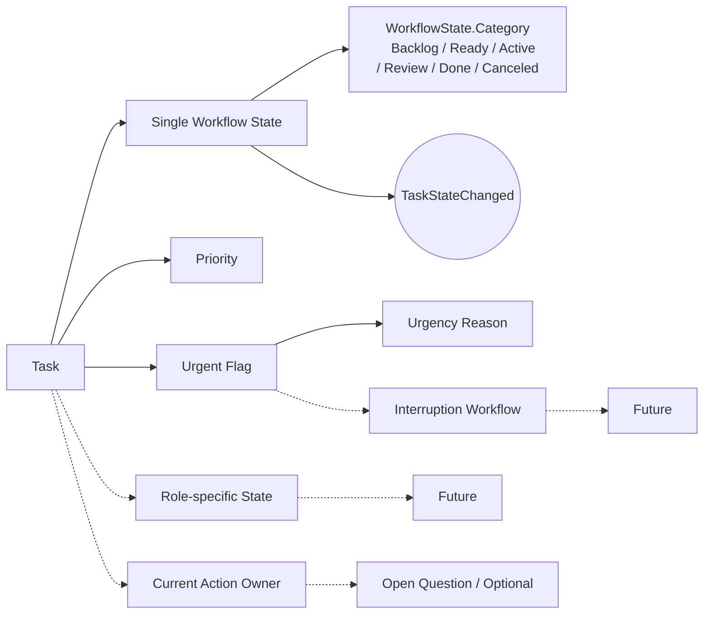

本輪新增事件候選

因為 PO / Domain Expert 決定 v0.1 支援簡化緊急任務，所以事件清單可能新增：

TaskMarkedUrgent
TaskUrgencyReasonRecorded
TaskUnmarkedUrgent
TaskPriorityChanged

但這些在本輪先列為候選，不急著定案。

