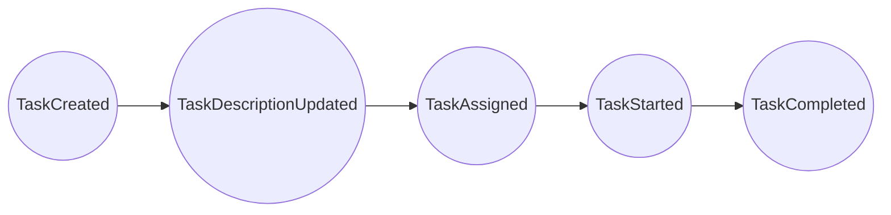
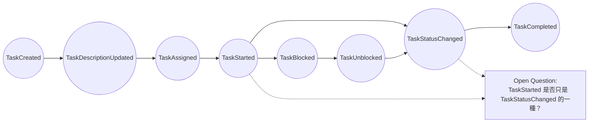
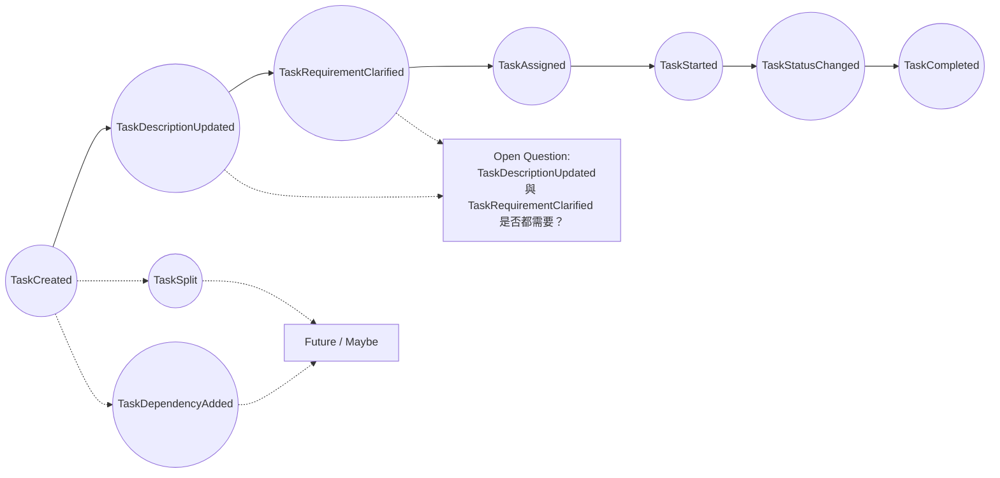
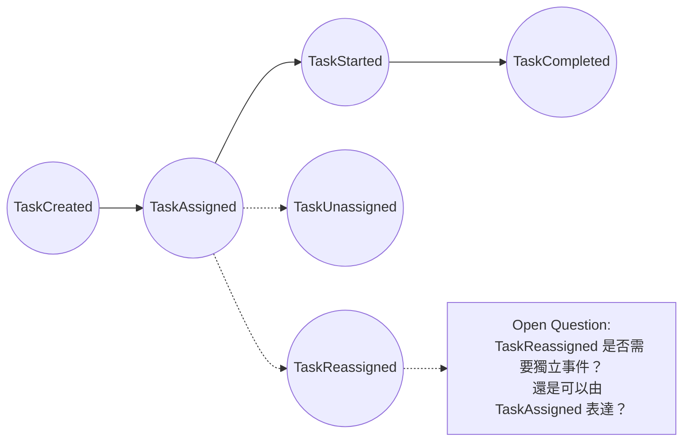
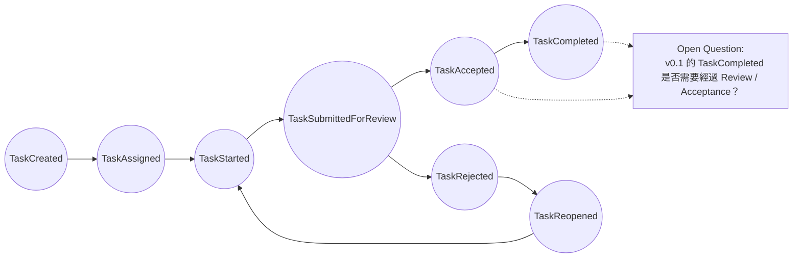
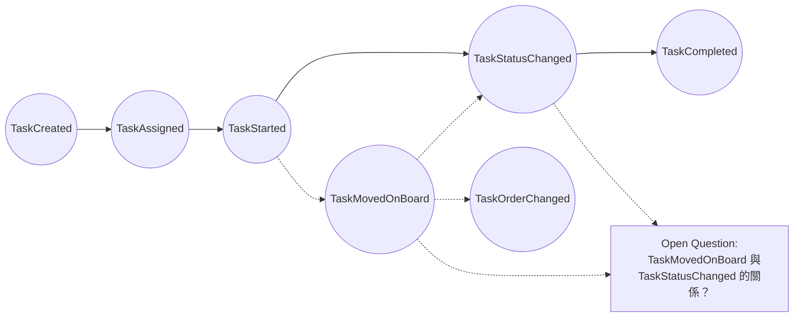
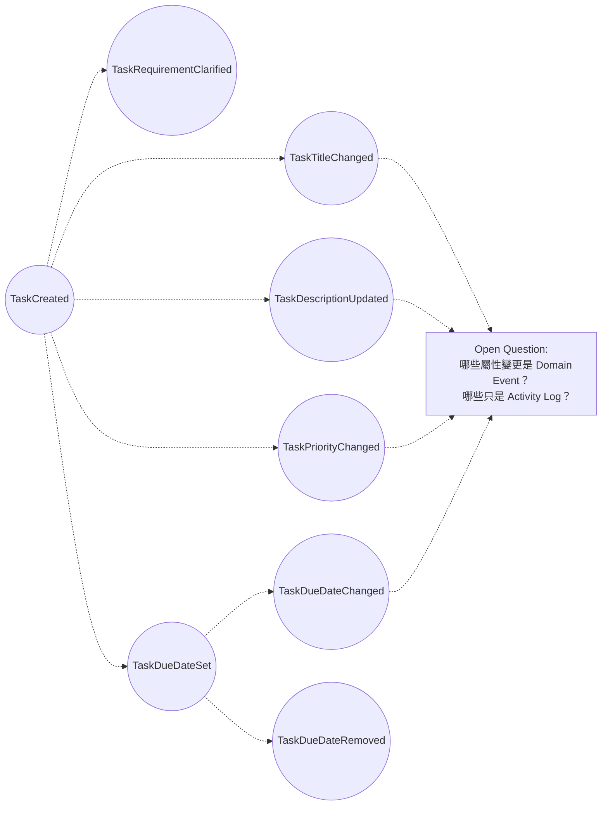
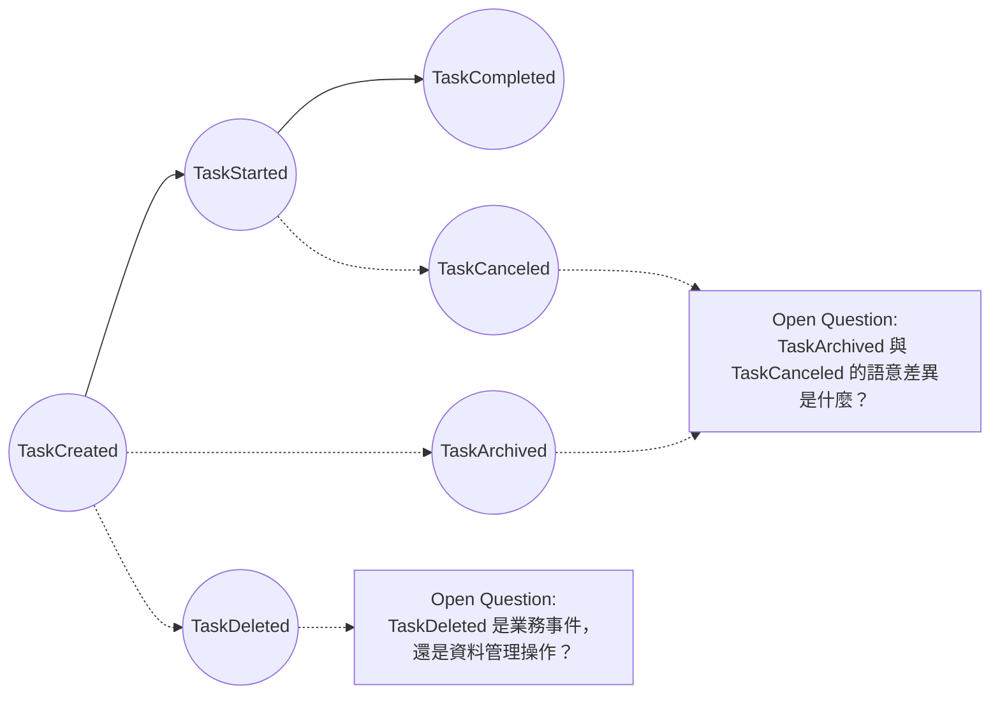
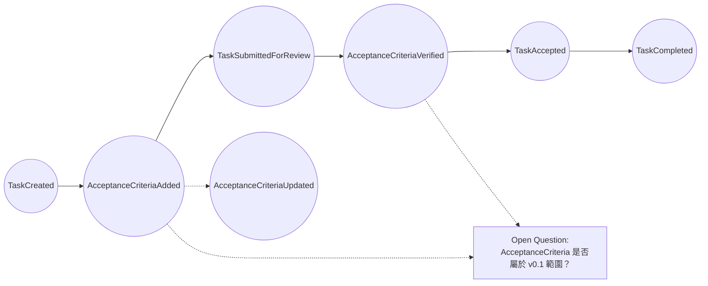
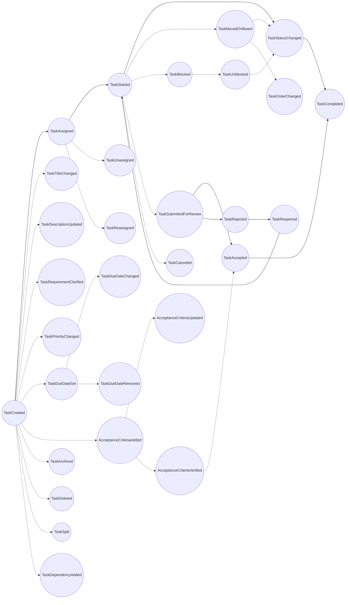

# devlog

開發過程的思維紀錄。

## 目錄

- [專案起跑](#devlog-project-kickoff)
- [專案管理前置作業：建立 Backlog 與 Workflow](#devlog-project-management-setup)
- [梳理業務規則](#devlog-domain-rules)
- [事件風暴會議模擬](#devlog-event-storming-simulation)

### 專案起跑

基於某種深植於靈魂的呼喚，我深深的被軟體工程所吸引。我不是資訊領域背景的，也不是甚麼天賦異稟的奇才，我只是**喜歡**這件事，從我第一個專案開始，我就意識到，軟體開發過程中不可避免的混亂，都會體現在程式碼中，最終化成埋藏在專案裡深處的地雷，在未來的某個時間點引爆。因此，在我連迴圈都寫得零零落落的菜鳥時期，我就在思考程式碼的結構、命名，乃至團隊開發流程等議題。

總之，這份動力驅使我在節奏緊湊的軟體產業裡摸爬滾打直到如今，我也何其有幸探索到諸如 [XP](../tech-base/xp.md)、[Scrum](../tech-base/scrum.md)、[Domain Modeling](../tech-base/domain-modeling.md)、[BDD](../tech-base/bdd.md)（[TDD](../tech-base/tdd.md)、[ATDD](../tech-base/atdd.md)）等深刻而優美的軟體工程的解決方案。在如今 AI 賦能的浪潮下，就像是終於為這顆運轉不休的引擎找到了合適的汽車，我終於可以開始親手實踐這些東西。

於是，這個專案就這樣誕生了。不知道這個專案能持續運作到甚麼時候，我看著那些靜靜躺在我的 [GitHub repo](../tech-base/github-repository.md) 的七十幾個專案，也許這個專案也是一樣，沒更新過幾次，就又會被新一輪生活忙亂攪起的渾水淤泥給掩埋，沉積在時間的長河裡。

也或許一切會有所不同。

特別感謝 [泰迪軟體](https://teddysoft.tw/) 的啟發，泰迪老師對知識的嚴謹和熱愛，以及不吝分享的個性，讓我得以深深體會到軟體工程領域的趣味。這個專案裡面提到的許多的軟體工程的知識和技術，也都是在泰迪的部落格、YouTube，或者工作坊裡面學到的。

歡迎所有熱愛軟體工程的夥伴們，一起討論各式各樣的議題。

那我們就開始吧。

2026/04/25 02:53。

### 專案管理前置作業：建立 [Backlog](../tech-base/backlog.md) 與 [Workflow](../tech-base/workflow.md)

在我對敏捷初淺的理解內，[Backlog](../tech-base/backlog.md) 大致等同於待辦清單，把一個專案分解成若干個待辦事項，可以更清楚的掌握專案進度，如果使用 [Kanban](../tech-base/kanban.md) 等方式管理專案，更可以統計出每個流程的 [WIP](../tech-base/wip.md)，更能夠確認是哪個環節是瓶頸，進而挹注必要資源，提升產能。

至於 [Backlog](../tech-base/backlog.md) 裡面要寫甚麼，一個簡單的指標是「所有可能讓產品更接近目標的工作收斂到一個可排序、可討論、可取捨的清單裡」。

因此 [Backlog](../tech-base/backlog.md) 是服膺於某個目標之下的，在和 AI 討論過後，我先將目標暫定為「建立 RonFlow 的最小可用開源版本，使使用者可以自架系統，建立專案、建立任務，並透過簡單的 [看板](../tech-base/kanban.md) 追蹤任務狀態。同時，專案本身要展現清楚的 [.NET](../tech-base/dotnet.md) 架構、測試策略、開發紀錄與架構決策」。

從上述目標可以得知，RonFlow v0.1 至少會包含幾種工作類型：

- 產品功能，例如 Project、Task、[Kanban Board](../tech-base/kanban.md)
- 工程建設，例如 [.NET](../tech-base/dotnet.md) solution、[分層架構](../tech-base/layered-architecture.md)、測試專案、資料庫設定
- 架構決策，例如技術選型、專案結構、[Domain Model](../tech-base/domain-model.md) 邊界
- 測試與驗收，例如 [ATDD](../tech-base/atdd.md)、[Acceptance Criteria](../tech-base/acceptance-criteria.md)、[Integration Test](../tech-base/integration-test.md)
- 文件與開發紀錄，例如 README、tech-base、devlog、[ADR](../tech-base/adr.md)

接著，我需要替這些工作項目設計一個簡單的 [Workflow](../tech-base/workflow.md)。第一版暫定如下：

- `Backlog`：值得保存，但尚未準備執行的想法或工作項目。
- `Ready`：已經足夠清楚，可以被放進近期 [Sprint](../tech-base/sprint.md) 或直接開始處理的項目。
- `In Progress`：目前正在進行的工作。
- `Review`：已完成初步處理，等待檢查、補文件、整理測試或確認是否符合完成條件。
- `Done`：符合 [Definition of Done](../tech-base/definition-of-done.md)，可以視為完成的項目。

配合這次想導入的 [ATDD](../tech-base/atdd.md) 與 [Outside-In](../tech-base/outside-in.md) 開發模式，功能型 Backlog Item 會盡量依照以下方式推進：

- 定義需求與驗收條件
- 撰寫驗收測試
- 從使用者介面或 [API](../tech-base/api.md) 入口開始設計
- 推進到 [Application Layer](../tech-base/application-layer.md)
- 調整 [Domain Model](../tech-base/domain-model.md)
- 補足 [Infrastructure](../tech-base/infrastructure.md) 實作
- 補上必要的開發紀錄

不過，這套流程不會被機械式套用到所有工作項目。像是文件、研究、架構決策或專案結構調整，可能會有不同的完成方式。對我來說，[Workflow](../tech-base/workflow.md) 的目的不是製造儀式感，而是讓工作狀態可以被看見，讓我知道自己現在正在做什麼、卡在哪裡，以及下一步該往哪裡推進。

在和 AI 討論後，AI 推薦我直接使用 [GitHub Project](../tech-base/github-project.md)，對目前的專案進行管理。

按下新增之後，跳出的視窗，依照我這個專案開發的需求，選擇"kanban"feature。

會問你要不要把 issue 匯入。

建立完成就會跑到這個畫面。

透過 Add Item 來建立項目(底下會跳出輸入框讓你輸入 Item 的標題，但操作上沒有那麼直觀)

不知道為什麼，要選擇 [repo](../tech-base/github-repository.md)

大致上工作了一下。

至此，我們就完成了專案管理的前置作業。

2026/04/25 09:09。

### 梳理業務規則

接下來，我打算透過 [Event Storming](../tech-base/event-storming.md) 來梳理專案管理工具的業務規則，在這一步，通常會有所謂的領域專家一同參與，釐清流程。

我不是專家，但 AI 可以是啊。尤其軟體開發這個領域並不是封閉的，AI 有足夠的文本可以訓練。

當然，AI 可能會出錯，就像現實中任何的領域專家一樣。而軟體之所以「軟」，就是因為試錯、糾正的成本相對於硬體是低的，所以我認為 AI 的專業程度在開發初期絕對夠用。

事件風暴的進行方式，我先暫時整理成以下步驟：

1. 先定義本次 [Event Storming](../tech-base/event-storming.md) 的範圍。
2. 找出「已經發生的業務事實」，也就是候選的 [Domain Event](../tech-base/domain-event.md)。
3. 再反推出「是誰觸發的」，例如 actor + command。
4. 再找出「觸發前需要什麼條件」，也就是 condition。
5. 再整理出「哪些模型負責這些規則」，也就是 entity。
6. 最後才進一步形成流程、邊界與系統設計。

#### 事件風暴會議模擬

接下來，這一輪會由 AI 模擬一段 [Event Storming](../tech-base/event-storming.md) 的工作過程，參與人物如下：

- Facilitator / 主持人：負責控制討論節奏，提醒大家只找事件，不急著進入解決方案。
- Domain Expert / 領域專家：假設是一位有多年專案管理經驗的人，熟悉任務如何從需求、開發、測試到完成。
- PM / Project Manager：關注專案進度、任務狀態、可追蹤性、交付節奏。
- PO / Product Owner：關注任務是否能承載產品價值、需求是否被正確表達、完成是否代表可交付。
- RD / Developer：關注任務是否能拆解、狀態是否清楚、哪些事件對系統建模有意義。
- QA / Tester：關注驗收、退回、完成條件、例外情境。
- UX / Designer：關注任務在畫面與使用流程中如何被理解，但本輪不深入 UI。

每個參與事件風暴的人，都被要求在事前先閱讀相關文件 [FirstEventStormDoc](../assets/FirstEventStormDoc.md)，對「專案管理」領域進行一定的了解。

#### 第一輪發散

##### 1. 領域專家提出基本任務生命週期

Domain Expert：

如果從任務開始，第一個一定是任務被建立。

我會先貼：

TaskCreated

Facilitator：

好，TaskCreated 是第一個事件。

Domain Expert：

任務建立後，內容可能還不完整，所以任務描述可能被更新。

TaskDescriptionUpdated

Domain Expert：

接著任務通常會被指派給某個人。

TaskAssigned

Domain Expert：

被指派的人開始處理後，任務就進入進行中。

TaskStarted

Domain Expert：

最後任務被完成。

TaskCompleted

##### 2. PM 補充狀態與阻塞

PM：

我會關注任務狀態。任務不只是開始與完成，中間可能會有狀態變化。

例如從 Todo 到 In Progress，再到 Done。

我覺得應該有：

TaskStatusChanged

RD：

那 TaskStarted 會不會只是 TaskStatusChanged 的一種？

Facilitator：

這是很好的問題，但本輪先不合併事件。我們先保留兩者，後面整理時再判斷。

PM：

任務也可能被阻塞，例如等人回覆、等資料、等環境。

TaskBlocked

阻塞解除後：

TaskUnblocked

##### 3. PO 補充需求釐清與任務拆分

PO：

從產品角度，我在意任務是否有清楚的需求。

有些任務一開始只有很模糊的描述，後來需求才被釐清。

我會加：

TaskRequirementClarified

RD：

TaskDescriptionUpdated 和 TaskRequirementClarified 好像不完全一樣。

TaskDescriptionUpdated 比較像資料變更。

TaskRequirementClarified 比較像業務語意變清楚。

Facilitator：

很好，兩個先保留，後面再判斷是否都是真正的 [Domain Event](../tech-base/domain-event.md)。

PO：

任務有時候太大，會被拆成幾個比較小的任務。

TaskSplit

PM：

任務也可能依賴其他任務。

例如 A 任務完成後，B 任務才能開始。

TaskDependencyAdded

Facilitator：

這兩個可能超出 v0.1 核心流程，但先貼上，後面可放入 Future / Maybe。

##### 4. RD 補充負責人異動

RD：

我想確認，任務建立後一定會被指派嗎？

還是可以先建立在 Backlog 裡，之後才指派？

Domain Expert：

很多工具都允許先建立未指派任務。

任務可能之後才被指派。

RD：

那除了 TaskAssigned，可能也會有取消指派。

TaskUnassigned

任務也可能從一個人改派給另一個人。

TaskReassigned

PM：

這對追蹤責任很重要。

Facilitator：

先保留。後面再判斷 TaskReassigned 是否可以用 TaskAssigned 表達。

##### 5. QA 補充驗收、退回與重新開啟

QA：

如果只說 TaskCompleted，我會擔心太簡化。

很多任務不是做完就完成，可能要提交檢查或驗收。

我會補：

TaskSubmittedForReview

PO：

如果驗收通過，可能是任務被接受。

TaskAccepted

QA：

如果驗收不通過，任務會被退回。

TaskRejected

QA：

退回後任務可能重新被打開。

TaskReopened

PM：

但 v0.1 不一定要有 Review 流程。

Facilitator：

同意。這些事件先列為「完成語意相關事件」，不代表 v0.1 都會實作。

##### 6. UX 補充看板操作

UX：

從使用者角度，任務會在看板上被拖曳到不同欄位。

這對使用者來說是一個很明確的事件。

可以叫：

TaskMovedOnBoard

RD：

如果看板欄位代表任務狀態，那 TaskMovedOnBoard 可能只是 TaskStatusChanged。

PM：

但在同一欄裡調整任務順序，就不是狀態變更。

UX：

那應該還有：

TaskOrderChanged

Facilitator：

很好。先保留兩個事件，後面再釐清它們和狀態變更的關係。

##### 7. 領域專家補充任務內容異動

Domain Expert：

任務標題可能會被修改。

TaskTitleChanged

任務優先度可能會被調整。

TaskPriorityChanged

截止日可能被設定。

TaskDueDateSet

截止日也可能被修改。

TaskDueDateChanged

也可能被移除。

TaskDueDateRemoved

QA：

這些看起來比較像屬性變動，但可能會影響任務管理。

Facilitator：

本輪先記錄，後面再判斷哪些是 [Domain Event](../tech-base/domain-event.md)，哪些只是 [Audit Log](../tech-base/audit-log.md) 或 [Activity Log](../tech-base/activity-log.md)。

##### 8. QA 補充取消、刪除與封存

QA：

任務不一定會完成，也可能被取消。

TaskCanceled

PO：

任務也可能被刪除。

TaskDeleted

RD：

TaskDeleted 可能比較像資料管理操作，不一定是業務事件。

PM：

如果任務已經進行到一半，通常不應該直接刪除，而是取消或封存。

Domain Expert：

那應該也有：

TaskArchived

Facilitator：

三個都先保留，但後面要釐清語意。

##### 9. PO 與 QA 補充驗收條件

PO：

有些任務在完成前，應該要有驗收條件。

也許有：

AcceptanceCriteriaAdded

QA：

驗收條件可能被更新。

AcceptanceCriteriaUpdated

而且驗收條件可能被確認通過。

AcceptanceCriteriaVerified

RD：

這可能會讓範圍變大，但它跟任務完成很相關。

Facilitator：

先放在「完成語意相關事件」。後續再判斷 v0.1 是否納入。

#### 第一輪完整白板

以下是本輪事件發散後的完整事件圖。

