# devlog

開發過程的思維紀錄。

## 目錄

- [專案起跑](#devlog-project-kickoff)
- [專案管理前置作業：建立 Backlog 與 Workflow](#devlog-project-management-setup)
- [梳理業務規則-事件風暴01](#devlog-domain-rules)
- [梳理業務規則-事件風暴02](#devlog-domain-rules-02)
- [梳理業務規則-事件風暴03](#devlog-domain-rules-03)
- [梳理業務規則-事件風暴04](#devlog-domain-rules-04)

### 專案起跑

基於某種深植於靈魂的呼喚，我深深的被軟體工程所吸引。我不是資訊領域背景的，也不是甚麼天賦異稟的奇才，我只是**喜歡**這件事，從我第一個專案開始，我就意識到，軟體開發過程中不可避免的混亂，都會體現在程式碼中，最終化成埋藏在專案裡深處的地雷，在未來的某個時間點引爆。因此，在我連迴圈都寫得零零落落的菜鳥時期，我就在思考程式碼的結構、命名，乃至團隊開發流程等議題。

總之，這份動力驅使我在節奏緊湊的軟體產業裡摸爬滾打直到如今，我也何其有幸探索到諸如 [XP](../tech-base/xp.md)、[Scrum](../tech-base/scrum.md)、[Domain Modeling](../tech-base/domain-modeling.md)、[BDD](../tech-base/bdd.md)（[TDD](../tech-base/tdd.md)、[ATDD](../tech-base/atdd.md)）等深刻而優美的軟體工程的解決方案。在如今 AI 賦能的浪潮下，就像是終於為這顆運轉不休的引擎找到了合適的汽車，我終於可以開始親手實踐這些東西。

於是，這個專案就這樣誕生了。不知道這個專案能持續運作到甚麼時候，我看著那些靜靜躺在我的 [GitHub repo](../tech-base/github-repository.md) 的七十幾個專案，也許這個專案也是一樣，沒更新過幾次，就又會被新一輪生活忙亂攪起的渾水淤泥給掩埋，沉積在時間的長河裡。

也或許一切會有所不同。

特別感謝 [泰迪軟體](https://teddysoft.tw/) 的啟發，泰迪老師對知識的嚴謹和熱愛，以及不吝分享的個性，讓我得以深深體會到軟體工程領域的趣味。這個專案裡面提到的許多的軟體工程的知識和技術，也都是在泰迪的部落格、YouTube，或者工作坊裡面學到的。

歡迎所有熱愛軟體工程的夥伴們，一起討論各式各樣的議題。

那我們就開始吧。

2026/04/25 02:53。

### 專案管理前置作業：建立 [Backlog](../tech-base/backlog.md) 與 [Workflow](../tech-base/workflow.md)

在我對敏捷初淺的理解內，[Backlog](../tech-base/backlog.md) 大致等同於待辦清單，把一個專案分解成若干個待辦事項，可以更清楚的掌握專案進度，如果使用 [Kanban](../tech-base/kanban.md) 等方式管理專案，更可以統計出每個流程的 [WIP](../tech-base/wip.md)，更能夠確認是哪個環節是瓶頸，進而挹注必要資源，提升產能。

至於 [Backlog](../tech-base/backlog.md) 裡面要寫甚麼，一個簡單的指標是「所有可能讓產品更接近目標的工作收斂到一個可排序、可討論、可取捨的清單裡」。

因此 [Backlog](../tech-base/backlog.md) 是服膺於某個目標之下的，在和 AI 討論過後，我先將目標暫定為「建立 RonFlow 的最小可用開源版本，使使用者可以自架系統，建立專案、建立任務，並透過簡單的 [看板](../tech-base/kanban.md) 追蹤任務狀態。同時，專案本身要展現清楚的 [.NET](../tech-base/dotnet.md) 架構、測試策略、開發紀錄與架構決策」。

從上述目標可以得知，RonFlow v0.1 至少會包含幾種工作類型：

- 產品功能，例如 Project、Task、[Kanban Board](../tech-base/kanban.md)
- 工程建設，例如 [.NET](../tech-base/dotnet.md) solution、[分層架構](../tech-base/layered-architecture.md)、測試專案、資料庫設定
- 架構決策，例如技術選型、專案結構、[Domain Model](../tech-base/domain-model.md) 邊界
- 測試與驗收，例如 [ATDD](../tech-base/atdd.md)、[Acceptance Criteria](../tech-base/acceptance-criteria.md)、[Integration Test](../tech-base/integration-test.md)
- 文件與開發紀錄，例如 README、tech-base、devlog、[ADR](../tech-base/adr.md)

接著，我需要替這些工作項目設計一個簡單的 [Workflow](../tech-base/workflow.md)。第一版暫定如下：

- `Backlog`：值得保存，但尚未準備執行的想法或工作項目。
- `Ready`：已經足夠清楚，可以被放進近期 [Sprint](../tech-base/sprint.md) 或直接開始處理的項目。
- `In Progress`：目前正在進行的工作。
- `Review`：已完成初步處理，等待檢查、補文件、整理測試或確認是否符合完成條件。
- `Done`：符合 [Definition of Done](../tech-base/definition-of-done.md)，可以視為完成的項目。

配合這次想導入的 [ATDD](../tech-base/atdd.md) 與 [Outside-In](../tech-base/outside-in.md) 開發模式，功能型 [Backlog Item](../tech-base/backlog-item.md) 會盡量依照以下方式推進：

- 定義需求與驗收條件
- 撰寫驗收測試
- 從使用者介面或 [API](../tech-base/api.md) 入口開始設計
- 推進到 [Application Layer](../tech-base/application-layer.md)
- 調整 [Domain Model](../tech-base/domain-model.md)
- 補足 [Infrastructure](../tech-base/infrastructure.md) 實作
- 補上必要的開發紀錄

不過，這套流程不會被機械式套用到所有工作項目。像是文件、研究、架構決策或專案結構調整，可能會有不同的完成方式。對我來說，[Workflow](../tech-base/workflow.md) 的目的不是製造儀式感，而是讓工作狀態可以被看見，讓我知道自己現在正在做什麼、卡在哪裡，以及下一步該往哪裡推進。

在和 AI 討論後，AI 推薦我直接使用 [GitHub Project](../tech-base/github-project.md)，對目前的專案進行管理。

按下新增之後，跳出的視窗，依照我這個專案開發的需求，選擇"kanban"feature。

會問你要不要把 issue 匯入。

建立完成就會跑到這個畫面。

透過 Add Item 來建立項目(底下會跳出輸入框讓你輸入 Item 的標題，但操作上沒有那麼直觀)

不知道為什麼，要選擇 [repo](../tech-base/github-repository.md)

大致上工作了一下。

至此，我們就完成了專案管理的前置作業。

2026/04/25 09:09。

### 梳理業務規則-事件風暴01

接下來，我打算透過 [Event Storming](../tech-base/event-storming.md) 來梳理專案管理工具的業務規則，在這一步，通常會有所謂的 [Domain Expert](../tech-base/domain-expert.md) 一同參與，釐清流程。

我不是專家，但 AI 可以是啊。尤其軟體開發這個領域並不是封閉的，AI 有足夠的文本可以訓練。

當然，AI 可能會出錯，就像現實中任何的領域專家一樣。而軟體之所以「軟」，就是因為試錯、糾正的成本相對於硬體是低的，所以我認為 AI 的專業程度在開發初期絕對夠用。

事件風暴的進行方式，我先暫時整理成以下步驟：

1. 先定義本次 [Event Storming](../tech-base/event-storming.md) 的範圍。
2. 找出「已經發生的業務事實」，也就是候選的 [Domain Event](../tech-base/domain-event.md)。
3. 再反推出「是誰觸發的」，例如 [Actor](../tech-base/actor.md) + [Command](../tech-base/command.md)。
4. 再找出「觸發前需要什麼條件」，也就是 condition。
5. 再整理出「哪些模型負責這些規則」，也就是 [Entity](../tech-base/entity.md)。
6. 最後才進一步形成流程、邊界與系統設計。

#### 事件風暴會議模擬

接下來，這一輪會由 AI 模擬一段 [Event Storming](../tech-base/event-storming.md) 的工作過程，參與人物如下：

- [Facilitator](../tech-base/facilitator.md) / 主持人：負責控制討論節奏，提醒大家只找事件，不急著進入解決方案。
- [Domain Expert](../tech-base/domain-expert.md) / 領域專家：假設是一位有多年專案管理經驗的人，熟悉任務如何從需求、開發、測試到完成。
- [PM / Project Manager](../tech-base/project-manager.md)：關注專案進度、任務狀態、可追蹤性、交付節奏。
- [PO / Product Owner](../tech-base/product-owner.md)：關注任務是否能承載產品價值、需求是否被正確表達、完成是否代表可交付。
- [RD / Developer](../tech-base/developer.md)：關注任務是否能拆解、狀態是否清楚、哪些事件對系統建模有意義。
- [QA / Tester](../tech-base/tester.md)：關注驗收、退回、完成條件、例外情境。
- [UX / Designer](../tech-base/designer.md)：關注任務在畫面與使用流程中如何被理解，但本輪不深入 UI。

每個參與事件風暴的人，都被要求在事前先閱讀相關文件 [FirstEventStormDoc](../assets/FirstEventStormDoc.md)，對「專案管理」領域進行一定的了解。

#### 第一輪發散

##### 1. 領域專家提出基本任務生命週期

Domain Expert：

如果從任務開始，第一個一定是任務被建立。

我會先貼：

TaskCreated

#### 焦點二：角色視角與責任

Facilitator：

好，TaskCreated 是第一個事件。

Domain Expert：

任務建立後，內容可能還不完整，所以任務描述可能被更新。

TaskDescriptionUpdated

Domain Expert：

接著任務通常會被指派給某個人。

TaskAssigned

Domain Expert：

被指派的人開始處理後，任務就進入進行中。

TaskStarted

Domain Expert：

最後任務被完成。

TaskCompleted

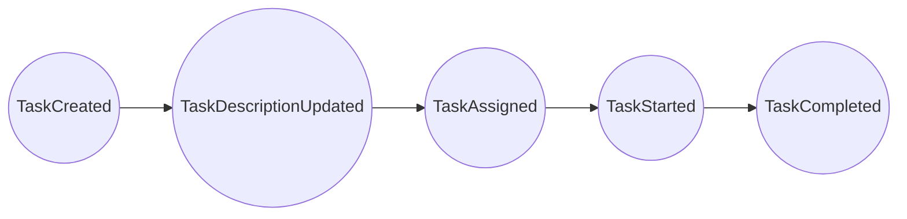
```mermaid
flowchart LR
    A((TaskCreated))
    B((TaskDescriptionUpdated))
    C((TaskAssigned))
    D((TaskStarted))
    E((TaskCompleted))

    A --> B --> C --> D --> E
```

##### 2. PM 補充狀態與阻塞

PM：

我會關注任務狀態。任務不只是開始與完成，中間可能會有狀態變化。

例如從 Todo 到 In Progress，再到 Done。

我覺得應該有：

TaskStatusChanged

RD：

那 TaskStarted 會不會只是 TaskStatusChanged 的一種？

Facilitator：

這是很好的問題，但本輪先不合併事件。我們先保留兩者，後面整理時再判斷。

PM：

任務也可能被阻塞，例如等人回覆、等資料、等環境。

TaskBlocked

阻塞解除後：

TaskUnblocked
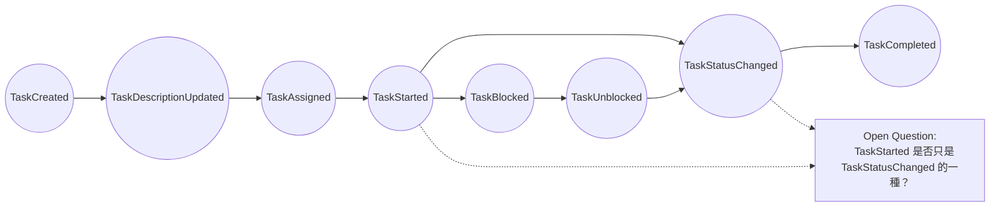
```mermaid
flowchart LR
    A((TaskCreated))
    B((TaskDescriptionUpdated))
    C((TaskAssigned))
    D((TaskStarted))
    E((TaskStatusChanged))
    F((TaskBlocked))
    G((TaskUnblocked))
    H((TaskCompleted))

    A --> B --> C --> D --> E --> H

    D --> F --> G --> E

    Q1["Open Question:
    TaskStarted 是否只是 TaskStatusChanged 的一種？"]

    D -.-> Q1
    E -.-> Q1
```

##### 3. PO 補充需求釐清與任務拆分

PO：

從產品角度，我在意任務是否有清楚的需求。

有些任務一開始只有很模糊的描述，後來需求才被釐清。

我會加：

TaskRequirementClarified

RD：

TaskDescriptionUpdated 和 TaskRequirementClarified 好像不完全一樣。

TaskDescriptionUpdated 比較像資料變更。

TaskRequirementClarified 比較像業務語意變清楚。

Facilitator：

很好，兩個先保留，後面再判斷是否都是真正的 [Domain Event](../tech-base/domain-event.md)。

PO：

任務有時候太大，會被拆成幾個比較小的任務。

TaskSplit

PM：

任務也可能依賴其他任務。

例如 A 任務完成後，B 任務才能開始。

TaskDependencyAdded

Facilitator：

這兩個可能超出 v0.1 核心流程，但先貼上，後面可放入 Future / Maybe。

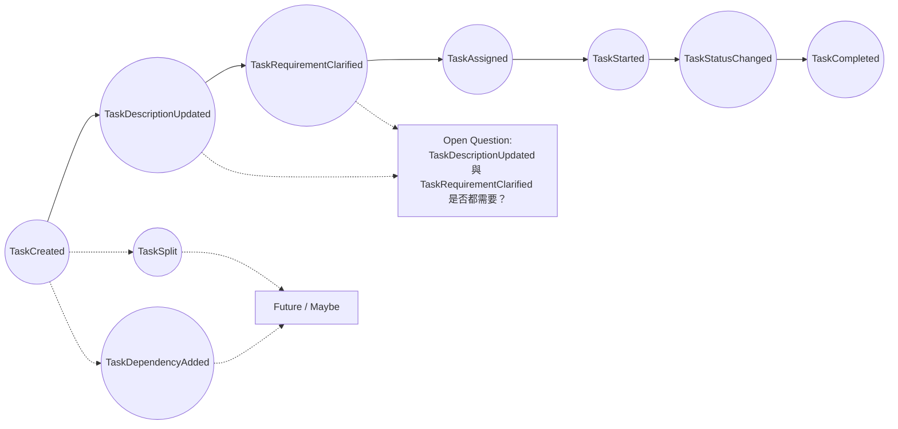
```mermaid
flowchart LR
    A((TaskCreated))
    B((TaskDescriptionUpdated))
    C((TaskRequirementClarified))
    D((TaskAssigned))
    E((TaskStarted))
    F((TaskStatusChanged))
    G((TaskCompleted))

    A --> B --> C --> D --> E --> F --> G

    X((TaskSplit))
    Y((TaskDependencyAdded))

    A -.-> X
    A -.-> Y

    Q2["Open Question:
    TaskDescriptionUpdated 與 TaskRequirementClarified 是否都需要？"]

    B -.-> Q2
    C -.-> Q2

    M["Future / Maybe"]
    X -.-> M
    Y -.-> M
```

##### 4. RD 補充負責人異動

RD：

我想確認，任務建立後一定會被指派嗎？

還是可以先建立在 Backlog 裡，之後才指派？

Domain Expert：

很多工具都允許先建立未指派任務。

任務可能之後才被指派。

RD：

那除了 TaskAssigned，可能也會有取消指派。

TaskUnassigned

任務也可能從一個人改派給另一個人。

TaskReassigned

PM：

這對追蹤責任很重要。

Facilitator：

先保留。後面再判斷 TaskReassigned 是否可以用 TaskAssigned 表達。

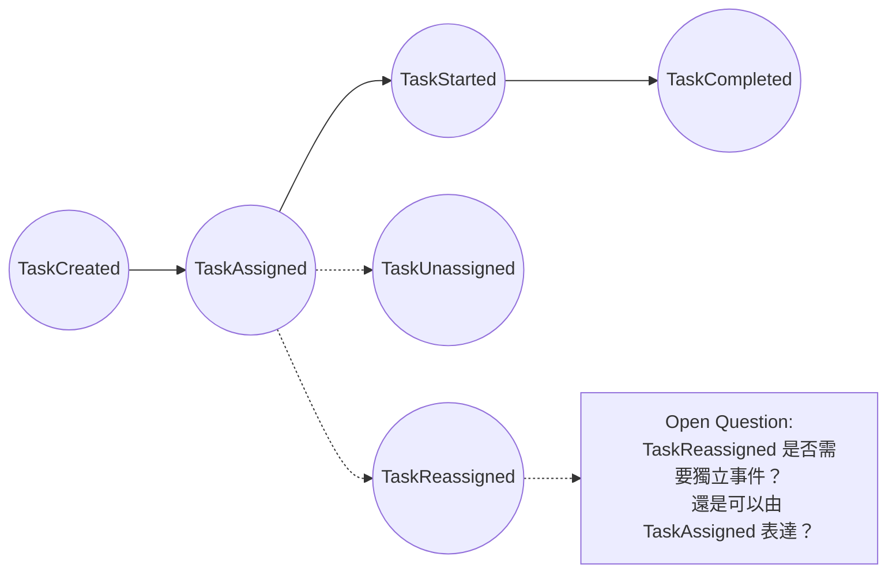
```mermaid
flowchart LR
    A((TaskCreated))
    B((TaskAssigned))
    C((TaskStarted))
    D((TaskCompleted))

    A --> B --> C --> D

    U((TaskUnassigned))
    R((TaskReassigned))

    B -.-> U
    B -.-> R

    Q3["Open Question:
    TaskReassigned 是否需要獨立事件？
    還是可以由 TaskAssigned 表達？"]

    R -.-> Q3
```

##### 5. QA 補充驗收、退回與重新開啟

QA：

如果只說 TaskCompleted，我會擔心太簡化。

很多任務不是做完就完成，可能要提交檢查或驗收。

我會補：

TaskSubmittedForReview

PO：

如果驗收通過，可能是任務被接受。

TaskAccepted

QA：

如果驗收不通過，任務會被退回。

TaskRejected

QA：

退回後任務可能重新被打開。

TaskReopened

PM：

但 v0.1 不一定要有 Review 流程。

Facilitator：

同意。這些事件先列為「完成語意相關事件」，不代表 v0.1 都會實作。

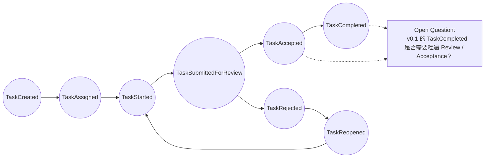
```mermaid
flowchart LR
    A((TaskCreated))
    B((TaskAssigned))
    C((TaskStarted))
    D((TaskSubmittedForReview))
    E((TaskAccepted))
    F((TaskCompleted))

    A --> B --> C --> D --> E --> F

    R((TaskRejected))
    O((TaskReopened))

    D --> R --> O --> C

    Q4["Open Question:
    v0.1 的 TaskCompleted 是否需要經過 Review / Acceptance？"]

    E -.-> Q4
    F -.-> Q4
```

##### 6. UX 補充看板操作

UX：

從使用者角度，任務會在看板上被拖曳到不同欄位。

這對使用者來說是一個很明確的事件。

可以叫：

TaskMovedOnBoard

RD：

如果看板欄位代表任務狀態，那 TaskMovedOnBoard 可能只是 TaskStatusChanged。

PM：

但在同一欄裡調整任務順序，就不是狀態變更。

UX：

那應該還有：

TaskOrderChanged

Facilitator：

很好。先保留兩個事件，後面再釐清它們和狀態變更的關係。

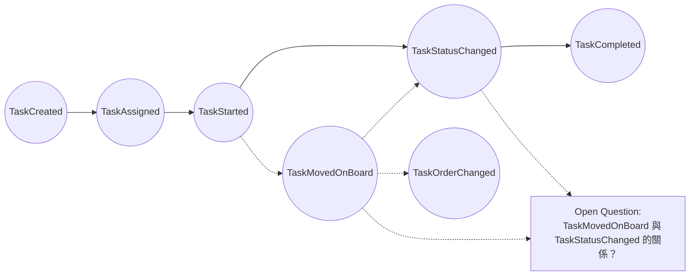
```mermaid
flowchart LR
    A((TaskCreated))
    B((TaskAssigned))
    C((TaskStarted))
    D((TaskStatusChanged))
    E((TaskCompleted))

    A --> B --> C --> D --> E

    M((TaskMovedOnBoard))
    O((TaskOrderChanged))

    C -.-> M
    M -.-> D
    M -.-> O

    Q5["Open Question:
    TaskMovedOnBoard 與 TaskStatusChanged 的關係？"]

    M -.-> Q5
    D -.-> Q5
```

##### 7. 領域專家補充任務內容異動

Domain Expert：

任務標題可能會被修改。

TaskTitleChanged

任務優先度可能會被調整。

TaskPriorityChanged

截止日可能被設定。

TaskDueDateSet

截止日也可能被修改。

TaskDueDateChanged

也可能被移除。

TaskDueDateRemoved

QA：

這些看起來比較像屬性變動，但可能會影響任務管理。

Facilitator：

本輪先記錄，後面再判斷哪些是 [Domain Event](../tech-base/domain-event.md)，哪些只是 [Audit Log](../tech-base/audit-log.md) 或 [Activity Log](../tech-base/activity-log.md)。

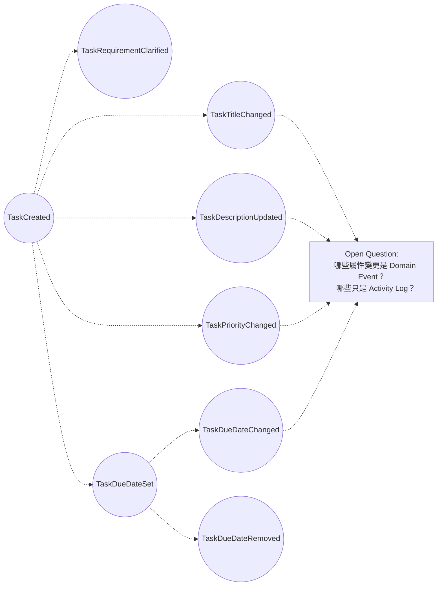
```mermaid
flowchart LR
    A((TaskCreated))

    T((TaskTitleChanged))
    D((TaskDescriptionUpdated))
    R((TaskRequirementClarified))
    P((TaskPriorityChanged))
    S((TaskDueDateSet))
    C((TaskDueDateChanged))
    X((TaskDueDateRemoved))

    A -.-> T
    A -.-> D
    A -.-> R
    A -.-> P
    A -.-> S
    S -.-> C
    S -.-> X

    Q6["Open Question:
    哪些屬性變更是 Domain Event？
    哪些只是 Activity Log？"]

    T -.-> Q6
    D -.-> Q6
    P -.-> Q6
    C -.-> Q6
```

##### 8. QA 補充取消、刪除與封存

QA：

任務不一定會完成，也可能被取消。

TaskCanceled

PO：

任務也可能被刪除。

TaskDeleted

RD：

TaskDeleted 可能比較像資料管理操作，不一定是業務事件。

PM：

如果任務已經進行到一半，通常不應該直接刪除，而是取消或封存。

Domain Expert：

那應該也有：

TaskArchived

Facilitator：

三個都先保留，但後面要釐清語意。

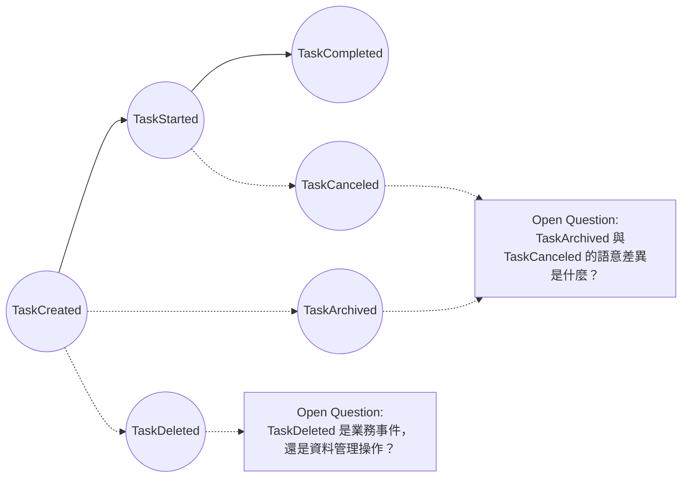
```mermaid
flowchart LR
    A((TaskCreated))
    B((TaskStarted))
    C((TaskCompleted))

    A --> B --> C

    X((TaskCanceled))
    Y((TaskArchived))
    Z((TaskDeleted))

    B -.-> X
    A -.-> Y
    A -.-> Z

    Q7["Open Question:
    TaskDeleted 是業務事件，
    還是資料管理操作？"]

    Z -.-> Q7

    Q8["Open Question:
    TaskArchived 與 TaskCanceled 的語意差異是什麼？"]

    X -.-> Q8
    Y -.-> Q8
```

##### 9. PO 與 QA 補充驗收條件

PO：

有些任務在完成前，應該要有驗收條件。

也許有：

AcceptanceCriteriaAdded

QA：

驗收條件可能被更新。

AcceptanceCriteriaUpdated

而且驗收條件可能被確認通過。

AcceptanceCriteriaVerified

RD：

這可能會讓範圍變大，但它跟任務完成很相關。

Facilitator：

先放在「完成語意相關事件」。後續再判斷 v0.1 是否納入。

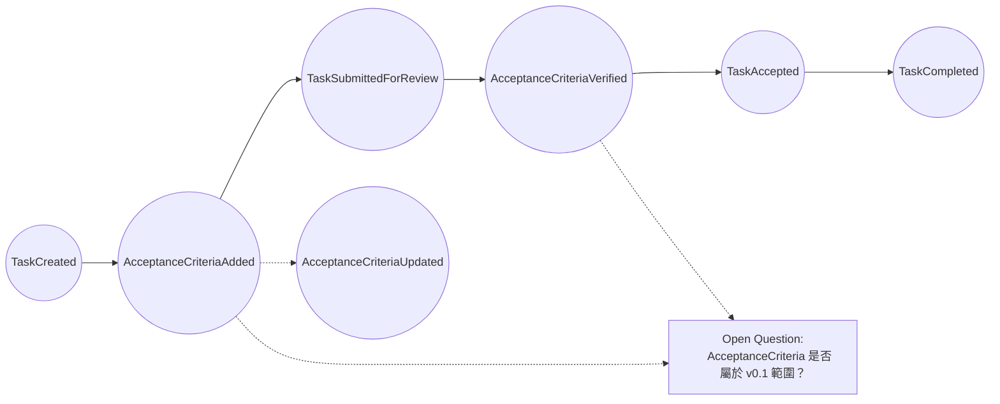
```mermaid
flowchart LR
    A((TaskCreated))
    B((AcceptanceCriteriaAdded))
    C((AcceptanceCriteriaUpdated))
    D((TaskSubmittedForReview))
    E((AcceptanceCriteriaVerified))
    F((TaskAccepted))
    G((TaskCompleted))

    A --> B --> D --> E --> F --> G
    B -.-> C

    Q9["Open Question:
    AcceptanceCriteria 是否屬於 v0.1 範圍？"]

    B -.-> Q9
    E -.-> Q9
```

#### 第一輪完整白板

以下是本輪事件發散後的完整事件圖。

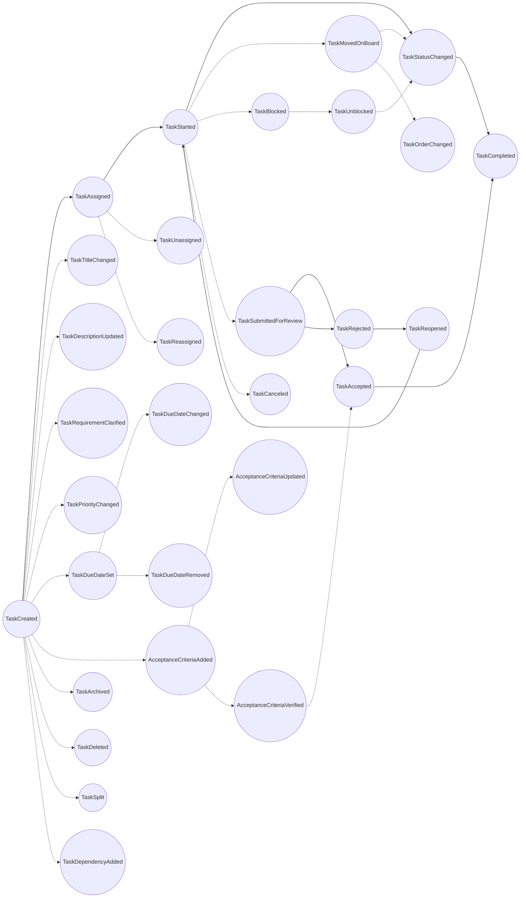
```mermaid
flowchart LR
    %% Core
    A((TaskCreated))
    B((TaskAssigned))
    C((TaskStarted))
    D((TaskStatusChanged))
    E((TaskCompleted))

    A --> B --> C --> D --> E

    %% Description / Requirement
    A -.-> T1((TaskTitleChanged))
    A -.-> T2((TaskDescriptionUpdated))
    A -.-> T3((TaskRequirementClarified))
    A -.-> T4((TaskPriorityChanged))
    A -.-> T5((TaskDueDateSet))
    T5 -.-> T6((TaskDueDateChanged))
    T5 -.-> T7((TaskDueDateRemoved))

    %% Assignment
    B -.-> A1((TaskUnassigned))
    B -.-> A2((TaskReassigned))

    %% Board / Workflow
    C -.-> W1((TaskMovedOnBoard))
    W1 -.-> D
    W1 -.-> W2((TaskOrderChanged))
    C -.-> W3((TaskBlocked))
    W3 -.-> W4((TaskUnblocked))
    W4 -.-> D

    %% Review / Acceptance
    C -.-> R1((TaskSubmittedForReview))
    R1 --> R2((TaskAccepted))
    R2 --> E
    R1 --> R3((TaskRejected))
    R3 --> R4((TaskReopened))
    R4 --> C

    %% Acceptance Criteria
    A -.-> AC1((AcceptanceCriteriaAdded))
    AC1 -.-> AC2((AcceptanceCriteriaUpdated))
    AC1 -.-> AC3((AcceptanceCriteriaVerified))
    AC3 -.-> R2

    %% Exit
    C -.-> X1((TaskCanceled))
    A -.-> X2((TaskArchived))
    A -.-> X3((TaskDeleted))

    %% Advanced / Future
    A -.-> F1((TaskSplit))
    A -.-> F2((TaskDependencyAdded))
```

2026/04/25 13:30。

### 梳理業務規則-事件風暴02

這一輪不再繼續發散新事件，而是回頭整理上一輪產出的候選事件，試著把任務生命週期、狀態抽象與緊急任務處理方式收斂成比較接近產品決策的形狀。

#### 第二輪整理目標

1. 排出 Task 從建立到完成的最小主流程。
2. 找出哪些具體事件應該被抽象成 `TaskStateChanged`。
3. 標記哪些事件暫時放到 Future / Open Questions。

#### 焦點一：狀態抽象與流程語意

Facilitator：

「我們開始第二輪事件風暴。」

「上一輪我們已經先發散出一批候選 [Domain Event](../tech-base/domain-event.md)，例如：

- `TaskCreated`
- `TaskAssigned`
- `TaskStarted`
- `TaskStatusChanged`
- `TaskSubmittedForReview`
- `TaskAccepted`
- `TaskRejected`
- `TaskReopened`
- `TaskCompleted`
- `TaskCanceled`
- `TaskArchived`
- `TaskDeleted`
- `TaskBlocked`
- `TaskUnblocked`
- `TaskMovedOnBoard`
- `TaskOrderChanged`
」

「但在進入下一步之前，RD 提出了一個重要觀點：RonFlow 是一個專案管理工具，不是某個固定流程的內部系統。因此，我們不應該把所有狀態寫死。」

「也就是說，像這些事件：

- `TaskStarted`
- `TaskSubmittedForReview`
- `TaskCompleted`
- `TaskBlocked`

」

「可能不應該都成為固定的系統事件，而是要考慮是否能抽象成：」

`TaskStateChanged`

「再由使用者自訂的 [Workflow State](../tech-base/workflow-state.md) 來承載具體語意。」

「所以本輪目標不是繼續找更多事件，而是整理上一輪事件，並建立第一版任務生命週期時間線。」

Domain Expert：

「我同意這輪先整理流程。不過我想補充一下，雖然系統不一定要寫死 TaskStarted 或 TaskCompleted，但在真實專案管理裡，這些詞還是有業務意義。」

「例如：」

- 任務開始了
- 任務進入驗收
- 任務完成了
- 任務被退回了

「我也同意。RonFlow 應該允許不同團隊自己定義流程，但產品本身還是要知道某些狀態的大分類。」

「例如使用者可以把狀態命名為：」

- 開發中
- 處理中
- 施工中

「但系統可能需要知道它們都屬於：」

`Active`

「同樣地，使用者可以把完成狀態叫：」

- `Done`
- 完成
- 已結案
- 已交付

「但系統可能需要知道它們都屬於：」

`Done / Final`

PM：

「從管理角度來看，我關心的是：」

- 任務是否尚未開始
- 任務是否正在進行
- 任務是否等待檢查
- 任務是否完成
- 任務是否被取消

「所以我不一定要求狀態名稱固定，但希望系統至少能判斷任務目前在哪一種管理階段。」

QA：

「那我會在意一件事：如果狀態可以自訂，我們怎麼判斷任務是否真的完成？」

「例如使用者可以建立一個狀態叫 Finished，也可以叫 Closed，也可以叫 已驗收。如果沒有狀態分類，測試和驗收會很難判斷。」

Facilitator：

「目前聽起來，本輪有一個初步共識：」

RonFlow 不應該寫死所有任務狀態名稱。
但 RonFlow 需要保留一些狀態語意分類，讓系統可以理解任務目前的大致階段。

「也就是可能需要類似：」

`WorkflowState.Category`

「例如：」

- `Backlog`
- `Ready`
- `Active`
- `Review`
- `Done`
- `Canceled`

「但這只是候選，這一輪先不定案。」

RD：

「上述這些我都同意。不過我想補充兩個問題。」

「第一個問題是：同一個任務狀態，對不同角色可能有不同含意。」

「例如需求尚未釐清時，對 RD 來說，這個任務可能是 not ready 或 blocked，因為 RD 無法開始開發；但對 PM 來說，這件事反而可能是 active，因為 PM 必須立刻協調人員、釐清需求，讓任務變得可執行。」

「同樣地，如果任務已經交付 QA 驗收，對 RD 來說可能是 done，因為 RD 的工作結束了；但對 QA 來說，這件事才剛進入 ready，因為 QA 的驗收工作準備開始。」

「第二個問題是：系統是否需要支援『緊急任務』或『插單』？」

「實務開發上，總是會遇到突如其來的緊急事件，例如 production bug、主管臨時交辦、客戶重大問題。這些任務會打斷原本的排序與 Sprint 節奏。」

「所以我想問：RonFlow 是否應該在任務上支援 urgent 標記？或者它其實不只是標記，而是會影響任務排序、WIP、目前進行中的工作，甚至影響 Sprint 承諾？」

Facilitator：

「這兩個問題都很重要，而且它們指出了同一件事：」

Task 的狀態不一定只有一條線。
同一個 Task 可能同時在不同角色、不同工作流、不同責任視角下呈現不同狀態。

「上一輪我們討論的是 TaskStateChanged，但現在 RD 提出：」

TaskState 可能不是單一狀態，而是與 [Workflow](../tech-base/workflow.md) / Role / Responsibility 有關。

「這代表我們需要小心，不要太早把 Task 設計成只有一個 CurrentStateId。」

Domain Expert：

「RD 的說法很真實。」

「在實務上，一個任務常常不是一個人完成，而是經過多個角色接力。」

「例如一張任務卡可能叫：」

建立登入功能

「但它背後可能包含：」

PM 釐清需求
RD 開發
QA 測試
PO 驗收

「所以如果只問『這個 Task 現在是什麼狀態』，答案可能會太粗。」

「比較真實的問法可能是：」

這個 Task 對哪個角色而言，現在處於什麼狀態？

PM：

「我會把它拆成兩個層次。」

「第一層是任務本身在整體流程中的狀態，例如：」

Backlog
Ready
In Progress
Review
Done

「第二層是目前誰需要採取行動。」

「例如需求未釐清時，任務整體可能還不是 Ready，但目前 action owner 是 PM。」

「所以對 PM 來說它是 active，但不是因為 Task 已經可以開發，而是因為 PM 有一個待處理責任。」

PO：

「我覺得 RD 提出的問題會導出一個很重要的模型區分。」

「我們可能不能只設計：」

Task.CurrentState

「而要區分：」

- [Workflow State](../tech-base/workflow-state.md)
- Responsibility / Assignment State

「例如：」

| 層次 | 問題 |
| --- | --- |
| Task Workflow State | 這張任務在整體流程中走到哪裡？ |
| Responsibility State | 現在輪到誰處理？ |
| Role-specific View | 對某個角色來說，這件事是 ready、active、done 還是 blocked？ |

QA：

「RD 說『交付 QA 對 RD 是 done，但對 QA 是 ready』，這個很精準。」

「如果系統只記錄 TaskCompleted，會誤導。」

「對 RD 來說，可能是：」

DevelopmentCompleted

「對 QA 來說，可能是：」

TestingReady

「對整個 Task 來說，可能只是：」

TaskEnteredReviewState

「所以我認為整體任務完成和某個角色的工作完成，應該分開。」

Facilitator：

「目前產生幾個候選概念，我先記在白板上，不代表定案。」

- `TaskState`
- [Workflow State](../tech-base/workflow-state.md)
- `RoleViewState`
- `Responsibility`
- [Current Action Owner](../tech-base/current-action-owner.md)
- [Urgency](../tech-base/urgency.md)
- `Interruption`

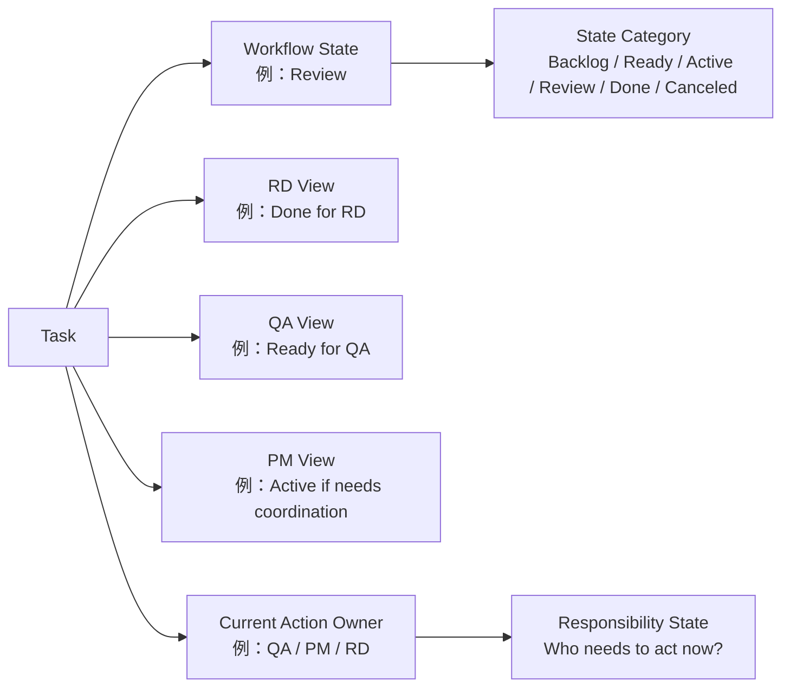
```mermaid
flowchart LR
    T["Task"]

    T --> WS["Workflow State
    例：Review"]

    T --> R1["RD View
    例：Done for RD"]

    T --> R2["QA View
    例：Ready for QA"]

    T --> R3["PM View
    例：Active if needs coordination"]

    T --> AO["Current Action Owner
    例：QA / PM / RD"]

    WS --> C["State Category
    Backlog / Ready / Active / Review / Done / Canceled"]

    AO --> RESP["Responsibility State
    Who needs to act now?"]
```

#### 焦點三：緊急任務與插單

Facilitator：

「接著討論第二個問題：緊急任務或插單。」

「我們先不要急著決定 UI 上是不是一個紅色標籤。先問業務上發生了什麼。」

PM：

「緊急任務不只是 [Priority](../tech-base/priority.md) 高。」

「在實務上，緊急任務通常代表：」

原本的工作順序被打斷
原本的 Sprint 承諾被影響
某些正在進行中的任務可能被暫停
團隊需要重新分配人力

「所以如果只做一個 [Priority](../tech-base/priority.md) = High，可能不夠。」

Domain Expert：

「實務上插單通常需要留下原因。」

「例如：」

- Production issue
- 客戶重大問題
- 法規期限
- 主管指示
- 安全漏洞
- 資料錯誤

「否則一堆人都標 urgent，最後 urgent 就失去意義。」

QA：

「緊急不代表可以跳過驗收。」

「反而 emergency task 常常風險更高，因為它打斷流程、壓縮時間。」

「系統應該至少讓團隊知道：」

- 這是緊急任務
- 為什麼緊急
- 誰宣告緊急
- 是否影響原本工作
- 是否需要後續補測或補文件

PO：

「我會區分 [Priority](../tech-base/priority.md) 和 [Urgency](../tech-base/urgency.md)。」

| 概念 | 意義 |
| --- | --- |
| [Priority](../tech-base/priority.md) | 相對重要性，代表這件事和其他工作相比的產品價值或排序。 |
| [Urgency](../tech-base/urgency.md) | 時間壓力，代表這件事需要立即處理。 |
| `Interruption` | 對原本計畫造成中斷，需要調整工作流。 |

「有些事情 [Priority](../tech-base/priority.md) 很高，但不一定 urgent。」

「有些事情 urgent，但長期產品價值不一定高，例如 production bug。」

RD：

「如果是緊急任務，技術上可能不只是把卡片排序拉到最上面。」

「它可能需要：」

建立任務
標記為緊急
記錄插單原因
中斷或暫停某些工作
重新安排 assignee
改變 Sprint Backlog

「這可能會產生一串事件，不只是一個欄位變更。」

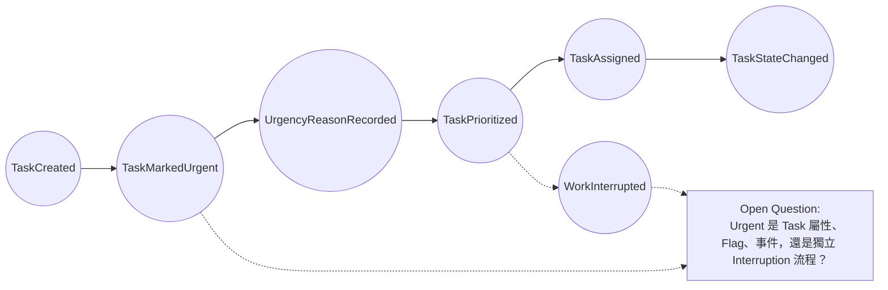
```mermaid
flowchart LR
    A((TaskCreated))
    B((TaskMarkedUrgent))
    C((UrgencyReasonRecorded))
    D((TaskPrioritized))
    E((WorkInterrupted))
    F((TaskAssigned))
    G((TaskStateChanged))

    A --> B --> C --> D
    D --> F --> G

    D -.-> E

    Q1["Open Question:
    Urgent 是 Task 屬性、Flag、事件，還是獨立 Interruption 流程？"]

    B -.-> Q1
    E -.-> Q1


```

Facilitator：

「RD 的兩個問題讓我們發現，本輪不能只把上一輪事件全部粗暴合併成 TaskStateChanged。」

「我們需要保留幾個新的 Open Questions。」

#### 第二輪 open questions

1. Task 是否只有一個 `CurrentState`？還是需要區分整體 [Workflow State](../tech-base/workflow-state.md) 與 Role-specific State？
2. 同一個 Task 對不同角色的 ready / active / done 是否需要被系統建模？還是只是不同角色在看板上的 view？
3. 是否需要 [Current Action Owner](../tech-base/current-action-owner.md)？用來表示現在輪到誰處理。
4. RD 的 done、QA 的 ready、整體 Task 的 review 是否應該用同一個 workflow 表達？
5. Urgent 是否只是 [Priority](../tech-base/priority.md)？還是獨立於 [Priority](../tech-base/priority.md) 的 [Urgency](../tech-base/urgency.md) / interruption 概念？
6. 緊急插單是否需要留下原因與影響紀錄？
7. v0.1 是否要處理 urgent task？或先放入 Future / Maybe？

#### 第二輪暫時收斂

1. RonFlow 不應寫死 `TaskStarted`、`TaskCompleted` 等固定狀態事件。
2. 多數狀態變化可以先抽象成 `TaskStateChanged`。
3. 但 `TaskStateChanged` 背後可能需要 `WorkflowState.Category`，否則系統無法理解狀態的大致語意。
4. 同一個 Task 的狀態可能依角色視角不同而有不同含意。這可能導出 [Current Action Owner](../tech-base/current-action-owner.md)、Role-specific View 或 Responsibility State。
5. 緊急任務不是單純 [Priority](../tech-base/priority.md) high。它可能是一種 [Urgency](../tech-base/urgency.md) / interruption，會影響排序、責任分配與原本工作計畫。
6. v0.1 暫時不急著實作角色視角狀態與緊急插單，但應該在事件風暴中保留為重要設計議題。

#### 焦點四：v0.1 範圍收斂

PO：

「我會先把 RonFlow v0.1 定位成：」

一個小團隊可以自架使用的最小專案管理工具。

「v0.1 的目標不是一次做出最完整的企業級流程，而是先讓使用者可以完成最基本的事情：」

- 建立 Project
- 建立 Task
- 把 Task 放進看板流程
- 改變 Task 狀態
- 看到 Task 是否完成
- 保留基本開發與管理紀錄

「所以我不希望 v0.1 太早進入複雜的角色視角狀態。」

「像 RD 說的：同一個 Task 對 RD 是 done、對 QA 是 ready，這是很真實的情境。但這可能意味著我們要處理：」

- 角色
- 責任轉移
- 工作交接
- 驗收階段
- 多角色 workflow

「這些對產品長期很重要，但對 v0.1 來說會太大。」

Domain Expert：

「我也同意這是真實業務問題。」

「在實際團隊裡，同一張任務卡確實常常同時對不同角色有不同意義。」

「例如：」

PM：需求待釐清，是 active
RD：需求不清楚，是 blocked / not ready
QA：尚未交付，是 not ready

「但如果我們是做第一版工具，我會建議先不要把每個角色的狀態都建成獨立 workflow。」

「比較務實的做法是：」

- Task 有一個整體 [Workflow State](../tech-base/workflow-state.md)
- 再用 [Assignee](../tech-base/assignee.md) / [Current Action Owner](../tech-base/current-action-owner.md) / Comment / [Activity Log](../tech-base/activity-log.md) 輔助說明目前誰需要處理

「也就是說，v0.1 先回答：」

這張任務整體走到哪裡？

「未來再回答：」

這張任務對每個角色而言分別走到哪裡？

PM：

「我覺得 PO 和 Domain Expert 的方向合理。」

「但我會建議 v0.1 至少要保留一個概念：」

現在輪到誰處理？

「因為如果需求不清楚，Task 整體可能還在 Backlog 或 Ready 之前，但實務上 PM 正在處理。這時如果沒有任何欄位表示目前責任人，管理上會不清楚。」

「所以我會建議：」

- v0.1 不做 Role-specific State。
- 但可以有 [Current Action Owner](../tech-base/current-action-owner.md) 或 [Assignee](../tech-base/assignee.md)。

「不過如果 v0.1 只想更小，也可以先只做 [Assignee](../tech-base/assignee.md)，[Current Action Owner](../tech-base/current-action-owner.md) 放到後面。」

QA：

「我可以接受 v0.1 先不做多角色狀態。」

「但我會要求一點：」

Done 的定義要清楚。

「如果 v0.1 允許使用者自己定義 [Workflow State](../tech-base/workflow-state.md)，那至少要有 [State Category](../tech-base/state-category.md)，否則系統不知道哪個狀態是完成。」

「例如使用者可以叫：」

- `Done`
- 已完成
- 已結案
- 已驗收

「但系統至少要知道它屬於：」

`Done`

「不然測試、統計、完成率、看板篩選都會很難做。」

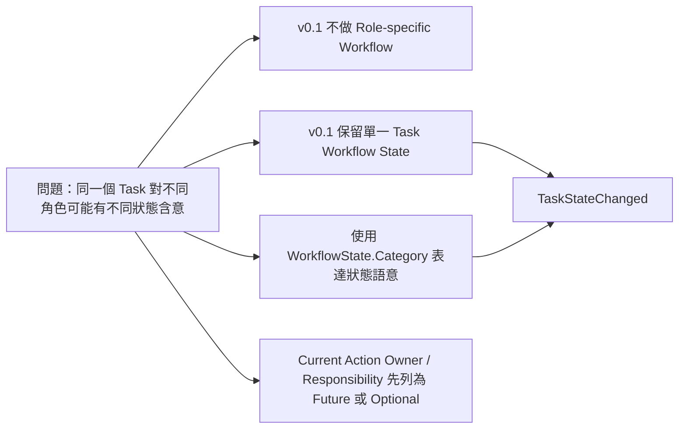
```mermaid
flowchart LR
    A["問題：同一個 Task 對不同角色可能有不同狀態含意"]

    A --> B["v0.1 不做 Role-specific Workflow"]
    A --> C["v0.1 保留單一 Task Workflow State"]
    A --> D["使用 WorkflowState.Category 表達狀態語意"]
    A --> E["Current Action Owner / Responsibility 先列為 Future 或 Optional"]

    C --> F["TaskStateChanged"]
    D --> F
```

#### 焦點五：Urgent 的最小產品決策

Facilitator：

「那緊急任務呢？PO，你認為 v0.1 要不要支援？」

PO：

「我認為緊急任務是實務上非常重要的情境。」

「但是，如果我們要完整處理插單，可能會牽涉到：」

Sprint 承諾變更
原任務中斷
人力重新分配
插單原因
影響評估
事後檢討

「這會變成另一個大功能。」

「所以我建議 v0.1 不做完整 Interruption Workflow，但可以做最小支援：」

- Urgent flag
- [Urgency](../tech-base/urgency.md) reason
- [Priority](../tech-base/priority.md)

「這樣至少可以讓使用者標記：」

這是一個緊急任務
為什麼緊急
它和普通高優先度任務不同

Domain Expert：

「我同意要做簡化版，但緊急不能只是勾選。」

「因為真實團隊裡很容易每個人都說自己的任務很急。」

「所以如果有 Urgent，至少應該要求：」

- [Urgency](../tech-base/urgency.md) Reason

「例如：」

Production Bug
Security Issue
Customer Escalation
Legal Deadline
Data Correction
Manager Request

「不一定一開始就做完整分類，但至少要有文字原因。」

PM：

「我也建議 v0.1 區分 [Priority](../tech-base/priority.md) 和 Urgent。」

- [Priority](../tech-base/priority.md)：相對重要性
- Urgent：是否需要立即處理

「例如技術債可能 Priority 高，但不一定 urgent。」

「Production bug 可能 urgent，即使它不是產品路線圖中最有價值的項目。」

QA：

「我希望系統語意上不要暗示 urgent 可以跳過品質流程。」

「如果只是 Urgent flag，那還可以接受。」

「如果做完整 Interruption Workflow，就要處理緊急任務是否需要補測、補文件、補 review。這個 v0.1 先不要做。」

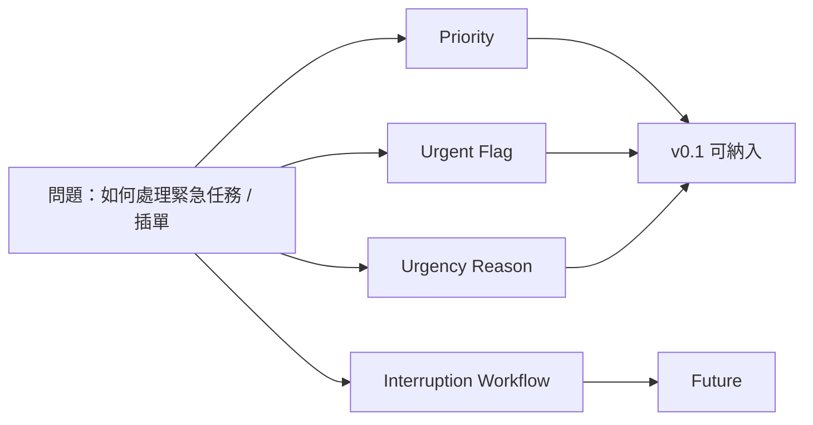
```mermaid
flowchart LR
    A["問題：如何處理緊急任務 / 插單"]

    A --> B["Priority"]
    A --> C["Urgent Flag"]
    A --> D["Urgency Reason"]
    A --> E["Interruption Workflow"]

    B --> F["v0.1 可納入"]
    C --> F
    D --> F

    E --> G["Future"]
```

#### 暫定產品決策

- v0.1 支援基本 Urgent 標記。
- Urgent 與 [Priority](../tech-base/priority.md) 分開。
- Urgent 需要留下原因。
- v0.1 不做完整 Interruption Workflow。
- 完整插單影響分析、暫停原任務、Sprint 承諾變更，列為 Future。

#### 第二輪最終收斂結論

角色視角狀態：

- v0.1 不做 Role-specific Workflow。
- v0.1 採用單一 Task [Workflow State](../tech-base/workflow-state.md)。
- [Workflow State](../tech-base/workflow-state.md) 可由使用者命名。
- 但系統需要 `WorkflowState.Category` 來理解狀態語意。
- [Current Action Owner](../tech-base/current-action-owner.md) / Responsibility 先列為 Open Question 或 Future。

緊急任務：

- v0.1 支援 [Priority](../tech-base/priority.md)。
- v0.1 支援 Urgent flag。
- Urgent 與 [Priority](../tech-base/priority.md) 分開。
- Urgent 需要 reason。
- 完整插單流程列為 Future。

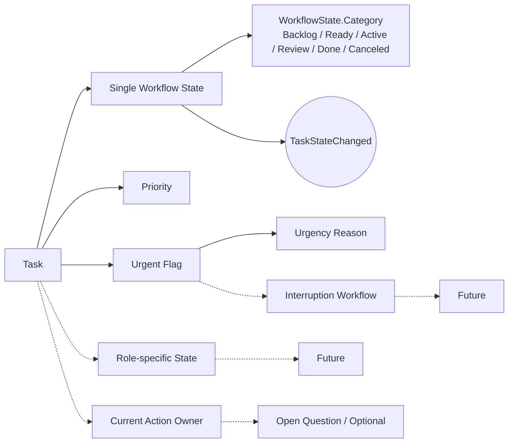
```mermaid
flowchart LR
    T["Task"]

    T --> S["Single Workflow State"]
    S --> C["WorkflowState.Category
    Backlog / Ready / Active / Review / Done / Canceled"]

    S --> E((TaskStateChanged))

    T --> P["Priority"]
    T --> U["Urgent Flag"]
    U --> R["Urgency Reason"]

    T -.-> RSV["Role-specific State"]
    RSV -.-> F1["Future"]

    T -.-> AO["Current Action Owner"]
    AO -.-> Q1["Open Question / Optional"]

    U -.-> IW["Interruption Workflow"]
    IW -.-> F2["Future"]


```

#### 本輪新增事件候選

因為 PO / Domain Expert 決定 v0.1 支援簡化緊急任務，所以事件清單可能新增：

- `TaskMarkedUrgent`
- `TaskUrgencyReasonRecorded`
- `TaskUnmarkedUrgent`
- `TaskPriorityChanged`

但這些在本輪先列為候選，不急著定案。

Facilitator：

「前一段收斂出的產品方向，這裡直接當作前提使用。」

「接下來只整理任務從建立到完成的最小事件時間線，不討論 [Command](../tech-base/command.md)、[Actor](../tech-base/actor.md)、[Aggregate](../tech-base/aggregate.md)、資料表、[API](../tech-base/api.md)、UI。」

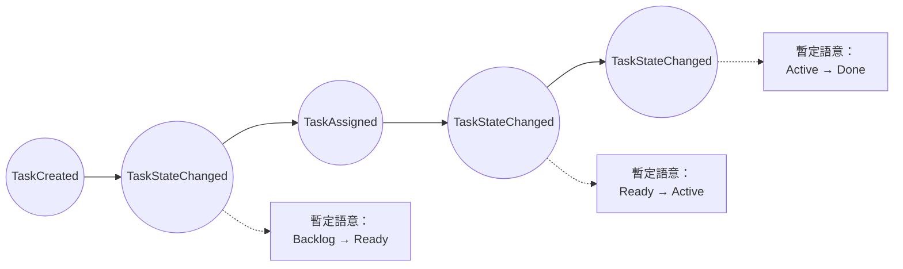
```mermaid
flowchart LR
    A((TaskCreated))
    B((TaskStateChanged))
    C((TaskAssigned))
    D((TaskStateChanged))
    E((TaskStateChanged))

    A --> B --> C --> D --> E

    N1["暫定語意：
    Backlog → Ready"]
    N2["暫定語意：
    Ready → Active"]
    N3["暫定語意：
    Active → Done"]

    B -.-> N1
    D -.-> N2
    E -.-> N3
```

Facilitator：

「我先提出一條最小主流程候選：」

TaskCreated
→ TaskStateChanged: Backlog → Ready
→ TaskAssigned
→ TaskStateChanged: Ready → Active
→ TaskStateChanged: Active → Done

「這條流程的意思是：」

1. 任務被建立。
2. 任務從 Backlog 變成 Ready，代表它已經足夠清楚，可以被處理。
3. 任務被指派。
4. 任務從 Ready 變成 Active，代表開始被處理。
5. 任務從 Active 變成 Done，代表任務完成。

Domain Expert：

「這條流程大致合理，但我會提醒一件事：任務不一定要先 Ready 才能被指派。」

「有些團隊會先指派給 PM 或某個負責人去釐清需求。也就是說，任務剛建立時可能還在 Backlog，但已經有人負責整理它。」

「所以我不確定 TaskAssigned 一定要發生在 Backlog → Ready 之後。」

PM：

「我同意。從管理角度來看，任務被指派不一定代表任務可開發。」

「例如：」

TaskCreated
→ TaskAssigned to PM
→ TaskStateChanged: Backlog → Ready
→ TaskAssigned to RD
→ TaskStateChanged: Ready → Active

「但如果 v0.1 不做 Current Action Owner 或角色視角，那我們可能要先接受一個簡化：Assignee 代表目前主要負責人，不一定代表開發者。」

PO：

「我覺得 v0.1 可以先簡化，但文件裡要講清楚：」

TaskAssigned 代表任務目前有主要負責人。
它不代表任務一定已經 Ready，也不代表一定已經開始執行。

「否則 Assignee 的語意會太窄。」

QA：

「我比較在意 Done 的語意。」

「如果 v0.1 沒有完整 Review 流程，那 Active → Done 可以代表任務完成。」

「但我們要留下 Open Question：未來如果加入 Review，Done 可能要經過 Review 或 Accepted。」

Facilitator：

「這裡我先替 RD 標出一個待確認問題：」

TaskAssigned 是否應該放在 Ready 之前或之後？

「因為這會影響主流程怎麼畫。」

Facilitator：

「目前看起來，大家比較接近候選流程 C。」

「也就是：」

Task 的 Workflow State 流程是一條線；
TaskAssigned 是可以在不同狀態中發生的事件，不一定是主流程中的固定一步。

「這樣會比較符合平台彈性。」

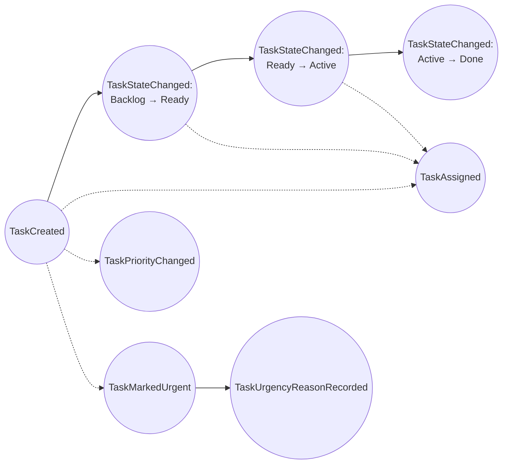
```mermaid
flowchart LR
    A((TaskCreated))
    B((TaskStateChanged:
    Backlog → Ready))
    C((TaskStateChanged:
    Ready → Active))
    D((TaskStateChanged:
    Active → Done))

    A --> B --> C --> D

    X((TaskAssigned))
    A -.-> X
    B -.-> X
    C -.-> X

    P((TaskPriorityChanged))
    U((TaskMarkedUrgent))
    R((TaskUrgencyReasonRecorded))

    A -.-> P
    A -.-> U --> R
```

Round 2 暫定事件語意
TaskCreated

代表任務被建立。

目前暫定：

Task 建立後進入 Workflow 的 initial state。

例如：

Backlog

但 initial state 由 Workflow 設定決定。

TaskStateChanged

代表任務從某個 Workflow State 移動到另一個 Workflow State。

範例：

Backlog → Ready
Ready → Active
Active → Done

這個事件取代上一輪中的多數具體狀態事件，例如：

TaskStarted
TaskSubmittedForReview
TaskCompleted
TaskAssigned

代表任務被指派主要負責人。

暫定語意：

TaskAssigned 不必然代表 Task Ready。
TaskAssigned 不必然代表 Task Started。
TaskAssigned 只代表目前有人被指定為主要負責人。
TaskPriorityChanged

代表任務優先度被調整。

暫時列為支援事件。

TaskMarkedUrgent

代表任務被標記為緊急。

暫定要求：

若 TaskMarkedUrgent，需記錄 urgency reason。
TaskUrgencyReasonRecorded

代表緊急原因被記錄。

Round 2 目前 Open Questions
1. Task 建立後是否一定進入 Backlog？
   還是由 Workflow.InitialState 決定？

2. TaskAssigned 是否只允許一位 assignee？
   v0.1 是否先採單一 assignee？

3. TaskAssigned 是否應改名為 TaskAssigneeChanged？
   因為它可能涵蓋初次指派與重新指派。

4. TaskStateChanged 是否需要記錄 fromState / toState 的 Category？
   還是只記錄 StateId，再查 WorkflowState？

5. Active → Done 是否足以代表 v0.1 的完成？
   還是 v0.1 至少要有 Review？

6. TaskMarkedUrgent 和 TaskPriorityChanged 的關係是什麼？
   Urgent 是否會自動影響排序？

Facilitator：

「Round 2 先停在這裡。」

「目前我們把主流程收斂成：」

TaskCreated
→ TaskStateChanged
→ TaskStateChanged
→ TaskStateChanged

「而 TaskAssigned、TaskPriorityChanged、TaskMarkedUrgent 不作為主流程固定節點，而是可以在任務生命週期中發生的支援事件。」

RD：

「從目前主流程圖來看，TaskAssigned 似乎不是必要事件。也就是說，從 TaskCreated 到 Task 進入 Done，中間都沒有經過 TaskAssigned，是否可以被接受？」

「另外，TaskAssigned 是否只會發生一次？如果發生多次，第二次之後仍然叫 TaskAssigned，還是應該變成 TaskAssigneeChanged？我們是否需要額外區分第一次指派和第二次指派？」

Facilitator：

「這是一個很好的問題。它其實包含兩個議題：」

1. 任務完成前是否一定要被指派？
2. 初次指派與重新指派是否需要不同事件？

「我們先請 PO 和 Domain Expert 回答業務語意，再讓 PM、QA、RD補充。」

PO：

「我認為從產品角度來看，TaskAssigned 不應該是完成任務的絕對必要條件。」

「原因是有些團隊的工作方式不一定會正式指派任務。例如：」

小型團隊中，任務可能由成員自行認領。
個人使用者使用 RonFlow 時，所有任務其實都是自己做。
某些文件或研究任務可能只是被完成，不一定需要明確 assignee。

「所以如果我們把 TaskAssigned 設為必經事件，會讓 RonFlow 的使用方式變窄。」

「不過，如果任務沒有 assignee，系統仍然應該允許使用者完成它。」

Domain Expert：

「我同意 PO 的說法。真實專案裡，任務可以沒有負責人，但管理上會有風險。」

「沒有 assignee 的任務可能代表：」

尚未分工
團隊自行認領
任務太小，大家默認有人會處理
個人專案，不需要指派
流程設計不成熟

「所以我會說：」

TaskAssigned 不應該是任務完成的硬性前置條件。
但系統可以用提示或警示提醒：未指派任務被推進或完成。

「這是管理品質問題，不一定是領域規則。」

PM：

「從 PM 角度，我不會要求 v0.1 強制所有任務都要有 assignee。」

「但是我會要求系統能支援這種管理視角：」

哪些任務尚未指派？
哪些未指派任務已經進入 Active？
哪些未指派任務已經 Done？

「因為未指派任務進入 Active 或 Done 不一定錯，但它是值得注意的訊號。」

QA：

「如果 v0.1 不強制指派，那驗收測試就要明確寫出來。」

「例如：」

Scenario: Task can be completed without assignee
Given a task exists without assignee
When the task state is changed to Done
Then the task should be considered completed
And no assignment error should be raised

「這樣未來才不會有人誤以為完成任務一定要先指派。」

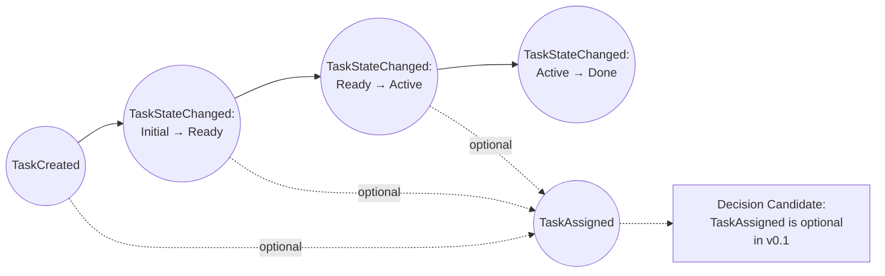
```mermaid
flowchart LR
    A((TaskCreated))
    B((TaskStateChanged:
    Initial → Ready))
    C((TaskStateChanged:
    Ready → Active))
    D((TaskStateChanged:
    Active → Done))

    A --> B --> C --> D

    X((TaskAssigned))
    A -. optional .-> X
    B -. optional .-> X
    C -. optional .-> X

    N["Decision Candidate:
    TaskAssigned is optional in v0.1"]

    X -.-> N
```

Facilitator：

「接著討論第二個問題：第一次指派和之後的改派，要不要分成不同事件？」

Domain Expert：

「在真實管理上，第一次指派和改派確實有不同意思。」

「第一次指派代表：」

這個任務開始有負責人。

「重新指派代表：」

責任從一個人轉移到另一個人。

「改派通常更需要知道原因，例如：」

原負責人請假
工作內容改變
更適合的人接手
人力重新分配
緊急插單導致重新安排

「所以從業務語意來看，TaskAssigned 和 TaskReassigned 是可以分開的。」

PO：

「我理解兩者語意不同，但 v0.1 不一定要暴露兩種事件。」

「如果我們設計成一個通用事件：」

TaskAssigneeChanged

「事件內容包含：」

previousAssignee
newAssignee

「那第一次指派時：」

previousAssignee = null
newAssignee = Ron

「取消指派時：」

previousAssignee = Ron
newAssignee = null

「重新指派時：」

previousAssignee = Ron
newAssignee = Alice

「這樣技術模型比較簡潔，也能表達三種情境。」

PM：

「我傾向 PO 的設計，但希望系統仍然能查出：」

初次指派
重新指派
取消指派

「如果用 TaskAssigneeChanged，只要有 previousAssignee 和 newAssignee，其實可以推導。」

情境	previousAssignee	newAssignee	可推導語意
初次指派	null	user	Assigned
重新指派	user A	user B	Reassigned
取消指派	user	null	Unassigned

「所以我可以接受用一個事件。」

QA：

「如果用一個事件 TaskAssigneeChanged，測試會比較一致。」

「但需要明確定義不合法情境，例如：」

previousAssignee 和 newAssignee 都是 null，不應該產生事件。
previousAssignee 等於 newAssignee，不應該產生事件。

「還要確認是否支援未指派狀態。」

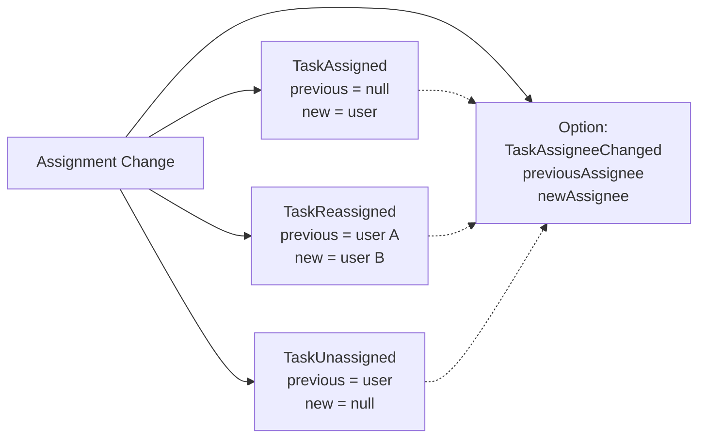
```mermaid
flowchart LR
    A["Assignment Change"]

    A --> B["TaskAssigned
    previous = null
    new = user"]

    A --> C["TaskReassigned
    previous = user A
    new = user B"]

    A --> D["TaskUnassigned
    previous = user
    new = null"]

    A --> E["Option:
    TaskAssigneeChanged
    previousAssignee
    newAssignee"]

    B -.-> E
    C -.-> E
    D -.-> E

```

Round 2 更新後主流程

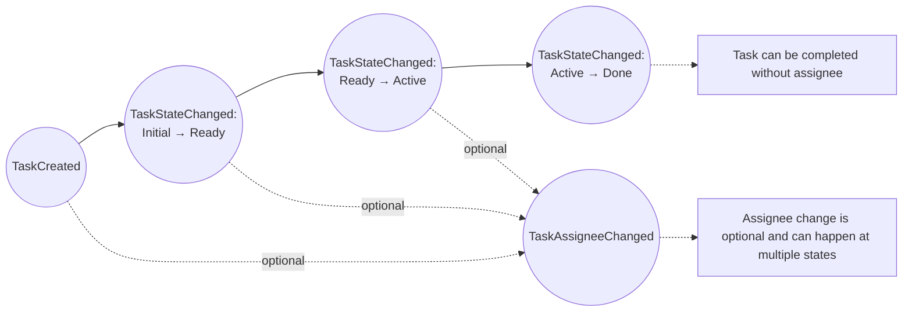
```mermaid
flowchart LR
    A((TaskCreated))
    B((TaskStateChanged:
    Initial → Ready))
    C((TaskStateChanged:
    Ready → Active))
    D((TaskStateChanged:
    Active → Done))

    A --> B --> C --> D

    X((TaskAssigneeChanged))
    A -. optional .-> X
    B -. optional .-> X
    C -. optional .-> X

    N1["Task can be completed without assignee"]
    N2["Assignee change is optional and can happen at multiple states"]

    X -.-> N2
    D -.-> N1
```

新增 Open Questions
1. TaskAssigneeChanged 是否需要 reason？
   v0.1 可以先 nullable。

2. 是否允許多人 assignee？
   v0.1 暫定單一 assignee。

3. 未指派任務進入 Active / Done 是否需要 warning？
   v0.1 可先不強制，只保留未來管理視角。

4. 若 previousAssignee = newAssignee，是否應拒絕產生事件？
   傾向是：不產生事件。

Facilitator：

「接下來聚焦主流程裡最核心的事件：TaskStateChanged。」

「這個事件會承接上一輪提到的許多具體狀態語意，例如：」

TaskStarted
TaskSubmittedForReview
TaskCompleted
TaskRejected
TaskReopened

「但問題是，如果只記錄 TaskStateChanged，系統怎麼知道任務是開始了、進入驗收了，還是完成了？」

「這一段我們先處理四個問題：」

1. TaskCreated 後是否一定進入 Backlog？
2. WorkflowState.Category 是否必要？
3. TaskStateChanged 要記錄什麼？
4. Active → Done 是否足以代表 v0.1 的完成？

PO：

「我認為不應該寫死一定進入 Backlog。」

「RonFlow 是平台，不是固定流程系統。不同團隊可能會希望新任務一建立就進入不同初始狀態。」

「例如有些團隊的初始狀態叫：」

Backlog
Todo
待處理
未開始
需求池

「所以系統不應該假設初始狀態名稱一定是 Backlog。」

Domain Expert：

「從實務上來說，大多數任務剛建立時確實會進入某種類似 Backlog / Todo 的狀態。」

「但 PO 說得對，名稱不應該寫死。」

「我會建議 RonFlow 需要一個概念：」

Workflow.InitialState

「任務建立後，自動進入該 Workflow 的初始狀態。」

PM：

「我同意。管理上我只需要知道任務剛建立時是在某個初始狀態。」

「至於那個狀態叫 Backlog、Todo、待辦，應該由團隊自己定義。」

QA：

「那測試上要明確定義：」

When Task is created
Then Task current state should be Workflow.InitialState

「而不是：」

Then Task current state should be Backlog

「這樣才不會把 Backlog 寫死。」

Facilitator：

「目前這點看起來有共識：」

TaskCreated 後不固定進入 Backlog。
TaskCreated 後進入該 Workflow 的 Initial State。

```mermaid

flowchart LR
    W["Workflow"]
    I["Initial State
    由 Workflow 設定"]

    W --> I

    A((TaskCreated))
    A --> S["Task.CurrentState = Workflow.InitialState"]

    I --> S


```

Facilitator：

「接著討論 WorkflowState.Category。」

「如果狀態名稱可以自訂，例如：」

待辦
處理中
驗收中
已完成

「那系統怎麼知道哪個是未開始、哪個是進行中、哪個是完成？」

PO：

「我認為 Category 必要。」

「因為 RonFlow 不只是把卡片放在欄位裡。系統至少要能回答：」

這個任務是否完成？
這個任務是否正在進行？
這個任務是否已取消？

「如果只有使用者自訂名稱，系統無法穩定判斷。」

PM：

「從管理角度，Category 很重要。」

「例如不同團隊可能這樣命名：」

Team A	Team B	Category
Todo	待處理	NotStarted
Doing	開發中	Active
QA	驗收中	Review
Done	已完成	Done

「如果沒有 Category，跨專案統計、完成率、逾期狀態都很難做。」

QA：

「我也支持 Category。否則測試很難寫。」

「例如我要測：任務移到完成狀態後，系統應該記錄 CompletedAt。」

「如果沒有 Category，我只能依賴狀態名稱叫 Done。這很危險。」

Domain Expert：

「但 Category 不應該太多。」

「如果一開始設太細，使用者會被迫理解系統分類，反而失去自訂 workflow 的彈性。」

「我建議 v0.1 先有少量 Category。」

Facilitator：

「目前候選 Category 可以是：」

Backlog
Ready
Active
Review
Done
Canceled

「但這裡有一個問題：Backlog 和 Ready 是否都必要？」

PM：

「從管理上，Backlog 和 Ready 有差異。」

Backlog = 還只是工作池，未必可以開始做。
Ready = 已經釐清，可以開始安排。

「但 v0.1 如果要簡化，也可以先只有：」

NotStarted
Active
Review
Done
Canceled

PO：

「我會偏向先做：」

Todo
Active
Review
Done
Canceled

「但 Todo 這個字可能不夠表達 Backlog / Ready 的差別。」

QA：

「我建議 Category 用更中性的命名，不要太像看板欄位名稱。」

例如：

NotStarted
InProgress
WaitingForReview
Completed
Canceled

Facilitator：

「目前看起來，大家同意 Category 必要，但 Category 命名還未定案。」

「本段先不決定最終枚舉名稱，只確認：」

WorkflowState 必須有系統可理解的 Category。

```mermaid
flowchart LR
    WS["WorkflowState"]

    WS --> N["Name
    使用者自訂
    例：開發中 / QA / 已完成"]

    WS --> C["Category
    系統語意
    例：NotStarted / Active / Review / Done / Canceled"]

    C --> SYS["System can understand:
    是否開始
    是否進行中
    是否驗收中
    是否完成
    是否取消"]

```

Facilitator：

「如果 TaskStateChanged 是主流程核心事件，那它至少需要記錄 from / to。」

「但要記錄到什麼程度？」

Facilitator：

「可能有兩種做法：」

方案 A：
事件只記錄 FromStateId / ToStateId。

方案 B：
事件同時記錄 StateId、StateName、StateCategory snapshot。

PO：

「我傾向方案 B。」

「因為 workflow state 名稱可能之後被改。」

「例如原本叫 QA，後來改成 驗收中。如果事件只記 StateId，未來看歷史紀錄時，會看到新的名稱，可能和當時情境不一致。」

QA：

「我也支持 snapshot。」

「事件是已發生的事實，應該盡量保留當下語意。」

「不然測試歷史或 audit log 時會有問題。」

PM：

「從管理角度，如果我要看一個月前任務怎麼流動，我希望看到當時的狀態名稱，而不是後來被改過的名稱。」

Domain Expert：

「這也符合業務紀錄。歷史事件應該反映當下發生時的語言。」

Facilitator：

「目前看起來，TaskStateChanged 應該記錄：」

TaskId
FromStateId
FromStateName snapshot
FromStateCategory snapshot
ToStateId
ToStateName snapshot
ToStateCategory snapshot
ChangedAt
ChangedBy

「至於 Reason 是否需要，先列為 optional。」

```mermaid
classDiagram
    class TaskStateChanged {
        TaskId
        FromStateId
        FromStateNameSnapshot
        FromStateCategorySnapshot
        ToStateId
        ToStateNameSnapshot
        ToStateCategorySnapshot
        ChangedAt
        ChangedBy
        Reason?
    }
```

Facilitator：

「最後處理本段最關鍵問題：在 v0.1 裡，任務從 Active 類型狀態進入 Done 類型狀態，是否就代表完成？」

PO：

「以 v0.1 來說，我認為可以。」

「v0.1 目標是最小可用開源版本，不應該一開始就強制完整 Review 流程。」

「如果某個團隊想要 Review，可以建立一個 Category 是 Review 的 state，但系統不應該強迫每個任務一定經過 Review。」

QA：

「我可以接受 v0.1 不強制 Review。」

「但完成的定義要清楚：」

Task 進入 Category = Done 的 WorkflowState 時，視為完成。

「並且應該記錄 CompletedAt。」

PM：

「同意。不一定每個任務都需要 Review。」

「有些任務像文件整理、小型修正，直接 Done 是合理的。」

Domain Expert：

「我建議保留 Review Category，但不強制。」

「這樣工具有彈性：」

簡單團隊：
Todo → Doing → Done

稍微正式的團隊：
Backlog → Ready → In Progress → Review → Done

Facilitator：

「目前共識是：」

v0.1 不強制 Review。
Task 進入 Category = Done 的 state 時，視為完成。
是否經過 Review，由 workflow 設定決定。

第 3 段暫定結論
1. TaskCreated 後的初始狀態
TaskCreated 後，Task 進入 Workflow.InitialState。
不寫死為 Backlog。
2. WorkflowState.Category
WorkflowState 必須有 Category。
使用者可以自訂 State Name。
系統透過 Category 理解狀態語意。
3. TaskStateChanged
TaskStateChanged 是 v0.1 任務流程的核心事件。
它取代 TaskStarted、TaskSubmittedForReview、TaskCompleted 等固定狀態事件。
4. TaskStateChanged 事件內容
需要記錄 from / to state 的 id、name snapshot、category snapshot。
5. 完成語意
Task 進入 Category = Done 的 WorkflowState 時，視為完成。
v0.1 不強制 Review。
Review 可作為 workflow 的 optional state。

```mermaid
flowchart LR
    A((TaskCreated))
    B["Task.CurrentState = Workflow.InitialState"]
    C((TaskStateChanged))
    D((TaskStateChanged))
    E["State.Category = Done"]
    F["Task considered completed"]

    A --> B --> C --> D --> E --> F

    X((TaskAssigneeChanged))
    B -. optional .-> X
    C -. optional .-> X
    D -. optional .-> X

    U((TaskMarkedUrgent))
    B -. optional .-> U
```

新增 Open Questions
1. WorkflowState.Category 的正式枚舉值要怎麼命名？
2. 是否允許多個 Done 類型 state？
3. 是否允許從 Done 回到非 Done？
4. 進入 Done 時是否要產生額外 TaskCompleted 事件？
5. CompletedAt 是 Task 欄位，還是由事件推導？
6. StateName / Category snapshot 是否會造成事件資料冗餘？
7. Workflow.InitialState 是否必須是 Category = NotStarted / Backlog 類型？

RD：

「我目前的看法是：」

1. 需要 WorkflowState.Category。
2. TaskStateChanged 應該記錄 snapshot。
3. 需要 TaskCompleted。
   因為未來可能會有主任務 / 子任務情境。
   當多個子任務完成時，可能會連帶代表主任務完成。
   這會產生 TaskCompleted 傳播行為。
4. 應該要有 CompletedAt。
   至於是否保留在 Task 上，目前想到主要是查詢效能差異。
5. Done → Active 讓我想到 bug 修復後，下一版又復發的情境。
   這時到底應該建立新 Task，還是把原本 Task 重新回到 Active，需要討論。

Facilitator：

「RD 這幾點很重要，尤其是 TaskCompleted。」

「我們剛才原本傾向只用：」

TaskStateChanged(toState.Category = Done)

「來表示完成。」

「但 RD 提出主任務 / 子任務的情境後，TaskCompleted 可能就不只是狀態變更的別名，而是一個具有後續傳播意義的業務事件。」

PO：

「我同意 TaskCompleted 有價值。」

「但我會區分兩種事件：」

1. TaskStateChanged
   表示任務狀態被移動到某個 WorkflowState。

2. TaskCompleted
   表示任務在業務語意上被判定為完成。

「例如使用者把 Task 移到 Done 狀態時，系統可以先產生：」

TaskStateChanged

「然後因為 toState.Category = Done，系統再產生：」

TaskCompleted

「這樣 TaskCompleted 可以被其他流程訂閱，例如主任務完成判斷、進度統計、里程碑更新。」

Domain Expert：

「我支持保留 TaskCompleted。」

「因為在管理語言裡，『任務完成』是非常重要的業務事實。」

「即使底層是狀態變更觸發，對領域來說，完成仍然值得成為獨立事件。」

「尤其主任務 / 子任務情境非常常見。」

例如：

主任務：建立登入功能
子任務：
- 建立登入 API
- 建立登入畫面
- 建立登入驗收測試

「當所有子任務都完成時，主任務可能也被判定完成。這時不是有人手動移動主任務狀態，而是由子任務完成結果推導出主任務完成。」

QA：

「如果有 TaskCompleted，那 Done → Active 的情境就不能只是另一個 TaskStateChanged 而已。」

「因為如果任務已完成後又回到 Active，代表完成狀態被撤銷，或者任務被重新開啟。」

「這可能需要事件：」

TaskReopened

「否則測試上會不清楚：」

這個任務是從未完成？
還是已完成後又被打回？

PM：

「在管理上，我認為 Done → Active 應該可以發生。」

「因為實務上確實會遇到：」

任務被誤判完成
QA 後來發現問題
需求方驗收後又退回
上線後發現修復不完整

「但它不能只是普通狀態變更。它應該被明確記錄，最好需要原因。」

「例如：」

TaskReopened
reason: bug reproduced in next version

白板更新：完成與重新開啟

```mermaid
flowchart LR
    A((TaskStateChanged))
    B["toState.Category = Done"]
    C((TaskCompleted))
    D["Parent / Progress / Metrics may react"]

    A --> B --> C --> D

    E["Task already completed"]
    F((TaskStateChanged))
    G["toState.Category != Done"]
    H((TaskReopened))

    E --> F --> G --> H

```

Facilitator：

「RD 提到的主任務 / 子任務，是一個重要擴充點。我們先不要完整設計子任務，但可以先記錄事件傳播語意。」

PO：

「v0.1 不一定要做子任務，但我們現在可以先在事件語意上保留擴充可能。」

「所以 TaskCompleted 作為明確事件是合理的。」

Facilitator：

「接著討論 CompletedAt。」

「RD 認為應該要有，但是否保留在 Task 上，可能主要是查詢效能考量。」

PM：

「管理上一定需要完成時間。」

「例如：」

任務何時完成？
Sprint 內完成了多少任務？
平均完成時間是多少？
哪些任務逾期完成？

「所以 CompletedAt 是必要資訊。」

QA：

「如果任務完成後又 reopened，再次完成，會有多個完成時間。」

「這時 Task 上的 CompletedAt 應該代表哪一次？」

Facilitator：

「這裡有兩層資料：」

事件歷史：
TaskCompleted occurred at T1
TaskReopened occurred at T2
TaskCompleted occurred at T3

目前狀態快照：
Task.CompletedAt = T3

「也就是說，事件流可以保留所有歷史，而 Task 上可以保留目前最新完成時間作為查詢最佳化。」

建議收斂
TaskCompleted event 必須有 CompletedAt。
Task entity / read model 可以保留 CompletedAt 作為目前完成時間快照。
如果 TaskReopened，Task.CompletedAt 可被清空或保留為 LastCompletedAt，需後續決定。

白板更新：CompletedAt 與事件歷史

```mermaid
flowchart LR
    A((TaskCompleted at T1))
    B((TaskReopened at T2))
    C((TaskCompleted at T3))

    A --> B --> C

    R["Read Model / Task Snapshot"]
    C --> R

    R --> X["CompletedAt / LastCompletedAt = T3"]
```

Facilitator：

「最後討論 RD 提出的 bug 復發案例。」

「例如：」

Bug 修復了，Task Done。
但下一個版本又出現，可能被另一個 RD 的 commit 覆蓋。

「這時應該建立新 Task，還是把原 Task 從 Done 拉回 Active？」

Domain Expert：

「我會用一個問題判斷：」

這是原本任務其實沒有完成？
還是完成後出現了新的問題？

「如果是原本任務被誤判完成，例如 QA 發現其實沒修好，那應該 reopen 原任務。」

「如果是後來新版本又被其他變更破壞，這比較像新的 bug，應該建立新 Task，並連結到原任務。」

QA：

「以測試語境來說，如果 bug 修復後在下一版又復發，通常會稱為 regression。」

「它可以建立新的 bug task，並標記：」

RegressionOf: 原 Task

「因為它代表新的測試發現、新的修復流程，也有新的責任與時間。」

「但如果只是剛剛才驗收就發現不通過，那比較像 reject / reopen。」

PM：

「我也傾向 regression 建新任務。」

「否則一個任務可能跨很多版本一直打開關閉，會讓統計混亂。」

「例如原本 sprint 已完成的任務，又在下一個 sprint 被 reopen，會影響完成率與歷史紀錄。」

PO：

「我建議 v0.1 先支援簡單 Reopen。」

「但規則文件中定義：」

如果是同一輪驗收未通過，可以 reopen 原任務。
如果是後續版本復發，建議建立新任務並連結原任務。

「RegressionOf 可以列為 future。」

```mermaid
flowchart TD
    A["Issue found after Done"]

    A --> B{"Was original work incorrectly completed?"}

    B -- Yes --> C((TaskReopened))
    C --> D["Original task returns to non-Done state"]

    B -- No --> E((TaskCreated))
    E --> F["New task linked to original task"]
    F --> G["Future: RegressionOf relation"]
```

第 3 段更新後結論
已確認
1. WorkflowState.Category 必要。
2. TaskStateChanged 應記錄 from / to state snapshot。
3. TaskCompleted 需要保留為獨立事件。
4. TaskCompleted 可由 TaskStateChanged(to Category = Done) 衍生。
5. CompletedAt 必要。
6. v0.1 可支援 TaskReopened。
7. Done → Active 可以發生，但應視為 TaskReopened，不只是普通狀態變更。
暫定事件規則
TaskStateChanged

表示 Task 從一個 workflow state 移動到另一個 workflow state。

TaskCompleted

當 Task 進入 Category = Done 的 state 時產生。

可能來源：

1. 使用者手動將 Task 移入 Done 類 state。
2. 未來由子任務完成規則自動判定主任務完成。
TaskReopened

當已完成 Task 從 Done 類 state 移回非 Done 類 state 時產生。

建議需要 reason。

CompletedAt
TaskCompleted event 必須記錄 CompletedAt。
Task read model 可保留目前 CompletedAt 作為查詢快照。

```mermaid
flowchart LR
    A((TaskCreated))
    B["Task.CurrentState = Workflow.InitialState"]
    C((TaskStateChanged))
    D["State.Category = Active"]
    E((TaskStateChanged))
    F["State.Category = Done"]
    G((TaskCompleted))

    A --> B --> C --> D --> E --> F --> G

    X((TaskAssigneeChanged))
    B -. optional .-> X
    D -. optional .-> X

    R((TaskReopened))
    F -. "Done → non-Done" .-> R
```

Open Questions 更新
1. WorkflowState.Category 的正式枚舉值命名。2. 是否允許多個 Done 類型 state？3. TaskReopened 是否一定需要 reason？4. Task.CompletedAt 在 reopened 時要清空，還是改為 LastCompletedAt？5. 是否需要 CompletedCount / CompletionHistory read model？6. 子任務與主任務完成傳播是否納入 v0.1？   暫定不納入，但保留設計可能。7. Regression bug 是否要在 v0.1 支援 linked task？   暫定 future。

Facilitator：
「這一段我們先停在這裡。」
「RD，你的幾點補充已經改變了我們對完成事件的設計：TaskCompleted 會被保留下來，而且不只是 TaskStateChanged 的同義詞。」
「你可以確認一下：目前這樣收斂是否符合你的想法？尤其是這三點：」
1. TaskCompleted 由 Done 類狀態觸發，但保留為獨立事件。2. TaskReopened 表示 Done → non-Done，需要明確語意。3. Regression 比較建議建立新 Task，並在未來支援 linked task。

Facilitator：

「下一段改看 Review / Rejected / Reopened 的關係，確認它們和 TaskStateChanged、TaskCompleted 的邊界。」

目前白板
```mermaid
flowchart LR
    A((TaskCreated))
    B["Task.CurrentState = Workflow.InitialState"]
    C((TaskStateChanged))
    D["State.Category = Active"]
    E((TaskStateChanged))
    F["State.Category = Done"]
    G((TaskCompleted))

    A --> B --> C --> D --> E --> F --> G

    R((TaskReopened))
    F -. "Done → non-Done" .-> R
```
問題一：Review 是否只是 WorkflowState.Category 的一種？
Facilitator

「如果 RonFlow 支援自訂 workflow，那 Review 不應該被寫死成一個固定狀態名稱。」

「但它可能是一種系統可以理解的狀態分類，也就是：」

WorkflowState.Category = Review

「請 PO 先說明產品角度。」

PO

「我認為 Review 應該是 optional category。」

「有些團隊不需要 Review，流程可能是：」

Todo → Doing → Done

「但比較正式的團隊會需要：」

Backlog → Ready → In Progress → Review → Done

「所以 v0.1 不應強制 Review，但如果使用者想建立 Review 狀態，系統應該能理解它是 Review 類型。」

Domain Expert

「我同意。Review 是常見流程，但不是所有任務都需要。」

「例如文件整理、小型修正、個人任務，可能不經 Review。」

「但對開發任務、QA 驗收、PO 驗收來說，Review 很重要。」

QA

「從 QA 角度，Review 是必要語意，但不一定是必要流程。」

「也就是說，系統可以允許沒有 Review，但如果 workflow 裡有 Review，系統要知道那代表任務正在等待檢查或驗收。」

PM

「管理上我也會想知道哪些任務卡在 Review。這和 Active 不一樣。」

「Active 是正在做，Review 是做完一部分但等待確認。」

Facilitator 收斂
Review 不作為 v0.1 必經流程。
Review 可作為 WorkflowState.Category。
是否經過 Review，由 workflow 設定決定。
白板更新：Review 作為 optional category

```mermaid
flowchart LR
    A["WorkflowState"]

    A --> N["Name: 使用者自訂
    例：QA / 驗收中 / Review"]
    A --> C["Category: Review"]

    C --> M["System Meaning:
    等待檢查 / 驗收 / 確認"]

    X["Review is optional"]
    C -.-> X
```

問題二：Review → Active 是否需要 TaskRejected？
Facilitator

「接著討論：如果 Task 從 Review 回到 Active，這只是普通的 TaskStateChanged，還是也應該產生 TaskRejected？」

「例如：」

Review → Active

「這可能代表驗收未通過，被退回處理。」

QA

「我會希望有 TaskRejected。」

「原因是 Review → Active 不一定只是拖曳狀態，它在業務上代表：」

這個任務被檢查過，但未通過。

「這跟一般狀態變更不同。」

「如果沒有 TaskRejected，之後很難知道這個任務是否曾經被退回過。」

PO

「我同意 TaskRejected 有產品價值，因為退回是很重要的協作訊號。」

「但我會把它定義成衍生事件，而不是使用者直接操作。」

「例如使用者把任務從 Review 類狀態移回 Active 類狀態，系統產生：」

TaskStateChanged
TaskRejected
Domain Expert

「這合理。」

「在實務上，退回通常表示某種不符合期待，例如：」

需求不符
測試未通過
文件不足
實作有 bug
驗收條件未達成

「所以 TaskRejected 最好能留下原因。」

PM

「退回次數也會影響管理判斷。」

「如果一個任務反覆 Review → Active，可能代表需求不清楚、品質問題，或驗收標準不一致。」

「所以 TaskRejected 有統計價值。」

Facilitator 收斂
Review → Active 類型的狀態變更，應可衍生 TaskRejected。
TaskRejected 表示任務在 Review / 驗收階段未被接受，需要回到處理狀態。
TaskRejected 建議需要 reason，但 v0.1 可先 nullable 或 optional。
白板更新：TaskRejected

```mermaid
flowchart LR
    A((TaskStateChanged))
    B["from.Category = Review"]
    C["to.Category = Active / Ready"]
    D((TaskRejected))
    E["Reason?"]

    A --> B --> C --> D --> E
```
問題三：TaskRejected 和 TaskReopened 的差異是什麼？
Facilitator

「現在我們要釐清 TaskRejected 和 TaskReopened。」

「兩者都可能讓任務回到非完成狀態，但語意不同。」

QA

「我認為差異很明確。」

TaskRejected：
任務還沒有真正完成，只是在 Review 階段被退回。

TaskReopened：
任務已經被視為完成，後來又被重新打開。

「所以關鍵差異是：任務是否已經進入 Done。」

PO

「我同意。」

「也就是：」

Review → Active = TaskRejected
Done → Active = TaskReopened

「兩者在產品語意上不一樣。」

PM

「管理上也不同。」

「Rejected 代表交付品質或驗收問題。」

「Reopened 代表已完成事項被重新打開，可能影響已完成統計、Sprint 結果、版本紀錄。」

Domain Expert

「如果任務一直在 Review 和 Active 之間來回，這是驗收流程中的退回。」

「如果任務已經 Done，過一段時間又發現問題，那是重新開啟。」

Facilitator 收斂
事件	觸發情境	語意
TaskRejected	Review 類狀態 → 非 Review / 非 Done，通常回 Active 或 Ready	驗收 / 檢查未通過
TaskReopened	Done 類狀態 → 非 Done 類狀態	已完成任務被重新打開
白板更新：Rejected vs Reopened
```mermaid
flowchart LR
    R["Review State"]
    A["Active / Ready State"]
    D["Done State"]

    R -->|Review failed| A
    A1((TaskRejected))
    R -.-> A1

    D -->|Done revoked / reopened| A
    A2((TaskReopened))
    D -.-> A2
```

問題四：Review → Done 是否需要 TaskAccepted？
Facilitator

「如果 Review → Active 會產生 TaskRejected，那 Review → Done 是否需要 TaskAccepted？」

QA

「從 QA 角度，Review → Done 可以代表驗收通過。」

「我會覺得 TaskAccepted 有語意價值。」

PO

「但是我們已經有 TaskCompleted。」

「如果 Review → Done 同時產生：」

TaskStateChanged
TaskAccepted
TaskCompleted

「事件可能變多。」

「對 v0.1 來說，我認為 TaskCompleted 就足以代表任務被完成。」

Domain Expert

「Accepted 比較強調『有人接受了成果』，Completed 比較強調任務生命週期完成。」

「如果 RonFlow 未來要做 PO 驗收或 QA 驗收，TaskAccepted 可能有價值。」

「但 v0.1 可以先不做。」

PM

「我同意 v0.1 先不做 TaskAccepted。」

「完成率、交付狀態先靠 TaskCompleted 就好。」

QA

「可以接受，但要保留 open question。」

Facilitator 收斂
v0.1 先不保留 TaskAccepted 作為核心事件。
Review → Done 會產生 TaskStateChanged 與 TaskCompleted。
TaskAccepted 列為 Future / Optional，未來若導入正式驗收流程再考慮。
白板更新：Review → Done
```mermaid
flowchart LR
    A["Review State"]
    B["Done State"]
    C((TaskStateChanged))
    D((TaskCompleted))
    E((TaskAccepted? Future))

    A --> C --> B --> D
    B -.-> E
```

問題五：v0.1 是否需要完整 Review 流程？
Facilitator

「綜合剛才討論，請 PO 做產品決策。」

PO

「v0.1 不強制完整 Review 流程。」

「但 v0.1 的 workflow category 應該允許 Review。」

「如果使用者建立 Review 類狀態，系統可以支援：」

Active → Review
Review → Done
Review → Active / Ready

「其中：」

Review → Done 會產生 TaskCompleted。
Review → Active / Ready 會產生 TaskRejected。
QA

「我同意。」

PM

「我也同意，這樣可以支援簡單團隊，也支援稍微正式的流程。」

第 4 段正式結論
1. Review
Review 是 optional WorkflowState.Category。
v0.1 不強制每個任務都經過 Review。
2. TaskRejected
TaskRejected 需要保留。
當 Task 從 Review 類狀態移回 Active / Ready 等非 Done 狀態時，可產生 TaskRejected。
TaskRejected 建議支援 reason。
3. TaskReopened
TaskReopened 與 TaskRejected 不同。
TaskReopened 發生在 Done → non-Done。
TaskRejected 發生在 Review → non-Done。
4. TaskAccepted
v0.1 不保留 TaskAccepted 作為核心事件。
Review → Done 先由 TaskCompleted 表達。
TaskAccepted 列為 Future / Optional。
5. Review 流程
v0.1 不強制 Review。
但若 workflow 中有 Review 類狀態，系統應能理解其語意。
第 4 段收斂後白板
```mermaid
flowchart LR
    A((TaskCreated))
    B["Workflow.InitialState"]
    C["Active State"]
    R["Review State"]
    D["Done State"]

    A --> B
    B -->|TaskStateChanged| C
    C -->|TaskStateChanged| R
    R -->|TaskStateChanged| D
    D --> TC((TaskCompleted))

    R -->|TaskStateChanged| C
    C2((TaskRejected))
    R -. "Review → Active / Ready" .-> C2

    D -->|TaskStateChanged| C
    R2((TaskReopened))
    D -. "Done → non-Done" .-> R2
```
更新後 v0.1 候選事件清單
核心事件
TaskCreated
TaskStateChanged
TaskCompleted
TaskRejected
TaskReopened
支援事件
TaskAssigneeChanged
TaskPriorityChanged
TaskMarkedUrgent
TaskUrgencyReasonRecorded
Future / Optional
TaskAccepted
TaskBlocked
TaskUnblocked
TaskDependencyAdded
TaskSplit
ParentTaskCompletedBySubtasks
RegressionTaskLinked
新增 Open Questions
1. TaskRejected 是否一定需要 reason？
2. Review → Ready 是否也算 TaskRejected？
3. 若 Review → Canceled，是否算 Rejected 還是 Canceled？
4. TaskAccepted 未來是否應該獨立於 TaskCompleted？
5. 如果 workflow 沒有 Review 類狀態，TaskRejected 是否永遠不會發生？

Facilitator：

「最後一段把前面收斂的結果整理成 v0.1 最小流程圖、事件分類與保留議題。」

1. v0.1 最小流程圖

以下是本輪收斂後的 v0.1 最小流程。
```mermaid
flowchart LR
    A((TaskCreated))
    B["Task.CurrentState = Workflow.InitialState"]

    C["Non-Done State"]
    D["Active State"]
    R["Review State<br/>optional"]
    E["Done State"]

    SC1((TaskStateChanged))
    SC2((TaskStateChanged))
    SC3((TaskStateChanged))

    TC((TaskCompleted))
    TRJ((TaskRejected))
    TRO((TaskReopened))

    A --> B
    B --> SC1 --> C
    C --> SC2 --> D

    D --> SC3 --> E
    E --> TC

    D -->|optional| R
    R -->|TaskStateChanged| E
    R -->|TaskStateChanged| D
    R -. "Review → Active / Ready" .-> TRJ

    E -->|TaskStateChanged| D
    E -. "Done → non-Done" .-> TRO
```

2. 支援事件不在主流程，但可在流程中發生

Facilitator：

「以下事件不是任務完成的必經流程，但在任務生命週期中可以發生。」

```mermaid
flowchart LR
    T["Task"]

    T -.-> A((TaskAssigneeChanged))
    T -.-> P((TaskPriorityChanged))
    T -.-> U((TaskMarkedUrgent))
    U --> R((TaskUrgencyReasonRecorded))

    A --> N1["可發生於任務生命週期任一階段"]
    P --> N1
    U --> N1
```

3. 核心概念收斂
3.1 TaskCreated

代表任務被建立。

目前收斂語意：

TaskCreated 後，Task 進入該 Workflow 的 InitialState。
不寫死為 Backlog。

```mermaid
flowchart LR
    W["Workflow"]
    I["Workflow.InitialState"]
    T((TaskCreated))
    S["Task.CurrentState = InitialState"]

    W --> I
    T --> S
    I --> S
```

3.2 TaskStateChanged

代表任務從一個 WorkflowState 移動到另一個 WorkflowState。

它取代固定狀態事件，例如：

TaskStarted
TaskSubmittedForReview
TaskMovedToDone

因為 RonFlow 是平台型工具，不應寫死任務狀態名稱。

目前收斂語意：

TaskStateChanged 是狀態流轉的核心事件。
需要記錄 from / to state 的 id、name snapshot、category snapshot。

建議事件資料：

TaskId
FromStateId
FromStateNameSnapshot
FromStateCategorySnapshot
ToStateId
ToStateNameSnapshot
ToStateCategorySnapshot
ChangedAt
ChangedBy
Reason?

```mermaid
classDiagram
    class TaskStateChanged {
        TaskId
        FromStateId
        FromStateNameSnapshot
        FromStateCategorySnapshot
        ToStateId
        ToStateNameSnapshot
        ToStateCategorySnapshot
        ChangedAt
        ChangedBy
        Reason?
    }
```

3.3 WorkflowState.Category

WorkflowState.Name 可以由使用者自訂，但 Category 是系統理解狀態語意的必要欄位。

```mermaid
flowchart LR
    WS["WorkflowState"]

    WS --> N["Name<br/>使用者自訂<br/>例：開發中 / QA / 已結案"]
    WS --> C["Category<br/>系統語意<br/>例：Active / Review / Done"]

    C --> SYS["系統可判斷：<br/>是否進行中<br/>是否等待驗收<br/>是否完成<br/>是否取消"]
```

目前確認：

需要 Category。
Category 正式枚舉名稱尚未定案。

候選 Category：

NotStarted
Ready
Active
Review
Done
Canceled

或：

Backlog
Ready
Active
Review
Done
Canceled

正式名稱留待後續 ADR 或建模會議決定。

4. 衍生事件收斂
4.1 TaskCompleted

目前確認需要保留為獨立事件。

原因：

1. 「任務完成」具有明確業務意義。
2. 未來主任務 / 子任務完成傳播需要訂閱 TaskCompleted。
3. 報表、進度、統計、完成時間都會依賴完成語意。

目前收斂規則：

當 TaskStateChanged 的 ToState.Category = Done 時，
系統產生 TaskCompleted。

```mermaid
flowchart LR
    A((TaskStateChanged))
    B["ToState.Category = Done"]
    C((TaskCompleted))
    D["CompletedAt recorded"]

    A --> B --> C --> D
```
4.2 TaskRejected

目前確認 v0.1 保留。

目前收斂規則：

當 Task 從 Review 類狀態回到 Active / Ready 等非 Done 狀態時，
系統可產生 TaskRejected。

語意：

任務在檢查 / 驗收階段未被接受，需要回到處理流程。

```mermaid
flowchart LR
    R["Review State"]
    A["Active / Ready State"]
    E((TaskStateChanged))
    J((TaskRejected))

    R --> E --> A
    E -. "Review → Active / Ready" .-> J

```

4.3 TaskReopened

目前確認 v0.1 保留。

目前收斂規則：

當 Task 從 Done 類狀態回到非 Done 類狀態時，
系統產生 TaskReopened。

語意：

已完成任務被重新打開。

這與 TaskRejected 不同：

事件	觸發情境	語意
TaskRejected	Review → Active / Ready	驗收或檢查未通過
TaskReopened	Done → non-Done	已完成任務被重新打開

```mermaid
flowchart LR
    D["Done State"]
    A["Active / Ready State"]
    E((TaskStateChanged))
    R((TaskReopened))

    D --> E --> A
    E -. "Done → non-Done" .-> R
```
5. 支援事件收斂
5.1 TaskAssigneeChanged

目前確認：

TaskAssigneeChanged 不是主流程必經事件。
Task 可以不經指派而完成。

它可涵蓋：

情境	PreviousAssignee	NewAssignee
初次指派	null	User
重新指派	User A	User B
取消指派	User	null

建議事件資料：

TaskId
PreviousAssigneeId
NewAssigneeId
ChangedAt
ChangedBy
Reason?

邊界規則候選：

previousAssignee = newAssignee 時，不產生事件。
previousAssignee = null 且 newAssignee = null 時，不產生事件。
v0.1 暫定單一 assignee。

```mermaid
flowchart LR
    A["TaskAssigneeChanged"]

    A --> B["Initial assignment<br/>null → user"]
    A --> C["Reassignment<br/>user A → user B"]
    A --> D["Unassignment<br/>user → null"]
```

5.2 TaskPriorityChanged

目前確認：

Priority 和 Urgent 不同。
Priority 代表相對重要性或排序。

TaskPriorityChanged 是支援事件，不是主流程必經事件。

5.3 TaskMarkedUrgent / TaskUrgencyReasonRecorded

目前確認：

v0.1 支援基本 Urgent flag。
Urgent 與 Priority 分開。
Urgent 需要 reason。
完整插單流程列為 Future。

```mermaid
flowchart LR
    A((TaskMarkedUrgent))
    B((TaskUrgencyReasonRecorded))
    C["Future:<br/>Interruption Workflow"]

    A --> B
    A -.-> C
```

6. Future / Optional 項目

本輪明確不納入 v0.1 核心，但保留為未來方向。

TaskAccepted
TaskBlocked
TaskUnblocked
TaskDependencyAdded
TaskSplit
ParentTaskCompletedBySubtasks
RegressionTaskLinked
Role-specific Workflow
Current Action Owner
Full Interruption Workflow
Future 流程示意：主任務 / 子任務完成傳播
```mermaid
flowchart LR
    A((SubTaskCompleted))
    B["Check parent completion rule"]
    C{"All required subtasks completed?"}
    D((TaskCompleted))
    E["Parent remains not completed"]

    A --> B --> C
    C -- Yes --> D
    C -- No --> E
```
Future 流程示意：Regression linked task
```mermaid
flowchart TD
    A["Issue found after Task Done"]

    A --> B{"Original work incorrectly completed?"}

    B -- Yes --> C((TaskReopened))
    B -- No --> D((TaskCreated))
    D --> E["Link to original task<br/>RegressionOf"]
```

7. 第二輪會議最終事件分類
7.1 核心事件

這些事件構成 RonFlow v0.1 任務生命週期的核心。

TaskCreated
TaskStateChanged
TaskCompleted
TaskRejected
TaskReopened
7.2 支援事件

這些事件不屬於完成任務的必經流程，但支援任務管理。

TaskAssigneeChanged
TaskPriorityChanged
TaskMarkedUrgent
TaskUrgencyReasonRecorded
7.3 Future / Optional
TaskAccepted
TaskBlocked
TaskUnblocked
TaskDependencyAdded
TaskSplit
ParentTaskCompletedBySubtasks
RegressionTaskLinked
RoleSpecificStateChanged
CurrentActionOwnerChanged
TaskInterruptionRecorded
8. 第二輪會議留下的 Open Questions
1. WorkflowState.Category 的正式枚舉值要如何命名？

2. Workflow.InitialState 是否必須屬於 NotStarted / Backlog 類 category？

3. 是否允許多個 Done 類型 state？

4. 是否允許多個 Review 類型 state？

5. TaskCompleted 是否一定由 TaskStateChanged(to Done) 觸發？
   還是未來可能由子任務完成規則觸發？

6. CompletedAt 要保留在 Task Entity、Read Model，還是只存在事件中？

7. TaskReopened 是否一定需要 reason？

8. TaskRejected 是否一定需要 reason？

9. Review → Canceled 是否算 Rejected，還是另外產生 TaskCanceled？

10. TaskCanceled 是否需要納入 v0.1？

11. TaskMarkedUrgent 是否會自動影響排序？

12. Urgent reason 是否要使用固定分類，還是自由文字？

13. v0.1 是否需要支援 Activity Log？
    例如 title / description / due date 變更。

14. TaskAssigneeChanged 是否需要 reason？

15. 是否需要 Current Action Owner？
9. 第二輪會議總結

Facilitator：

「第二輪事件風暴先收斂到這裡。」

「這一輪的核心轉換，是把固定流程名稱抽象成 TaskStateChanged + WorkflowState.Category，同時保留 TaskCompleted、TaskRejected、TaskReopened 這些仍然有明確業務語意的事件。」

10. 下一輪建議

下一輪，也就是第三輪事件風暴，建議進入：

Command → Event Mapping

也就是回答：

使用者或系統執行什麼意圖，會導致這些事件發生？

例如：

Command	Event
CreateTask	TaskCreated
ChangeTaskState	TaskStateChanged
CompleteTask	TaskStateChanged + TaskCompleted
RejectTask	TaskStateChanged + TaskRejected
ReopenTask	TaskStateChanged + TaskReopened
ChangeTaskAssignee	TaskAssigneeChanged
MarkTaskUrgent	TaskMarkedUrgent + TaskUrgencyReasonRecorded

下一輪才會開始逐步靠近：

[Actor](../tech-base/actor.md)
[Command](../tech-base/command.md)
[Business Rule](../tech-base/business-rule.md)
[Aggregate](../tech-base/aggregate.md)
[Use Case](../tech-base/use-case.md)
[Acceptance Criteria](../tech-base/acceptance-criteria.md)
[Backlog Item](../tech-base/backlog-item.md)

Facilitator：

「本輪會議結束。」

2026/04/26 15:22。

[會後檢討](../assets/after%20event%20storm%20meeting%202.md)

### 梳理業務規則-事件風暴03

#### 第三輪整理目標

Facilitator：

「我們開始第三場事件風暴會議：[Behavior Mapping](../tech-base/behavior-mapping.md)。」

「前兩場已經完成：」

- 會議 1：Event Discovery
    - 找出候選事件
    - 排出任務生命週期的最小流程

- 會議 2：Event Refinement
    - 釐清事件語意
    - 確認 TaskStateChanged、TaskCompleted、TaskRejected、TaskReopened 等事件

「本場會議不再討論事件是否存在，而是要回答三個問題：」

1. 是什麼 Command 導致這些 Event 發生？
2. 哪些 Actor 會執行這些 Command？
3. Command 成立前，需要滿足哪些 [Business Rule](../tech-base/business-rule.md) / [Invariant](../tech-base/invariant.md)？

#### 白板初始狀態

```mermaid
flowchart LR
    A["Command<br/>使用者或系統的意圖"]
    B["Business Rules<br/>操作成立前的規則"]
    C["Event<br/>已經發生的業務事實"]

    A --> B --> C

    E["本場事件範圍:
    TaskCreated
    TaskStateChanged
    TaskCompleted
    TaskRejected
    TaskReopened
    TaskAssigneeChanged
    TaskPriorityChanged
    TaskMarkedUrgent
    TaskUrgencyReasonRecorded"]

    E -.-> C

```

Facilitator：

「我們先從最基本的事件開始：TaskCreated。」

「問題是：什麼 Command 會導致 TaskCreated 發生？」

#### 第一段：CreateTask -> TaskCreated

PO：

「這個很直覺，Command 應該是：」

CreateTask

「使用者想要在某個 Project 底下建立一個 Task，成功後產生：」

TaskCreated

Domain Expert：

「在專案管理情境中，建立任務通常代表：」

一個新的工作項目被記錄下來，準備進入後續整理、分派或執行。

「它不一定代表任務已經可以開始做。」

QA：

「那 Task 建立時是否一定要有 description、assignee、due date？」

PO：

「v0.1 先不要要求太多。」

「我建議最小必要資料是：」

- `ProjectId`
- `Title`
- `WorkflowId` 或可推導出的 Project Workflow

「其他都可以選填。」

##### CreateTask 初步規則

- Task 必須屬於某個 Project。
- Task title 不可為空。
- Task title 不可超過系統限制長度。
- Project 必須存在。
- Project 必須處於可新增任務的狀態。
- Task 建立後進入 Workflow.InitialState。
- TaskCreated 後，不代表 Task 已 Ready，也不代表 Task 已 Assigned。

```mermaid
flowchart LR
    A["CreateTask"]

    R["Rules:
    Project must exist
    Title must not be empty
    Project must allow new tasks
    Task enters Workflow.InitialState"]

    E((TaskCreated))

    A --> R --> E

    E --> S["Task.CurrentState = Workflow.InitialState"]
```

Facilitator：

「誰可以在業務上建立 Task？先不談權限細節，只談業務角色。」

- [Project Member](../tech-base/project-member.md)
- PM
- PO
- RD
- QA
- Domain Expert

「一般專案工具裡，幾乎所有專案成員都可能建立任務。」

「例如：」

- PM 建立需求任務
- RD 建立技術工作或 bug
- QA 建立測試發現的問題
- PO 建立產品需求

| Actor | 是否可能 CreateTask | 備註 |
| --- | --- | --- |
| Project Member | 是 | 泛用角色 |
| PM | 是 | 建立管理、協調、需求任務 |
| PO | 是 | 建立產品需求 |
| RD | 是 | 建立開發、技術債、bug |
| QA | 是 | 建立測試問題 |
| System | 未定 | 例如未來由模板或子任務自動建立，v0.1 先不處理 |

##### 暫定結論

- `CreateTask -> TaskCreated`

CreateTask 是 v0.1 的基本 Command。

TaskCreated 代表新的工作項目被建立，並進入 Workflow.InitialState。

任務建立時不要求 assignee，也不要求 description、due date、priority 或 urgency。

##### Parking Lot

1. 是否支援由模板自動建立 Task？
2. 是否支援 System 自動建立子任務？
3. 是否允許 Project 被封存後仍建立 Task？
4. Title 長度限制要放在 Domain Rule 還是 Application Validation？

##### Business Rules 初稿

CreateTask:
- Task 必須屬於某個 Project。
- Project 必須存在。
- Project 必須處於可新增任務的狀態。
- Task title 不可為空。
- Task title 不可超過系統限制長度。
- Task 建立後進入 Workflow.InitialState。
- TaskCreated 不代表 Task 已 Ready。
- TaskCreated 不代表 Task 已 Assigned。

Facilitator：

「我們進入本場會議的第二段。這段處理最核心的 Command：」

#### 第二段：ChangeTaskState / RejectTask / ReopenTask

ChangeTaskState

「這個 Command 的基本意圖是：」

將 Task 從目前的 WorkflowState 移動到另一個 WorkflowState。

「成功後一定會產生：」

TaskStateChanged

「但根據 from / to state 的 category，可能還會衍生：」

- TaskCompleted
- TaskRejected
- TaskReopened

```mermaid
flowchart LR
    A["ChangeTaskState"]

    R["Rules:
    Task must exist
    ToState must exist
    ToState must belong to same Workflow
    FromState != ToState"]

    E((TaskStateChanged))

    A --> R --> E

    E --> C{"State Category Rule"}

    C -->|ToState.Category = Done| TC((TaskCompleted))
    C -->|FromState.Category = Review<br/>ToState.Category = Active / Ready| TR((TaskRejected))
    C -->|FromState.Category = Done<br/>ToState.Category != Done| RO((TaskReopened))
```

Facilitator：

「我先提出一個基本對照：」

| Command | 基本 Event | 可能衍生 Event |
| --- | --- | --- |
| ChangeTaskState | TaskStateChanged | TaskCompleted / TaskRejected / TaskReopened |

「問題是：我們是否要把 CompleteTask、RejectTask、ReopenTask 做成獨立 Command？」

「還是全部都由 ChangeTaskState 統一處理？」

PO：

「以產品語意來看，我會希望使用者操作時可以看到不同語意。」

「例如：」

- 把任務移到 Done
- 退回任務
- 重新開啟任務

「這些在畫面上可能是不同操作。」

「但在底層 Command 上，我可以接受先統一成 ChangeTaskState，再由 state category 判斷是否產生 TaskCompleted、TaskRejected 或 TaskReopened。」

「v0.1 我會傾向：」

- 底層使用 ChangeTaskState。
- 語意事件由 state category 衍生。

Domain Expert：

「這樣合理。」

「因為在專案管理工具裡，很多時候使用者就是拖曳卡片到不同欄位。」

「使用者不一定會按一個叫『完成任務』的按鈕，而是把任務拖到 Done。」

「所以從行為上看，確實可以是狀態變更。」

「但是領域語意上，進入 Done 就是完成；從 Review 退回就是 rejected；從 Done 拉回來就是 reopened。」

QA：

「我支持底層統一成 ChangeTaskState，但測試案例要明確拆開。」

「例如：」

- Scenario: Change state to Done produces TaskCompleted
- Scenario: Change state from Review to Active produces TaskRejected
- Scenario: Change state from Done to Active produces TaskReopened

「這樣既保留統一 Command，又能測出不同業務語意。」

PM：

「從管理角度我也接受。」

「不過我會關心原因欄位。」

「例如 Reopen 和 Reject 最好要有 reason。」

「ChangeTaskState 本身可以沒有 reason，但如果產生 TaskRejected 或 TaskReopened，reason 是否要必填？」

##### 討論問題一：Reject / Reopen 是否需要 reason？

Facilitator

「這裡出現一個規則問題：」

- TaskRejected 是否必須有 reason？
- TaskReopened 是否必須有 reason？

PO

「v0.1 我不想讓流程太重，但從產品品質來看，reject / reopen 沒原因會很難追蹤。」

「我建議：」

- TaskRejected reason 必填。
- TaskReopened reason 必填。
- 一般 TaskStateChanged reason 選填。

QA

「我同意。退回和重新開啟都應該說明原因。」

「否則只看到狀態變了，不知道為什麼。」

Domain Expert

「實務上也是如此。」

「正常往前移動可以不用特別寫原因，但退回、重開這種反向流程通常需要說明。」

Facilitator 收斂

暫定規則：
- 一般 ChangeTaskState：reason optional
- 若產生 TaskRejected：reason required
- 若產生 TaskReopened：reason required

##### 討論問題二：TaskCompleted 是否需要 reason？

Facilitator

「那完成任務是否需要 reason？」

PO

「不需要。完成通常不需要理由。」

「如果需要驗收說明，那未來可以透過 comment、acceptance criteria 或 review note 處理。」

QA

「同意。完成不需要 reason，但需要 completedAt。」

PM

「同意。」

Facilitator 收斂

- TaskCompleted 不需要 reason。
- TaskCompleted 必須有 completedAt。

##### 討論問題三：是否允許任意狀態跳轉？

Facilitator

「下一個問題：ChangeTaskState 是否允許任意 state 跳轉？」

「例如：」

- Initial → Done
- Done → Review
- Active → Canceled
- Review → Initial

「我們是否需要 WorkflowTransition 規則？」

PO

「v0.1 我希望可以簡單，但不能完全沒有規則。」

「如果完全任意跳轉，會讓 workflow 失去意義。」

「我建議每個 Workflow 可以設定允許的 transition，但 v0.1 可以先提供預設規則。」

Domain Expert

「專案管理工具通常會允許一定彈性。」

「有些工具可以任意拖曳，有些工具有嚴格流程。」

「RonFlow 如果定位成平台，未來應該支援 transition rule。」

RD 風險由 Facilitator 先標記

Facilitator：

「這裡可能會變成建模與功能範圍問題。」

「我們先不要完整設計 WorkflowTransition，但要決定 v0.1 的最小規則。」

QA

「至少要保證：」

- ToState 必須屬於同一個 Workflow。
- FromState 不可等於 ToState。
- ToState 不可不存在。

「至於是否允許跳過 Review，這取決於 workflow 設定。」

PM

「我建議 v0.1 先允許任意 state 跳轉，只要 state 屬於同一個 workflow。」

「因為小團隊不一定需要嚴格 transition。嚴格 transition 可以列 future。」

PO 收斂

「我同意 v0.1 先允許同一 workflow 內任意 state 跳轉。」

「但要把 WorkflowTransition Rule 放到 Future。」

Facilitator 收斂

v0.1 暫定：
- 允許 Task 在同一 Workflow 的 State 之間移動。
- 不限制 transition graph。
- ToState 必須屬於 Task 所使用的 Workflow。
- FromState 不可等於 ToState。
- WorkflowTransition 規則列 Future。

```mermaid
flowchart LR
    A["ChangeTaskState"]

    R1["Task exists"]
    R2["ToState exists"]
    R3["ToState belongs to Task.Workflow"]
    R4["FromState != ToState"]
    R5["If produces TaskRejected: reason required"]
    R6["If produces TaskReopened: reason required"]

    E((TaskStateChanged))

    A --> R1 --> R2 --> R3 --> R4 --> R5 --> R6 --> E

    E --> C{"Category Derivation"}

    C -->|to = Done| TC((TaskCompleted))
    C -->|from = Review<br/>to = Active / Ready| RJ((TaskRejected))
    C -->|from = Done<br/>to != Done| RO((TaskReopened))

    FT["Future:
    WorkflowTransition rules"]
    R3 -.-> FT
```

##### Command / Event Mapping 暫定表

| Command | 條件 | Event |
| --- | --- | --- |
| ChangeTaskState | 一般狀態變更 | TaskStateChanged |
| ChangeTaskState | ToState.Category = Done | TaskStateChanged + TaskCompleted |
| ChangeTaskState | FromState.Category = Review 且 ToState.Category = Active / Ready | TaskStateChanged + TaskRejected |
| ChangeTaskState | FromState.Category = Done 且 ToState.Category != Done | TaskStateChanged + TaskReopened |

##### Actor 初稿

Facilitator 提問

「業務上誰會改變 Task state？」

PO

「一般 Project Member 應該可以移動 Task。」

Domain Expert

「Task Assignee 通常可以更新自己負責的任務狀態。」

QA

「Reviewer / QA 會把 Review 中的任務退回或移到 Done。」

PM

「PM 也可能協助調整任務狀態，尤其是管理看板時。」

###### Actor / Command 初稿

| Actor | 是否可能 ChangeTaskState | 備註 |
| --- | --- | --- |
| Project Member | 是 | 泛用角色 |
| Task Assignee | 是 | 更新自己負責的任務 |
| PM | 是 | 協調、管理流程 |
| PO | 是 | 驗收或調整狀態 |
| QA / Reviewer | 是 | Review、Reject、Done |
| System | 未來 | 子任務完成傳播、自動逾期狀態等 |

##### 暫定結論

ChangeTaskState 是 v0.1 的核心 Command。

它一定會產生 TaskStateChanged。

根據 from / to WorkflowState.Category，可能衍生：
- TaskCompleted
- TaskRejected
- TaskReopened

v0.1 暫時不建立 CompleteTask / RejectTask / ReopenTask 作為獨立 Command。
這些語意先由 ChangeTaskState 搭配 category rule 表達。

但在 UI 或使用者語言中，可以呈現為：
- 完成任務
- 退回任務
- 重新開啟任務

##### Open Questions

1. 是否未來需要獨立 Command：
   CompleteTask / RejectTask / ReopenTask？

2. Review → Canceled 是否要產生 TaskRejected？
   目前未定。

3. Done → Canceled 是否算 TaskReopened？
   目前未定。

4. TaskRejected 的 ToState 是否只允許 Active / Ready？
   還是任何 non-Done 都可以？

5. WorkflowTransition rules 是否進入 v0.2？

6. ChangeTaskState 是否需要 reason 欄位？
   暫定 optional，但 Reject / Reopen required。

##### Parking Lot

1. WorkflowTransition 設定功能。
2. System 自動改變 TaskState。
3. 子任務完成後自動完成主任務。
4. Review / QA 專用流程。
5. Status change history read model。

PO：

「我接受 RD 的修正。」

「CompleteTask 可以不用獨立，因為使用者把任務移到 Done，本身就很直觀。」

「但 RejectTask 和 ReopenTask 不一樣。」

「退回任務和重新開啟任務都帶有比較強的管理語意，並且需要填原因。所以我會修正剛才的決策：」

ChangeTaskState:
- 處理一般狀態流轉
- 進入 Done 時可產生 TaskCompleted

RejectTask:
- 處理 Review 階段退回
- 必須輸入 reason
- 產生 TaskStateChanged + TaskRejected

ReopenTask:
- 處理 Done 後重新開啟
- 必須輸入 reason
- 產生 TaskStateChanged + TaskReopened

##### 修正後決策

Domain Expert 補充：Reject / Reopen 是明確業務行為

Domain Expert：

「我同意。」

「在實務上，退回不是單純把卡片拖回去，而是代表：」

這個任務被檢查過，但未達標準。

「重新開啟也不是單純移動狀態，而是代表：」

這個任務曾經被視為完成，但現在完成結論被撤回。

「這兩個都應該留下理由。」

QA 補充：獨立 Command 更好測

QA：

「從測試角度，我也支持拆開。」

「因為這樣測試會比較清楚：」

- RejectTask 必須有 reason。
- ReopenTask 必須有 reason。
- ChangeTaskState 一般狀態移動 reason 可選。

「如果全部都塞進 ChangeTaskState，測試邏輯會變成：某些 category 組合下 reason 必填，某些不用。這會比較隱晦。」

##### 修正後 Command / Event Mapping

1. 一般狀態變更

    ChangeTaskState → TaskStateChanged

用途：

- Initial → Ready
- Ready → Active
- Active → Review
- Active → Done
- Review → Done

若 toState.Category = Done，可額外產生：

    - TaskCompleted

2. 退回任務

    RejectTask → TaskStateChanged + TaskRejected

用途：

- Review → Active
- Review → Ready

必要輸入：

    - reason
    - targetState

3. 重新開啟任務

    ReopenTask → TaskStateChanged + TaskReopened

用途：

- Done → Active
- Done → Ready

必要輸入：

    - reason
    - targetState

##### 白板修正版

```mermaid
flowchart LR
    A["ChangeTaskState"]
    A --> R1["General state transition rules"]
    R1 --> E1((TaskStateChanged))
    E1 --> C{"to.Category = Done?"}
    C -- Yes --> TC((TaskCompleted))

    B["RejectTask"]
    B --> R2["Rules:
    from.Category = Review
    to.Category = Active / Ready
    reason required"]
    R2 --> E2((TaskStateChanged))
    E2 --> TR((TaskRejected))

    D["ReopenTask"]
    D --> R3["Rules:
    from.Category = Done
    to.Category != Done
    reason required"]
    R3 --> E3((TaskStateChanged))
    E3 --> RO((TaskReopened))

```

##### 釐清問題 5：TaskRejected 的判斷條件是什麼？

目前比較合理的判斷條件是：

TaskRejected 發生於：

- 任務目前在 Review 類狀態。
- 使用者明確執行 RejectTask。
- 任務回到非 Done、非 Review 的處理狀態。

更具體：

- fromState.Category = Review
- toState.Category in [Ready, Active]
- reason 必填

也就是：

| From Category | To Category | 是否 TaskRejected |
| --- | --- | --- |
| Review | Active | 是 |
| Review | Ready | 是 |
| Review | Done | 否，這是完成 |
| Review | Canceled | 未定 |
| Review | Review | 否 |
| Active | Ready | 否，不是 rejected |
| Done | Active | 否，這是 reopened |

所以 TaskRejected 的核心不是「任何狀態倒退」，而是：

任務在 Review / 驗收階段被判定不通過，需要回到處理流程。

討論：Review → Canceled 算不算 Rejected？

這裡先留 Open Question。

可能有兩種解讀：

方案 A：Review → Canceled 不是 Rejected

語意是：

任務在 Review 階段被取消，不是被退回。

事件：

- TaskStateChanged
- TaskCanceled

方案 B：Review → Canceled 同時是 Rejected + Canceled

語意是：

任務驗收不通過，且決定取消。

事件：

- TaskStateChanged
- TaskRejected
- TaskCanceled

v0.1 目前還沒有正式納入 TaskCanceled，所以先放 Parking Lot。

##### 關於任意跳轉

Facilitator：

「RD 也提出一個重要點：理論上不應該任意跳轉，例如 Active → Ready 不一定合理。」

「但 v0.1 可以暫時允許，這裡可以整理成暫定策略。」

v0.1 暫定策略

- v0.1 允許同一 Workflow 內的 state transition。
- 但這是為了降低初版複雜度，不代表業務上所有跳轉都合理。

Future

- 未來加入 WorkflowTransition Rule。
- 例如：
- Active 不可回 Ready，除非使用 Reopen / Reject 類操作
- Review 可以回 Active
- Done 不可直接改回 Active，必須 ReopenTask

其實我們已經開始看到一條重要規則：

有些反向流程不應該只是 ChangeTaskState，而應該透過語意明確的 Command，例如 RejectTask、ReopenTask。

這能在 v0.1 裡先提供最低限度的規範。

##### 修正後暫定結論

1. ChangeTaskState 保留為一般狀態變更 Command。

2. CompleteTask 不獨立。
   任務進入 Done 類狀態時，由 ChangeTaskState 產生 TaskStateChanged + TaskCompleted。

3. RejectTask 獨立。
   因為它需要 reason，且代表 Review 不通過。

4. ReopenTask 獨立。
   因為它需要 reason，且代表已完成任務重新打開。

5. RejectTask / ReopenTask 的 reason 必填。

6. v0.1 暫時允許同一 Workflow 內一般狀態移動。
   但 Done → non-Done、Review → Active / Ready 應分別透過 ReopenTask / RejectTask 表達。

7. WorkflowTransition Rule 列為 Future。

##### 修正後 Command / Event 對照表

| Command | 條件 | Events |
| --- | --- | --- |
| ChangeTaskState | 一般狀態移動 | TaskStateChanged |
| ChangeTaskState | toState.Category = Done | TaskStateChanged + TaskCompleted |
| RejectTask | fromState.Category = Review, toState.Category = Ready / Active, reason required | TaskStateChanged + TaskRejected |
| ReopenTask | fromState.Category = Done, toState.Category != Done, reason required | TaskStateChanged + TaskReopened |

##### 更新後 Open Questions

1. Review → Canceled 是否算 TaskRejected？
2. 是否需要 TaskCanceled？
3. v0.1 是否應禁止使用 ChangeTaskState 直接執行 Review → Active？
   也就是要求必須用 RejectTask。
4. v0.1 是否應禁止使用 ChangeTaskState 直接執行 Done → non-Done？
   也就是要求必須用 ReopenTask。
5. Future 的 WorkflowTransition Rule 要如何和 RejectTask / ReopenTask 共存？

Facilitator：

「我們進入會議 3 的第 3 段。」

#### 第三段：Assignee / Priority / Urgent

「前一段已經收斂：」

- ChangeTaskState → TaskStateChanged
- ChangeTaskState(to Done) → TaskStateChanged + TaskCompleted
- RejectTask → TaskStateChanged + TaskRejected
- ReopenTask → TaskStateChanged + TaskReopened

「這一段處理支援性 Command，也就是不一定在主流程上，但對任務管理很重要的操作：」

- ChangeTaskAssignee
- ChangeTaskPriority
- MarkTaskUrgent
- UnmarkTaskUrgent

##### 1. ChangeTaskAssignee → TaskAssigneeChanged

Facilitator 提問

Facilitator：

「我們先處理 assignee。」

「上一場已經確認，TaskAssigneeChanged 可以涵蓋：」

- 初次指派
- 重新指派
- 取消指派

「那這一段要確認的是：Command 應該叫什麼？規則是什麼？誰會執行？」

PO 決策發言

PO：

「我會把 Command 命名為：」

ChangeTaskAssignee

「因為它比較中性，可以同時包含初次指派、改派、取消指派。」

「成功後產生：」

TaskAssigneeChanged
Domain Expert 補充

Domain Expert：

「在業務上，assignee 代表目前主要負責人。」

「但 v0.1 先不要把它定義成唯一責任來源，因為我們還沒有 Current Action Owner 或 Role-specific workflow。」

「所以目前可以先說：」

- Assignee = 任務目前主要負責人

QA 質疑

QA：

「如果目前 assignee 是 Ron，又把 assignee 設成 Ron，要不要產生事件？」

PO 回應

PO：

「不需要。沒有實際變化就不產生事件。」

Facilitator 收斂規則

ChangeTaskAssignee:
- Task 必須存在。
- v0.1 暫定只支援單一 assignee。
- NewAssignee 可以是 User，也可以是 null。
- NewAssignee = null 代表取消指派。
- PreviousAssignee 與 NewAssignee 相同時，不產生事件。
- PreviousAssignee = null 且 NewAssignee = null 時，不產生事件。
- 若 NewAssignee 不為 null，該 User 應存在。

##### Actor 初稿

| Actor | 是否可能 ChangeTaskAssignee | 備註 |
| --- | --- | --- |
| PM | 是 | 常見任務分派者 |
| PO | 是 | 可調整產品任務負責人 |
| Task Assignee | 可能 | 自行轉交或取消，規則未定 |
| Project Member | 可能 | 小團隊可允許 |
| QA / Reviewer | 可能較少 | 主要在測試任務中 |
| System | Future | 自動分派先不做 |

##### 白板：Assignee

```mermaid
flowchart LR
    A["ChangeTaskAssignee"]
    R["Rules:
    Task exists
    Single assignee in v0.1
    NewAssignee may be null
    No event if unchanged
    User must exist if not null"]
    E((TaskAssigneeChanged))

    A --> R --> E

    E --> S["previousAssignee / newAssignee"]
    S --> C1["null → user: initial assignment"]
    S --> C2["user A → user B: reassignment"]
    S --> C3["user → null: unassignment"]

```

##### 2. ChangeTaskPriority → TaskPriorityChanged

Facilitator 提問

Facilitator：

「接著討論 Priority。」

「之前我們已經區分：」

- Priority = 相對重要性 / 排序
- Urgent = 是否需要立即處理

「那 Priority 的 Command 應該是？」

PO 決策發言

PO：

「Command 可以叫：」

ChangeTaskPriority

「事件是：」

TaskPriorityChanged
PM 補充

PM：

「Priority 對任務排序很重要，但它不一定代表緊急。」

「例如技術債可能 Priority 高，但不需要今天處理。」

QA 質疑

QA：

「Priority 有哪些值？High / Medium / Low？還是數字？」

Facilitator 控制範圍

Facilitator：

「Priority 值的設計比較像產品設定或模型設計，我先放 Open Question。」

「本段先確認事件和基本規則。」

暫定規則

ChangeTaskPriority:
- Task 必須存在。
- NewPriority 必須是系統允許的 priority value。
- NewPriority 與目前 priority 相同時，不產生事件。
- Priority 變更不等於 Urgent。
- Priority 變更不自動改變 TaskState。

##### Actor 初稿

| Actor | 是否可能 ChangeTaskPriority | 備註 |
| --- | --- | --- |
| PM | 是 | 常見 |
| PO | 是 | 常見，根據產品價值調整 |
| Project Member | 可能 | 視團隊規則 |
| Task Assignee | 可能 | 可建議或自行調整，規則未定 |
| QA | 可能 | 對測試缺陷調整嚴重性時可能需要 |
| System | Future | 自動排序或風險計算先不做 |

##### 白板：Priority

```mermaid
flowchart LR
    A["ChangeTaskPriority"]
    R["Rules:
    Task exists
    NewPriority is valid
    No event if unchanged
    Priority != Urgent
    Does not change TaskState"]
    E((TaskPriorityChanged))

    A --> R --> E
```

##### 3. MarkTaskUrgent → TaskMarkedUrgent + TaskUrgencyReasonRecorded

Facilitator 提問

Facilitator：

「接著討論 Urgent。」

「我們之前已經確認：Urgent 和 Priority 不同，Urgent 應該有 reason。」

「那 Command 應該是：」

MarkTaskUrgent

「成功後產生什麼事件？」

PO 決策發言

PO：

「我認為至少要有：」

TaskMarkedUrgent

「並且因為 reason 必填，也要記錄：」

TaskUrgencyReasonRecorded

「但我有點猶豫，這兩個要不要分開。」

Domain Expert 補充

Domain Expert：

「從業務上，標記緊急和記錄緊急原因其實是同一個動作的一部分。」

「如果沒有 reason，就不應該成功標記 urgent。」

QA 質疑

QA：

「那是不是只需要一個事件 TaskMarkedUrgent，裡面包含 reason？」

PM 回應

PM：

「我也傾向一個事件。」

「因為使用者不是先標 urgent，再補 reason；而是宣告這件事很急，並同時說明原因。」

Facilitator 收斂

Facilitator：

「這裡修正一下。原本我們列了：」

- TaskMarkedUrgent
- TaskUrgencyReasonRecorded

「但根據現在討論，v0.1 可以先收斂成：」

MarkTaskUrgent → TaskMarkedUrgent(reason)

「也就是 TaskMarkedUrgent 事件內含 reason。」

暫定規則

MarkTaskUrgent:
- Task 必須存在。
- Task 目前不可已是 urgent。
- Urgency reason 必填。
- Urgency reason 不可為空白。
- Mark urgent 不自動改變 priority。
- Mark urgent 不自動改變 TaskState。

##### Actor 初稿

| Actor | 是否可能 MarkTaskUrgent | 備註 |
| --- | --- | --- |
| PM | 是 | 常見，處理插單與風險 |
| PO | 是 | 產品 / 客戶急迫性 |
| Task Assignee | 可能 | 發現任務變緊急 |
| QA | 可能 | 嚴重 bug 或阻斷測試 |
| Project Member | 可能 | 小團隊中可允許 |
| System | Future | 自動標 urgent 先不做 |

##### 白板：Urgent

```mermaid
flowchart LR
    A["MarkTaskUrgent"]
    R["Rules:
    Task exists
    Task is not urgent
    Reason required
    Reason not blank
    Does not change Priority
    Does not change TaskState"]
    E((TaskMarkedUrgent))

    A --> R --> E
    E --> Reason["reason snapshot"]
```

##### 4. UnmarkTaskUrgent → TaskUnmarkedUrgent

Facilitator 提問

Facilitator：

「如果可以標記 urgent，是否也需要取消 urgent？」

PO 決策發言

PO：

「需要。」

「否則一個任務被標 urgent 後，如果緊急狀況解除，沒有方式恢復。」

「Command 可以叫：」

UnmarkTaskUrgent

「事件：」

TaskUnmarkedUrgent
PM 補充

PM：

「取消 urgent 也應該可以有 reason，但我不確定是否要必填。」

「例如 production issue 已排除，或客戶改期。」

QA 質疑

QA：

「如果標 urgent 需要 reason，那取消 urgent 是否也要 reason？」

PO 回應

PO：

「我會建議 v0.1 取消 urgent 的 reason 選填。」

「因為取消 urgent 的管理壓力比較低。」

Domain Expert 補充

Domain Expert：

「可以接受。」

「但事件裡最好能保留 reason nullable。」

暫定規則

UnmarkTaskUrgent:
- Task 必須存在。
- Task 目前必須是 urgent。
- Reason optional。
- Unmark urgent 不自動改變 priority。
- Unmark urgent 不自動改變 TaskState。

##### Actor 初稿

| Actor | 是否可能 UnmarkTaskUrgent | 備註 |
| --- | --- | --- |
| PM | 是 | 常見 |
| PO | 是 | 常見 |
| Task Assignee | 可能 | 視團隊規則 |
| QA | 可能 | 測試風險解除 |
| Project Member | 可能 | 小團隊可允許 |
| System | Future | 自動解除 urgent 先不做 |

##### 白板：Unmark Urgent

```mermaid
flowchart LR
    A["UnmarkTaskUrgent"]
    R["Rules:
    Task exists
    Task is urgent
    Reason optional
    Does not change Priority
    Does not change TaskState"]
    E((TaskUnmarkedUrgent))

    A --> R --> E
    E --> Reason["reason?"]
```

##### 第 3 段暫定 Command / Event 對照表

| Command | Event |
| --- | --- |
| ChangeTaskAssignee | TaskAssigneeChanged |
| ChangeTaskPriority | TaskPriorityChanged |
| MarkTaskUrgent | TaskMarkedUrgent |
| UnmarkTaskUrgent | TaskUnmarkedUrgent |

##### 第 3 段暫定 Business Rules

ChangeTaskAssignee
- Task 必須存在。
- v0.1 暫定只支援單一 assignee。
- NewAssignee 可以是 null。
- NewAssignee = null 代表取消指派。
- PreviousAssignee 與 NewAssignee 相同時，不產生事件。
- 若 NewAssignee 不為 null，該 User 必須存在。
ChangeTaskPriority
- Task 必須存在。
- NewPriority 必須是系統允許的 priority value。
- NewPriority 與目前 priority 相同時，不產生事件。
- Priority 變更不等於 Urgent。
- Priority 變更不自動改變 TaskState。
MarkTaskUrgent
- Task 必須存在。
- Task 目前不可已是 urgent。
- Urgency reason 必填。
- Urgency reason 不可為空白。
- Mark urgent 不自動改變 priority。
- Mark urgent 不自動改變 TaskState。
UnmarkTaskUrgent
- Task 必須存在。
- Task 目前必須是 urgent。
- Reason optional。
- Unmark urgent 不自動改變 priority。
- Unmark urgent 不自動改變 TaskState。

##### Open Questions

1. Priority 的值應該是固定 enum，還是可自訂？
2. Priority 是否應影響看板排序？
3. MarkTaskUrgent 是否需要影響排序？
4. ChangeTaskAssignee 是否需要 reason？
5. UnmarkTaskUrgent 的 reason 是否應必填？
6. v0.1 是否要區分 UrgencyReason 和一般 Comment？
7. 是否需要 TaskUnmarkedUrgent？
   目前傾向需要。

##### Parking Lot

1. 多 assignee。
2. Current Action Owner。
3. 自動分派。
4. 自動標記 urgent。
5. 完整插單流程。
6. Urgent 對 Sprint 承諾的影響。
7. Priority scheme 可配置化。

RD：

1. TaskMarkedUrgent 不需要輸入 reason。
   但 urgent 設定後，任務應該直接進入 In Progress / Active 狀態，
   並且應該強制 assignee 開始作業。

   如果未來有 WIP 機制，也可以透過其他機制暫停該 assignee 目前進行中的任務，
   要求該人馬上處理 urgent task。

2. 需要 TaskUnmarkedUrgent。
   緊急任務被取消，在管理上是一件值得注意的事，
   而且應該輸入原因。

3. Urgent 應該視為最優先。

4. ChangeTaskAssignee 不需要 reason。

5. Priority 用數字應該比 enum 更好管理。
Facilitator 回應

Facilitator：

「RD 的回饋把 Urgent 的語意推得更明確了。」

「原本我們把 Urgent 當成一個單純 flag，但 RD 現在提出：」

Urgent 不只是標記。
Urgent 代表任務應該立即進入處理流程。
Urgent 會影響目前工作排序。
Urgent 可能會中斷 assignee 原本正在進行的工作。

「這代表 Urgent 可能不是普通屬性，而是一種工作流干預。」

PO 回應：Urgent 的產品範圍要小心

PO：

「我同意 Urgent 在業務語意上比 Priority 更強。」

「但我會把它拆成兩層：」

v0.1：
Urgent 表示最高處理優先級，並在看板與排序上被明確標記。

Future：
Urgent 觸發完整 interruption flow，例如暫停 assignee 目前任務、強制接手、調整 WIP。

「如果 v0.1 就強制 urgent task 進入 Active，並且強制 assignee 開始作業，會牽涉到幾個問題：」

1. 如果 task 沒有 assignee 怎麼辦？
2. 如果 assignee 已經有其他 active task，系統是否可以自動暫停？
3. 如果目前 workflow 沒有 Active 類狀態怎麼辦？
4. 誰有權宣告 urgent？
5. urgent 是否一定表示可立即開始？需求不清楚時怎麼辦？

「所以我建議 v0.1 不要直接強制自動進入 Active，但要把 urgent 定義為最高優先級。」

Domain Expert 回應：Urgent 不一定等於 Ready

Domain Expert：

「RD 說 urgent 任務應該立刻處理，這符合很多實務場景。」

「但我也同意 PO 的擔心。」

「有些事情很急，但不代表它已經可以執行。」

例如：

Production issue 很急，但還沒有重現步驟。
客戶重大問題很急，但需求還沒釐清。
法規期限很急，但資料還沒到齊。

「所以 urgent 應該表示：」

這件事需要立即被關注與處理。

「但不一定表示：」

這件事已經可以直接進入開發或執行。
PM 回應：Urgent 應該影響排序，但自動插單要放 Future

PM：

「管理上我同意 urgent 應該視為最優先。」

「但我不建議 v0.1 直接自動暫停別人的任務，因為那是很強的管理動作。」

「比較務實的 v0.1 做法是：」

1. Urgent task 顯示在最高優先區。
2. Urgent task 在排序上高於一般 priority。
3. 若 urgent task 沒有 assignee，顯示為需要處理的管理風險。
4. 不自動暫停其他 active task。
5. WIP / interruption flow 放 future。
QA 回應：UnmarkUrgent reason 應必填

QA：

「我同意 RD，TaskUnmarkedUrgent 需要 reason。」

「因為 urgent 被取消代表管理語意變化，例如：」

緊急狀況解除
客戶改期
問題已被其他方式處理
判斷錯誤，不再緊急

「這些都值得記錄。」

Facilitator 收斂：Urgent 語意調整
1. TaskMarkedUrgent 是否需要 reason？

原本暫定：

MarkTaskUrgent reason 必填。

RD 修正：

TaskMarkedUrgent 不需要 reason。

經討論後，目前較合理收斂為：

v0.1：MarkTaskUrgent 不強制 reason。
但可以保留 optional reason 欄位。

原因：

Urgent 的核心語意是立即提升處理優先級。
不是所有 urgent 宣告都需要長理由。
但若團隊需要追蹤，可填 reason。
2. TaskUnmarkedUrgent 是否需要 reason？

目前收斂：

TaskUnmarkedUrgent 需要 reason。

因為取消 urgent 代表緊急狀態被解除，是管理上值得注意的事件。

3. Urgent 是否影響 Priority？

RD 認為 urgent 應視為最優先。

目前收斂：

Urgent 不等於 Priority。
但在排序邏輯上，Urgent 應優先於 Priority。

也就是：

排序時：
Urgent task > non-urgent task
在 urgent task 之間，再依 priority 排序。

但：

MarkTaskUrgent 不會直接修改 Priority 數值。

這樣可以保留概念乾淨：

概念	意義
Priority	任務的相對重要性 / 排序權重
Urgent	是否需要立即關注 / 插單處理
排序規則	Urgent 優先於一般 Priority
4. Urgent 是否自動讓 Task 進入 Active？

目前收斂為：

v0.1 不自動改變 TaskState。

原因：

Urgent 不一定代表 Ready。
Urgent task 可能還需要釐清、指派或補資料。
自動進入 Active 會引入 Current Action Owner、WIP、Interruption Flow 等複雜度。

但記入 Future：

未來可設計 Interruption Workflow：
- urgent task 自動插入 assignee 的工作佇列
- 暫停 assignee 目前 active task
- 產生 TaskInterrupted / TaskPaused
- 產生 CurrentActionOwnerChanged
- WIP limit 重新計算
5. Priority 使用數字

RD 認為數字比 enum 更好管理。

目前收斂：

Priority 使用數字。

建議 v0.1 可以先用：

Priority: integer
數值越大，優先度越高

或反過來：

數值越小，優先度越高

這需要後續決定。

我建議採用：

數值越大，優先度越高。

因為直覺上：

Priority 100 > Priority 10

比較容易理解。

修正後 Command / Event Mapping
Command	Event	備註
ChangeTaskAssignee	TaskAssigneeChanged	reason 不需要
ChangeTaskPriority	TaskPriorityChanged	priority 使用數字
MarkTaskUrgent	TaskMarkedUrgent	reason optional；不自動改 state
UnmarkTaskUrgent	TaskUnmarkedUrgent	reason required
修正後 Business Rules
ChangeTaskAssignee
- Task 必須存在。
- v0.1 暫定只支援單一 assignee。
- NewAssignee 可以是 null。
- NewAssignee = null 代表取消指派。
- PreviousAssignee 與 NewAssignee 相同時，不產生事件。
- 若 NewAssignee 不為 null，該 User 必須存在。
- 不需要 reason。
ChangeTaskPriority
- Task 必須存在。
- Priority 使用數字。
- NewPriority 必須在系統允許範圍內。
- NewPriority 與目前 priority 相同時，不產生事件。
- Priority 不等於 Urgent。
- Priority 變更不自動改變 TaskState。
MarkTaskUrgent
- Task 必須存在。
- Task 目前不可已是 urgent。
- Reason optional。
- Mark urgent 不自動改變 Priority。
- Mark urgent 不自動改變 TaskState。
- 在排序語意上，urgent task 應高於 non-urgent task。
UnmarkTaskUrgent
- Task 必須存在。
- Task 目前必須是 urgent。
- Reason required。
- Reason 不可為空白。
- Unmark urgent 不自動改變 Priority。
- Unmark urgent 不自動改變 TaskState。
白板更新

```mermaid
flowchart LR
    A["ChangeTaskAssignee"]
    A --> AR["Rules:
    Task exists
    Single assignee in v0.1
    NewAssignee may be null
    No event if unchanged
    User must exist if not null
    Reason not required"]
    AR --> AE((TaskAssigneeChanged))

    P["ChangeTaskPriority"]
    P --> PR["Rules:
    Task exists
    Priority is numeric
    NewPriority is valid
    No event if unchanged
    Does not change Urgent
    Does not change TaskState"]
    PR --> PE((TaskPriorityChanged))

    U["MarkTaskUrgent"]
    U --> UR["Rules:
    Task exists
    Task is not urgent
    Reason optional
    Does not change Priority
    Does not change TaskState
    Urgent ranks above non-urgent"]
    UR --> UE((TaskMarkedUrgent))

    X["UnmarkTaskUrgent"]
    X --> XR["Rules:
    Task exists
    Task is urgent
    Reason required
    Does not change Priority
    Does not change TaskState"]
    XR --> XE((TaskUnmarkedUrgent))

```
##### Parking Lot 更新

1. WIP limit。
2. Interruption Workflow。
3. 自動暫停 assignee 目前 active task。
4. Current Action Owner。
5. Urgent task 自動進入 Active。
6. Urgent task 無 assignee 時的管理警示。
7. Priority 數值範圍。
8. Priority 數值方向：數字越大越高，或越小越高。

#### 會議 3：Behavior Mapping 總收斂

Command、Actor、Business Rules

目前會議 3 已完成三段：

1. CreateTask → TaskCreated
2. ChangeTaskState / RejectTask / ReopenTask
3. Assignee / Priority / Urgent

本場會議的目標是把前兩場事件風暴收斂出的事件，轉成：

- Command → Event Mapping
- Actor / Command Mapping
- Business Rules / Invariants 初稿
- Open Questions
- Parking Lot

##### 1. 本場確認的 Command / Event Mapping

| Command | Event | 備註 |
| --- | --- | --- |
| CreateTask | TaskCreated | 建立任務，任務進入 Workflow.InitialState |
| ChangeTaskState | TaskStateChanged | 一般狀態變更 |
| ChangeTaskState | TaskStateChanged + TaskCompleted | 當 toState.Category = Done |
| RejectTask | TaskStateChanged + TaskRejected | Review 退回，reason 必填 |
| ReopenTask | TaskStateChanged + TaskReopened | Done 後重開，reason 必填 |
| ChangeTaskAssignee | TaskAssigneeChanged | reason 不需要 |
| ChangeTaskPriority | TaskPriorityChanged | priority 使用數字 |
| MarkTaskUrgent | TaskMarkedUrgent | reason optional，不自動改 state |
| UnmarkTaskUrgent | TaskUnmarkedUrgent | reason required |

##### 2. 本場確認的 Actor / Command Mapping

這裡先只談「業務上可能由誰執行」，不是正式權限設計。

| Command | 主要可能 Actor | 備註 |
| --- | --- | --- |
| CreateTask | Project Member, PM, PO, RD, QA | 專案成員皆可能建立任務 |
| ChangeTaskState | Project Member, Task Assignee, PM, PO, QA / Reviewer | 一般狀態移動 |
| RejectTask | QA / Reviewer, PO, PM | 驗收或檢查未通過 |
| ReopenTask | QA / Reviewer, PO, PM, Task Assignee | 已完成任務重新打開 |
| ChangeTaskAssignee | PM, PO, Project Member, Task Assignee | v0.1 不細分權限 |
| ChangeTaskPriority | PM, PO, Project Member, Task Assignee, QA | 實際權限未定 |
| MarkTaskUrgent | PM, PO, Task Assignee, QA, Project Member | 緊急任務標記 |
| UnmarkTaskUrgent | PM, PO, Task Assignee, QA, Project Member | 取消緊急狀態 |

##### 3. Business Rules / Invariants 初稿

3.1 CreateTask
- Task 必須屬於某個 Project。
- Project 必須存在。
- Project 必須處於可新增任務的狀態。
- Task title 不可為空。
- Task title 不可超過系統限制長度。
- Task 建立後進入 Workflow.InitialState。
- TaskCreated 不代表 Task 已 Ready。
- TaskCreated 不代表 Task 已 Assigned。
3.2 ChangeTaskState
- Task 必須存在。
- ToState 必須存在。
- ToState 必須屬於 Task 使用的 Workflow。
- FromState 不可等於 ToState。
- 一般 ChangeTaskState 的 reason optional。
- 若 ToState.Category = Done，產生 TaskCompleted。
- ChangeTaskState 不應用於 Review → Active / Ready；應使用 RejectTask。
- ChangeTaskState 不應用於 Done → non-Done；應使用 ReopenTask。
- v0.1 暫時不實作完整 WorkflowTransition Rule。
3.3 RejectTask
- Task 必須存在。
- Task 目前狀態的 Category 必須是 Review。
- TargetState.Category 應為 Ready 或 Active。
- Reason 必填。
- Reason 不可為空白。
- 成功後產生 TaskStateChanged。
- 成功後產生 TaskRejected。
3.4 ReopenTask
- Task 必須存在。
- Task 目前狀態的 Category 必須是 Done。
- TargetState.Category 不可為 Done。
- Reason 必填。
- Reason 不可為空白。
- 成功後產生 TaskStateChanged。
- 成功後產生 TaskReopened。
3.5 ChangeTaskAssignee
- Task 必須存在。
- v0.1 暫定只支援單一 assignee。
- NewAssignee 可以是 null。
- NewAssignee = null 代表取消指派。
- PreviousAssignee 與 NewAssignee 相同時，不產生事件。
- PreviousAssignee = null 且 NewAssignee = null 時，不產生事件。
- 若 NewAssignee 不為 null，該 User 必須存在。
- 不需要 reason。
3.6 ChangeTaskPriority
- Task 必須存在。
- Priority 使用數字。
- NewPriority 必須在系統允許範圍內。
- NewPriority 與目前 priority 相同時，不產生事件。
- Priority 不等於 Urgent。
- Priority 變更不自動改變 TaskState。
- Priority 變更不自動改變 Urgent。
3.7 MarkTaskUrgent
- Task 必須存在。
- Task 目前不可已是 urgent。
- Reason optional。
- Mark urgent 不自動改變 Priority。
- Mark urgent 不自動改變 TaskState。
- 在排序語意上，urgent task 應高於 non-urgent task。
3.8 UnmarkTaskUrgent
- Task 必須存在。
- Task 目前必須是 urgent。
- Reason required。
- Reason 不可為空白。
- Unmark urgent 不自動改變 Priority。
- Unmark urgent 不自動改變 TaskState。

##### 4. 本場收斂後白板

```mermaid
flowchart LR
    CT["CreateTask"]
    CT --> CTR["Rules"]
    CTR --> TCE((TaskCreated))

    CS["ChangeTaskState"]
    CS --> CSR["General state transition rules"]
    CSR --> TSC((TaskStateChanged))
    TSC --> CSD{"to.Category = Done?"}
    CSD -- Yes --> TC((TaskCompleted))

    RJ["RejectTask"]
    RJ --> RJR["from.Category = Review<br/>to.Category = Ready / Active<br/>reason required"]
    RJR --> RJSC((TaskStateChanged))
    RJSC --> TRE((TaskRejected))

    RO["ReopenTask"]
    RO --> ROR["from.Category = Done<br/>to.Category != Done<br/>reason required"]
    ROR --> ROSC((TaskStateChanged))
    ROSC --> TRO((TaskReopened))

    ASG["ChangeTaskAssignee"]
    ASG --> ASGR["single assignee<br/>reason not required<br/>no event if unchanged"]
    ASGR --> TAE((TaskAssigneeChanged))

    PR["ChangeTaskPriority"]
    PR --> PRR["numeric priority<br/>does not change urgent<br/>does not change state"]
    PRR --> TPE((TaskPriorityChanged))

    MU["MarkTaskUrgent"]
    MU --> MUR["reason optional<br/>does not change priority<br/>does not change state<br/>ranks above non-urgent"]
    MUR --> TMU((TaskMarkedUrgent))

    UU["UnmarkTaskUrgent"]
    UU --> UUR["reason required<br/>does not change priority<br/>does not change state"]
    UUR --> TUU((TaskUnmarkedUrgent))
```

##### 5. Open Questions

1. Review → Canceled 是否算 TaskRejected？
2. 是否需要 TaskCanceled？
3. v0.1 是否應禁止使用 ChangeTaskState 直接執行 Review → Active？
   目前傾向：應透過 RejectTask。
4. v0.1 是否應禁止使用 ChangeTaskState 直接執行 Done → non-Done？
   目前傾向：應透過 ReopenTask。
5. Future 的 WorkflowTransition Rule 要如何和 RejectTask / ReopenTask 共存？
6. Priority 數值範圍是多少？
7. Priority 數字方向是否採「數字越大，優先度越高」？
8. MarkTaskUrgent 是否需要 optional reason 欄位？
9. Urgent task 是否需要在沒有 assignee 時顯示管理警示？
10. Actor / Command Mapping 是否要在下一階段轉成正式權限模型？

##### 6. Parking Lot

1. WorkflowTransition 設定功能
2. System 自動改變 TaskState
3. 子任務完成後自動完成主任務
4. Review / QA 專用流程
5. Status change history read model
6. 多 assignee
7. Current Action Owner
8. 自動分派
9. 自動標記 urgent
10. 完整插單流程
11. WIP limit
12. 自動暫停 assignee 目前 active task
13. Urgent task 自動進入 Active
14. Urgent 對 Sprint 承諾的影響
15. Priority scheme 可配置化

2025/04/27 21:35。

### 梳理業務規則-事件風暴04

Facilitator：

「我們開始第四場會議：Modeling & Delivery。」

「前三場已經完成：」

會議 1：Event Discovery
- 找出任務生命週期中的候選事件
- 排出最小流程

會議 2：Event Refinement
- 釐清事件語意
- 確認 TaskStateChanged、TaskCompleted、TaskRejected、TaskReopened 等事件

會議 3：Behavior Mapping
- 建立 Command / Event Mapping
- 初步整理 Actor / Command
- 初步整理 Business Rules / Invariants

「本場會議的目標不是再討論事件是否存在，而是把前面結果轉成可以設計與開發的材料。」

本場目標

本場要完成五件事：

1. 整理候選 [Aggregate](../tech-base/aggregate.md) / [Entity](../tech-base/entity.md) / [Value Object](../tech-base/value-object.md)
2. 整理候選 [Read Model](../tech-base/read-model.md) / View
3. 整理 [Backlog Item](../tech-base/backlog-item.md) 清單
4. 整理 [ADR](../tech-base/adr.md) 清單
5. 整理 Spike / Open Questions

本場不討論
1. 實際資料表 schema
2. API endpoint 詳細規格
3. 前端 UI 細節
4. 完整權限模型
5. 完整 CI/CD
6. 子任務 / Regression / WIP 的完整實作

這些如果出現，先放進 Parking Lot 或 Spike。

目前已確認的核心事件與 Command
Events
TaskCreated
TaskStateChanged
TaskCompleted
TaskRejected
TaskReopened
TaskAssigneeChanged
TaskPriorityChanged
TaskMarkedUrgent
TaskUnmarkedUrgent
Commands
CreateTask
ChangeTaskState
RejectTask
ReopenTask
ChangeTaskAssignee
ChangeTaskPriority
MarkTaskUrgent
UnmarkTaskUrgent

第 1 段：候選 Domain Model
Facilitator 提問

Facilitator：

「我們先根據前面產生的 Command、Event、Rule，整理候選模型。」

「先不急著決定 [Aggregate Root](../tech-base/aggregate-root.md)，只列出可能存在的概念。」

初步候選模型
Project
Task
Workflow
WorkflowState
TaskAssignee
TaskPriority
TaskUrgency
TaskStateChange
TaskActivity
1. Task
PO

「Task 一定是核心模型。」

「因為所有事件都圍繞 Task：」

TaskCreated
TaskStateChanged
TaskCompleted
TaskRejected
TaskReopened
TaskAssigneeChanged
TaskPriorityChanged
TaskMarkedUrgent
TaskUnmarkedUrgent
Domain Expert

「Task 是專案管理中的基本工作單位。」

「它至少要表達：」

標題
目前狀態
是否完成
負責人
優先度
是否緊急
RD 初步建模方向

Facilitator 代為整理：

Task 很可能是 [Aggregate Root](../tech-base/aggregate-root.md)。

原因：

1. 大部分 Command 都是對單一 Task 進行操作。
2. Task 需要保護自身狀態轉換規則。
3. Task 會產生多個 Domain Events。
4. Task 有自己的生命週期。
2. Project
PM

「Project 是 Task 的容器。」

「Task 必須屬於某個 Project，這點前面已經確認。」

PO

「v0.1 至少需要 Project，否則 Task 沒有管理範圍。」

Domain Expert

「Project 可能決定使用哪個 Workflow。」

例如：

Project A 使用簡單流程：Todo → Doing → Done
Project B 使用正式流程：Backlog → Ready → Active → Review → Done
Facilitator 收斂
Project 是候選 [Aggregate Root](../tech-base/aggregate-root.md)。
但 v0.1 可以先把 Project 作為 Task 的上層容器。

需要後續決定：

Task 是否屬於 Project Aggregate 內部？
還是 Task 自己是 Aggregate Root，只持有 ProjectId？
3. Workflow / WorkflowState
PO

「Workflow 是 RonFlow 平台化能力的核心。」

「因為我們已經決定不寫死 Task 狀態。」

QA

「WorkflowState.Category 必要，否則 Done / Review / Active 等語意無法判斷。」

Facilitator 收斂
Workflow 是候選 [Aggregate Root](../tech-base/aggregate-root.md)。
WorkflowState 是 Workflow 底下的 [Entity](../tech-base/entity.md) 或 [Value Object](../tech-base/value-object.md) 候選。

目前語意：

Workflow:
- 定義一組任務狀態
- 指定 InitialState
- 狀態名稱可由使用者自訂

WorkflowState:
- Name：使用者自訂
- Category：系統語意
- Order：顯示順序
- IsInitial：是否初始狀態，或由 Workflow.InitialStateId 表達
4. TaskAssignee
Facilitator

「Assignee 是否需要獨立模型？」

PO

「v0.1 只支援單一 assignee，不需要複雜模型。」

Domain Expert

「Assignee 在業務上重要，但目前可以是 Task 上的一個欄位。」

Facilitator 收斂
v0.1 暫不建立 TaskAssignee Entity。
Task 可持有 AssigneeId nullable。
TaskAssigneeChanged 事件保留 previous / new snapshot。

Future：

多 assignee
Current Action Owner
Role-specific responsibility
5. Priority
PM

「Priority 使用數字。」

Facilitator 收斂
v0.1 可先將 Priority 作為 Task 的數值欄位。

候選 Value Object：

TaskPriority

規則：

Priority 使用數字。
數字越大，優先度越高。
Priority 不等於 Urgent。
6. Urgency
PO

「Urgent 和 Priority 不同。」

PM

「Urgent 在排序上應高於非 urgent。」

Facilitator 收斂
Urgency 可以先是 Task 上的狀態欄位。

可能欄位：

IsUrgent
UrgentMarkedAt
UrgentReason nullable

不過 UnmarkTaskUrgent reason required，代表事件中要保存取消原因。

Future：

Interruption Workflow
WIP limit
自動暫停目前工作
7. TaskActivity / TaskStateChange
QA

「狀態變更、退回、重開、urgent 變更等都需要歷史。」

RD 方向整理
TaskStateChanged 等事件本身可以作為歷史來源。
但為了查詢方便，可能需要 [Read Model](../tech-base/read-model.md) / [Activity Log](../tech-base/activity-log.md)。

暫定：

v0.1 Domain Model 不一定需要 TaskActivity Entity。
但 [Read Model](../tech-base/read-model.md) 可以有 TaskActivityView / TaskHistory。

第 1 段白板：候選模型

```mermaid
flowchart LR
    P["Project"]
    T["Task"]
    W["Workflow"]
    WS["WorkflowState"]

    P --> T
    P --> W
    W --> WS
    T --> W
    T --> WS_CURRENT["Current WorkflowState"]

    T --> A["AssigneeId?"]
    T --> PR["Priority"]
    T --> U["Urgent"]

    T -. produces .-> E["Domain Events"]
    E --> EV1["TaskCreated"]
    E --> EV2["TaskStateChanged"]
    E --> EV3["TaskCompleted"]
    E --> EV4["TaskRejected"]
    E --> EV5["TaskReopened"]

```

第 1 段暫定結論
候選 [Aggregate Root](../tech-base/aggregate-root.md)
Task
Project
Workflow
候選 Entity
WorkflowState
候選 [Value Object](../tech-base/value-object.md)
TaskPriority
TaskUrgency
暫不建成 Entity
TaskAssignee
TaskActivity
TaskStateChange

這些先以欄位、事件或 [Read Model](../tech-base/read-model.md) 表達。

關鍵建模問題
1. Task 是否應該是 [Aggregate Root](../tech-base/aggregate-root.md)？
2. Project 是否擁有 Task，還是 Task 只持有 ProjectId？
3. Workflow 是否是獨立 Aggregate？
4. WorkflowState 是 [Entity](../tech-base/entity.md) 還是 [Value Object](../tech-base/value-object.md)？
5. Task.CurrentState 是否只存 StateId，還是包成 TaskState [Value Object](../tech-base/value-object.md)？
6. TaskCompleted / TaskRejected / TaskReopened 的歷史是否只靠事件，還是要建立 Activity [Read Model](../tech-base/read-model.md)？

第 1 段收斂白板

```mermaid
flowchart LR
    P["Project<br/>候選 Aggregate Root"]
    T["Task<br/>高度可能是 Aggregate Root"]
    W["Workflow<br/>候選 Aggregate Root"]
    WS["WorkflowState<br/>候選 Entity"]

    P --> T
    P --> W
    W --> WS
    T --> W
    T --> Current["CurrentStateId"]

    T --> A["AssigneeId?"]
    T --> PR["TaskPriority<br/>候選 Value Object"]
    T --> U["TaskUrgency<br/>候選 Value Object"]

    T -. produces .-> E["Domain Events"]
    E --> E1["TaskCreated"]
    E --> E2["TaskStateChanged"]
    E --> E3["TaskCompleted"]
    E --> E4["TaskRejected"]
    E --> E5["TaskReopened"]
```

Facilitator：

「先討論 Task。」

「目前大部分 Command 都是針對 Task：」

CreateTask
ChangeTaskState
RejectTask
ReopenTask
ChangeTaskAssignee
ChangeTaskPriority
MarkTaskUrgent
UnmarkTaskUrgent

「那 Task 是否應該成為 Aggregate Root？」

RD / Architect 觀點

RD：

「我傾向 Task 是 Aggregate Root。」

「因為 Task 需要維護自己的生命週期規則，例如：」

- ChangeTaskState 時，目標 state 必須有效。
- RejectTask 必須從 Review 類狀態退回 Ready / Active。
- ReopenTask 必須從 Done 類狀態退回 non-Done。
- MarkTaskUrgent 不應自動改變 priority 或 state。
- UnmarkTaskUrgent 需要 reason。

「這些規則都圍繞 Task 本身。」

Domain Expert 觀點

Domain Expert：

「從業務上來看，Task 確實是一個有自己生命週期的工作項目。」

「它不是 Project 裡的一個普通資料列而已。它會被建立、移動、退回、完成、重開、指派、標 urgent。」

「所以我同意 Task 應該有自己的模型責任。」

PO 觀點

PO：

「產品上也合理。」

「RonFlow 的核心功能就是讓使用者管理 Task。如果 Task 沒有獨立生命週期，後續像 urgent、review、reopen、activity timeline 都會很難擴充。」

QA 觀點

QA：

「測試上也會比較清楚。」

「我們可以針對 Task 的行為寫測試：」

Task.Reject(...)
Task.Reopen(...)
Task.ChangeState(...)
Task.MarkUrgent(...)

「而不是把所有規則塞進 Application Service。」

Facilitator 收斂
暫定結論：
Task 應作為 v0.1 的 Aggregate Root。
2. Project 是否擁有 Task？
Facilitator 提問

Facilitator：

「接著討論 Project 和 Task 的關係。」

「Task 必須屬於 Project，但這不代表 Project 一定要把所有 Task 作為內部 Entity 管理。」

「有兩個方案：」

方案 A：
Project Aggregate 擁有 Tasks。
Project.Tasks 是 Project Aggregate 的內部集合。

方案 B：
Task 是獨立 Aggregate Root。
Task 只持有 ProjectId。
Project 不直接載入所有 Tasks。
RD / Architect 觀點

RD：

「我傾向方案 B。」

「理由是 Project 可能有很多 Task。如果 Project Aggregate 包含所有 Tasks，Project 會變得非常大。」

「而且大部分 Task 操作不需要修改 Project。」

例如：

ChangeTaskState
RejectTask
ReopenTask
ChangeTaskAssignee
MarkTaskUrgent

「這些都不應該需要載入整個 Project Aggregate。」

PM 觀點

PM：

「從管理上，Project 需要知道 Task 的整體進度，但不一定要親自管理每個 Task 的狀態。」

「Project Dashboard 可以透過 Read Model 統計。」

Domain Expert 觀點

Domain Expert：

「Project 是任務的歸屬範圍，但 Task 的生命週期主要由 Task 自己推進。」

「所以我同意 Task 可以獨立。」

PO 觀點

PO：

「Project 還是需要控制一些高階規則。」

例如：

- Project 已封存時，不可新增 Task。
- Project 使用哪個 Workflow。
- Project 是否允許某些任務設定。

「但 Task 狀態變更不應該都經過 Project。」

Facilitator 收斂
暫定結論：
Task 作為獨立 Aggregate Root。
Task 持有 ProjectId。
Project 不直接擁有 Task 集合。
白板：Project / Task Aggregate 邊界

```mermaid
flowchart LR
    P["Project Aggregate<br/>ProjectId<br/>Status<br/>WorkflowId"]
    T["Task Aggregate<br/>TaskId<br/>ProjectId<br/>CurrentStateId<br/>AssigneeId<br/>Priority<br/>Urgency"]

    T -->|"references by ProjectId"| P

    Q["Project Dashboard / Task List<br/>Read Model"]
    P -.-> Q
    T -.-> Q

```

3. Workflow 是否應該是獨立 Aggregate？
Facilitator 提問

Facilitator：

「接著討論 Workflow。」

「Task 使用 WorkflowState 來判斷狀態語意，例如 Done、Review、Active。」

「那 Workflow 應該屬於 Project 裡面，還是獨立 Aggregate？」

RD / Architect 觀點

RD：

「我傾向 Workflow 是獨立 Aggregate。」

「理由是 Workflow 有自己的規則：」

- Workflow 必須有至少一個 state。
- Workflow 必須有 InitialState。
- WorkflowState 必須屬於 Workflow。
- WorkflowState.Category 必須有效。
- WorkflowState 的 order 不應重複，或至少需要定義排序規則。
- 正在被 Task 使用的 WorkflowState 不能任意刪除。

「這些規則不是 Project 的核心規則，而是 Workflow 自己的設定規則。」

PO 觀點

PO：

「產品上，Workflow 很可能會被多個 Project 使用。」

「例如預設 Kanban workflow 可以被很多 Project 共用。」

「所以如果 Workflow 放在 Project 裡，未來共用會比較麻煩。」

Domain Expert 觀點

Domain Expert：

「專案可以選擇一套流程，但流程本身不一定只屬於單一專案。」

「所以 Workflow 獨立合理。」

QA 觀點

QA：

「測試上也可以把 Workflow 設定規則獨立測試。」

Facilitator 收斂
暫定結論：
Workflow 作為獨立 Aggregate Root。
Project 持有 WorkflowId。
Task 透過 Project / WorkflowId 使用 WorkflowState。
4. WorkflowState 是 Entity 還是 Value Object？
Facilitator 提問

Facilitator：

「WorkflowState 是 Workflow 裡的一個狀態定義。它有：」

StateId
Name
Category
Order

「它應該是 Entity 還是 Value Object？」

RD / Architect 觀點

RD：

「我傾向 WorkflowState 是 Entity。」

「因為 Task 會持有 CurrentStateId。如果 state 可以被 rename、調整 order、改 category，那它需要穩定 identity。」

「例如使用者把 QA 改名成 驗收中，Task 的 currentStateId 不應該改變。」

QA 觀點

QA：

「而且 TaskStateChanged 事件會記錄 FromStateId / ToStateId，以及 name / category snapshot。」

「這也暗示 state 有 identity。」

PO 觀點

PO：

「產品上，使用者會編輯 workflow state，所以 state 有自己的存在感。」

Facilitator 收斂
暫定結論：
WorkflowState 是 Workflow Aggregate 內部的 Entity。

5. Task 如何使用 WorkflowState？
Facilitator 提問

Facilitator：

「既然 WorkflowState 屬於 Workflow Aggregate，而 Task 是獨立 Aggregate，那 Task 不能直接擁有 WorkflowState Entity。」

「Task 要怎麼使用 WorkflowState？」

RD / Architect 觀點

RD：

「Task 應該只保存：」

WorkflowId
CurrentStateId
CurrentStateCategorySnapshot? 或 CurrentCategory?

「執行 ChangeTaskState 時，Application Service 先載入 Task 和 Workflow，確認 targetState 屬於 Task.Workflow，然後把 target state 的必要資訊傳給 Task。」

「Task 不應該直接查資料庫，也不應該擁有整個 Workflow。」

Facilitator 補充

「也就是：」

Application Service:
1. Load Task
2. Load Workflow
3. Find target WorkflowState
4. Verify target state belongs to workflow
5. Call Task.ChangeState(targetStateInfo)
QA 觀點

「這樣測試也清楚。」

「Task 單元測試可以傳入一個 WorkflowStateInfo 或 Value Object，不必真的載入整個 Workflow。」

Facilitator 收斂
暫定結論：
Task 不直接擁有 WorkflowState Entity。
Task 透過 StateId / WorkflowId 參照 WorkflowState。
Task 行為方法接收必要的 state info 作為參數。
白板：Task / Workflow 互動

```mermaid
sequenceDiagram
    participant App as Application Service
    participant Task as Task Aggregate
    participant Workflow as Workflow Aggregate

    App->>Task: Load Task
    App->>Workflow: Load Workflow
    App->>Workflow: Get target state info
    Workflow-->>App: WorkflowStateInfo
    App->>Task: ChangeState(targetStateInfo)
    Task-->>App: Domain Events
```

6. TaskPriority / TaskUrgency
Facilitator 提問

Facilitator：

「Priority 和 Urgency 是欄位、Value Object，還是 Entity？」

RD / Architect 觀點

RD：

「Priority 我傾向 Value Object 或簡單數值包裝。」

「因為它有規則：」

- Priority 是數字。
- 數字方向要定義。
- Priority 不等於 Urgent。

「Urgency 也可以是 Value Object，尤其它不只是 bool，還可能包含：」

IsUrgent
MarkedAt
Reason?

「但 v0.1 可以先簡化，仍然在 Task 裡表達。」

PO 觀點

「我同意。不要先建成獨立 Entity。」

Facilitator 收斂
暫定結論：
TaskPriority 作為 Value Object 或簡單數值封裝。
TaskUrgency 作為 Value Object 候選。
v0.1 不建立獨立 Priority / Urgency Entity。
第 2 段收斂白板

```mermaid
flowchart TB
    subgraph ProjectAggregate["Project Aggregate"]
        P["Project<br/>ProjectId<br/>Status<br/>WorkflowId"]
    end

    subgraph WorkflowAggregate["Workflow Aggregate"]
        W["Workflow<br/>WorkflowId<br/>InitialStateId"]
        WS["WorkflowState<br/>StateId<br/>Name<br/>Category<br/>Order"]
        W --> WS
    end

    subgraph TaskAggregate["Task Aggregate"]
        T["Task<br/>TaskId<br/>ProjectId<br/>WorkflowId<br/>CurrentStateId<br/>AssigneeId?<br/>Priority<br/>Urgency"]
    end

    T -. references .-> P
    T -. references .-> W
    P -. uses .-> W
```
第 2 段暫定結論
Aggregate Root
- Task
- Project
- Workflow

Entity
- WorkflowState

WorkflowState 是 Workflow Aggregate 內部 Entity。

Value Object / 欄位候選
- TaskPriority
- TaskUrgency
- WorkflowStateInfo
關係
- Task 持有 ProjectId。
- Task 持有 WorkflowId。
- Task 持有 CurrentStateId。
- Project 持有 WorkflowId。
- Workflow 擁有 WorkflowState。
- Task 不直接擁有 WorkflowState。

仍待後續 ADR 決定的問題
1. Task 是否正式作為 Aggregate Root？
   目前傾向：是。

2. Project 是否直接擁有 Task？
   目前傾向：否，Task 獨立，持有 ProjectId。

3. Workflow 是否獨立 Aggregate？
   目前傾向：是。

4. WorkflowState 是否為 Entity？
   目前傾向：是，且屬於 Workflow Aggregate。

5. TaskPriority 是否包成 Value Object？
   待技術設計決定。

6. TaskUrgency 是否包成 Value Object？
   待技術設計決定。

7. WorkflowStateInfo 是否作為跨 Aggregate 傳遞用 Value Object？
   待技術設計決定。

Facilitator：

「我們進入會議 4 的第 3 段：Read Model / View 候選。」

「前一段我們已經初步收斂 Aggregate 邊界：」

Task 是 Aggregate Root
Project 是 Aggregate Root
Workflow 是 Aggregate Root
WorkflowState 是 Workflow 內部 Entity

「但 Aggregate 主要處理寫入行為與業務規則。使用者實際操作系統時，還需要看見任務、看板、專案進度、緊急任務、歷史紀錄等資訊。」

「所以這一段我們要整理：」

使用者需要哪些查詢畫面或 Read Model？

本段不討論
1. UI 長什麼樣子
2. 前端元件細節
3. SQL 查詢最佳化
4. API endpoint 命名
5. 權限過濾細節

本段只整理 查詢需求與 Read Model 候選。

1. Kanban Board View
PO

「RonFlow v0.1 最核心的畫面應該是 Kanban Board。」

「使用者要能看到某個 Project 底下，不同狀態的 Task 分布。」

PM

「看板至少要能回答：」

哪些任務在待處理？
哪些任務正在進行？
哪些任務在 Review？
哪些任務已完成？
哪些是 urgent？
哪些還沒指派？
QA

「如果有 rejected task，也應該能看出來，否則退回的任務會被埋掉。」

Facilitator 收斂

候選 Read Model：

KanbanBoardView

可能資料：

- ProjectId
- WorkflowId
- Columns:
    - WorkflowStateId
    - WorkflowStateName
    - WorkflowStateCategory
    - Order
    - Tasks[]
- TaskCard:
    - TaskId
    - Title
    - CurrentStateId
    - Assignee
    - Priority
    - IsUrgent
    - IsRejectedRecently?
    - DueDate?
    - UpdatedAt

白板

```mermaid
flowchart LR
    KB["KanbanBoardView"]
    KB --> P["ProjectId"]
    KB --> W["WorkflowId"]
    KB --> C["Columns by WorkflowState"]

    C --> S1["State: Ready"]
    C --> S2["State: Active"]
    C --> S3["State: Review"]
    C --> S4["State: Done"]

    S1 --> T1["TaskCard[]"]
    S2 --> T2["TaskCard[]"]
    S3 --> T3["TaskCard[]"]
    S4 --> T4["TaskCard[]"]

    T2 --> U["Urgent / Priority / Assignee / UpdatedAt"]
```

2. Task Detail View
Domain Expert

「使用者點進任務後，應該能看到完整任務資訊。」

PO

「Task Detail 是必要的，因為看板卡片只能放摘要。」

QA

「Task Detail 要能看到目前狀態、是否 urgent、是否完成、是否曾被 rejected / reopened。」

Facilitator 收斂

候選 Read Model：

TaskDetailView

可能資料：

TaskId
ProjectId
Title
Description
CurrentState
CurrentStateCategory
Assignee
Priority
IsUrgent
UrgentMarkedAt?
CompletedAt?
CreatedAt
UpdatedAt
LastRejectedAt?
LastReopenedAt?
ActivityTimeline

```mermaid
flowchart LR
    TD["TaskDetailView"]

    TD --> Basic["Basic Info<br/>Title / Description / Project"]
    TD --> State["Current State<br/>Name / Category"]
    TD --> People["Assignee"]
    TD --> Flags["Priority / Urgent"]
    TD --> Time["CreatedAt / UpdatedAt / CompletedAt"]
    TD --> History["ActivityTimeline"]
```

3. Project Task List
PM

「除了看板，有時候需要列表，方便排序、篩選、批次查看。」

PO

「v0.1 可以先有看板，但 Project Task List 也很適合做基本查詢。」

Facilitator 收斂

候選 Read Model：

ProjectTaskListView

用途：

顯示某個 Project 底下所有 Task。
支援排序與篩選。

可能篩選：

State
Category
Assignee
Priority
Urgent
Completed / Not Completed
Unassigned
Rejected

可能資料：

TaskId
Title
StateName
StateCategory
AssigneeName
Priority
IsUrgent
CreatedAt
UpdatedAt
CompletedAt
4. My Tasks View
Domain Expert

「對實際使用者而言，最常看的可能不是整個 Project，而是『我的任務』。」

PM

「這對 assignee 很重要。」

PO

「v0.1 若有登入使用者，就應該考慮 My Tasks。」

Facilitator 收斂

候選 Read Model：

MyTasksView

資料範圍：

目前使用者作為 Assignee 的 Task。

可能分類：

Urgent
Active
Review
Not Started
Done

可能資料：

TaskId
ProjectId
ProjectName
Title
StateName
StateCategory
Priority
IsUrgent
UpdatedAt
5. Urgent Tasks View
RD 提醒背景

「前面我們已經決定 urgent 在排序上高於一般 priority。」

PM

「那 urgent tasks 需要被集中看見，否則 urgent 只是一個藏在卡片上的標記。」

PO

「同意。Urgent Tasks 可以是 view，不一定是獨立功能頁，但 Read Model 上要支援。」

Facilitator 收斂

候選 Read Model：

UrgentTasksView

用途：

快速列出所有需要立即關注的 urgent tasks。

排序規則候選：

Urgent first
Priority desc
UpdatedAt desc

可能資料：

TaskId
ProjectId
ProjectName
Title
Assignee
Priority
UrgentMarkedAt
StateName
StateCategory
6. Unassigned Tasks View
PM

「未指派任務是管理風險。」

「前面我們同意 Task 可以不經指派而完成，但管理上仍需要看出來。」

PO

「Unassigned Tasks 可以先作為篩選條件，不一定做獨立頁。」

Facilitator 收斂

候選 Read Model / Filter：

UnassignedTasksView

或：

ProjectTaskListView filter: Assignee = null

用途：

找出尚未有主要負責人的 Task。
7. Rejected / Reopened Tasks View
QA

「被退回或重開的任務需要被看見。」

「如果只靠 Activity Timeline，可能不好查。」

PM

「Rejected 次數也可能是管理指標。」

PO

「v0.1 可以先不做統計，但 Read Model 可以保留欄位。」

Facilitator 收斂

候選 Read Model / Filter：

RejectedTasksView
ReopenedTasksView

或先作為 Task List 篩選：

LastRejectedAt is not null
LastReopenedAt is not null

可能資料：

TaskId
Title
StateName
Assignee
LastRejectedAt
LastRejectedReason
RejectedCount
LastReopenedAt
ReopenedCount
8. Completed Tasks View
PM

「完成任務要能查，尤其 Sprint 或 Project 統計會需要。」

PO

「v0.1 可以先有 CompletedAt 欄位，完整報表以後再做。」

Facilitator 收斂

候選 Read Model / Filter：

CompletedTasksView

或：

ProjectTaskListView filter: StateCategory = Done

可能資料：

TaskId
Title
Assignee
CompletedAt
Priority
WasUrgent
ProjectId
ProjectName
9. Task Activity Timeline
QA

「狀態變更、退回、重開、指派變更、urgent 變更都應該有歷史。」

RD

「這可以由 domain events 轉成 read model。」

Facilitator 收斂

候選 Read Model：

TaskActivityTimeline

可能事件來源：

TaskCreated
TaskStateChanged
TaskCompleted
TaskRejected
TaskReopened
TaskAssigneeChanged
TaskPriorityChanged
TaskMarkedUrgent
TaskUnmarkedUrgent

可能資料：

ActivityId
TaskId
ActivityType
OccurredAt
ActorId
ActorName
Summary
Payload
白板

```mermaid
flowchart LR
    E["Domain Events"]
    E --> A["TaskActivityTimeline"]

    E --> E1["TaskCreated"]
    E --> E2["TaskStateChanged"]
    E --> E3["TaskCompleted"]
    E --> E4["TaskRejected"]
    E --> E5["TaskReopened"]
    E --> E6["TaskAssigneeChanged"]
    E --> E7["TaskMarkedUrgent"]

    A --> V["Task Detail View"]
```
第 3 段暫定 Read Model 清單
核心 Read Models
KanbanBoardView
TaskDetailView
ProjectTaskListView
TaskActivityTimeline
重要 Filters / Secondary Views
MyTasksView
UrgentTasksView
UnassignedTasksView
RejectedTasksView
ReopenedTasksView
CompletedTasksView
Read Model 與事件來源對照
Read Model	主要事件來源
KanbanBoardView	TaskCreated, TaskStateChanged, TaskCompleted, TaskRejected, TaskReopened, TaskAssigneeChanged, TaskPriorityChanged, TaskMarkedUrgent, TaskUnmarkedUrgent
TaskDetailView	所有 Task 相關事件
ProjectTaskListView	TaskCreated, TaskStateChanged, TaskAssigneeChanged, TaskPriorityChanged, urgent events
TaskActivityTimeline	所有 Task Domain Events
UrgentTasksView	TaskMarkedUrgent, TaskUnmarkedUrgent, TaskPriorityChanged, TaskStateChanged
RejectedTasksView	TaskRejected, TaskStateChanged
ReopenedTasksView	TaskReopened, TaskStateChanged
CompletedTasksView	TaskCompleted, TaskStateChanged
第 3 段 Open Questions
1. KanbanBoardView 是否是 v0.1 必做？
   目前傾向：是。

2. TaskActivityTimeline 是否是 v0.1 必做？
   目前傾向：至少要有簡化版。

3. MyTasksView 是否納入 v0.1？
   若 v0.1 有登入與 assignee，建議納入。

4. UrgentTasksView 是否是獨立頁，還是 Task List 篩選？
   目前傾向：先作為篩選。

5. Rejected / Reopened / Completed 是否做獨立頁？
   目前傾向：先作為篩選。

6. Read Model 是否直接由 task table 查詢，還是由 domain events projection 產生？
   v0.1 可先用傳統查詢，保留事件投影可能。
第 3 段 Parking Lot
1. Sprint Board
2. Project Progress Report
3. WIP Report
4. Cycle Time / Lead Time
5. Assignee Workload View
6. Activity feed across project
7. Cross-project My Tasks
8. Saved filters
9. Custom dashboard

Facilitator：

「我們進入會議 4 的第 3 段：Read Model / View 候選。」

「前一段我們已經初步收斂 Aggregate 邊界：」

Task 是 Aggregate Root
Project 是 Aggregate Root
Workflow 是 Aggregate Root
WorkflowState 是 Workflow 內部 Entity

「但 Aggregate 主要處理寫入行為與業務規則。使用者實際操作系統時，還需要看見任務、看板、專案進度、緊急任務、歷史紀錄等資訊。」

「所以這一段我們要整理：」

使用者需要哪些查詢畫面或 Read Model？

本段不討論
1. UI 長什麼樣子
2. 前端元件細節
3. SQL 查詢最佳化
4. API endpoint 命名
5. 權限過濾細節

本段只整理 查詢需求與 Read Model 候選。

1. Kanban Board View
PO

「RonFlow v0.1 最核心的畫面應該是 Kanban Board。」

「使用者要能看到某個 Project 底下，不同狀態的 Task 分布。」

PM

「看板至少要能回答：」

哪些任務在待處理？
哪些任務正在進行？
哪些任務在 Review？
哪些任務已完成？
哪些是 urgent？
哪些還沒指派？
QA

「如果有 rejected task，也應該能看出來，否則退回的任務會被埋掉。」

Facilitator 收斂

候選 Read Model：

KanbanBoardView

可能資料：

ProjectId
WorkflowId
Columns:
  - WorkflowStateId
  - WorkflowStateName
  - WorkflowStateCategory
  - Order
  - Tasks[]
TaskCard:
  - TaskId
  - Title
  - CurrentStateId
  - Assignee
  - Priority
  - IsUrgent
  - IsRejectedRecently?
  - DueDate?
  - UpdatedAt
白板
flowchart LR
    KB["KanbanBoardView"]
    KB --> P["ProjectId"]
    KB --> W["WorkflowId"]
    KB --> C["Columns by WorkflowState"]

    C --> S1["State: Ready"]
    C --> S2["State: Active"]
    C --> S3["State: Review"]
    C --> S4["State: Done"]

    S1 --> T1["TaskCard[]"]
    S2 --> T2["TaskCard[]"]
    S3 --> T3["TaskCard[]"]
    S4 --> T4["TaskCard[]"]

    T2 --> U["Urgent / Priority / Assignee / UpdatedAt"]
2. Task Detail View
Domain Expert

「使用者點進任務後，應該能看到完整任務資訊。」

PO

「Task Detail 是必要的，因為看板卡片只能放摘要。」

QA

「Task Detail 要能看到目前狀態、是否 urgent、是否完成、是否曾被 rejected / reopened。」

Facilitator 收斂

候選 Read Model：

TaskDetailView

可能資料：

TaskId
ProjectId
Title
Description
CurrentState
CurrentStateCategory
Assignee
Priority
IsUrgent
UrgentMarkedAt?
CompletedAt?
CreatedAt
UpdatedAt
LastRejectedAt?
LastReopenedAt?
ActivityTimeline
白板
flowchart LR
    TD["TaskDetailView"]

    TD --> Basic["Basic Info Title / Description / Project"]
    TD --> State["Current State Name / Category"]
    TD --> People["Assignee"]
    TD --> Flags["Priority / Urgent"]
    TD --> Time["CreatedAt / UpdatedAt / CompletedAt"]
    TD --> History["ActivityTimeline"]
3. Project Task List
PM

「除了看板，有時候需要列表，方便排序、篩選、批次查看。」

PO

「v0.1 可以先有看板，但 Project Task List 也很適合做基本查詢。」

Facilitator 收斂

候選 Read Model：

ProjectTaskListView

用途：

顯示某個 Project 底下所有 Task。
支援排序與篩選。

可能篩選：

State
Category
Assignee
Priority
Urgent
Completed / Not Completed
Unassigned
Rejected

可能資料：

TaskId
Title
StateName
StateCategory
AssigneeName
Priority
IsUrgent
CreatedAt
UpdatedAt
CompletedAt
4. My Tasks View
Domain Expert

「對實際使用者而言，最常看的可能不是整個 Project，而是『我的任務』。」

PM

「這對 assignee 很重要。」

PO

「v0.1 若有登入使用者，就應該考慮 My Tasks。」

Facilitator 收斂

候選 Read Model：

MyTasksView

資料範圍：

目前使用者作為 Assignee 的 Task。

可能分類：

Urgent
Active
Review
Not Started
Done

可能資料：

TaskId
ProjectId
ProjectName
Title
StateName
StateCategory
Priority
IsUrgent
UpdatedAt
5. Urgent Tasks View
RD 提醒背景

「前面我們已經決定 urgent 在排序上高於一般 priority。」

PM

「那 urgent tasks 需要被集中看見，否則 urgent 只是一個藏在卡片上的標記。」

PO

「同意。Urgent Tasks 可以是 view，不一定是獨立功能頁，但 Read Model 上要支援。」

Facilitator 收斂

候選 Read Model：

UrgentTasksView

用途：

快速列出所有需要立即關注的 urgent tasks。

排序規則候選：

Urgent first
Priority desc
UpdatedAt desc

可能資料：

TaskId
ProjectId
ProjectName
Title
Assignee
Priority
UrgentMarkedAt
StateName
StateCategory
6. Unassigned Tasks View
PM

「未指派任務是管理風險。」

「前面我們同意 Task 可以不經指派而完成，但管理上仍需要看出來。」

PO

「Unassigned Tasks 可以先作為篩選條件，不一定做獨立頁。」

Facilitator 收斂

候選 Read Model / Filter：

UnassignedTasksView

或：

ProjectTaskListView filter: Assignee = null

用途：

找出尚未有主要負責人的 Task。
7. Rejected / Reopened Tasks View
QA

「被退回或重開的任務需要被看見。」

「如果只靠 Activity Timeline，可能不好查。」

PM

「Rejected 次數也可能是管理指標。」

PO

「v0.1 可以先不做統計，但 Read Model 可以保留欄位。」

Facilitator 收斂

候選 Read Model / Filter：

RejectedTasksView
ReopenedTasksView

或先作為 Task List 篩選：

LastRejectedAt is not null
LastReopenedAt is not null

可能資料：

TaskId
Title
StateName
Assignee
LastRejectedAt
LastRejectedReason
RejectedCount
LastReopenedAt
ReopenedCount
8. Completed Tasks View
PM

「完成任務要能查，尤其 Sprint 或 Project 統計會需要。」

PO

「v0.1 可以先有 CompletedAt 欄位，完整報表以後再做。」

Facilitator 收斂

候選 Read Model / Filter：

CompletedTasksView

或：

ProjectTaskListView filter: StateCategory = Done

可能資料：

TaskId
Title
Assignee
CompletedAt
Priority
WasUrgent
ProjectId
ProjectName
9. Task Activity Timeline
QA

「狀態變更、退回、重開、指派變更、urgent 變更都應該有歷史。」

RD

「這可以由 domain events 轉成 read model。」

Facilitator 收斂

候選 Read Model：

TaskActivityTimeline

可能事件來源：

TaskCreated
TaskStateChanged
TaskCompleted
TaskRejected
TaskReopened
TaskAssigneeChanged
TaskPriorityChanged
TaskMarkedUrgent
TaskUnmarkedUrgent

可能資料：

ActivityId
TaskId
ActivityType
OccurredAt
ActorId
ActorName
Summary
Payload
白板
flowchart LR
    E["Domain Events"]
    E --> A["TaskActivityTimeline"]

    E --> E1["TaskCreated"]
    E --> E2["TaskStateChanged"]
    E --> E3["TaskCompleted"]
    E --> E4["TaskRejected"]
    E --> E5["TaskReopened"]
    E --> E6["TaskAssigneeChanged"]
    E --> E7["TaskMarkedUrgent"]

    A --> V["Task Detail View"]
第 3 段暫定 Read Model 清單
核心 Read Models
KanbanBoardView
TaskDetailView
ProjectTaskListView
TaskActivityTimeline
重要 Filters / Secondary Views
MyTasksView
UrgentTasksView
UnassignedTasksView
RejectedTasksView
ReopenedTasksView
CompletedTasksView
Read Model 與事件來源對照
Read Model	主要事件來源
KanbanBoardView	TaskCreated, TaskStateChanged, TaskCompleted, TaskRejected, TaskReopened, TaskAssigneeChanged, TaskPriorityChanged, TaskMarkedUrgent, TaskUnmarkedUrgent
TaskDetailView	所有 Task 相關事件
ProjectTaskListView	TaskCreated, TaskStateChanged, TaskAssigneeChanged, TaskPriorityChanged, urgent events
TaskActivityTimeline	所有 Task Domain Events
UrgentTasksView	TaskMarkedUrgent, TaskUnmarkedUrgent, TaskPriorityChanged, TaskStateChanged
RejectedTasksView	TaskRejected, TaskStateChanged
ReopenedTasksView	TaskReopened, TaskStateChanged
CompletedTasksView	TaskCompleted, TaskStateChanged
第 3 段 Open Questions
1. KanbanBoardView 是否是 v0.1 必做？
   目前傾向：是。

2. TaskActivityTimeline 是否是 v0.1 必做？
   目前傾向：至少要有簡化版。

3. MyTasksView 是否納入 v0.1？
   若 v0.1 有登入與 assignee，建議納入。

4. UrgentTasksView 是否是獨立頁，還是 Task List 篩選？
   目前傾向：先作為篩選。

5. Rejected / Reopened / Completed 是否做獨立頁？
   目前傾向：先作為篩選。

6. Read Model 是否直接由 task table 查詢，還是由 domain events projection 產生？
   v0.1 可先用傳統查詢，保留事件投影可能。
第 3 段 Parking Lot
1. Sprint Board
2. Project Progress Report
3. WIP Report
4. Cycle Time / Lead Time
5. Assignee Workload View
6. Activity feed across project
7. Cross-project My Tasks
8. Saved filters
9. Custom dashboard

註：這裡我提了一個問題「為什麼我們不先從 [Read Model](../tech-base/read-model.md) 開始討論呢」：
[為什麼不先從 Read Model 開始討論](../assets/outside-in-vs-event-storming-order.md)

註：以及 [事件投影](../tech-base/event-projection.md) 的相關知識：
[事件投影 vs Classic Query](../assets/event-projection-vs-classic-query.md)

剛剛插入討論後，我們已經額外收斂出一個重要技術策略：

RonFlow v0.1 採用：
[Classic Query](../tech-base/classic-query.md) + [Domain Events](../tech-base/domain-event.md) + [Activity Log](../tech-base/activity-log.md)

主要 [Read Model](../tech-base/read-model.md) 先用經典查詢完成。
[Domain Events](../tech-base/domain-event.md) 保留業務事實。
[Activity Log](../tech-base/activity-log.md) 支援任務歷史。
[Event Projection](../tech-base/event-projection.md) 不作為 v0.1 預設查詢方案。
若未來經典查詢難以支撐特定統計、聚合或效能需求，再導入 Selective Projection。

會議 4 / 第 3 段補充結論：[Read Model](../tech-base/read-model.md) 查詢策略

v0.1 必做 [Read Model](../tech-base/read-model.md)
KanbanBoardView
TaskDetailView
ProjectTaskListView
TaskActivityTimeline
v0.1 以 Filter 支援
MyTasksView
UrgentTasksView
UnassignedTasksView
RejectedTasksView
ReopenedTasksView
CompletedTasksView
Future
Sprint Board
Project Progress Report
WIP Report
Cycle Time / Lead Time
Assignee Workload View
Cross-project Dashboard
Saved Filters
Custom Dashboard
查詢策略
[Classic Query](../tech-base/classic-query.md) 為主
[Domain Event](../tech-base/domain-event.md)s 為輔
[Activity Log](../tech-base/activity-log.md) 支援歷史
Selective Projection 作為未來擴充
白板更新
```mermaid
flowchart LR
    DB["Classic Tables<br/>tasks / projects / workflows / workflow_states"]
    DB --> KB["KanbanBoardView"]
    DB --> TL["ProjectTaskListView"]
    DB --> TD["TaskDetailView"]

    TL --> F1["My Tasks filter"]
    TL --> F2["Urgent filter"]
    TL --> F3["Unassigned filter"]
    TL --> F4["Rejected / Reopened filter"]
    TL --> F5["Completed filter"]

    E["Domain Events"]
    E --> AL["Activity Log"]
    AL --> TIMELINE["TaskActivityTimeline"]

    E -. future .-> P["Selective Projection"]
    P -. future .-> RPT["Reports / Metrics / Dashboards"]
```

1. v0.1 Backlog Items
1.1 Project 基礎功能
Backlog Item：建立 Project
[Feature] Create Project
目的：
使用者可以建立一個 Project，作為 Task 的管理容器。
初步內容：
- Project 有名稱- Project 可指定 Workflow- Project 建立後可新增 Task
相關模型：
ProjectWorkflow
相關後續議題：
Project 是否可封存Project 封存後是否可新增 TaskProject 是否可以更換 Workflow

Backlog Item：查看 Project List
[Feature] View Project List
目的：
使用者可以看到自己可以管理或參與的 Project。
Read Model：
ProjectListView

1.2 Workflow 基礎功能
Backlog Item：建立預設 Workflow
[Feature] Provide Default Workflow
目的：
系統提供一組 v0.1 預設 workflow，讓 Project 建立後可以直接開始使用。
建議預設：
Todo / Active / Review / Done
或：
Backlog / Ready / Active / Review / Done
相關決策：
WorkflowState.Category 的正式 enum 命名InitialState 設定Done / Review 類狀態判斷

Backlog Item：讀取 Workflow States
[Feature] View Workflow States
目的：
Kanban Board 需要根據 WorkflowState 顯示欄位。
[Read Model](../tech-base/read-model.md)：
WorkflowStatesView

1.3 Task 核心功能
Backlog Item：建立 Task
[Feature] Create Task
對應 Command / Event：
CreateTask → TaskCreated
初步規則：
- Task 必須屬於 Project- Project 必須存在- Project 必須允許新增 Task- Title 不可為空- Task 建立後進入 Workflow.InitialState

Backlog Item：顯示 Kanban Board
[Feature] View Kanban Board
目的：
使用者可以在 Project 中以看板形式查看 Task。
[Read Model](../tech-base/read-model.md)：
KanbanBoardView
必須顯示：
- WorkflowState 欄位- Task card- Task title- State- Assignee- Priority- Urgent marker

Backlog Item：移動 Task 狀態
[Feature] Change Task State
對應 Command / Event：
ChangeTaskState → TaskStateChangedChangeTaskState(to Done) → TaskStateChanged + TaskCompleted
初步規則：
- Task 必須存在- ToState 必須存在- ToState 必須屬於 Task 使用的 Workflow- FromState 不可等於 ToState- 若 ToState.Category = Done，產生 TaskCompleted- Review → Active / Ready 應使用 RejectTask- Done → non-Done 應使用 ReopenTask

Backlog Item：查看 Task Detail
[Feature] View Task Detail
[Read Model](../tech-base/read-model.md)：
TaskDetailView
內容：
- Title- Description- Current State- Assignee- Priority- Urgent- CompletedAt- Activity Timeline

1.4 Review / Done / Reopen
Backlog Item：完成 Task
[Feature] Complete Task
說明：
v0.1 不建立獨立 CompleteTask Command。任務進入 Done 類狀態時，產生 TaskCompleted。
對應：
ChangeTaskState(to Done) → TaskStateChanged + TaskCompleted
需要記錄：
CompletedAt

Backlog Item：退回 Task
[Feature] Reject Task
對應 Command / Event：
RejectTask → TaskStateChanged + TaskRejected
初步規則：
- Task 目前必須在 Review 類狀態- TargetState.Category 應為 Ready 或 Active- Reason 必填- Reason 不可為空白

Backlog Item：重新開啟 Task
[Feature] Reopen Task
對應 Command / Event：
ReopenTask → TaskStateChanged + TaskReopened
初步規則：
- Task 目前必須在 Done 類狀態- TargetState.Category 不可為 Done- Reason 必填- Reason 不可為空白

1.5 Assignee / Priority / Urgent
Backlog Item：變更 Task Assignee
[Feature] Change Task Assignee
對應 Command / Event：
ChangeTaskAssignee → TaskAssigneeChanged
初步規則：
- v0.1 只支援單一 assignee- NewAssignee 可以是 null- NewAssignee = null 代表取消指派- NewAssignee 不為 null 時，User 必須存在- 前後 assignee 相同時，不產生事件- 不需要 reason

Backlog Item：變更 Task Priority
[Feature] Change Task Priority
對應 Command / Event：
ChangeTaskPriority → TaskPriorityChanged
初步規則：
- Priority 使用數字- NewPriority 必須在有效範圍內- Priority 不等於 Urgent- Priority 不自動改變 TaskState- Priority 不自動改變 Urgent

Backlog Item：標記 Task 為 Urgent
[Feature] Mark Task Urgent
對應 Command / Event：
MarkTaskUrgent → TaskMarkedUrgent
初步規則：
- Task 必須存在- Task 目前不可已是 urgent- Reason optional- 不自動改變 Priority- 不自動改變 TaskState- 排序上 urgent 高於 non-urgent

Backlog Item：取消 Task Urgent
[Feature] Unmark Task Urgent
對應 Command / Event：
UnmarkTaskUrgent → TaskUnmarkedUrgent
初步規則：
- Task 必須存在- Task 目前必須是 urgent- Reason 必填- Reason 不可為空白- 不自動改變 Priority- 不自動改變 TaskState

1.6 Activity Log / Timeline
Backlog Item：記錄 Task Activity
[Feature] Record Task Activity
目的：
將 Task 相關 Domain Events 轉成使用者可讀的活動紀錄。
事件來源：
TaskCreatedTaskStateChangedTaskCompletedTaskRejectedTaskReopenedTaskAssigneeChangedTaskPriorityChangedTaskMarkedUrgentTaskUnmarkedUrgent

Backlog Item：顯示 Task Activity Timeline
[Feature] View Task Activity Timeline
[Read Model](../tech-base/read-model.md)：
TaskActivityTimeline
內容：
- Activity type- OccurredAt- Actor- Summary- Reason / payload

2. ADR 清單
ADR 1：使用 TaskStateChanged 表達一般狀態流轉
[ADR] Use TaskStateChanged for general workflow state transitions
決策摘要：
RonFlow 不寫死 TaskStarted / TaskSubmittedForReview 等狀態事件。一般狀態流轉統一使用 TaskStateChanged。

ADR 2：使用 WorkflowState.Category 表達系統語意
[ADR] Introduce WorkflowState.Category for system-understandable state semantics
決策摘要：
WorkflowState.Name 可由使用者自訂。WorkflowState.Category 用於系統判斷 Done / Review / Active 等語意。

ADR 3：保留 TaskCompleted 作為獨立事件
[ADR] Keep TaskCompleted as a distinct domain event
決策摘要：
TaskCompleted 不只是 TaskStateChanged 的別名。它代表任務業務上已完成，未來可支援統計、報表、主任務 / 子任務完成傳播。

ADR 4：RejectTask / ReopenTask 作為獨立 Command
[ADR] Separate RejectTask and ReopenTask from general ChangeTaskState
決策摘要：
RejectTask 和 ReopenTask 需要 reason，且具有明確業務語意，因此不與一般 ChangeTaskState 混為一談。

ADR 5：v0.1 暫不實作完整 WorkflowTransition Rule
[ADR] Defer configurable WorkflowTransition rules
決策摘要：
v0.1 允許同一 Workflow 內的一般狀態變更。但 Review → Active / Ready 必須透過 RejectTask。Done → non-Done 必須透過 ReopenTask。完整 Transition Graph 留到未來版本。

ADR 6：RonFlow v0.1 採用 Classic Query + Domain Events + Activity Log
[ADR] Use Classic Query with Domain Events and Activity Log in v0.1
決策摘要：
日常查詢以 [Classic Query](../tech-base/classic-query.md) 為主。[Domain Events](../tech-base/domain-event.md) 記錄業務事實。[Activity Log](../tech-base/activity-log.md) 支援任務歷史。不在 v0.1 導入完整 [Event Sourcing](../tech-base/event-sourcing.md) 或全面 [事件投影](../tech-base/event-projection.md)。未來必要時導入 Selective Projection。

ADR 7：Task / Project / Workflow 作為獨立 Aggregate Root
[ADR] Model Task, Project, and Workflow as separate aggregate roots
決策摘要：
Task 作為獨立 [Aggregate Root](../tech-base/aggregate-root.md)，持有 ProjectId / WorkflowId / CurrentStateId。Project 不直接擁有 Task 集合。Workflow 作為獨立 [Aggregate Root](../tech-base/aggregate-root.md)，擁有 WorkflowState。

3. Spike 清單
Spike 1：WorkflowState.Category enum 命名
[Spike] Define WorkflowState.Category values
候選：
NotStartedReadyActiveReviewDoneCanceled
或：
BacklogReadyActiveReviewDoneCanceled
需要決定：
正式名稱語意定義是否需要 Canceled是否需要同時有 Backlog 與 Ready

Spike 2：Priority 數值範圍與排序方向
[Spike] Define TaskPriority numeric scale
待決：
數字越大是否代表越高優先度？預設 priority 是多少？priority 範圍是否有限制？

Spike 3：[Activity Log](../tech-base/activity-log.md) 設計
[Spike] Design Task Activity Log schema and rendering rules
待決：
Activity 是否由 Domain Events 直接轉換？是否保存 payload？Summary 是否即時產生或寫入時保存？不同事件如何產生使用者可讀文案？

Spike 4：Workflow 被使用後是否允許修改
[Spike] Define workflow modification rules after being used by tasks
待決：
WorkflowState 是否可刪除？WorkflowState.Category 是否可改？WorkflowState.Name 是否可改？WorkflowState.Order 是否可改？已存在 Task 如何處理？

Spike 5：Project 封存規則
[Spike] Define archived project behavior
待決：
封存 Project 是否可新增 Task？封存 Project 是否可變更既有 Task？封存 Project 是否可顯示在 Project List？

4. [Acceptance Criteria](../tech-base/acceptance-criteria.md) 初稿
Feature：Create Task
Scenario: 使用者建立 Task  Given 一個可新增任務的 Project 存在  And 該 Project 已指定 Workflow  When 使用者輸入非空白 Title 並建立 Task  Then 系統應建立 Task  And Task 應屬於該 Project  And Task 應進入 Workflow.InitialState  And 系統應記錄 TaskCreated
Scenario: 使用者以空白 Title 建立 Task  Given 一個可新增任務的 Project 存在  When 使用者以空白 Title 建立 Task  Then 系統應拒絕建立  And 不應產生 TaskCreated

Feature：Change Task State
Scenario: 使用者變更 Task 狀態  Given 一個 Task 存在  And 目標 State 屬於該 Task 使用的 Workflow  When 使用者將 Task 移動到目標 State  Then 系統應更新 Task.CurrentState  And 系統應記錄 TaskStateChanged
Scenario: 使用者將 Task 移動到 Done 類狀態  Given 一個 Task 存在  And 目標 State 的 Category 是 Done  When 使用者將 Task 移動到該 State  Then 系統應記錄 TaskStateChanged  And 系統應記錄 TaskCompleted  And 系統應記錄 CompletedAt

Feature：Reject Task
Scenario: 使用者退回 Review 中的 Task  Given 一個 Task 目前處於 Review 類狀態  And 目標 State 的 Category 是 Active  When 使用者輸入退回原因並退回 Task  Then 系統應更新 Task.CurrentState  And 系統應記錄 TaskStateChanged  And 系統應記錄 TaskRejected
Scenario: 使用者未輸入原因就退回 Task  Given 一個 Task 目前處於 Review 類狀態  When 使用者未輸入退回原因並嘗試退回 Task  Then 系統應拒絕操作  And 不應產生 TaskRejected

Feature：Reopen Task
Scenario: 使用者重新開啟已完成 Task  Given 一個 Task 目前處於 Done 類狀態  And 目標 State 的 Category 不是 Done  When 使用者輸入重開原因並重新開啟 Task  Then 系統應更新 Task.CurrentState  And 系統應記錄 TaskStateChanged  And 系統應記錄 TaskReopened

Feature：Mark Task Urgent
Scenario: 使用者標記 Task 為 Urgent  Given 一個 Task 存在  And 該 Task 目前不是 urgent  When 使用者將 Task 標記為 urgent  Then 系統應將 Task 標記為 urgent  And 系統應記錄 TaskMarkedUrgent  And Task 排序應高於 non-urgent task

Feature：Unmark Task Urgent
Scenario: 使用者取消 Task 的 Urgent 狀態  Given 一個 Task 存在  And 該 Task 目前是 urgent  When 使用者輸入取消原因並取消 urgent  Then 系統應取消 Task 的 urgent 狀態  And 系統應記錄 TaskUnmarkedUrgent

5. Future Scope / Parking Lot
明確不納入 v0.1

- 完整 WorkflowTransition Rule
- 多 assignee
- Current Action Owner
- Role-specific Workflow
- 子任務 / 主任務完成傳播
- Regression linked task
- WIP limit
- Interruption Workflow
- 自動暫停 assignee 目前 active task
- 自動標記 urgent
- 自動分派
- Sprint Board
- Cycle Time / Lead Time
- Assignee Workload Report
- Project Progress Report
- Saved Filters
- Custom Dashboard
- 完整 [Event Sourcing](../tech-base/event-sourcing.md)
- 全面 [事件投影](../tech-base/event-projection.md)

6. v0.1 建議開發順序
Phase 1：基礎資料與預設流程

1. 建立 Project
2. 建立預設 Workflow / WorkflowState
3. 建立 Task

Phase 2：看板與任務狀態

4. 顯示 Kanban Board
5. ChangeTaskState
6. TaskCompleted

Phase 3：任務協作語意

7. RejectTask
8. ReopenTask
9. ChangeTaskAssignee

Phase 4：管理輔助

10. ChangeTaskPriority
11. MarkTaskUrgent
12. UnmarkTaskUrgent

Phase 5：歷史與查詢

13. TaskActivityTimeline
14. ProjectTaskListView filters
15. MyTasks / Urgent / Completed / Rejected filters

7. 會議 4 最終收斂
Facilitator：
「會議 4 到這裡完成。」
「我們已經把前面三場的事件風暴成果，轉換成：」

1. 候選 Aggregate / Entity / Value Object
2. Read Model / View 候選
3. 查詢策略
4. Backlog Items
5. ADR 清單
6. Spike 清單
7. Acceptance Criteria 初稿
8. v0.1 開發順序

「這代表 RonFlow 的第一輪事件風暴與 Outside-In Delivery Mapping 已經可以結案。」

8. 四場會議總結
會議 1：Event Discovery
產出：

- 候選事件
- 最小流程
- 初步 Open Questions

會議 2：Event Refinement
產出：

- 事件分類
- TaskStateChanged
- TaskCompleted
- TaskRejected
- TaskReopened
- WorkflowState.Category

會議 3：Behavior Mapping
產出：

- Command / Event Mapping
- Actor / Command Mapping
- Business Rules

會議 4：Outside-In Delivery Mapping
產出：

- Aggregate 候選
- Read Model
- Backlog
- ADR
- Spike
- Acceptance Criteria
- v0.1 開發順序

Facilitator：
「本次 RonFlow v0.1 事件風暴與交付規劃會議正式結束。」

### 規劃專案進度

Project / Workflow
[Feature] Create Project
[Feature] View Project List
[Feature] Provide Default Workflow
[Feature] View Workflow States
Task 核心功能
[Feature] Create Task
[Feature] View Kanban Board
[Feature] Change Task State
[Feature] Complete Task
[Feature] View Task Detail
Review 核心功能
[Feature] Reject Task
[Feature] Reopen Task
Task 重要功能
[Feature] Change Task Assignee
[Feature] Change Task Priority
[Feature] Mark Task Urgent
[Feature] Unmark Task Urgent
Activity Log
[Feature] Record Task Activity
[Feature] View Task Activity Timeline
文件 / 架構決策
[ADR] Use TaskStateChanged for general workflow state transitions
[ADR] Introduce WorkflowState.Category
[ADR] Keep TaskCompleted as a distinct domain event
[ADR] Separate RejectTask and ReopenTask from ChangeTaskState
[ADR] Defer configurable WorkflowTransition rules
[ADR] Use Classic Query + Domain Events + Activity Log in v0.1
[ADR] Model Task, Project, and Workflow as separate aggregate roots
Spike
[Spike] Define WorkflowState.Category values
[Spike] Define TaskPriority numeric scale
[Spike] Design Task Activity Log schema and rendering rules
[Spike] Define workflow modification rules after being used by tasks
[Spike] Define archived project behavior

### 決定技術棧
Frontend:
Vue 3 + TypeScript + Vite + Tailwind CSS
原因：
1. 大量前端互動，擁有前端專門框架會更好
1. Outside-In / ATDD 更容易對齊「使用者可見行為」

Backend:
ASP.NET Core Web API on .NET 10 LTS

Architecture:
Modular Monolith
Clean Architecture boundaries
Vertical Slice feature organization
DDD-lite Domain Model
Domain Events

Database:
RonFlow v0.1 以 SQLite 作為開發預設資料庫，保留 PostgreSQL 作為正式部署目標。

Persistence:
EF Core
Dapper optional for complex read queries

Testing:
NUnit
FluentAssertions
Reqnroll
Playwright

DevOps:
Docker Compose
GitHub Actions

2026/05/01。

### 第一次 sprint

在專案初期，通常會有許多的規格需要制定，所以比起後續的 sprint ，需要進行的東西更多。

我在 /dics 裡面新增了一個`specs`目錄，用以對我的專案站台的流程、相關操作進行基本的描述。

花了比較多的時間和 AI 校準 spec 的定義，最終我認為，`spec`裡面存放的，應該是對當前系統的精準描述，因此移除了 AI 加上的討論的會議細節(哪些項目現階段不做、哪些項目待討論)、測試的撰寫等等。

我也使用了`playwrite`撰寫自動化規格驗收，並且預計會撰寫 api 集成測試，進一步驗證後端的資料儲存、規格驗證的狀況。

#### UI/UX flow
#### 驗收規格 Gherkin Review