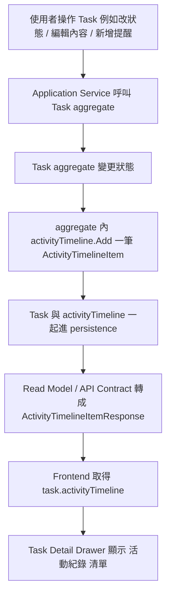

# RonFlow 的活動紀錄 / audit trail 雛形

## 為什麼這篇文章值得寫
RonFlow 的願望清單裡已經把「活動紀錄 / audit trail 雛形」列為已完成，但如果不把它寫清楚，很容易誤會成：
- RonFlow 已經有完整的企業級 audit log
- 或者它只是畫面上隨便列幾行歷史訊息

RonFlow 目前的實作，其實介於兩者之間。

它已經具備：
- task 操作歷程會隨領域行為一起累積
- 後端會把這些紀錄帶到 read model 與 API response
- 前端會在 Task Detail Drawer 顯示可閱讀的活動時間線

但它還不是嚴格意義上的合規級 audit log。

所以用「活動紀錄 / audit trail 雛形」來描述它，是很準確的。

## 這個技術概念是什麼
在 RonFlow 現況裡，這個能力更接近：
- activity timeline
- 操作歷程
- 使用者可讀的 task history

而不是完整的 audit log 平台。

它現在記錄的是：
- 某個 task 發生了哪些重要變化
- 這些變化在什麼時間發生
- 要如何把這些變化轉成畫面上可閱讀的訊息

例如：
- 已建立任務
- 任務狀態已變更為 進行中
- 已完成任務
- 已重新開啟任務
- 已新增提醒

## 它背後的設計精神
### 1. 把歷程視為 domain 變化的一部分
RonFlow 沒有把活動紀錄做成一個和 task 完全分離的後補紀錄器，而是直接讓 `Task` aggregate 在變化時，把對應的 timeline item 一起記下來。

這代表：
- 活動紀錄不是後端外掛
- 它和領域行為是一起發生的

### 2. 優先做「可閱讀的協作歷程」
RonFlow 目前關心的不是稽核合規，而是讓使用者在 task detail 裡能看懂：
- 這個 task 經歷過哪些操作
- 目前狀態是怎麼演變過來的

這比較偏向 [Activity Log](../tech-base/activity-log.md)，而不是完整 [Audit Log](../tech-base/audit-log.md)。

### 3. 先做 MVP 型的 audit trail 雛形
RonFlow 現在有：
- type
- message
- occurredAt

但還沒有：
- actor identity
- before/after value
- append-only 外部事件表
- 稽核查詢報表
- 不可否認性與合規需求

所以它比較像 audit trail 的第一步，而不是終局。

## 這樣做的優點
### 1. Task Detail 有更完整的上下文
使用者打開 task，不只看到當前狀態，也能看到這個 task 是怎麼變成現在這樣的。

### 2. 領域行為與歷程紀錄不容易脫鉤
因為 timeline item 是在 aggregate 方法內直接加入的，所以不像外部 logger 那樣容易漏記。

### 3. 後續可以往更完整的 audit / projection 演進
現在雖然還只是 task 內嵌 timeline，但它已經把：
- 歷史語意
- 顯示模型
- API contract

先建立起來了。

## 代價與限制
### 1. 目前更像 activity timeline，不是完整 audit log
它主要支援的是「看得懂的操作歷程」，不是「可稽核、可追責、可比對前後值」的完整能力。

### 2. 目前缺少 actor 資訊
畫面上的活動紀錄只有訊息與時間，沒有明確記錄是誰做的。

### 3. 目前紀錄依附在 task 聚合資料裡
這讓實作簡單，但也代表：
- 沒有獨立的 audit store
- 沒有針對 audit 查詢最佳化
- 不適合直接拿去做大規模查詢或合規報表

## RonFlow 裡是怎麼實作的
### 後端：Task aggregate 內直接保存活動時間線
RonFlow 的 `Task` aggregate 內有一個 `activityTimeline` 欄位，直接跟著 task 一起存在。

```csharp
private readonly List<ActivityTimelineItem> activityTimeline;
```

這代表目前的活動紀錄不是外部觀察器補寫，而是 aggregate 自己持有的一部分狀態。

### 後端：建立 task 時就會放入第一筆活動紀錄
`Task.Create(...)` 在建立時，就先放入一筆 `TaskCreated`：

```csharp
[ActivityTimelineItem.TaskCreated(createdAt)]
```

也就是說，RonFlow 的 task 從一開始就不是只有目前狀態，也帶著最初的歷程起點。

### 後端：每個重要行為都會往 timeline append 一筆訊息
例如在 `Task.ChangeState(...)` 裡，會先記一筆狀態變更，再視情況補上完成或重新開啟：

```csharp
CurrentState = targetState;
activityTimeline.Add(ActivityTimelineItem.TaskStateChanged(targetState.Label, changedAt));

if (!wasDone && isDone)
{
    CompletedAt = changedAt;
    activityTimeline.Add(ActivityTimelineItem.TaskCompleted(changedAt));
}

if (wasDone && !isDone)
{
    CompletedAt = null;
    activityTimeline.Add(ActivityTimelineItem.TaskReopened(changedAt));
}
```

其他行為也有同樣模式，例如：
- `UpdateDetails(...)`
- `UpdateSortOrder(...)`
- `Archive(...)`
- `MoveToTrash(...)`
- `RestoreFromArchive(...)`
- `RestoreFromTrash(...)`
- `AddReminder(...)`
- `DeleteReminder(...)`

### 後端：ActivityTimelineItem 統一封裝 message 與 type
RonFlow 沒有把訊息硬寫在各個 command service 裡，而是集中在 `ActivityTimelineItem`：

```csharp
public sealed record ActivityTimelineItem(string Type, string Message, DateTimeOffset OccurredAt)
```

例如：

```csharp
public static ActivityTimelineItem TaskCreated(DateTimeOffset occurredAt)
{
    return new("TaskCreated", "已建立任務", occurredAt);
}

public static ActivityTimelineItem TaskReordered(DateTimeOffset occurredAt)
{
    return new("TaskReordered", "已調整任務順序", occurredAt);
}
```

這樣做的好處是：
- type 與 message 有一致來源
- UI 不必自己拼湊這些文案

### 後端：活動紀錄會被序列化進 persistence 與 API response
RonFlow 目前會把 `ActivityTimelineItem` 寫進 JSON persistence，也會在 read model / API contract 中保留它。

資料結構在 API contract 端長這樣：

```csharp
public sealed record ActivityTimelineItemResponse(string Type, string Message, DateTimeOffset OccurredAt)
```

前端收到的型別也有明確定義：

```ts
export type ActivityTimelineItemResponse = {
  type: string
  message: string
  occurredAt: string
}
```

這表示它不是只存在於 domain memory，而是已經穿過：
- persistence
- read model
- API contract
- frontend types

### 前端：Task Detail Drawer 會把 timeline 顯示成可閱讀的歷程清單
在 `TaskDetailModal.vue` 裡，RonFlow 直接把 `task.activityTimeline` render 成清單：

```vue
<div class="detail-card detail-card-full">
  <p class="detail-label">活動紀錄</p>
  <ul class="history-list">
    <li v-for="entry in task.activityTimeline" :key="`${entry.type}-${entry.occurredAt}`">
      <span>{{ entry.message }}</span>
      <small>{{ formatTimelineTime(entry.occurredAt) }}</small>
    </li>
  </ul>
</div>
```

這代表 RonFlow 目前已經把活動紀錄從 domain 概念，走到使用者實際看得到的 UI。

## 用 Mermaid 看 RonFlow 目前的活動紀錄流向


這張圖能看出 RonFlow 現在的重點是：
- 把 task 的重要變化保留下來
- 再把它投遞到畫面讓使用者閱讀

而不是先做一個獨立 audit 平台。

## 這件事對 RonFlow 代表什麼
這個能力很適合被叫做「audit trail 雛形」，因為它已經證明 RonFlow 不只會保存當前狀態，也開始關心歷史語意。

它對 RonFlow 的價值在於：
- task 不再只是 CRUD 結果
- task 已經有一條可閱讀的歷程線
- 未來若要做 projection、report、actor-based audit、event log，都有一個可以演進的起點

## 下一步可以怎麼演進
如果未來要把這個雛形升級成更完整的 audit trail，可以考慮：
- 加入 actor：誰做了這個變更
- 加入 before / after value
- 拆成獨立 audit/event store
- 做針對 audit 的 query / projection
- 區分 activity log 與 compliance audit log

## 總結
RonFlow 目前的「活動紀錄 / audit trail 雛形」，本質上是一條由 `Task` aggregate 持有、由 API 帶出、由 Task Detail Drawer 顯示的 activity timeline。

它還不是企業級 audit log，但也絕對不只是 UI 假資料。它已經把「歷程」變成 task 模型的一部分，這正是 audit trail 演進的第一步。