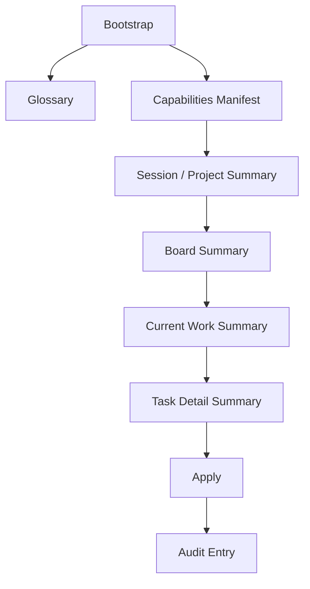

# RonFlow 的 AI discovery surface

## 為什麼這篇文章值得寫
RonFlow 要讓 AI 真正可用，不能只提供一個 `apply` 寫入入口。

如果 AI 在開始工作前，沒有穩定的 discovery surface，它就只能：
- 靠 prompt 片段猜系統裡有哪些入口
- 自己從整塊 board 文本推測目前該看哪一筆 task
- 在 glossary 缺席時，用不一致的名詞理解同一個 domain 概念

這些都會讓 AI 的行為變得難以審計，也更容易誤用 contract。

所以 RonFlow 把 discovery surface 視為一等公民，而不是 `apply` 的附屬說明。

## 這個技術概念是什麼
AI discovery surface 指的不是單一 endpoint，而是一組讓 AI 可以逐步定位上下文的 read-first contract。

在 RonFlow 目前的切法裡，這條路徑是：
- bootstrap：先知道 RonFlow 是什麼、有哪些第一步入口
- glossary：先把 interaction surface 的核心用語對齊
- capabilities manifest：知道哪些 read / write 能力存在
- session / project summary：知道目前 scope 與可存取 project
- current work summary：先縮小成目前真正還在處理中的 task 集合
- task detail summary：再進入單一 task 的細節

這代表 AI 不必一開始就讀完整 spec，也不必從整個 board 自己猜下一步。

## 它背後的設計精神
### 1. 先讓 AI 找到方向，再讓 AI 寫入
RonFlow 的設計不是把 AI 當成直接呼叫 command 的自動腳本，而是把「找到正確 target」本身視為產品能力。

也就是說，系統不只要能寫，還要讓 AI 先知道：
- 自己目前在哪個 scope
- 哪些任務是現在仍然 open 的 current work
- 下一步該讀哪個 summary

### 2. 名詞對齊本身就是風險控制
bootstrap 裡已經要求 AI 先讀 glossary，這代表 RonFlow 把名詞一致性視為可操作性的前提。

像是 `active scope`、`summary`、`apply`、`audit entry` 這些字，如果沒有穩定定義，AI 很容易在不同 prompt、不同文件之間把意思混掉。

所以 glossary 不是補充說明，而是 discovery surface 的正式一部分。

### 3. current work 要比 board 更扁平
board summary 很適合回答整體狀態，但它仍然要求 AI 從欄位與卡片混合資訊裡自己挑出「目前最值得處理的 open tasks」。

RonFlow 補上的 `current-work-summary` 則故意做得更扁平：
- 只列出未完成 workflow column 裡的 task
- 直接給 `task_id`、`title`、`workflow_state_key`
- 用 `open_task_count` 讓 AI 可以先判斷目前 task 集合大小

這讓 AI 在進入 task detail 之前，就先用更低成本把目標縮小。

## 這樣做的優點
### 1. 降低 AI 挑錯 task 的機率
AI 不必從完整 board 文本推斷哪幾張卡算是 still open，也不用自己過濾 `Done`。

### 2. 讓 bootstrap 的承諾真正可兌現
如果 bootstrap 要求先讀 glossary，但系統沒有 glossary endpoint，bootstrap 就只是口頭承諾。

把 glossary 落成正式 route 後，AI 才能真的依 bootstrap 指示工作。

### 3. 讓 summary contract 更有層次
現在的 summary 不再只有 project list、board、task detail 三層，而是補上了一個介於 board 與 task detail 之間的 current work 視角。

這對 AI 特別重要，因為它通常需要先找對 task，再決定是否讀更深的 detail。

## 代價與限制
### 1. 需要同步維護多個 text contract
bootstrap、glossary、manifest、summary 彼此之間會共享名詞與能力描述。

一旦其中一個改了，其他文件與測試也要一起改，否則 AI 看到的 surface 很快就會失真。

### 2. current work 仍然是 summary，不是排序引擎
`current-work-summary` 目前做的是「縮小集合」，不是幫 AI 決定哪一筆 task 最重要。

下一步若要更進一步，才會需要 priority、assignee、aging、blocked reason 等更強的排序訊號。

## RonFlow 裡是怎麼實作的
### 後端：AI controller 把 discovery surface 拆成多個穩定 route
RonFlow 的 `AiInteractionController` 不是只提供 `bootstrap` 與 `apply`，而是把 discovery surface 分成：
- `bootstrap`
- `glossary`
- `capabilities`
- `workflow-guidance`
- `session-summary`
- `projects/summary`
- `projects/{projectId}/board-summary`
- `projects/{projectId}/current-work-summary`
- `projects/{projectId}/tasks/{taskId}/detail-summary`

這種切法讓 AI 可以逐層深入，而不是一次讀到過大、過扁或過雜的資訊塊。

### 後端：canonical text contract 集中在 formatter
RonFlow 把 discovery surface 的文本契約集中在 `AiTextContractFormatter`。

這樣做的好處是：
- endpoint 不用各自手寫字串
- 測試可以直接鎖定 canonical label
- 新增 glossary 與 current work summary 時，可以和既有 bootstrap / summary contract 維持同一種語氣與排版

### 後端：current work 直接沿用 board read model，但只挑未完成欄位
RonFlow 沒有為了 current work 另開一套 read store，而是從 `ProjectBoardView` 衍生出另一個更聚焦的文字視圖。

其中一個重要細節是：
- `current-work-summary` 只選 `IsCompletedState == false` 的 workflow column
- `open_task_count` 也改成沿用同一個未完成定義

這避免 project summary 與 current work summary 對「open task」各說各話。

### 測試：integration 與 acceptance 一起鎖住新 surface
這個切片除了 controller 與 formatter，也同步補了：
- 後端 integration test：驗證 `glossary`、`current-work-summary` 與 capabilities manifest
- 前端 acceptance spec：驗證 AI-facing text contract 確實可由外部 agent 讀到

所以這不是單純加 endpoint，而是把 discovery surface 當成產品契約來驗收。

## 用 Mermaid 看 RonFlow 的 AI discovery flow

## 小結
RonFlow 的 AI discovery surface 不是「多補兩個 endpoint」而已。

它代表 RonFlow 開始把 AI 視為一種需要先定位上下文、對齊名詞、逐層縮小目標，再安全寫入的 actor。

對外看起來只是 glossary 與 current work summary；但對內其實是在建立一條更可靠的 AI working path。