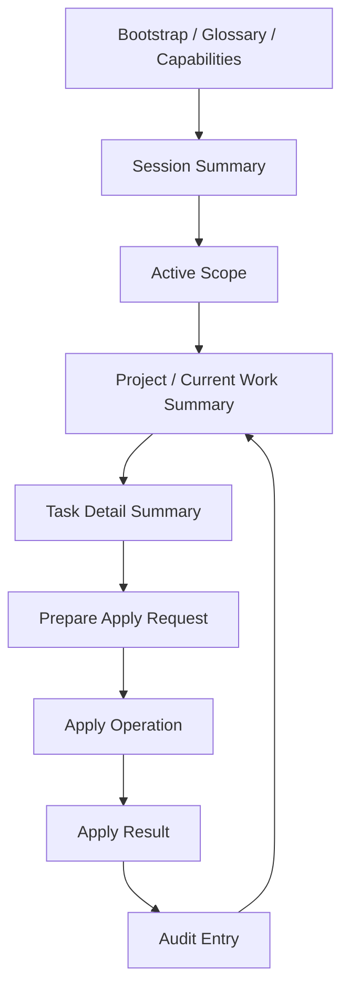

# RonFlow 的 AI interaction surface

## 為什麼這篇文章值得寫
RonFlow v0.3 的目標不是只讓 AI 讀得到系統狀態，而是讓 AI 可以在可識別、可限制、可追溯的前提下完成實際工作。

這代表系統需要一條 AI 專用 interaction surface：它不等同於人類 UI，也不只是把既有 REST API 開給 AI 呼叫。它必須讓 AI 先找到正確上下文，再使用穩定 contract 寫入，最後留下人類可審計的結果。

## 這個技術概念是什麼
AI interaction surface 是一組給 AI actor 使用的 read / write / audit contract。

RonFlow 目前把它拆成四段：

1. discovery：bootstrap、glossary、capabilities、workflow guidance。
2. summary：session summary、project summary、board summary、current work summary、task detail summary。
3. apply：用固定 operation 與 required / optional fields 執行 Project / Task 操作。
4. audit：每次成功 apply 都回傳 audit entry id，讓人類可以查回 actor、target、requested change 與 actual diff。

這條 surface 的重點不是「AI 能不能呼叫 API」，而是 AI 能不能用穩定、可驗收、可審計的方式完成工作。

## RonFlow 已經落地的能力
RonFlow 已經提供下列 AI-facing endpoints：

- `GET /api/ai/bootstrap`
- `GET /api/ai/glossary`
- `GET /api/ai/capabilities`
- `GET /api/ai/workflow-guidance`
- `GET /api/ai/session-summary`
- `GET /api/ai/projects/summary`
- `GET /api/ai/invitations/summary`
- `GET /api/ai/projects/{projectId}/board-summary`
- `GET /api/ai/projects/{projectId}/current-work-summary`
- `GET /api/ai/projects/{projectId}/tasks/{taskId}/detail-summary`
- `POST /api/ai/active-scope`
- `POST /api/ai/apply`
- `GET /api/ai/audit-entries/{auditEntryId}`

`apply` 目前承接的操作包含：

- `create_project`
- `create_task`
- `invite_project_member`
- `accept_project_invitation`
- `reject_project_invitation`
- `update_task_detail`
- `check_task_subtask`
- `uncheck_task_subtask`
- `move_task_state`
- `reorder_task`
- `archive_task`
- `restore_archived_task`
- `trash_task`
- `restore_trashed_task`

這些 operation 讓 AI 可以用同一種 write contract 完成 Project / Task / Invitation 的主要操作，而不是直接散打各個人類 UI 使用的 API。

## 設計重點
### 1. Read-first，而不是 write-first
AI 在寫入前應先讀 summary，確認 session、scope、project、task 與 required fields。

這是 RonFlow AI surface 最重要的安全設計：先用低成本 summary 找對上下文，再進入寫入操作。這比讓 AI 直接猜 project id、task id 或 workflow state 更可控。

### 2. Capabilities manifest 讓可用操作可發現
AI 不需要猜目前支援哪些操作，而是透過 capabilities manifest 讀到 operation、category、是否需要 active scope，以及 required inputs。

manifest 也必須把 capability 接到實際 route 與 body shape。Write capability 會明確標示 `POST /api/ai/apply`、`requiredFields.<inputName>` 的欄位位置，以及關鍵操作的 apply request example；read capability 會標示對應的 read endpoint。

這使得 interaction surface 可以演進：新增能力時更新 manifest 與測試，AI 就能依 contract 發現新能力，而不是靠猜 endpoint 或 JSON shape。

bootstrap 也應補上 canonical base paths 與 entrypoints，因為 localhost 同時掛 UI、RonFlow API 與 RonAuth API。若 AI 一開始把 contract path 接到 `http://localhost/`，通常只會看到一般 404，這對 agent 幾乎沒有診斷價值。

### 3. Bootstrap 做漸進式揭露，不做離線手冊
RonFlow 的外部 skill 只需要提供登入、session activation 與 bootstrap 入口。

AI 登入後應由 `GET /api/ai/bootstrap` 取得下一步入口，再逐步查詢 capabilities、glossary、workflow guidance、summary 與 apply contract。這讓操作規則回到系統內版本化與測試，避免 prompt 文件複製一份容易過期的流程說明。

### 4. Workflow guidance 把工作方式也做成 contract
RonFlow 不只告訴 AI 有哪些 endpoint，還透過 workflow guidance 說明 expected workflow：read summary、確認 target、準備 write request、inspect result。

這讓「AI 應該如何工作」不只存在 prompt 裡，而是系統可回傳、可測試、可版本化的內容。

### 5. 結構化 DoD 讓 AI 逐項完成 task
RonFlow 的 task detail summary 會列出 subtasks，workflow guidance 也要求 AI 遇到 checklist 時逐項處理。

因此 AI 不應只宣告「我完成了」，而是用 `check_task_subtask` / `uncheck_task_subtask` 對每個完成條件做出可追蹤的狀態變更。這讓 DoD 從文字提醒變成正式 workflow contract。

### 6. Project access 也可以走 read-first contract
以前 AI 若在 projects summary 看不到目標 project，只能停下來請人類確認 access。

現在 RonFlow 補上 `read_invitation_inbox_summary`，讓 AI 可以先確認自己是否有 pending invitation；若有明確目標，就能用 `accept_project_invitation` 接受邀請，再重新讀取 projects summary。

這讓「取得 project access」也維持同一套 read-first、apply、audit 流程，而不是要求 AI 猜一般 REST API 或完全依賴人類手動操作。

### 7. Audit entry 是 apply 的一部分
每次成功 apply 都會回傳 `audit_entry_id`。

人類可以透過 audit entry 追查：

- actor identity
- target type / target id
- requested change
- result status
- actual diff

這讓 AI 寫入不是一個只存在 chat transcript 裡的行為，而是 RonFlow 系統內可查詢的操作結果。

## 可視需求深化的方向
RonFlow v0.3 baseline 已經可以讓 AI 透過正式 surface 完成主要工作。現階段的風險控管流程是：AI 完成修改、部署到測試機、人工驗收、再由人類 commit 程式碼。

在這個工作流下，RonFlow 不需要把 proposal / preview / approval gate 放進 AI apply 的必要路徑；額外審核關卡反而可能增加不必要的摩擦。

後續若要深化，較適合優先考慮下列方向：

1. `AiAuditRegistry` 目前偏向 runtime-level registry；若未來需要跨 session、跨部署、跨版本長期追查 AI 操作，可推進為持久化、可查詢、可保留的 audit read model。
2. 已用新的 VS Code session 驗證 AI 能從 bootstrap / summary / apply / audit 順利完成任務；若未來要降低 contract 演進風險，可以把這種人工驗證整理成可重跑的 smoke test 或 evaluation scenario。
3. AI surface 目前可操作 task checklist；project-level DoD template 維護可先保留給人類工程師，讓 AI 負責執行單張 task 的 checklist，這是合理分工，不必急著擴成 AI 專用管理 contract。
4. `update_task_detail` 的 AI apply contract 目前涵蓋 title、description、due date；其他結構化欄位可依實際需求再評估是否納入 AI surface。

## 用 Mermaid 看 RonFlow 的 AI interaction loop

## 小結
RonFlow 的 AI interaction surface 已經跨過「只有 AI 可讀文件」的階段，進入「AI 可以用正式 contract 完成 Project / Task 工作」的階段。

它目前的價值在於：讓 AI 能夠先讀、再寫、可回報、可審計；後續若要深化，重點應放在持久化 audit、可重跑的 AI workflow smoke test，以及依實際需求擴充 AI apply contract。