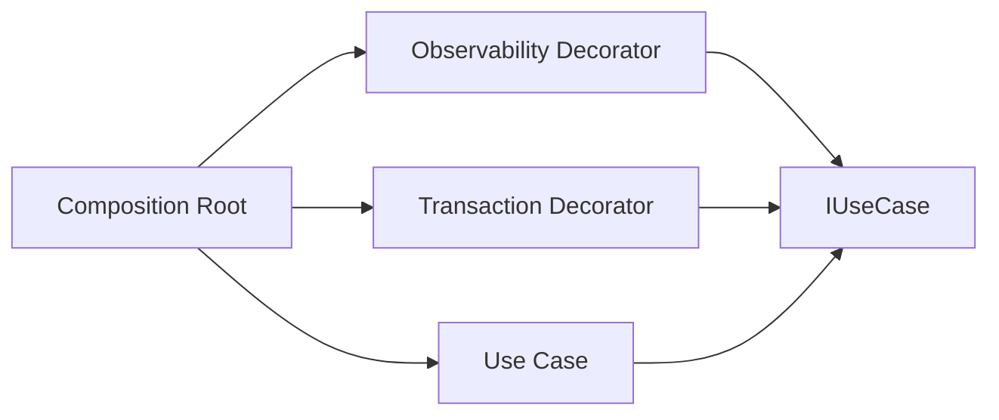
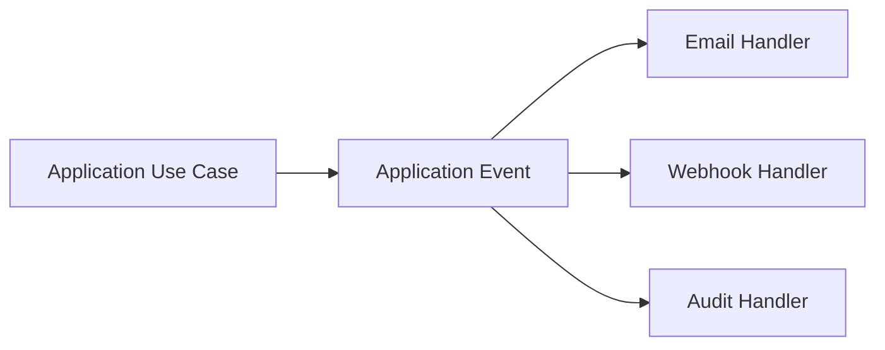

# RonFlow 的 cross-cutting pattern language

## 為什麼這篇文章值得寫
當系統開始加入 observability、email 通知、外部系統整合、audit log、retry、transaction、health check 之後，團隊很容易遇到一個共同問題：

- 這些東西到底算不算 adapter
- 它們應該包在 application 外面，還是放在 application 裡
- 如果越來越多外圍能力都要「跑過這段流程」，會不會最後變成一條很長的 `A -> B -> Application` 相依鏈

如果沒有一套 pattern language，討論很容易卡在「好像這樣可以，但又覺得哪裡怪怪的」。

這篇文章的目的，就是把 RonFlow 目前實際用到與未來很可能會用到的幾種模式講清楚，讓團隊在面對 cross-cutting concern 時，有比較一致的命名與判斷方式。

## 先講結論：不是所有外圍能力都叫 adapter
在 RonFlow 這類 Clean Architecture / Ports and Adapters 風格的系統裡，很多東西都可以被寬鬆地叫成 adapter，但如果只用這個詞，通常不夠精確。

比較有用的說法是把它再拆細成幾種模式：

- adapter：邊界轉接
- decorator：包住同一個 port，在前後做額外行為
- filter / middleware：在 transport 邊界形成 request pipeline
- event handler：回應用例完成後的副作用
- orchestrator / process manager：協調多個步驟完成更大的流程
- composition root：決定最後的組裝順序，但不承擔業務邏輯

RonFlow 在 board read observability 這個案例裡，真正用到的其實不是單一模式，而是這些模式的組合。

## Pattern Language 對照表
### 1. Adapter
Adapter 的角色是：
- 把外部世界的介面轉成系統能理解的形式
- 或把系統內部結果轉成外部世界需要的形式

在 RonFlow 裡，最典型的 adapter 是：
- ASP.NET Core controller
- SQLite repository / read store
- RonAuth JWT 驗證與 HTTP 邊界

也就是說，controller 是 HTTP adapter，repository 是 persistence adapter。

### 2. Decorator
Decorator 的角色是：
- 不改變原本 port 的介面
- 只是包在外面，於執行前後加上額外行為

RonFlow 的 board read observability 用的就是這個模式：
- `ObservedGetProjectBoardQueryService`
- `ObservedCoreFlowReadStore`

它們都不是新的用例，也不是新的 adapter protocol，而是包在既有介面外層的 decorator。

### 3. Filter / Middleware
這類模式主要活在 transport boundary。

它們的角色是：
- 在 request 進到 endpoint 前後做額外處理
- 形成 request pipeline

RonFlow 的 `BoardReadServerTimingFilter` 就屬於這一類。它不是 application logic，而是 HTTP boundary 上的 response-enrichment concern。

### 4. Event Handler
這類模式適合處理：
- 用例成功後的副作用
- 不需要硬包在主流程外圍的反應

例如未來如果 RonFlow 在 task 建立後：
- 寄 email 給自己
- 通知別的 bounded context
- 發 webhook

這通常比較適合用 event handler，而不是再加一層 decorator 包住 command service。

### 5. Orchestrator / Process Manager
當流程不只是「執行一個 use case」，而是：
- 要協調多個步驟
- 中間可能有成功 / 失敗 / 補償
- 還要控制順序

這時候比較像 orchestrator / process manager 的責任。

它適合表達的是：
- 哪一步先做
- 哪一步後做
- 失敗時怎麼處理

而不是把這些東西藏進 decorator chain 裡。

## RonFlow 目前的 board read 觀測該怎麼命名
如果用比較精確的 pattern language 來描述，RonFlow 現在這套 board read 觀測比較像：

- 在架構風格上：Ports and Adapters / Clean Architecture 的 outer ring concern
- 在 use case 邊界上：Decorator
- 在 HTTP 邊界上：Filter
- 在系統組裝上：Composition Root 決定 wiring

所以如果只說「這是 adapter」，不能說完全錯，但太粗。

更好的說法是：
- `ProjectsController` 是 HTTP adapter
- `BoardReadServerTimingFilter` 是 HTTP filter
- `ObservedGetProjectBoardQueryService` 是 use case decorator
- `ObservedCoreFlowReadStore` 是 read store decorator
- `Program.cs` 是 composition root

## 多個外圍能力都要跑時，怎麼避免依賴打結
這是最容易出現設計退化的地方。

真正該避免的，不是「有順序」，而是「外圍能力彼此知道太多」。

### 順序本身不是問題
像這樣的順序其實很正常：

```text
Observability -> Transaction -> Application Use Case
```

問題不在於它有順序，而在於如果寫成：

```text
Observability 直接依賴 Transaction
Transaction 再直接依賴 Application
```

那就會開始產生 hard-coded ordering 與相依耦合。

### 正確的做法是共同依賴同一個 port
比較健康的做法是：
- 每個 decorator 都只依賴同一個抽象介面
- 不直接依賴彼此的 concrete type
- 最後由 composition root 決定包裝順序

概念上像這樣：



真正執行時可能是：

```text
Observability(Transaction(Application))
```

但 `Observability` 不需要知道自己包的是 `TransactionDecorator` 還是別的東西；它只知道自己包的是 `IUseCase`。

## 什麼該用 decorator，什麼不該
### 適合用 decorator 的情況
- 你想在用例前後加技術性行為
- 不想改 use case 本體
- 這個行為對很多 use case 都可能重用
- 它屬於 cross-cutting concern

典型例子：
- observability
- transaction
- retry
- metrics
- tracing
- authorization guard

### 不適合硬做成 decorator 的情況
如果你的需求是：
- 用例完成後寄 email
- 用例完成後通知外部系統
- 用例完成後寫 audit event

這些通常更像「副作用反應」，而不是包在用例外層的技術邏輯。

這時候比較適合：
- domain event
- application event
- outbox + handler

## Email / 外部通知 這種需求比較像哪一類
如果 RonFlow 未來有：
- 建立 task 後寄 email
- invitation accepted 後通知別的系統
- 某個專案狀態變更後發 webhook

我通常不會先建議做成：

```text
EmailDecorator(WebhookDecorator(Application))
```

因為這樣很容易把副作用、投遞策略、重試策略都塞進同步 call chain，最後讓主流程過重。

這類需求通常更適合：



這樣的好處是：
- email handler 不需要知道 webhook handler
- webhook handler 不需要知道 audit handler
- 主用例與副作用之間的依賴更鬆

如果還要可靠投遞，再往外加 outbox 就好。

## 一個實用判斷法
遇到新需求時，可以先問三個問題：

### 1. 它是在包 use case，還是在回應 use case 結果？
- 如果是在包 use case，通常比較像 decorator / pipeline
- 如果是在回應結果，通常比較像 event handler

### 2. 它是 technical concern，還是業務流程的一部分？
- technical concern：observability、retry、metrics、transaction
- 業務反應：通知、對外同步、audit trail、integration event

### 3. 它需要知道其它外圍元件嗎？
- 如果需要直接知道別的外圍元件，通常代表設計開始過緊
- 比較理想的狀態是：大家都依賴同一個 port 或同一個 event，而不是互相直連

## RonFlow 目前這個設計的價值
RonFlow 這次把 observability 抽成 `RonFlow.Observability` project，不只是為了程式碼看起來整齊，而是為了讓團隊後續在面對更多 cross-cutting concern 時，有一套比較不容易打結的 pattern language。

這代表未來討論可以更精確地說：
- 這是一個 decorator 問題，不是 event handler 問題
- 這是 HTTP filter，不是 application service 責任
- 這應該由 composition root 決定順序，不應該讓 A 直接依賴 B
- 這比較像 outbox / integration handler，而不是再包一層 decorator

一旦有這套語言，設計討論就比較不容易退化成「全部都叫 adapter，但其實大家心裡想的都不是同一種東西」。

## 和壓力測試文章的關係
這篇文章是 pattern language 的總說明。

如果你想看 RonFlow 如何把這套思路實際用在 board read 壓測與 observability 上，再回去看：
- [RonFlow 的壓力測試與 observability 實踐](./ronflow-load-testing-observability.md)

那篇文章比較回答：
- RonFlow 為什麼做 baseline
- 為什麼要把 server-side timing 帶回 k6
- 為什麼要抽成 `RonFlow.Observability` project

而這篇文章比較回答：
- 這種做法在 pattern language 裡到底叫什麼
- 什麼時候應該用 decorator
- 什麼時候應該改用 event handler 或 orchestrator