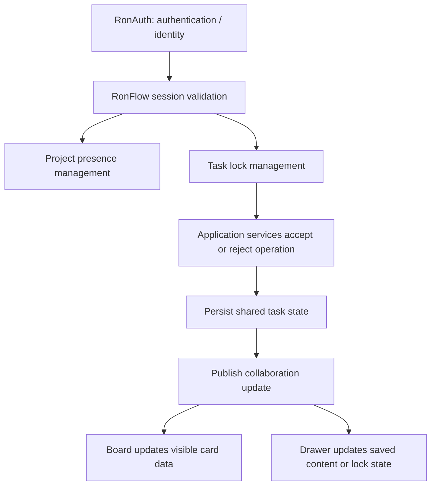
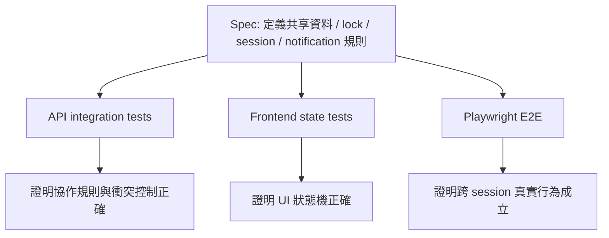

# RonFlow 的多人協作 / 即時同步設計

## 為什麼這篇文章值得寫
RonFlow 接下來要做的多人協作，不只是「兩個人都能看到同一個 Project」而已。

真正困難的是這幾件事要同時成立：
- 共用資料要近即時同步
- 未儲存草稿不能被誤當成共享資料
- 同一張 Task 的衝突操作要被限制
- session 失效、presence 回收、lock 釋放要一致
- 自動化測試不能只驗 happy path，還要驗競態與失效情境

這篇文章的目的，是把 [RonFlow Core Flow Spec](../specs/ronflow-core-flow-spec.md) 中多人協作相關規格，整理成一份可實作、可測試、可討論的技術文章。

## 這個技術概念是什麼
RonFlow 的多人協作不是 generic chat-style real-time，而是以 Task 協作為核心的 real-time office workflow。

它的核心面向有四個：
- shared state：Project Board 與 Task Detail Drawer 中的已儲存資料
- private draft：某位使用者尚未儲存的編輯草稿
- conflict control：content edit lock、drag lock、lifecycle lock
- session / presence：誰目前仍在這個 Project scope 中、誰的 session 已失效

換句話說，RonFlow 要處理的不只是「資料更新要推送」，而是：
- 什麼資料要同步
- 什麼資料不能同步
- 哪些操作彼此衝突
- 哪些狀態必須在 session 結束時立即回收

## 它背後的設計精神
### 1. 先分清楚共享狀態與私人草稿
Spec 已經明確寫出：未儲存草稿不屬於共享資料。

這是一個很重要的界線，因為如果系統把所有暫時輸入都廣播出去，就會讓協作變成互相覆蓋。

RonFlow 要同步的是「已儲存的真實狀態」，不是某個使用者正在打字中的半成品。

### 2. lock 是協作規則，不是 UI 小技巧
多人協作常見錯誤，是把 lock 視為前端 disable 按鈕而已。

在 RonFlow，lock 應該是 domain / application 層要理解的協作規則：
- 誰已取得 content edit lock
- 誰已取得 drag lock
- 誰正在做 lifecycle 操作
- 哪些 lock 可並存，哪些不行

UI 只是把這些規則顯示出來。

#### 2.1 這裡說的 mutation 是什麼
這裡的 `mutation` 不是生物學上的「突變」，而是工程語境中的「會改變狀態的寫入操作」。

在 RonFlow 這一輪設計裡，像下面這些都屬於 task mutation：
- `task.UpdateDetails(...)`
- `task.ReplaceSubtasks(...)`
- `task.ChangeState(...)`
- `task.AddReminder(...)`

如果用中文說得更自然，這裡其實更接近：
- 狀態變更操作
- 寫入操作
- 會改變 aggregate 狀態的命令

之所以程式碼裡仍沿用 `mutation`，是因為它剛好能和「query 不改狀態、mutation 會改狀態」這個語意對齊，也能讓 lock policy 很自然地表達成「不同 mutation 有不同 lock requirement」。

### 3. session 與 presence 必須一起設計
Spec 裡的 single active session policy 很關鍵。

RonFlow 不是只判斷「JWT 還有效嗎」，而是要判斷：
- 這是不是目前最新的 RonFlow session
- 舊 session 的 presence 是否已回收
- 舊 session 持有的 lock 是否已釋放

這代表 session 管理在這裡不是純認證問題，而是協作一致性問題。

### 4. 通知面與核心即時面應分級處理
Spec 已經區分：
- Project Board 與 Task Detail Drawer 是核心即時面
- Invitation Inbox、Members Panel、Project List badge、在線名單是通知面

這個分級很重要，因為不是所有畫面都需要同等級的即時性。

## 目前 RonFlow 實際是怎麼做多人協作的
### 1. 目前不是 WebSocket-first，而是 polling-first
就目前程式碼來看，RonFlow 的多人協作並不是用 WebSocket、SignalR 或 SSE 來做推播；目前比較接近「近即時 polling + 協作規則控制」。

前端最核心的同步入口在 [App.vue](../../code-frontend/src/App.vue)。

它目前會：
- 每 3 秒輪詢一次 workspace 相關資料
- 在 board / drawer 視圖時同步 refresh Project List、Board、Task Detail
- 不在 invitation inbox 視圖時，仍持續更新 invitation badge
- 一旦收到 session invalidated 事件，就停止輪詢並清掉本地 session

通知面則不是和 Board 完全同級同步，而是由像 [InvitationInboxView.vue](../../code-frontend/src/components/InvitationInboxView.vue) 這種畫面各自做輪詢。以目前實作來看，Invitation Inbox 是先延遲 6 秒啟動，再以 5 秒週期更新一次。

這代表目前 RonFlow 的「即時」比較準確的說法是：
- 核心協作面使用短週期 polling 達成 near-real-time
- 通知面使用較寬鬆的 polling 達成 eventual consistency
- 真正的衝突防止不是靠前端自己猜，而是靠後端協作規則

### 2. 使用到的技術框架與執行元件
如果把實作拆開來看，目前多人協作主要由這幾種技術組合而成：

- frontend framework：Vue 3 + composables
- transport：一般 HTTP API 請求，不是長連線通道
- backend framework：ASP.NET Core Web API + middleware + hosted service
- auth / identity：RonAuth 提供 JWT 與 identity
- RonFlow session control：RonFlow 自己另外維護 active session 規則
- persisted shared state：SQLite 與 RonFlow.Infrastructure 的 repository / read store
- transient collaboration state：application layer 的 singleton registry，內部目前主要使用 `ConcurrentDictionary`

也就是說，RonFlow 現在的多人協作不是「先有一條即時通道，再把所有東西都往裡面丟」，而是：
- 先用 ASP.NET Core 把 session、presence、lock 的規則守住
- 再由 Vue 端以 polling 方式把共享狀態重新拉回來

### 3. Session 協定是 RonFlow 自己加在 API 上的
RonAuth 只處理 authentication / identity，但 RonFlow 另外建立了一個自己的 collaboration session 協定。

前端在 [ronflowSession.ts](../../code-frontend/src/ronflowSession.ts) 內會：
- 用 `sessionStorage` 建立一個 RonFlow session id
- 透過 `CustomEvent` 廣播 session invalidated 事件

而 [request.ts](../../code-frontend/src/api/request.ts) 會在每次 API request 自動加上 `X-RonFlow-Session-Id` header。後端則在 [RonFlowSessionConstants.cs](../../code-backend/RonFlow.Api/RonFlowSessionConstants.cs) 與 [RonFlowActiveSessionMiddleware.cs](../../code-backend/RonFlow.Api/RonFlowActiveSessionMiddleware.cs) 裡定義這套協定：

- request header：`X-RonFlow-Session-Id`
- invalidation response header：`X-RonFlow-Session-Invalidated`
- middleware 會在每次請求時確認這是不是目前仍有效的 RonFlow session

這一層很重要，因為它清楚表明：
- JWT 合法，不代表這個 RonFlow session 仍可協作
- session invalidation 是 RonFlow collaboration protocol 的一部分，不只是 auth 邏輯

### 4. 關鍵程式碼目前在哪裡
如果要從程式碼理解多人協作，最值得先看的檔案大概是這幾組。

前端同步與 session：
- [App.vue](../../code-frontend/src/App.vue)：workspace polling、session invalidated handling、board / drawer / invitation badge 的同步節點
- [useRonFlowBoard.ts](../../code-frontend/src/composables/useRonFlowBoard.ts)：Task Detail mode、content edit lock、inactivity timeout、archived / trashed drawer sync
- [TaskDetailModal.vue](../../code-frontend/src/components/TaskDetailModal.vue)：view mode / edit mode / lifecycle read-only / reminder interaction
- [InvitationInboxView.vue](../../code-frontend/src/components/InvitationInboxView.vue)：通知面的 polling 與 stale invitation conflict sync
- [ronflowSession.ts](../../code-frontend/src/ronflowSession.ts)：前端 RonFlow session id 與 invalidation event
- [request.ts](../../code-frontend/src/api/request.ts)：所有 API request 都附帶 RonFlow session header

後端 API 與協作入口：
- [Program.cs](../../code-backend/RonFlow.Api/Program.cs)：註冊 collaboration 相關 singleton service / middleware
- [SessionController.cs](../../code-backend/RonFlow.Api/Controllers/SessionController.cs)：activate session、release project scope
- [ProjectsController.cs](../../code-backend/RonFlow.Api/Controllers/ProjectsController.cs)：進入 board 時寫入 project presence、查 members / invitations
- [TasksController.cs](../../code-backend/RonFlow.Api/Controllers/TasksController.cs)：content edit lock、task update、lifecycle command 入口
- [RonFlowActiveSessionMiddleware.cs](../../code-backend/RonFlow.Api/RonFlowActiveSessionMiddleware.cs)：拒絕已失效 session 的請求

application layer 的協作規則：
- [TaskContentEditLockService.cs](../../code-backend/RonFlow.Application/TaskContentEditLockService.cs)：content edit lock 的 acquire / release / ownership 判定
- [TaskMutationGuard.cs](../../code-backend/RonFlow.Application/TaskMutationGuard.cs)：把 runtime lock 狀態轉成 aggregate 可用的 `TaskMutationAuthorization`
- [ProjectPresenceRegistry.cs](../../code-backend/RonFlow.Application/ProjectPresenceRegistry.cs)：project scope 在線名單
- [RonFlowActiveSessionRegistry.cs](../../code-backend/RonFlow.Application/RonFlowActiveSessionRegistry.cs)：single active session policy，並在切換 session 時回收 lock 與 presence
- [ProjectCollaborationQueryService.cs](../../code-backend/RonFlow.Application/ProjectCollaborationQueryService.cs)：members / online users / invitation inbox 查詢
- [UpdateTaskCommandService.cs](../../code-backend/RonFlow.Application/UpdateTaskCommandService.cs)：將 `TaskMutationAuthorization` 傳入 aggregate，並解讀 aggregate 回傳的 execution result
- [MoveTaskToTrashCommandService.cs](../../code-backend/RonFlow.Application/MoveTaskToTrashCommandService.cs)：lifecycle command 也改由 aggregate execution result 回報 lock 衝突

domain layer 的核心 task / project 規則：
- [TaskMutationLockPolicy.cs](../../code-backend/RonFlow.Domain/TaskMutationLockPolicy.cs)：定義不同 task mutation 對 lock 的需求矩陣
- [TaskMutationExecution.cs](../../code-backend/RonFlow.Domain/TaskMutationExecution.cs)：定義 `TaskMutationAuthorization` 與 aggregate mutation execution result
- [Task.cs](../../code-backend/RonFlow.Domain/Task.cs)：lifecycle state、reminders、activity timeline、state transition、detail update，以及直接回傳包含 `Locked` 的 mutation result
- [Project.cs](../../code-backend/RonFlow.Domain/Project.cs)：members、invitations、workflow states、project access 前提

### 5. 多人協作概念是否有體現在 application layer？答案是有，而且很明確
如果只看目前的程式碼分層，RonFlow 的多人協作概念最明顯地落在 application layer。

理由是這一層已經直接承擔：
- 誰可以取得 content edit lock
- 哪個 session 是目前有效 session
- 舊 session 失效後要釋放哪些 lock / presence
- lifecycle 操作是否要因為 lock 而被拒絕
- members panel 要如何查出 online users

這不是單純的 controller glue code，而是 collaboration policy 本身。

例如：
- [TaskContentEditLockService.cs](../../code-backend/RonFlow.Application/TaskContentEditLockService.cs) 不是 UI helper，而是後端真正的 lock authority
- [RonFlowActiveSessionRegistry.cs](../../code-backend/RonFlow.Application/RonFlowActiveSessionRegistry.cs) 在切換 active session 時會主動回收 lock 與 presence
- [TaskMutationGuard.cs](../../code-backend/RonFlow.Application/TaskMutationGuard.cs) 會把 runtime lock 狀態轉成 `TaskMutationAuthorization`

換句話說，目前 RonFlow 的 collaboration 並不是「前端自己 disable 一些按鈕」，而是 application service 真的知道什麼叫衝突、什麼叫失效、什麼叫可操作。

### 6. 多人協作概念是否已經進到 domain layer？答案是部分有，部分還沒有
這裡需要更精確地回答。

已經進到 domain layer 的部分：
- Task 的 lifecycle state
- Task reminder 與 reminder dispatch 狀態
- Task activity timeline
- Task state transition / reopened / completed 等業務事件
- Project members / invitations / workflow state 這些協作前提資料

也就是說，凡是「會進入共享持久化模型」的協作結果，現在大多已經落在 domain 裡。

但還沒有進到 domain layer、而是留在 application layer 的部分包括：
- content edit lock
- project presence
- active RonFlow session
- session invalidation 後的回收行為

不過這一輪有一個很重要的調整：
- lock 的保存位置仍在 application layer
- 但 lock 對不同 task mutation 的要求，已經明確進到 domain 的 `TaskMutationLockPolicy`
- 而 `Task` aggregate 的 mutation method，也已直接回傳包含 `Locked` 的 execution result

這代表 RonFlow 現在不是把 lock 狀態整個塞進 aggregate，而是把「lock 對 mutation 的語意」提升成 aggregate contract 的一部分。

這樣分層在目前其實是合理的，因為這些狀態有幾個特性：
- 它們是 runtime collaboration control，不是長期持久化資料
- 它們目前是 process-local / memory-local 狀態
- 它們更像 coordination policy，而不是 Task / Project aggregate 自身欄位

因此比較準確的架構描述會是：
- domain 已經承載共享 task / project 狀態與業務活動
- application 承載跨 request / 跨 session 的 collaboration coordination
- API / frontend 則把這些協作規則投影成使用者可見行為

### 6.1 Task mutation lock policy 與 aggregate execution result
這次設計最重要的改動，不是單純把 `if (locked) return conflict` 搬位置，而是重新定義 task mutation contract：

- application 仍負責保存 runtime collaboration state
- domain 明確宣告每種 task mutation 需要哪一種 lock discipline
- aggregate mutation method 直接回傳 execution result，其中包含 `Locked`

它背後想解決的問題是：
- 如果 lock 規則散在每個 command service，新增一個欄位或一條商業邏輯時，工程師很容易忘記同步補 lock
- 結果就會變成 UI 規則、API 規則、aggregate 規則彼此漂移

目前 RonFlow 的做法是把責任拆成三層：

1. `TaskContentEditLockService`
   - 負責 runtime lock state 的 authority
   - 回答誰持有 lock、誰是另一位使用者、哪個 task 目前被鎖住

2. `TaskMutationGuard`
   - 負責把 runtime lock state 轉成 `TaskMutationAuthorization`
   - 也就是把 application coordination 轉成 domain 可理解的授權結果

3. `Task` aggregate
   - 負責執行真正的 mutation
   - 如果收到的 authorization 是 locked，就直接回傳 execution result，讓 `Locked` 成為 mutation contract 的一部分

因此現在比較接近這種寫法：

```csharp
var authorization = taskMutationGuard.Authorize(currentUserId, taskId, TaskMutationKind.UpdateDetails);
var result = task.UpdateDetails(authorization, title, description, dueDate, changedAt);

if (result.Locked)
{
    return UpdateTaskResult.Locked();
}
```

而不是：

```csharp
if (!taskContentEditLockService.IsHeldBy(currentUserId, taskId))
{
    return UpdateTaskResult.Locked();
}

task.UpdateDetails(title, description, dueDate, changedAt);
```

這個差異很關鍵，因為後者把 lock 視為外部 cross-check；前者則把 lock 視為 mutation 本身的執行結果之一。

這並不代表 aggregate 自己保存了 lock 狀態。
比較精確地說，是 aggregate 現在已經理解：
- 自己正在執行哪一種 mutation
- 如果該 mutation 不被允許，應該如何回報

這樣的好處是：
- `task.UpdateDetails(...)`、`task.ReplaceSubtasks(...)` 這些 API 的行為邊界更完整
- lock 不再只是 command service 的零散防呆
- domain test 可以直接驗證「收到 locked authorization 時，aggregate 不應改變狀態」

代價則是：
- aggregate method 簽章會比以前更重
- application 仍然需要先把 runtime state 轉成 authorization，沒有辦法完全省掉外圍協調層

### 7. 這也說明了目前架構的限制
目前這種做法可以先把多人協作功能做對，但它也有一個很清楚的技術界線：

- lock / presence / active session 目前是 in-memory registry
- 因此它們天然偏單機、單 process 模式
- 現階段比較像「單節點 office workflow 協作」

這不代表設計錯，而是代表 RonFlow 現在的 collaboration 架構重點在於：
- 先把規則定清楚
- 先把測試做完整
- 先證明 application / domain 邊界合理

等未來真的要跨多節點擴充時，再把這些 registry 換成共享 store、event bus 或真正的 push channel，才會比較穩。

## 系統行為設計
### 1. 協作範圍先以 Project 為界
目前 spec 定義的共享邊界是 Project，而不是 workspace、tenant 或 organization。

所以多人協作的第一個設計原則應該是：
- presence 以 Project scope 計算
- lock 以 Task 為單位，但依附在 Project scope 內
- board、drawer、archived view、trash view、members panel 都屬於 Project presence 範圍

這樣做可以先把協作問題收斂在單一 bounded context 內，不要一開始就引入跨 workspace 的複雜度。

### 2. 區分兩種同步面
RonFlow 的同步面至少應分成兩級。

第一級是核心即時面：
- Project Board
- Task Detail Drawer

這兩個畫面中的已儲存變更應近即時同步，因為它們直接承接 task 的共享工作狀態。

第二級是通知面：
- Invitation Inbox
- Project Members Panel
- Project List 上的 invitation badge
- Project 在線名單

這些地方可接受最晚在 10 秒內同步，不需要和 Board 一樣追求每個瞬間都完全一致。

### 3. 同步的單位是已儲存資料，不是所有畫面狀態
根據 spec，以下資料屬於共享同步範圍：
- Task title
- description
- due date
- current state
- sort order
- lifecycle state
- reminders
- activity timeline

以下資料不屬於共享同步範圍：
- edit mode 中的未儲存草稿
- 本地暫時輸入中的欄位值
- lock / heartbeat 這種協作暫態事件本身，不應進 activity timeline

這意味著系統內部需要至少兩種模型：
- persisted shared model
- per-session local draft model

### 4. lock 模型要先定義衝突矩陣
Spec 已經給了很好的起點：
- content edit lock
- drag lock
- lifecycle lock

並且定義了基本關係：
- content edit lock 與 drag lock 可以並存
- lifecycle lock 不可與 drag lock 並存
- lifecycle lock 與 content edit lock 之間採先到先得

可以把它整理成一張衝突矩陣：

```text
1. content edit lock vs content edit lock -> 衝突
2. content edit lock vs drag lock -> 可並存
3. content edit lock vs lifecycle lock -> 衝突，先到先得
4. drag lock vs drag lock -> 衝突
5. drag lock vs lifecycle lock -> 衝突
6. lifecycle lock vs lifecycle lock -> 衝突
```

這張矩陣很重要，因為：
- application service 需要它決定是否允許操作
- frontend 需要它決定哪些按鈕或拖曳行為應被 disable
- 測試需要它定義預期結果

### 5. drag 同步要分成三個階段
多人協作下的 drag，不應是單純「前端先移動，失敗再 rollback」。

Spec 更合理的模型是三階段：

1. start drag
   - 取得 drag lock
   - 其他使用者看到該卡片被鎖定，但仍在原欄位
2. drop success
   - 後端提交新的 workflow state 或 sort order
   - 其他使用者一次看到卡片移到新欄位或新位置
3. release lock
   - drag 結束，解除拖曳鎖

這樣的好處是，其他使用者看到的是穩定狀態，而不是一張卡片在拖曳過程中跳來跳去。

### 6. Drawer 要分成 view mode 與 edit mode
Spec 已經把這件事定得很清楚：
- Drawer 預設是 view mode
- 使用者必須明確點擊「編輯」才進入 edit mode
- 只有在 edit mode 且取得 content edit lock 後，才可修改內容與 reminder

這個切分有三個價值：
- 避免一打開 Drawer 就立刻進入衝突狀態
- 讓 view mode 可以安全接收其他成員已儲存更新
- 讓未儲存草稿有明確生命週期

### 7. session 失效要當成協作事件處理
Spec 的 single active session policy 代表：
- 同一使用者的新分頁會建立新 session
- 舊 session 會失效
- 舊 session 的 project presence 與所有 task lock 應立即釋放

這裡的關鍵不是「把使用者踢掉」而已，而是：
- 鎖定不能殘留
- 在線名單不能殘留
- 舊 session 不能再送出任何協作操作

因此 RonFlow 應把 session invalidated 視為協作系統中的一級事件。

### 8. RonAuth 與 RonFlow 的責任要分開
在這個主題裡，RonAuth 與 RonFlow 的邊界應維持清楚：
- RonAuth 負責 authentication 與 identity
- RonFlow 負責判定這個 RonFlow session 是否仍為有效協作 session

也就是說：
- JWT 合法，不代表一定仍可操作 RonFlow
- 若該 session 已被新 session 取代，RonFlow 仍應拒絕該操作

### 9. 建議的事件流
多人協作若要做得穩，建議把系統內部事件至少整理成這幾類：
- task content changed
- task state changed
- task reordered
- task lifecycle changed
- task lock acquired / released
- project presence changed
- session invalidated

其中：
- 前四類屬於共享資料更新
- 後三類屬於協作控制訊號

這兩類都可能要被推送到前端，但不應混成同一種語意。

## 用 Mermaid 看多人協作的責任分層


這張圖的重點是：RonAuth 只提供身分前提；真正的協作一致性，仍由 RonFlow 自己負責。

## 如何撰寫自動化測試
### 1. 先把規格拆成可驗證行為，而不是先想 WebSocket API
這個主題最常犯的錯，是先寫即時通道程式，再回頭想要怎麼測。

比較穩的做法是反過來：
- 先從 spec 抽 acceptance criteria
- 再決定每條規格由哪一層測試承接

多人協作這段 spec 至少可以拆成四組測試責任：
- shared state sync
- lock / conflict control
- session invalidation
- notification surface auto refresh

### 2. E2E 應主攻真正的跨 session 使用者行為
多人協作最重要的 acceptance test，應該用兩個 page 或兩個 browser context 來驗證。

典型案例包括：
- A 在 Drawer 儲存 title，B 的 Board / Drawer 看到最新已儲存資料
- A 正在 drag，B 先看到鎖定；A drop 成功後，B 才看到卡片移動
- A 持有 content edit lock，B 不能進入 edit mode
- 同一使用者開第二個 tab 後，第一個 tab 被標記為 session 已失效並導回登入頁

這些案例很難只靠 unit test 證明，因為它們要驗的是整個系統行為。

### 3. API integration tests 應承接鎖定規則與 session 規則
比起直接在 E2E 裡構造所有競態，很多協作規則更適合先在後端 integration tests 驗證：
- 已持有 content edit lock 時，其他 session 取 lock 失敗
- drag lock 與 lifecycle lock 互斥
- 新 session 建立後，舊 session 的 lock 被回收
- 非有效 session 的操作會被拒絕

這些測試可以讓你先證明規則本身是對的，再把少數關鍵情境留給 E2E 驗畫面。

### 4. 前端 component / composable tests 應聚焦 UI 狀態機
前端較細的測試，應承接這些行為：
- view mode 與 edit mode 切換
- lock 狀態如何 disable 按鈕與表單
- 收到 collaboration update 時，Board card / Drawer model 如何更新
- session invalidated 時，前端如何先顯示訊息再導回登入頁

這一層不需要真的建立兩個瀏覽器使用者，而是驗 UI state machine 是否正確。

### 5. 把即時同步測試分成「資料正確」與「時序正確」
多人協作最容易漏掉的，是系統最後資料雖然正確，但中間時序不對。

例如 drag 的規格不是只有「最後卡片在 Active 欄位」，還包括：
- 其他使用者在拖曳期間先看到 lock
- 在 drop 成功前，不應提前看到卡片跳欄

因此測試最好顯式分兩段驗：
- intermediate state
- final state

### 6. 不要把協作暫態事件寫進 activity timeline 驗證
Spec 已明確規定：lock、presence、heartbeat、timeout 回收等事件，不應記錄進 Activity Timeline。

因此測試時要分清楚：
- `Activity Timeline` 驗的是 task 業務活動
- collaboration channel 驗的是即時協作暫態

不要把兩者混成同一個 assertion。

### 7. 為通知面使用較寬鬆的驗收時窗
Invitation Inbox、Members Panel、Project List badge、在線名單屬於通知面。

所以測試策略也應反映這個特性：
- 不要求毫秒級即時
- 可以接受輪詢或 eventual consistency
- 驗收標準是最晚 10 秒內更新

這類測試的 assertion 應該寫成「在指定時間窗內 eventually 成立」，而不是一送出操作就立刻硬等畫面同步。

### 8. 建議的測試分層
```text
1. Spec / acceptance draft
   - 定義跨使用者行為與時序

2. Backend API integration tests
   - 驗 lock 規則、session 規則、衝突拒絕

3. Frontend component / composable tests
   - 驗 UI state machine、disabled state、錯誤訊息、同步更新套用

4. Playwright E2E
   - 驗兩個 session 之間的真實協作流程
```

### 9. 一個實際的 E2E 測試骨架
下面是一個適合多人協作的 Playwright 測試骨架方向：

```ts
test('A 儲存後，B 的 view mode drawer 會看到最新內容', async ({ browser, request }) => {
  const owner = await registerRonFlowApiUser(request, createRonFlowAuthUser('owner'))
  const member = await registerRonFlowApiUser(request, createRonFlowAuthUser('member'))

  const contextA = await browser.newContext()
  const contextB = await browser.newContext()
  const pageA = await contextA.newPage()
  const pageB = await contextB.newPage()

  // Arrange: 建 project、邀請 member、讓兩人都進入同一個 task
  // Act: A 進入 edit mode 並儲存新 title
  // Assert: B 的 view mode drawer 在近即時時間窗內顯示最新 title
})
```

這裡的重點不是程式碼長怎樣，而是：
- 真的建立兩個 session
- 真的讓兩個人進入同一個 Project scope
- 驗的是跨使用者可見行為，而不是函式有沒有被呼叫

## 用 Mermaid 看測試策略


## 實作時最容易犯的錯
### 1. 先做推播，再定義共享與非共享資料
如果不先定義哪些狀態應同步，最後通常會把 local draft 也一起推送出去。

### 2. 只測最後結果，不測中間協作狀態
多人協作很多 bug 都出在中間時序，而不是最終資料。

### 3. 把 session 管理完全丟給 RonAuth
RonAuth 可以管理登入，但「哪個 RonFlow session 才是目前有效 session」仍然是 RonFlow 自己的責任。

### 4. 把 lock 當成純前端狀態
若 lock 只存在前端，跨分頁、跨裝置、跨 session 的衝突就無法真正被防止。

## 這件事對 RonFlow 代表什麼
多人協作會是 RonFlow 從單人流程工具，走向真正 office workflow system 的分水嶺。

它要求 RonFlow 把以下能力補齊：
- session policy
- presence
- lock discipline
- shared state synchronization
- 多層次自動化測試策略

這些能力一旦建立起來，後續不只 Board / Drawer 會受益，未來的多租戶、權限、報表 projection、事件驅動整合也都會更好承接。

## 總結
RonFlow 的多人協作設計，重點不在「用了什麼即時技術」，而在於先把 spec 中的共享資料、私人草稿、lock 規則、session 失效、presence 範圍與通知面同步時窗定義清楚。

只有先把這些行為邊界設計清楚，後面的 WebSocket、SSE、polling、lock store、presence store、E2E 測試，才不會變成彼此打架的零散技巧。