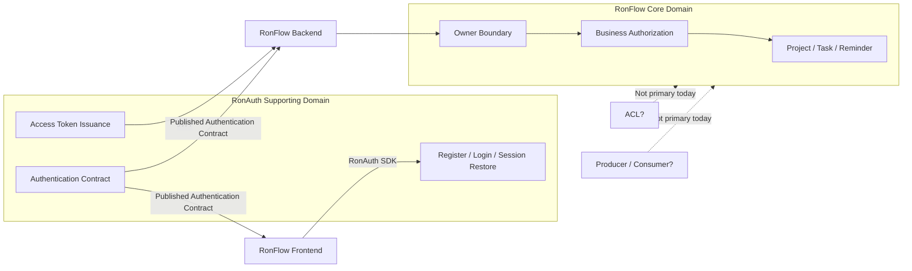

# RonFlow x RonAuth supporting domain 結合互動

## 為什麼這篇文章值得寫
RonFlow 在這一階段做的，不只是「加上一個登入功能」。

真正完成的是一個 supporting domain 與核心流程系統之間的協作方式：
- RonAuth 負責 authentication 與 session 管理
- RonFlow 負責 business authorization 與 owner scope
- 兩者不是混在同一個系統裡，而是透過清楚的邊界互動

這件事很適合被記錄成技術文章，因為它體現了 DDD、supporting domain、系統邊界、以及前後端整合策略是如何一起落地的。

## 這個技術概念是什麼
在 DDD 裡，並不是每個 bounded context 都要自己處理所有事情。

像 authentication 這種能力，常常更適合被抽成一個 supporting domain。它不是產品的核心差異，但它必須可靠、可重用、而且能被其他 bounded context 信任。

RonFlow 的核心問題是：
- 專案與任務如何被建立與流轉
- 使用者是否只能看見自己的資料
- 操作是否符合流程規則

RonAuth 的核心問題則是：
- 使用者如何註冊
- 如何登入
- 如何維持 session
- 如何簽發可信任的 access token

這兩者是不同問題，因此也應該由不同 context 負責。

## 它背後的設計精神
### 1. 把認證與授權拆開
認證回答的是「你是誰」。
授權回答的是「你能做什麼」。

RonAuth 負責前者，RonFlow 負責後者。

這樣做的好處是，RonFlow 不需要知道密碼驗證、登入流程、refresh token、session cookie 這些細節；它只需要知道目前請求的使用者是誰。

### 2. supporting domain 不應污染 core domain
如果把 RonAuth 的帳號、session、credential 等概念全部直接滲入 RonFlow domain，RonFlow 的核心模型就會開始混雜大量與流程管理無關的技術細節。

現在的做法是：
- RonFlow domain 只保留自己真的需要的概念，例如 Project OwnerId
- RonFlow backend 信任 RonAuth 簽發的 JWT，但不直接承接整套 identity model

### 3. 用邊界協作，而不是用共用資料庫耦合
這次整合不是讓 RonFlow 直接去讀 RonAuth 的資料表，也不是把帳號資料複製到 RonFlow 的 domain model 當成主模型。

而是透過：
- frontend 使用 RonAuth SDK
- backend 驗證 RonAuth JWT
- application service 使用 current user id 做 owner scope

（`ronauthClient`、`Program.Main` 內的 JWT Bearer 設定、`ProjectAccessService.GetOwnedProject`）

這讓 context 之間的責任分工比較清楚。

## 這在 DDD 的 context relationship 裡屬於哪一種
如果用 DDD strategic design 的角度來看，RonFlow 與 RonAuth 目前最貼近的是「上下游關係」，而且是 supporting domain 與 core domain 之間的上下游協作。

更精確地說：
- RonAuth 是上游，提供 authentication contract
- RonFlow 是下游，消費這個 contract，並把它轉成自己的 authorization 與 owner boundary
- 這個 contract 目前包含登入、註冊、session restore、access token，以及可被 RonFlow 信任的 user identity claim

這層互動現在主要是透過前端 SDK 與後端 JWT trust 落地，而不是透過共用資料庫或直接共享 domain model。

（`ronauthClient`、`registerWithRonAuth` / `loginWithRonAuth` / `bootstrapRonAuthSession`、`Program.Main` 內的 `builder.Services.AddAuthentication().AddJwtBearer(...)`、`AuthenticatedControllerBase.TryGetCurrentUserId`）

### 為什麼目前不算 ACL
ACL（Anti-Corruption Layer）的重點，不只是「有整合邊界」，而是「下游不想直接被上游模型污染，所以主動建立翻譯層」。

RonFlow 現在雖然有邊界，但它其實是接受 RonAuth 的身分語言：
- 前端直接使用 RonAuth SDK
- 後端直接信任 RonAuth 簽發的 JWT
- RonFlow 並沒有建立一套自己的 identity model 去翻譯 RonAuth 的使用者語意

也就是說，現在是「有邊界的協作」，但還不是「有強翻譯意圖的防腐層」。

只有當未來 RonAuth 的 identity model 變得更複雜，例如角色、組織、租戶、外部 IdP 映射，而 RonFlow 又不希望這些概念直接滲入自己的 core model 時，才會比較需要正式 ACL。

### 為什麼目前也不是以 producer / consumer 為主
Producer / consumer 關係通常更常出現在 event-driven integration、message queue、integration event 這些非同步互動。

但 RonFlow 與 RonAuth 現在的主要互動，不是 RonAuth 持續對 RonFlow 發送事件，而是：
- RonAuth 提供同步的 authentication capability
- RonFlow 在 request 進入時驗證並信任這個身份結果

所以從 strategic relationship 來看，把它定義成 producer / consumer 會失焦。現在真正重要的，不是事件流，而是「誰定義身份契約，誰依賴它來做自己的業務判斷」。

### 一句話總結目前的關係
RonFlow 與 RonAuth 目前採用的是 supporting domain 與 core domain 之間的上下游協作；RonAuth 以公開的 authentication contract 提供已驗證身份，RonFlow 作為下游遵守這個契約，並將其收斂為自身的 authorization 與 owner boundary 判斷。

## Context Relationship 圖

這張圖想表達的是：
- RonAuth 是上游 supporting domain
- RonFlow 是下游 core domain
- RonFlow 依賴的是 authentication contract，不是 RonAuth 內部模型
- RonFlow 真正自己承擔的，是 owner boundary 與 business authorization
- 目前整合主軸不是 ACL，也不是 event-driven producer / consumer

## 這樣做的優點
### 1. 認證能力可以獨立演化
RonAuth 之後若要加入第二因子登入、外部登入、session 撤銷、token policy 調整，RonFlow 不需要跟著大改。

### 2. RonFlow 核心模型比較乾淨
RonFlow 不需要把注意力放在 password、credential、identity persistence，而可以專注在 project、task、workflow、lifecycle 這些核心概念。

### 3. 權責更容易測試
這次的測試策略也因此比較清楚：
- RonAuth 測 authentication
- RonFlow API integration 測 current user 與 owner boundary
- RonFlow E2E 測真實登入後的使用者流程

### 4. 更符合 supporting domain 的示範價值
如果這個專案的其中一個教學目標，是展示 supporting domain 如何與核心 domain 協作，那這次整合其實已經是一個很好的案例。

## 代價與限制
### 1. RonFlow backend 目前只知道 user id，不知道完整帳號資訊
這代表 RonFlow 後端目前主要依賴 JWT claims 裡的身分識別，而不是完整 user profile。

### 2. token trust model 需要額外注意安全邊界
RonFlow backend 信任 RonAuth 發的 token，前提是 issuer、audience、signing key 都要配置正確，而且 access token 生命週期與撤銷策略也要設計好。

### 3. 本機開發拓樸會影響整合體驗
這次就遇到一個很典型的例子：
- 前端走 Vite proxy 到 RonAuth HTTP port
- RonAuth 又用 HTTPS redirect 把請求 307 到 7269
- 最後導致開發環境下的 auth flow 出錯

這提醒我們，supporting domain 的整合不只要看 use case，也要看實際部署拓樸。

## RonFlow 裡是怎麼實作的
### 前端：由 RonAuth SDK 接手登入註冊與 session restore
RonFlow frontend 沒有自己手寫一套 auth protocol，而是直接以 RonAuth SDK 為入口。

實作重點：
- 建立 RonAuth client 與 access token store
- 包裝 register、login、bootstrap、refresh、me、logout
- 在 App shell 中用 auth gate 控制未登入與已登入畫面
- 顯示目前使用者資訊並支援登出

（`ronauthClient`、`registerWithRonAuth` / `loginWithRonAuth` / `bootstrapRonAuthSession`、`useRonFlowAuth.initialize` / `login` / `register` / `logout`、`App.vue` 的 `onMounted` / `onLogin` / `onRegister`）

這使得 RonFlow 前端的 auth 實作比較像 orchestration，而不是自建 identity 流程。

### 後端：信任 RonAuth JWT，但不直接依賴 RonAuth API
RonFlow backend 在 API 層設定 JWT Bearer authentication，信任 RonAuth 的：
- issuer
- audience
- signing key

（`Program.Main` 內的 `builder.Services.AddAuthentication().AddJwtBearer(...)`、`RonAuthAuthenticationOptions`）

通過驗證後，再從 claims 取出 current user id。

（`AuthenticatedControllerBase.TryGetCurrentUserId`）

所以 RonFlow backend 目前不是每次請求都回頭打 RonAuth 查使用者，而是把 RonAuth 當作 trusted issuer。

### Application / Domain：把 current user 往下推到 owner scope
整合真正有價值的地方，不是 controller 多了 `[Authorize]`，而是 current user id 被一路推進到 application service 與 domain 邊界。

這次的改動包括：
- Project 擁有 OwnerId
- query service 只回傳目前使用者自己的資料
- command service 只能操作目前使用者擁有的 project / task
- 對於 foreign data 回傳 Access Denied

（`Project.OwnerId`、`GetProjectsQueryService.Get`、`GetProjectBoardQueryService.Get`、`ChangeTaskStateCommandService.Change`、`ProjectsController.GetBoard`）

也就是說，RonAuth 提供的是「可信的目前使用者」，而 RonFlow 真正負責的是「如何用這個目前使用者做資料邊界與商業規則」。

## 這件事對 RonFlow 代表什麼
這不只是加上一個外部 auth 模組，而是把 RonFlow 從單純的流程系統，往「有清楚 identity boundary 的多系統協作架構」推進了一步。

若未來要繼續擴充：
- authorization / policy-based access control
- 多人協作
- 多租戶 / workspace 邊界
- audit / reporting / projection

這次 RonAuth 整合會是一個很重要的基礎。因為之後所有更複雜的權限與協作設計，都必須建立在可靠的 identity boundary 之上。

## 總結
RonFlow x RonAuth 的整合，展示的不是「如何接一個登入 API」，而是：
- supporting domain 應該如何服務 core domain
- authentication 與 authorization 應該如何分工
- bounded context 之間應該如何靠協作邊界互動
- supporting domain 與 core domain 之間的上下游關係應如何落地

對 RonFlow 而言，RonAuth 負責回答「這個人是誰」。
對 RonFlow 核心流程而言，真正重要的是接著回答「這個人能看到哪些資料、能操作哪些流程」。

這正是這次技術實踐最值得被記錄的地方。
