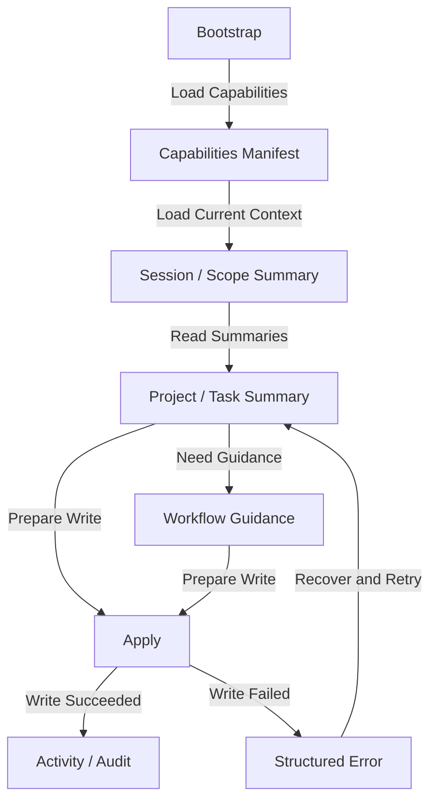

# RonFlow AI Interaction Surface Spec

## 1. 文件定位

本文件是 RonFlow 的 AI interaction surface companion spec，用來描述 AI actor 應如何發現、理解、查詢與操作 RonFlow。

這份文件的目標是：

1. 用 AI agent 可消化的方式描述 RonFlow 的 AI-facing interaction surface。
2. 作為 AI bootstrap、agent evaluation、產品討論與後續實作的共同對齊文件。
3. 作為 AI 專屬 acceptance / evaluation 的上游依據。
4. 讓 RonFlow 在不污染人類使用者 core flow spec 的前提下，仍能把 AI actor 的 intended behavior 寫清楚。

本文件與 `ronflow-core-flow-spec.md` 共同構成 RonFlow 的規格體系。`ronflow-core-flow-spec.md` 承接人類使用者的產品流程；本文件承接 AI agent 的操作流程，並把相同的 domain truth 投影成 AI 可使用的 interaction surface。

為了避免之後只更新 human flow 而漏掉 AI companion spec，本文件採用穩定檔名維護，而不是把版本號放在檔名中。未來若 `ronflow-core-flow-spec.md` 新增會影響 AI summary、manifest、write request 或 apply contract 的共享 Project / Task 規則，應同步更新本文件，或在本文件明確標示尚未承接。

## Related Evaluation Baseline

這份 spec 對應的是 RonFlow v0.3 的 AI evaluation baseline。做 spec / agent evaluation 差異比對時，可優先從下列能力切面開始：

1. AI bootstrap：新的 AI agent 是否能在短 bootstrap 後知道 RonFlow 的存在、定位與基本工作原則。
2. capability discovery：AI 是否能知道有哪些 read / write 能力可用。
3. session / scope awareness：AI 是否能在進入工作前判斷目前 session 與 active scope。
4. read-first summary：AI 是否能在寫入前先理解 project 與 task 的摘要上下文。
5. direct apply operation：AI 是否能以既有的 Project / Task 操作直接完成建立、更新、移動、排序與 lifecycle 變更。
6. structured error recovery：AI 是否能依錯誤碼與 recovery hint 決定下一步。
7. traceability：人類是否能追查 AI 做了什麼、為什麼做，以及實際結果。

這份對照是 v0.3 的主要驗收入口，不代表後續 evaluation coverage 已完整。實際評估進度時，仍應逐段比對 spec、agent evaluation 與實作是否一一承接。

---

## 2. v0.3 產品定位

RonFlow v0.3 定位為：

> 人類與 AI 都可以順暢使用的專案管理工具。

v0.1 解的是「個人可用」。

v0.2 解的是「多人協作可用」。

v0.3 要解的是：

```text
一個新的 AI agent，在拿到最小必要 bootstrap 後，能不能安全地讀取 RonFlow 的工作上下文、理解主要名詞、查詢目前狀態、提出下一步，並直接完成 RonFlow 既有的必要操作？
```

這代表 RonFlow 從「給人用的工具」往前走一步，變成「人與 AI 都能共享的工作系統」。

### 2.1 AI Actor 定義

本文件中的 AI agent 指的是：

```text
1. 一個可被識別、可被審計、可被約束的 RonFlow actor。
2. 它可以代表特定人類使用者工作，也可以是獨立的 AI actor identity。
3. 它與人類使用者共享同一套 domain truth，但不共享相同的 interaction surface。
4. 它在 authentication、authorization、session 與 scope 規則內工作。
```

### 2.2 v0.3 核心判斷標準

RonFlow v0.3 是否完成，應以以下問題判斷：

```text
一個新的 AI agent，在沒有讀完整份核心 spec 的前提下，是否能憑藉 RonFlow 提供的 bootstrap、能力清單、摘要查詢與既有操作 contract，順利接手目前工作並完成正確的 Project / Task 操作？
```

也就是說，v0.3 至少應讓 AI 可以完成以下事情：

```text
1. 知道 RonFlow 的存在、定位與基本使用原則
2. 知道目前有哪些可用操作
3. 知道主要領域名詞與它們之間的關係
4. 在寫入前先讀取目前 project / task / session / scope 的摘要
5. 針對既有的 Project / Task 操作組出正確參數並執行寫入
6. 執行單筆或小範圍變更，且能回報結果與影響
7. 在失敗時看懂錯誤原因，知道該重試、修正參數，還是回頭問人
8. 讓人類可以追查「哪個 AI 在什麼上下文下做了什麼事」
```

---

## 3. 文件使用原則

閱讀與維護本文件時，採以下原則：

1. 內容描述的是 RonFlow 對 AI actor 的 intended behavior。
2. 若 AI interaction surface、write contract、summary contract 或驗收方式改變，應直接更新本文件。
3. 若某能力尚未實作但已決定納入 v0.3，應先寫入本文件，並據此安排 evaluation 與實作。
4. 本文件收錄的是已決定納入 v0.3 的 AI actor 行為；探索中的選項可整理到其他討論文件。
5. 本文件描述可驗證的 AI 行為，但不規定必須由 agent evaluation、integration test、manual rehearsal 或其他方式承接。
6. 與 Project、Task、Workflow State、Lifecycle State、ownership、authorization 等共享 domain truth 相關的產品定義，仍以 `ronflow-core-flow-spec.md` 為主；本文件只補 AI actor 專屬規則。
7. 本文件將 AI bootstrap、正式 contract、policy 與 audit 機制一起視為 v0.3 的產品能力。
8. 若 `ronflow-core-flow-spec.md` 新增共享的 Project / Task 欄位、狀態轉換、操作或摘要需求，且可能影響 AI actor 的 manifest、summary、write request 或 apply contract，同一批變更必須同步更新本文件，或在本文件明確標示尚未承接。

---

## 4. 核心功能範圍

本文件描述 RonFlow v0.3 中 AI actor 應具備的成品行為如下：

```text
1. AI 可以透過 bootstrap 知道 RonFlow 的存在與基本工作原則
2. AI 可以查詢 capabilities manifest，知道有哪些可用操作
3. AI 可以讀取 AI 專用 glossary，理解核心領域名詞
4. AI 可以查詢目前 session 是否有效、是否已 activate、目前 active scope 是什麼
5. AI 可以在進入工作前，讀取 project 與 task 的摘要資訊
6. AI 可以以既有的 Project / Task 操作 contract 完成直接寫入
7. AI 可以收到結構化錯誤與 recovery hint
8. 系統會記錄 AI 的操作結果與必要上下文
11. AI 可以讀取 workflow guidance，知道 RonFlow 期待的工作方式
12. AI 依 core flow spec 中已定義的 domain 規則、ownership 邊界與 authorization 規則工作
```

### 4.1 AI Actor 與 Interaction Surface 前提

```text
1. RonFlow v0.3 同時承認兩種歧異度明顯不同的 actor：human user 與 AI agent。
2. human user 相關 flow 仍以 `ronflow-core-flow-spec.md` 為主。
3. AI agent 相關 flow 以本文件為主，並透過 bootstrap、manifest、summary query、apply operation、traceability 等 interaction surface 完成工作。
4. AI agent 透過 bootstrap、manifest、summary、apply result 與 traceability 驗證本文件中的規格。
5. AI agent 的 interaction surface 與 RonFlow 的 domain truth 對齊，並與 core flow spec 共用同一套產品真相。
```

### 4.2 身分與資料邊界前提

```text
1. AI agent 以可識別的 actor identity 進入 RonFlow。
2. AI agent 的每次讀取與寫入，都應能追溯 actor type、actor identity，以及若存在 delegation 時的上游授權來源。
3. AI agent 可讀取與操作的資料範圍，仍應以目前有效的身份、權限與 project scope 為準。
4. AI agent 在其對應權限與 project scope 內讀取與寫入資料。
5. workflow guidance 與 bootstrap 會把 AI 導向正式 policy、summary query 與 write contract。
6. AI agent 的寫入結果必須可追溯 actor、作用範圍與實際變更結果。
```

### 4.3 v0.3 Included

```text
1. AI bootstrap
2. AI 專用 glossary / ubiquitous language
3. 可發現的 capabilities manifest
4. session / scope awareness
5. read-first 的摘要查詢
6. direct apply 寫入流程
7. 結構化且可恢復的錯誤語意
8. AI 操作可追溯性與 explainability
9. 第一批 AI-native workflow guidance
```

### 4.4 v0.3 目前承接的 RonFlow 業務操作

```text
1. 查詢 Project List 與可存取的 Project summary
2. 查詢單一 Project 的 board summary
3. 查詢單一 Task 的 summary、detail summary 與最近活動
4. 建立 Project
5. 建立 Task
6. 更新 Task title、description、due date
7. 勾選單一 task checklist item
8. 取消勾選單一 task checklist item
9. 推進 Task workflow state
10. 調整 Task 在同欄位中的順序
11. 封存 Task 與還原已封存 Task
12. 將 Task 移到垃圾桶與還原垃圾桶中的 Task
13. 查詢操作結果與相關 activity 資訊
```

### 4.5 Shared-Domain 變更追蹤

```text
1. `ronflow-core-flow-spec.md` 已承接結構化 DoD：project subtask templates、task checklist，以及「全部勾選後自動進入 Review」的 shared-domain 規則。
2. 目前本 AI interaction surface 已承接 task checklist 的 detail summary contract，以及 `check_task_subtask` / `uncheck_task_subtask` 兩個 apply operation。
3. workflow guidance 現在會明確要求：若 task detail summary 含有 subtasks，AI 應先依 checklist 執行，再宣告 task 完成。
4. project subtask templates 的 AI 專用管理 contract 仍未納入；AI agent 目前不得假設自己可透過 AI interaction surface 管理 project subtask templates。
5. 後續若要讓 AI 正式讀寫其餘 structured DoD 能力，至少需同步更新 manifest、Read-First Summary Query、Write Request Preparation、Apply Operation 與 Acceptance Criteria。
```

---

## 5. Ubiquitous Language 對照表

### 5.1 用語使用原則

```text
1. 與 Project、Task、Workflow State、Lifecycle State 相關的核心名詞，沿用 core flow spec 的定義。
2. AI 專用 interaction surface 的工程用語可保留英文，例如 bootstrap、manifest、apply、audit entry。
3. 若同一概念在 human flow 與 AI flow 中都存在，應盡量共用同一個 domain term，避免形成雙重語彙。
4. 若某名詞只在 AI interaction surface 中存在，應在本對照表中定義其責任與邊界。
```

### 5.2 用語對照

| Concept | 工程/規格用語 | AI 可見用語 | 說明 |
|---|---|---|---|
| AI 代理 | AI Agent | AI agent | 可被識別、可被審計的 RonFlow actor。 |
| Actor 類型 | Actor Type | actor type | 至少區分 human 與 AI。 |
| 啟動資訊 | Bootstrap | bootstrap | AI 進入 RonFlow 時的最小必要說明。 |
| 能力清單 | Capabilities Manifest | capabilities manifest | 描述 AI 可用 read / write 能力與前置條件的契約。 |
| 能力項目 | Capability | capability | manifest 中的一個可用操作單位。 |
| 工作摘要 | Summary Query | summary | 讓 AI 低成本理解上下文的查詢結果。 |
| 啟用中的範圍 | Active Scope | active scope | AI 目前聚焦的 Project 或其他工作範圍。 |
| 套用 | Apply | apply | 把已確認的變更正式寫入系統。 |
| 恢復提示 | Recovery Hint | recovery hint | 發生錯誤後系統建議 AI 採取的下一步。 |
| 審計紀錄項目 | Audit Entry | audit entry | 記錄 AI 行為、理由與結果的紀錄單位。 |
| 工作指引 | Workflow Guidance | workflow guidance | 告訴 AI 在 RonFlow 中應如何遵循既有工作方式。 |

---

## 6. AI Agent Core Flow

### 6.1 Flow Summary

前提：

```text
1. AI agent 已取得 RonFlow bootstrap 或等價入口。
2. AI agent 具備可識別的 actor identity，且目前 session 為有效狀態。
3. AI agent 若要進入某個 Project 或工作範圍，需先知道目前 active scope 或能請求切換 scope。
4. 與 Project、Task、ownership、authorization 有關的核心規則，沿用 core flow spec。
```

```text
1. AI agent 收到與工作管理相關的任務
2. AI 先讀取 bootstrap，確認 RonFlow 是可使用的工作系統
3. AI 讀取 capabilities manifest 與 AI glossary
4. AI 查詢目前 session / active scope 摘要
5. AI 讀取 Project List summary，確認目前可存取的 Project
6. 若 Project List summary 找不到目標 Project，AI 讀取 Invitation Inbox summary 判斷是否有 pending invitation
7. AI 讀取目標 Project 的 board summary 與 open tasks summary
8. AI 讀取單一 Task summary 或 detail summary，理解目前狀態與最近活動
9. AI 判斷下一步是建立 Project、建立 Task、更新 Task、移動 Task 狀態、調整排序，或執行 lifecycle 操作
10. AI 依既有操作 contract 組出目標 object、欄位與參數
11. AI 執行 apply
12. 系統回傳結果、差異、activity 資訊與必要的 recovery hint
13. 若操作失敗，AI 依錯誤碼決定補參數、重讀 summary、調整操作，或回頭詢問人類
```

### 6.2 Flow Map

Flow Map 應同時呈現 AI agent 的操作與系統回應；若某步驟只是在同一 interaction surface 中補充資訊，則以目前節點的自我指涉表示。



---

## 7. Interaction Surface Spec

### 7.1 AI Bootstrap

**Purpose**

讓新的 AI agent 透過精簡入口知道 RonFlow 是什麼、何時該使用它，以及第一步應去哪裡讀更多資訊。

**Content Requirements**

```text
1. RonFlow 是什麼
2. RonFlow 主要處理哪些工作物件（project / board / task / session / scope）
3. AI 的基本工作原則：先讀後寫、先摘要後深入、寫入前先確認目標與參數
4. 可用能力入口：capabilities manifest、glossary、workflow guidance、summary query
5. 明確 escalation 規則：哪些情況必須先問人
```

**Expected Behavior**

```text
1. AI 讀完 bootstrap 後，知道 RonFlow 是可被使用的工作系統。
2. AI 讀完 bootstrap 後，知道自己應先讀 manifest / glossary / summary。
3. bootstrap 以可快速載入的精簡內容呈現。
4. bootstrap 應明確指出 AI 以既有的 read / write contract 工作。
```

**Canonical Text Contract**

```text
RonFlow Bootstrap v1

RonFlow 是一個專案管理工具。
RonFlow 管理的主要工作物件有：Project、Board、Task、Session、Active Scope。

canonical_base_paths:
- ui_root_url: http://localhost/
- ronflow_api_base_url: http://localhost/ronflow-api/api
- ronauth_api_base_url: http://localhost/ronauth-api/api/auth
- warning: http://localhost/ serves the UI shell; AI contracts live under /ronflow-api/api and auth lives under /ronauth-api/api/auth

canonical_entrypoints:
- GET /api/ai/bootstrap
- GET /api/ai/glossary
- GET /api/ai/capabilities
- GET /api/ai/workflow-guidance
- GET /api/ai/session-summary
- GET /api/ai/projects/summary
- GET /api/ai/invitations/summary
- GET /api/ai/projects/{projectId}/board-summary
- GET /api/ai/projects/{projectId}/current-work-summary
- GET /api/ai/projects/{projectId}/tasks/{taskId}/detail-summary
- POST /api/ai/active-scope
- POST /api/ai/apply
- GET /api/ai/audit-entries/{auditEntryId}

login_contract:
- endpoint: POST http://localhost/ronauth-api/api/auth/login
- request_body: {"userName":"<user-name>","password":"<password>"}
- note: RonAuth login reads `userName`, not `email`; email is identity metadata and may appear in summaries or responses

你現在應先做以下事情：
1. 讀取 capabilities manifest
2. 讀取 glossary
3. 讀取 workflow guidance
4. 查詢 session / scope summary
5. 讀取 project list summary
6. 視需要讀取 invitation inbox summary

工作原則：
- 先讀後寫
- 先摘要後深入
- 寫入前先確認 target object 與 required fields
- 後續細節以系統回傳的 contract 為準

需要先問人的情況：
- 無法判斷目標 Project 或 Task
- 缺少必要輸入
- 目前 scope 不正確
- 權限不足
```

**State Handling / Feedback**

```text
1. 若 bootstrap 版本已過期，系統應能讓 AI 知道還有更新版本可讀。
2. 若 bootstrap 提到的能力入口目前不可用，系統回傳可理解的 fallback 訊息。
```

**Definition of Done**

```text
1. bootstrap 回應第一行必須是 `RonFlow Bootstrap v1`。
2. bootstrap 必須完整包含 `RonFlow 是一個專案管理工具。` 這句話。
3. bootstrap 必須完整列出 `Project、Board、Task、Session、Active Scope`。
4. bootstrap 必須完整列出六個第一步入口：manifest、glossary、workflow guidance、session / scope summary、project list summary、invitation inbox summary。
5. bootstrap 必須明確揭露 localhost canonical base paths，並區分 UI root 與 API base path。
6. bootstrap 必須明確揭露 canonical entrypoints，包括 scope-bound summaries 的 canonical endpoint templates、`POST /api/ai/active-scope` 與 `POST /api/ai/apply`。
7. bootstrap 必須說明 RonAuth login request 使用 `userName`，不是 `email`。
8. bootstrap 必須完整列出四個需要先問人的情況。
```

**Testability**

```text
1. 新的 AI agent 應能僅靠 bootstrap 找到 manifest、summary 與 guidance 入口。
2. 測試以 bootstrap 作為 AI 開始操作的主要入口。
```

**Related Rules**

1. [Bootstrap 規則](#bootstrap-rules)

**Gherkin Draft**

```gherkin
Feature: AI bootstrap

	Scenario: 新的 AI agent 透過 bootstrap 知道如何開始
		Given 一個新的 AI agent 尚未讀取 RonFlow 的其他規格
		When AI 讀取 RonFlow bootstrap
		Then 回應應包含 `RonFlow Bootstrap v1`
		And 回應應包含 `RonFlow 是一個專案管理工具。`
		And 回應應包含 `你現在應先做以下事情：`
		And 回應應包含 `1. 讀取 capabilities manifest`
		And 回應應包含 `3. 讀取 workflow guidance`
		And 回應應包含 `5. 讀取 project list summary`
		And 回應應包含 `6. 視需要讀取 invitation inbox summary`
		And 回應應包含 `ronflow_api_base_url: http://localhost/ronflow-api/api`
		And 回應應包含 `endpoint: POST http://localhost/ronauth-api/api/auth/login`
		And 回應應包含 `GET /api/ai/projects/{projectId}/board-summary`
```

### 7.1.1 AI Glossary

**Purpose**

讓 AI 以低成本讀到 RonFlow 的 AI-facing ubiquitous language，而不必先翻完整 spec。

**Content Requirements**

```text
1. glossary 必須對齊本文件第 5 章的核心用語
2. glossary 至少要說明 bootstrap、capabilities manifest、summary、active scope、apply、audit entry、workflow guidance
3. glossary 應以穩定 label 呈現，讓 AI 可以引用既有名詞而不是自造詞
```

**Canonical Text Contract**

```text
RonFlow AI Glossary v1

- term: bootstrap
  meaning: AI 進入 RonFlow 時的最小必要說明
- term: capabilities manifest
  meaning: 描述 AI 可用 read / write 能力與前置條件的契約
- term: summary
  meaning: 讓 AI 低成本理解上下文的查詢結果
- term: active scope
  meaning: AI 目前聚焦的 Project 或其他工作範圍
- term: apply
  meaning: 把已確認的變更正式寫入系統
- term: audit entry
  meaning: 記錄 AI 行為、理由與結果的紀錄單位
- term: workflow guidance
  meaning: 告訴 AI 在 RonFlow 中應如何遵循既有工作方式
```

**Definition of Done**

```text
1. glossary 回應第一行必須是 `RonFlow AI Glossary v1`。
2. glossary 必須至少列出 bootstrap、capabilities manifest、summary、active scope、apply、audit entry、workflow guidance。
3. glossary 不得定義與第 5 章互相衝突的術語。
```

**Testability**

```text
1. 測試應能驗證 AI 僅靠 glossary 即可找到 interaction surface 的核心名詞。
2. 測試應能驗證 glossary 與 bootstrap、manifest 中使用的名詞一致。
```

### 7.2 Capabilities Manifest

**Purpose**

讓 AI 可以發現 RonFlow 目前有哪些可用能力。

**Contract Fields**

```text
1. capability id
2. capability name
3. capability purpose
4. operation category（read / write）
5. prerequisites
6. required inputs
7. read endpoint 或 endpoint template / apply endpoint
8. required route params 與 route param sources
9. apply request body shape 與 required input location
10. expected output shape
11. possible error codes
12. 是否需要 active scope
```

**Current Capability Coverage**

```text
1. read session summary
2. read project list summary
3. read project board summary
4. read task detail summary
5. read current work summary
6. create project
7. create task
8. update task detail
9. move task state
10. reorder task
11. archive task
12. restore archived task
13. move task to trash
14. restore trashed task
15. read audit entry
16. read invitation inbox summary
17. invite project member
18. accept project invitation
19. reject project invitation
```

**Expected Behavior**

```text
1. AI 應能從 manifest 看出目前有哪些 read / write 能力可用。
2. AI 應能從 manifest 知道某能力是否需要 active scope 與額外前置條件。
3. manifest 以穩定識別方式列出每個 capability。
4. 若某能力暫時停用，manifest 應能明確表達其不可用狀態。
```

**Canonical Text Contract**

```text
RonFlow Capabilities Manifest v1

scope_activation_contract:
	endpoint: POST /api/ai/active-scope
	body_shape: {"projectId":"<project-id>"}
	success_status: 204 No Content
	recovery_path: if the target project is not visible in project list summary, read invitation inbox summary before asking the human for access

write_request_contract:
	apply_endpoint: POST /api/ai/apply
	body_shape: operation, targetType, targetId, requiredFields, optionalFields, note
	required_input_location: requiredFields.<inputName>

- capability: read_session_summary
	category: read
	active_scope_required: no
	required_inputs: none
	read_endpoint: GET /api/ai/session-summary
	route_params: none
	yields: active_scope, available_scopes

- capability: read_task_detail_summary
	category: read
	active_scope_required: yes
	required_inputs: projectId, taskId
	read_endpoint: GET /api/ai/projects/{projectId}/tasks/{taskId}/detail-summary
	route_params: projectId, taskId
	route_param_sources:
	- projectId <- read_project_list_summary.project_id or read_session_summary.active_scope
	- taskId <- read_project_board_summary.visible_tasks.task_id or read_current_work_summary.open_tasks.task_id

- capability: read_current_work_summary
	category: read
	active_scope_required: yes
	required_inputs: projectId
	read_endpoint: GET /api/ai/projects/{projectId}/current-work-summary
	route_params: projectId
	route_param_sources:
	- projectId <- read_project_list_summary.project_id or read_session_summary.active_scope

- capability: read_project_list_summary
	category: read
	active_scope_required: no
	required_inputs: none
	read_endpoint: GET /api/ai/projects/summary
	route_params: none
	yields: project_id

- capability: read_project_board_summary
	category: read
	active_scope_required: yes
	required_inputs: projectId
	read_endpoint: GET /api/ai/projects/{projectId}/board-summary
	route_params: projectId
	route_param_sources:
	- projectId <- read_project_list_summary.project_id or read_session_summary.active_scope

- capability: read_audit_entry
	category: read
	active_scope_required: yes
	required_inputs: auditEntryId
	read_endpoint: GET /api/ai/audit-entries/{auditEntryId}
	route_params: auditEntryId
	route_param_sources:
	- auditEntryId <- apply_result.audit_entry_id

- capability: read_invitation_inbox_summary
	category: read
	active_scope_required: no
	required_inputs: none
	read_endpoint: GET /api/ai/invitations/summary
	route_params: none
	yields: invitation_id, project_id

- capability: create_project
	category: write
	active_scope_required: no
	required_inputs: name
	apply_endpoint: POST /api/ai/apply
	required_fields_path: requiredFields.name
	apply_request_example: {"operation":"create_project","targetType":"project","targetId":"new","requiredFields":{"name":"<project-name>"},"optionalFields":{},"note":"create project"}

- capability: create_task
	category: write
	active_scope_required: yes
	required_inputs: projectId, title
	apply_endpoint: POST /api/ai/apply
	required_fields_path: requiredFields.projectId, requiredFields.title
	apply_request_example: {"operation":"create_task","targetType":"task","targetId":"new","requiredFields":{"projectId":"<project-id>","title":"<task-title>"},"optionalFields":{},"note":"create task"}

- capability: invite_project_member
	category: write
	active_scope_required: yes
	required_inputs: projectId, invitee
	apply_endpoint: POST /api/ai/apply
	required_fields_path: requiredFields.projectId, requiredFields.invitee

- capability: accept_project_invitation
	category: write
	active_scope_required: no
	required_inputs: invitationId
	apply_endpoint: POST /api/ai/apply
	required_fields_path: requiredFields.invitationId
	apply_request_example: {"operation":"accept_project_invitation","targetType":"invitation","targetId":"<invitation-id>","requiredFields":{"invitationId":"<invitation-id>"},"optionalFields":{},"note":"accept invitation"}

- capability: reject_project_invitation
	category: write
	active_scope_required: no
	required_inputs: invitationId
	apply_endpoint: POST /api/ai/apply
	required_fields_path: requiredFields.invitationId
	apply_request_example: {"operation":"reject_project_invitation","targetType":"invitation","targetId":"<invitation-id>","requiredFields":{"invitationId":"<invitation-id>"},"optionalFields":{},"note":"reject invitation"}

- capability: update_task_detail
	category: write
	active_scope_required: yes
	required_inputs: taskId
	optional_inputs: title, description, dueDate
	apply_endpoint: POST /api/ai/apply
	required_fields_path: requiredFields.taskId
	optional_fields_path: optionalFields.title, optionalFields.description, optionalFields.dueDate
	apply_request_example: {"operation":"update_task_detail","targetType":"task","targetId":"<task-id>","requiredFields":{"taskId":"<task-id>"},"optionalFields":{"title":"<new-title>"},"note":"update task detail"}

- capability: move_task_state
	category: write
	active_scope_required: yes
	required_inputs: taskId, targetStateKey
	apply_endpoint: POST /api/ai/apply
	required_fields_path: requiredFields.taskId, requiredFields.targetStateKey
	apply_request_example: {"operation":"move_task_state","targetType":"task","targetId":"<task-id>","requiredFields":{"taskId":"<task-id>","targetStateKey":"Done"},"optionalFields":{},"note":"move task state"}

- capability: reorder_task
	category: write
	active_scope_required: yes
	required_inputs: taskId, targetStateKey, targetIndex

- capability: archive_task
	category: write
	active_scope_required: yes
	required_inputs: taskId

- capability: restore_archived_task
	category: write
	active_scope_required: yes
	required_inputs: taskId

- capability: trash_task
	category: write
	active_scope_required: yes
	required_inputs: taskId

- capability: restore_trashed_task
	category: write
	active_scope_required: yes
	required_inputs: taskId
```

**State Handling / Feedback**

```text
1. 當能力版本變更時，manifest 應能讓 AI 看出目前版本與已廢棄能力。
2. 若 AI 嘗試使用 manifest 中不存在的 capability，系統回傳明確錯誤。
```

**Definition of Done**

```text
1. manifest 回應第一行必須是 `RonFlow Capabilities Manifest v1`。
2. 每個 capability 區塊必須至少包含 `capability`、`category`、`active_scope_required`、`required_inputs` 四個 label。
3. manifest 必須完整列出目前支援的 Project / Task read / write capabilities。
4. `create_task` 的 `required_inputs` 必須至少包含 `projectId, title`。
5. `update_task_detail` 必須將 `title, description, dueDate` 列為 optional_inputs。
6. manifest 必須說明 `POST /api/ai/apply` 的 body shape，且 required inputs 必須放在 `requiredFields.<inputName>`。
7. 每個 read capability 必須揭露 canonical `read_endpoint` 或 endpoint template。
8. 對需要 path params 的 read capability，manifest 必須揭露 `route_params` 與 `route_param_sources`。
9. invitation 相關 capabilities 必須列出 invitation inbox read endpoint 與 accept / reject apply request example。
10. manifest 必須明確揭露 `POST /api/ai/active-scope` 的 endpoint、body shape、成功狀態與 recovery path。
11. `create_task` 這類常用 write capability 必須提供 canonical apply request example。
```

**Testability**

```text
1. 測試應能驗證 AI 不靠猜測，也能發現目標能力。
2. 測試應能驗證 manifest 是否正確揭露 operation category、prerequisites 與 errors。
```

**Related Rules**

1. [Manifest 規則](#manifest-rules)

**Gherkin Draft**

```gherkin
Feature: Capabilities manifest

	Scenario: AI 從 manifest 發現某個寫入能力需要 active scope
		Given AI 已載入 RonFlow capabilities manifest
		When AI 查看某個 write capability
		Then 回應應包含 `RonFlow Capabilities Manifest v1`
		And 回應應包含 `- capability: create_task`
		And 回應應包含 `active_scope_required: yes`
		And 回應應包含 `required_inputs: projectId, title`
		And 回應應包含 `read_endpoint: GET /api/ai/projects/{projectId}/current-work-summary`
```

### 7.3 Session / Scope Awareness

**Purpose**

讓 AI 在真正開始工作前，知道自己目前是否具有有效 session、是否已 activate，以及目前 active scope。

**Display / Output**

```text
1. session status
2. actor identity
3. actor type
4. active scope
5. available scopes 或可請求的 scope
6. session invalidation 狀態
```

**Expected Behavior**

```text
1. AI 應能在工作開始前查到目前 session 是否有效。
2. AI 若尚未有 active scope，系統明確指出目前 scope 狀態。
3. AI 應能明確請求 activate 某個 scope，並能知道 scope 切換結果。
4. 當 session 已失效時，系統應阻止後續寫入與需要 scope 的讀取。
```

**Canonical Text Contract**

```text
RonFlow Session Summary v1

session_status: active
actor_type: ai
actor_identity: <actor-identity>
active_scope: none
available_scopes:
- <project-scope-id-1>
- <project-scope-id-2>
```

**State Handling / Feedback**

```text
1. 若 session 已失效，系統回傳 session invalidated 類型訊號。
2. 若 scope 不存在、不可達或 actor 無權進入，系統應回傳對應錯誤與 recovery hint。
3. 若 AI 已離開某個 scope，系統應可反映 active scope 已釋放。
```

**Definition of Done**

```text
1. session / scope summary 回應第一行必須是 `RonFlow Session Summary v1`。
2. 回應必須完整包含 `session_status`、`actor_type`、`actor_identity`、`active_scope` 四個 label。
3. 當沒有 active scope 時，回應必須完整包含 `active_scope: none`。
4. 若目前存在可切換 scope，回應必須包含 `available_scopes:` 區塊。
```

**Testability**

```text
1. 測試應能驗證 AI 在沒有 active scope 時，不會誤以為自己已在某個 Project 中。
2. 測試應能驗證失效 session 下的寫入會被阻止。
```

**Related Rules**

1. [Session 與 Scope 規則](#session-scope-rules)

**Gherkin Draft**

```gherkin
Feature: Session and scope awareness

	Scenario: AI 在沒有 active scope 時查詢工作上下文
		Given AI 具有有效 session
		And AI 目前沒有 active scope
		When AI 查詢 session / scope summary
		Then 回應應包含 `RonFlow Session Summary v1`
		And 回應應包含 `session_status: active`
		And 回應應包含 `active_scope: none`
		And 回應應包含 `available_scopes:`
```

### 7.4 Read-First Summary Query

**Purpose**

讓 AI 在寫入前，以低 token 成本理解目前工作上下文。

**Supported Summary Types**

```text
1. Project List summary
2. Project board summary
3. task summary
4. task detail summary
5. workflow guidance summary
```

**Expected Behavior**

```text
1. Project List summary 會提供目前 actor 可存取的 Project 與其基本狀態。
2. Project board summary 會提供 workflow columns、open tasks、in-progress tasks、blocked tasks 與最近活動摘要。
3. task summary 會提供目前狀態、最近活動與目前可承接的下一步操作。
4. task detail summary 會提供 title、description、due date、current state、lifecycle state、subtasks、recent activities 與 reminder 摘要。
5. 若查詢需要 active scope，系統會先驗證 scope，再回傳 summary。
```

**Canonical Text Contract**

```text
RonFlow Project List Summary v1

projects_count: <count>

- project_id: <project-id>
	project_name: <project-name>
	role: owner
	open_task_count: <count>

next_actions:
- read_project_board_summary
- create_project
- activate_scope
```

```text
RonFlow Project Board Summary v1

project_id: <project-id>
project_name: <project-name>
workflow_columns:
- key: Todo
	name: 待處理
	task_count: <count>
- key: Active
	name: 進行中
	task_count: <count>
- key: Review
	name: 審查中
	task_count: <count>
- key: Done
	name: 已完成
	task_count: <count>

visible_tasks:
- task_id: <task-id>
	title: <task-title>
	workflow_state_key: <state-key>

recent_activities:
- <activity-1>
- <activity-2>

next_actions:
- read_task_detail_summary
- create_task
- move_task_state
```

```text
RonFlow Current Work Summary v1

project_id: <project-id>
project_name: <project-name>
open_task_count: <count>

open_tasks:
- task_id: <task-id>
	title: <task-title>
	workflow_state_key: <state-key>

next_actions:
- read_task_detail_summary
- update_task_detail
- move_task_state
```

```text
RonFlow Task Detail Summary v1

task_id: <task-id>
title: <title>
description: <description>
due_date: <yyyy-mm-dd or none>
workflow_state_key: <state-key>
workflow_state_name: <state-name>
lifecycle_state: active
subtasks:
- subtask_id: <subtask-id>
	title: <subtask-title>
	is_checked: yes|no
	order: <order>
recent_activities:
- <activity-1>
- <activity-2>

next_actions:
- update_task_detail
- check_task_subtask
- uncheck_task_subtask
- move_task_state
- reorder_task
- archive_task
- trash_task
```

**State Handling / Feedback**

```text
1. 若 summary 的依據資料已過期或 scope 已切換，系統會提供資料新鮮度與適用範圍。
2. 若目標資源不存在，系統回傳 ResourceNotFound。
```

**Definition of Done**

```text
1. Project List summary 回應第一行必須是 `RonFlow Project List Summary v1`。
2. Project List summary 必須包含 `projects_count:` 與至少一個 `project_id:` 區塊。
3. Project Board summary 回應第一行必須是 `RonFlow Project Board Summary v1`。
4. Project Board summary 必須包含 `workflow_columns:` 區塊，且至少列出 `Todo`、`Active`、`Review`、`Done` 四個 key。
5. Project Board summary 必須包含 `visible_tasks:` 區塊；若 board 上有 Task，至少要列出一筆 `task_id`、`title`、`workflow_state_key`。
6. Current Work summary 回應第一行必須是 `RonFlow Current Work Summary v1`。
7. Current Work summary 必須包含 `open_task_count:` 與 `open_tasks:` 區塊；若仍有未完成 Task，至少要列出一筆 `task_id`、`title`、`workflow_state_key`。
8. Task Detail summary 回應第一行必須是 `RonFlow Task Detail Summary v1`。
9. Task Detail summary 必須完整包含 `task_id`、`title`、`description`、`due_date`、`workflow_state_key`、`workflow_state_name`、`lifecycle_state`。
10. 若 task 有 checklist，Task Detail summary 必須包含 `subtasks:` 區塊，且每個 subtask 至少列出 `subtask_id`、`title`、`is_checked`、`order`。
11. Task Detail summary 必須包含 `recent_activities:` 與 `next_actions:` 區塊。
```

**Testability**

```text
1. 測試應能驗證 AI 在寫入前，能只靠 summary 理解上下文。
2. 測試應能驗證 Project List、board、current work、task 四類 summary 足以支撐建立、更新、移動、封存與還原等操作判斷。
```

**Related Rules**

1. [Summary Query 規則](#summary-query-rules)

**Gherkin Draft**

```gherkin
Feature: Read-first summary query

	Scenario: AI 在更新 Task 前先讀取 board 與 task summary
		Given AI 已進入某個有效的 Project scope
		And 目前存在一筆 Task
		When AI 先讀取 Project board summary，再讀取該 Task 的 summary
		Then board summary 回應應包含 `RonFlow Project Board Summary v1`
		And board summary 回應應包含 `workflow_columns:`
		And board summary 回應應包含 `- key: Todo`
		And board summary 回應應包含 `visible_tasks:`
		And board summary 回應應包含 `task_id:`
		And task summary 回應應包含 `RonFlow Task Detail Summary v1`
		And task summary 回應應包含 `task_id:`
		And task summary 回應應包含 `workflow_state_key:`
		And task summary 回應應包含 `next_actions:`
```

### 7.5 Write Request Preparation

**Purpose**

讓 AI 在真正寫入前，先把目標 object、欄位與必要參數整理成可套用的寫入請求。

**Contract Elements**

```text
1. target object / target scope
2. requested change
3. required fields
4. optional fields
5. expected state transition（若適用）
6. rationale / note（若提供）
```

**Supported Change Types**

```text
1. create project
2. create task
3. update task title / description / due date
4. move task to another workflow state
5. reorder task within workflow column
6. archive task
7. restore archived task
8. move task to trash
9. restore trashed task
```

**Expected Behavior**

```text
1. AI 會先根據最新 summary 與 manifest，整理出可執行的寫入請求。
2. 寫入請求會明確指出目標 Project 或 Task，以及要變更的欄位或狀態。
3. 寫入請求中的欄位名稱、狀態名稱與排序資訊，需與既有 RonFlow 操作 contract 對齊。
4. 若參數不完整或不合法，系統會在 apply 前後回傳 validation 類型錯誤。
```

**Canonical Text Contract**

```text
RonFlow Write Request v1

operation: update_task_detail
target_type: task
target_id: <task-id>
required_fields:
- taskId
optional_fields:
- title: <new-title>
- description: <new-description>
- dueDate: <yyyy-mm-dd>
note: <note or none>
```

**State Handling / Feedback**

```text
1. 若寫入請求對應的資料已變動，系統回傳 concurrency conflict 或 stale data 類型錯誤。
2. 若 target object 不存在或目前 scope 不可用，系統回傳對應錯誤與 recovery hint。
```

**Definition of Done**

```text
1. write request 第一行必須是 `RonFlow Write Request v1`。
2. write request 必須包含 `operation`、`target_type`、`target_id`、`required_fields`、`optional_fields` 五個 label。
3. `update_task_detail` 的 request 必須至少把 `taskId` 列在 `required_fields`。
4. 若 request 包含 `title`、`description`、`dueDate` 任一欄位，欄位名稱必須與 contract 完全一致。
```

**Testability**

```text
1. 測試應能驗證 AI 會先讀 summary，再組出正確的寫入請求。
2. 測試應能驗證缺少必要參數時，系統會回傳明確錯誤。
```

**Related Rules**

1. [Write Request 規則](#write-request-rules)

**Gherkin Draft**

```gherkin
Feature: Write request preparation

	Scenario: AI 在更新 Task 前整理寫入請求
		Given AI 已讀取目標 scope 與 task 的摘要
		When AI 準備更新該 Task 的 title 與 due date
		Then 寫入請求應包含 `RonFlow Write Request v1`
		And 寫入請求應包含 `operation: update_task_detail`
		And 寫入請求應包含 `target_type: task`
		And 寫入請求應包含 `- dueDate: <yyyy-mm-dd>`
```

### 7.6 Apply Operation

**Purpose**

讓 AI 以 RonFlow 既有的 Project / Task / Invitation 操作正式套用變更。

**Expected Behavior**

```text
1. apply 前，系統應再次驗證 session、scope、權限與資料新鮮度。
2. apply 可以承接 create project、create task、update task、move state、reorder、archive、restore、trash、restore from trash、invite project member、accept invitation、reject invitation 等操作。
3. apply 成功後，系統回傳實際變更結果、差異摘要與對應 audit entry。
4. 若 apply 失敗，系統回傳結構化錯誤與 recovery hint。
5. 若 apply request 缺少 required input，錯誤訊息應指出實際讀取位置，例如 `requiredFields.invitationId`，避免 AI 將欄位放在 top-level body。
```

**Canonical Text Contract**

```text
RonFlow Apply Result v1

status: success
operation: update_task_detail
target_type: task
target_id: <task-id>
changed_fields:
- title
- dueDate
audit_entry_id: <audit-entry-id>
```

**State Handling / Feedback**

```text
1. 若 apply 時資料已變更，系統回傳 stale / conflict 類型錯誤。
2. 若 apply 成功，但部分副作用仍待後續處理，系統應區分主要變更成功與後續處理狀態。
```

**Definition of Done**

```text
1. apply 成功回應第一行必須是 `RonFlow Apply Result v1`。
2. 成功回應必須包含 `status`、`operation`、`target_type`、`target_id`、`changed_fields`、`audit_entry_id`。
3. 若 operation 為 `update_task_detail`，`changed_fields` 應只列出實際變更的欄位。
```

**Testability**

```text
1. 測試應能驗證 apply 會依 session、scope、權限與資料狀態決定是否成功。
2. 測試應能驗證 apply 回應中有可追蹤的 diff 與 audit id。
```

**Related Rules**

1. [Apply 規則](#apply-rules)

**Gherkin Draft**

```gherkin
Feature: Apply operation

	Scenario: AI 套用一筆 Task 更新
		Given AI 已取得一筆有效的 Task 寫入請求
		When AI 執行 apply
		Then 回應應包含 `RonFlow Apply Result v1`
		And 回應應包含 `status: success`
		And 回應應包含 `operation: update_task_detail`
		And 回應應包含 `audit_entry_id:`
```

### 7.7 Structured Errors and Recovery

**Purpose**

讓 AI 在操作失敗時，知道錯在哪裡，以及接下來應採取什麼恢復動作。

**Error Types**

```text
1. Unauthorized
2. Forbidden
3. SessionNotActivated
4. ScopeRequired
5. ValidationFailed
6. InvalidStateTransition
7. ConcurrencyConflict
8. ResourceNotFound
9. SessionInvalidated
```

**Expected Behavior**

```text
1. 每個錯誤都應有 machine-readable code。
2. 每個錯誤都應有 human-readable message。
3. 每個錯誤都帶 recovery hint，讓 AI 知道應補參數、改切 scope、重新讀 summary、調整操作，或回頭問人。
4. 系統以各自的錯誤類型回傳不同失敗情境。
```

**Canonical Text Contract**

```text
RonFlow Error v1

error_code: ValidationFailed
message: Required field `title` is missing.
recovery_hint: Provide `title` and submit the write request again.
```

**State Handling / Feedback**

```text
1. 若錯誤與權限或 scope 有關，recovery hint 會導向正式規則內的下一步。
2. 若錯誤與 stale data 有關，recovery hint 會導向重新讀 summary 或重新送出寫入請求。
```

**Definition of Done**

```text
1. 錯誤回應第一行必須是 `RonFlow Error v1`。
2. 錯誤回應必須包含 `error_code`、`message`、`recovery_hint` 三個 label。
3. `message` 必須指出當前失敗原因。
4. `recovery_hint` 必須提供下一步動作，而不是只重複錯誤。
```

**Testability**

```text
1. 測試應能驗證 AI 是否能依錯誤碼選擇合理的下一步。
2. 測試應能驗證不同失敗情境是否真的回傳不同 error code。
```

**Related Rules**

1. [Error 與 Recovery 規則](#error-recovery-rules)

**Gherkin Draft**

```gherkin
Feature: Structured errors and recovery

	Scenario: AI 在資料已變動後套用舊請求
		Given AI 持有一筆依舊 summary 組出的 Task 更新請求
		When AI 執行 apply
		Then 回應應包含 `RonFlow Error v1`
		And 回應應包含 `error_code: ConcurrencyConflict`
		And 回應應包含 `recovery_hint:`
```

### 7.8 Audit Trail and Explainability

**Purpose**

讓人類可以追查 AI 做了什麼、為什麼做，以及變更結果是什麼。

**Audit Fields**

```text
1. actor type
2. actor identity
3. delegated-by / sponsor（若存在）
4. timestamp
5. target object / target scope
6. requested change
7. actual diff
8. result status
9. recovery note（若失敗）
```

**Expected Behavior**

```text
1. AI 的每次寫入都應留下 audit entry。
2. 重要的 read-to-write 決策鏈，至少應能追溯到對應 summary 與 write request。
3. 人類應能從 audit entry 看出 AI 的行動理由與結果，不需再回頭讀整段對話。
4. audit entry 會記錄「成功 / 失敗」之外的必要上下文。
```

**Canonical Text Contract**

```text
RonFlow Audit Entry v1

audit_entry_id: <audit-entry-id>
actor_type: ai
actor_identity: <actor-identity>
target_type: task
target_id: <task-id>
requested_change: update_task_detail
result_status: success
actual_diff:
- title: <old-title> -> <new-title>
- dueDate: <old-date> -> <new-date>
```

**State Handling / Feedback**

```text
1. 若某次操作失敗，audit entry 仍應保留失敗原因與 recovery note。
2. 若某次 apply 對應的是更新、移動或 lifecycle 操作，audit entry 應標示目標 object 與實際 diff。
```

**Definition of Done**

```text
1. audit entry 第一行必須是 `RonFlow Audit Entry v1`。
2. audit entry 必須包含 `audit_entry_id`、`actor_type`、`actor_identity`、`target_type`、`target_id`、`requested_change`、`result_status`、`actual_diff`。
3. 若 result_status 為 `success`，`actual_diff` 必須至少列出一項實際差異。
```

**Testability**

```text
1. 測試應能驗證每次 AI 寫入都會產生可查詢的 audit entry。
2. 測試應能驗證 audit entry 是否足以重建 summary 到 write result 的決策鏈。
```

**Related Rules**

1. [Audit 規則](#audit-rules)

**Gherkin Draft**

```gherkin
Feature: Audit trail for AI actions

	Scenario: AI 完成一筆 Task 更新
		Given AI 已成功套用一筆 Task 更新請求
		Then audit entry 應包含 `RonFlow Audit Entry v1`
		And audit entry 應包含 `actor_identity:`
		And audit entry 應包含 `requested_change: update_task_detail`
		And audit entry 應包含 `actual_diff:`
```

### 7.9 Workflow Guidance

**Purpose**

讓 AI 知道 RonFlow 期待的工作方式。

**Display / Output**

```text
1. 目前建議的工作順序
2. 在 RonFlow 中該先讀什麼、先確認什麼、先驗證什麼
3. 需求不完整或資訊不足時的 escalation 原則
4. 與 spec-first / acceptance-first workflow 對齊的建議
5. 當 task 含有 checklist/subtasks 時，AI 應如何逐項勾選與回報
```

**Expected Behavior**

```text
1. workflow guidance 幫助 AI 遵循 RonFlow 的工作文化。
2. guidance 提供工作順序與判斷原則，並與正式權限與 contract 對齊。
3. AI 應能從 guidance 理解何時該先整理 spec、何時該先讀摘要、何時該先補齊缺少的輸入。
4. 若 task detail summary 含有 subtasks，AI 應把 checklist 視為 execution plan，而不是直接以 task level 宣告完成。
5. 當 AI 被要求執行已確認的 Todo task 時，guidance 應要求 AI 在實作前先把 task 移到 Active。
```

**Canonical Text Contract**

```text
RonFlow Workflow Guidance v1

recommended_order:
1. read summary
2. confirm target object
3. confirm required fields
4. prepare write request
5. apply
6. inspect result

canonical_discovery_path:
- login -> POST http://localhost/ronauth-api/api/auth/login
- activate session -> POST /api/session/activate with X-RonFlow-Session-Id
- bootstrap -> GET /api/ai/bootstrap
- discover contracts -> GET /api/ai/capabilities, GET /api/ai/glossary, GET /api/ai/workflow-guidance
- inspect session -> GET /api/ai/session-summary
- discover projects -> GET /api/ai/projects/summary -> yields projectId
- activate target project scope -> POST /api/ai/active-scope with projectId
- inspect scoped work -> GET /api/ai/projects/{projectId}/board-summary or GET /api/ai/projects/{projectId}/current-work-summary -> yields taskId
- inspect task detail -> GET /api/ai/projects/{projectId}/tasks/{taskId}/detail-summary

task_start_rules:
- when the human asks the AI to execute a RonFlow task and the confirmed task is in Todo, move it to Active before implementation work begins
- use move_task_state with targetStateKey: Active
- inspect the apply result before continuing implementation work
- skip this only when the task is already Active, Review, or Done; the target task is ambiguous; the project has no Active state; or the human explicitly asks not to change state

checklist_rules:
- if task detail summary contains subtasks, treat them as the execution plan before declaring the task complete
- use check_task_subtask when one checklist item is finished
- use uncheck_task_subtask when a previously checked checklist item is no longer satisfied
- do not report the task as fully complete while required subtasks remain unchecked

invitation_rules:
- if project list summary does not contain the expected project, read_invitation_inbox_summary before asking the human for access
- use accept_project_invitation only when the invitation inbox summary contains the target invitation
- use reject_project_invitation only when the human intent is to decline that invitation

ask_human_when:
- target object is ambiguous
- required input is missing
- current scope is not correct
- returned error is not understood
```

**State Handling / Feedback**

```text
1. 若 guidance 與正式 contract 發生衝突，應以正式 contract 為準。
2. 若 guidance 已過期，系統會區分它的版本與適用範圍。
```

**Definition of Done**

```text
1. workflow guidance 第一行必須是 `RonFlow Workflow Guidance v1`。
2. guidance 必須包含 `recommended_order:`、`canonical_discovery_path:`、`task_start_rules:`、`checklist_rules:` 與 `ask_human_when:` 五個區塊。
3. `recommended_order` 必須完整列出 read summary、confirm target object、confirm required fields、prepare write request、apply、inspect result。
4. `canonical_discovery_path` 必須明確揭露 projectId 與 taskId 的取得路徑，不得要求 AI 自行猜測 summary endpoint。
5. `task_start_rules` 必須明確說明 AI 開始執行 Todo task 前應先使用 `move_task_state` 移到 `Active`，並列出可跳過的例外。
6. `checklist_rules` 必須明確說明 AI 應逐項勾選 checklist，且在未完成前不得直接宣告 task 完成。
```

**Testability**

```text
1. 測試應能驗證 AI 是否能依 guidance 採用正確工作順序。
2. 測試應能驗證 guidance 不會讓 AI 繞過正式規則。
```

**Related Rules**

1. [Workflow Guidance 規則](#workflow-guidance-rules)

**Gherkin Draft**

```gherkin
Feature: Workflow guidance

	Scenario: AI 透過 workflow guidance 知道先讀後寫
		Given AI 已進入 RonFlow 的 AI interaction surface
		When AI 讀取 workflow guidance
		Then 回應應包含 `RonFlow Workflow Guidance v1`
		And 回應應包含 `1. read summary`
		And 回應應包含 `4. prepare write request`
		And 回應應包含 `6. inspect result`
		And 回應應包含 `discover projects -> GET /api/ai/projects/summary -> yields projectId`
```

---

## 8. 驗證與規則

<a id="shared-domain-alignment-rules"></a>

### 8.0 Shared Domain Alignment 規則

```text
1. 與 Project、Task、Workflow State、Lifecycle State、ownership、authorization 有關的核心產品真相，沿用 core flow spec。
2. AI interaction surface 以 core flow spec 的 domain 規則為基礎提供 AI actor 可使用的操作流程。
3. AI actor 透過 interaction surface 在既有資料邊界與產品限制內工作。
```

<a id="bootstrap-rules"></a>

### 8.1 Bootstrap 規則

```text
1. bootstrap 必須短小、可快速載入。
2. bootstrap 必須告訴 AI：RonFlow 是什麼、何時該使用它、下一步去哪裡查更多資訊。
3. bootstrap 會提供最小必要的產品定位、能力入口與工作原則。
4. bootstrap 必須明確指出 AI 以既有的 read / write contract 工作。
```

<a id="manifest-rules"></a>

### 8.2 Manifest 規則

```text
1. capabilities manifest 必須穩定揭露 read / write 的能力差異。
2. 每個 capability 都必須有穩定識別方式、前置條件、輸入、輸出與錯誤碼。
3. manifest 會明確揭露每個 capability 的操作類型與輸入要求。
4. 停用或廢棄的能力，必須在 manifest 中明確標示。
```

<a id="session-scope-rules"></a>

### 8.3 Session 與 Scope 規則

```text
1. AI actor 必須在有效 session 下工作。
2. 需要 scope 的查詢與寫入，必須先確認 active scope。
3. 若目前沒有 active scope，系統會明確回應目前 scope 狀態。
4. session 失效後，系統以 session invalidated 類型訊號回應需要有效 session 的操作。
```

<a id="summary-query-rules"></a>

### 8.4 Summary Query 規則

```text
1. AI 在寫入前，應先讀取對應 summary。
2. summary 以目前狀態、限制、最近活動與下一步作為主要輸出。
3. summary 應標示資料適用範圍與新鮮度。
4. summary 在資源不存在時回傳 ResourceNotFound。
```

<a id="write-request-rules"></a>

### 8.5 Write Request 規則

```text
1. AI 在寫入前，應先根據最新 summary 組出對應的 write request。
2. write request 必須描述 target、requested change 與必要參數。
3. write request 的欄位名稱與狀態名稱，需與既有 RonFlow 操作 contract 對齊。
4. write request 失效或參數不足時，系統回傳對應錯誤與 recovery hint。
```

<a id="apply-rules"></a>

### 8.6 Apply 規則

```text
1. apply 前必須再次驗證 session、scope、權限與資料新鮮度。
2. apply 以既有的 Project / Task write contract 承接寫入。
3. apply 成功後仍需留下 audit entry。
4. apply 以顯式的 stale data 或 concurrency conflict 回應資料變更情境。
```

<a id="error-recovery-rules"></a>

### 8.7 Error 與 Recovery 規則

```text
1. 系統必須回傳 machine-readable error code。
2. 系統必須回傳 human-readable message 與 recovery hint。
3. 權限、scope、stale data、validation 等不同失敗類型以各自的 error code 回應。
4. recovery hint 會把 AI 導向正式規則內的下一步。
```

<a id="audit-rules"></a>

### 8.8 Audit 規則

```text
1. AI 的每次寫入必須留下 audit entry。
2. audit entry 必須可追溯 actor type、actor identity、target、理由與實際結果。
3. 失敗的寫入也必須留下足夠資訊，供人類追查。
4. audit entry 會保留成功 / 失敗之外的必要上下文。
```

<a id="workflow-guidance-rules"></a>

### 8.9 Workflow Guidance 規則

```text
1. workflow guidance 的責任是引導 AI 採用正確工作順序。
2. workflow guidance 與正式 contract 與權限規則對齊。
3. workflow guidance 應與 RonFlow 的 spec-first / acceptance-first workflow 對齊。
4. workflow guidance 應要求 AI 在開始實作已確認的 Todo task 前，先透過正式 apply contract 將 task 移到 Active。
```

---

## 9. Acceptance Criteria

### 9.0 Discover RonFlow Through Bootstrap

```text
1. 新的 AI agent 可以只靠 bootstrap 知道 RonFlow 是可被使用的工作系統。
2. AI 讀完 bootstrap 後，知道下一步要查 manifest、summary query 與 workflow guidance。
3. bootstrap 會明確告知 AI 以既有的 read / write contract 工作。
```

### 9.1 Discover Capabilities From Manifest

```text
1. AI 可以從 manifest 找到目前可用的 read 與 write。
2. manifest 會明確標示 capability 的前置條件、輸入、輸出與錯誤碼。
3. manifest 會明確標示是否需要 active scope。
```

### 9.2 Understand Session And Scope Before Work

```text
1. AI 可以查到目前 session 是否有效。
2. AI 可以查到目前是否已有 active scope。
3. 若沒有 active scope，系統會明確回覆，而不會默默猜測預設 Project。
4. session 失效時，系統以 session invalidated 類型回應需要有效 session 的操作。
```

### 9.3 Read Summary Before Write

```text
1. AI 可以在寫入前讀取 project / task 的摘要資訊。
2. summary 回應應包含目前狀態、最近活動、限制與下一步。
3. summary 以支撐下一步操作判斷所需的精簡資訊為主。
```

### 9.4 Read Project List And Board For Current Work

```text
1. AI 可以讀取目前 actor 可存取的 Project List summary。
2. AI 可以讀取目標 Project 的 board summary。
3. board summary 會包含 workflow columns、task 分布與最近活動摘要。
```

### 9.5 Read Task Summary And Task Detail Summary

```text
1. AI 可以讀取單一 Task 的 task summary。
2. AI 可以讀取單一 Task 的 detail summary。
3. detail summary 會包含 title、description、due date、current state、lifecycle state、subtasks、recent activities 與 reminder 摘要。
```

### 9.6 Create Project And Create Task Through AI Flow

```text
1. AI 可以在有效權限與 scope 下建立 Project。
2. AI 可以在有效 Project scope 下建立 Task。
3. create project 與 create task 會透過 manifest、summary 與 apply flow 承接。
4. 建立成功後，系統回傳新的 Project 或 Task 結果與 audit entry。
```

### 9.6.1 Read And Respond To Project Invitations Through AI Flow

```text
1. AI 可以在沒有 active scope 的狀態下讀取自己的 invitation inbox summary。
2. invitation inbox summary 應列出 pending invitation 的 invitation id、project id、project name 與 inviter name。
3. 當 projects summary 看不到目標 project 時，AI 可以透過 invitation inbox summary 判斷是否有可接受的 pending invitation。
4. AI 可以透過 `accept_project_invitation` 接受 invitation，成功後 projects summary 應能看見該 project。
5. AI 可以透過 `reject_project_invitation` 拒絕 invitation。
6. project owner 可以透過 `invite_project_member` 對已知使用者發出 project invitation。
7. invitation 相關寫入成功後，仍回傳 apply result 與 audit entry。
```

### 9.7 Update Task Detail Through AI Flow

```text
1. AI 可以更新 Task title、description 與 due date。
2. 更新前，AI 可以讀取 task summary 或 detail summary。
3. 更新成功後，系統回傳變更結果、差異與 audit entry。
```

### 9.8 Check And Uncheck Task Checklist Through AI Flow

```text
1. AI 可以透過 `check_task_subtask` 勾選單一 task checklist item。
2. AI 可以透過 `uncheck_task_subtask` 取消勾選單一 task checklist item。
3. 這兩個操作都以 `taskId` 與 `subtaskId` 為必要輸入，並沿用既有的 scope、authorization 與 concurrency 規則。
4. 若最後一個必要 checklist item 被勾選完成，Task 仍沿用 shared-domain 規則自動進入 Review。
```

### 9.9 Move, Reorder, Archive, Trash And Restore Task Through AI Flow

```text
1. AI 可以移動 Task 到另一個 workflow state。
2. AI 可以調整 Task 在同欄位中的順序。
3. AI 可以封存 Task 與還原已封存 Task。
4. AI 可以將 Task 移到垃圾桶與還原垃圾桶中的 Task。
5. 這些操作透過既有的 write contract 與 apply flow 承接。
```

### 9.10 Prepare Direct Change Request

```text
1. AI 可以根據最新 summary 整理出對應的 direct write request。
2. write request 會包含目標 object、requested change 與必要參數。
3. 若 write request 與當前資料狀態不一致，系統以 concurrency conflict 或 validation error 回應。
```

### 9.11 Apply Change With Current Authorization

```text
1. apply 依目前 session、scope 與權限狀態執行。
2. 當 scope 不正確或權限不足時，系統回傳對應錯誤。
3. 當資料已變動時，系統回傳 stale data 或 concurrency conflict。
```

### 9.12 Apply Existing RonFlow Changes Safely

```text
1. AI 可以以既有操作完成建立、更新、勾選/取消勾選 checklist、移動、排序、封存、還原與垃圾桶相關寫入。
2. apply 前後的回應足以讓 AI 確認實際變更結果。
3. apply 成功後，系統應回傳實際結果、差異與 audit entry。
4. apply 以明確的 stale data 或 concurrency conflict 回應資料變更情境。
```

### 9.13 Recover From Structured Errors

```text
1. AI 操作失敗時，系統應回傳 machine-readable error code。
2. 回應應包含 human-readable message 與 recovery hint。
3. AI 可以根據不同錯誤型別，決定補參數、重讀 summary、重新送出 request、切換 scope，或回頭詢問人類。
```

### 9.14 Audit AI Actions End-To-End

```text
1. AI 的每次寫入都會產生可查詢的 audit entry。
2. audit entry 應包含 actor identity、目標範圍、requested change 與實際 diff。
3. 人類可以只讀 audit entry，就理解這次 AI 行動做了什麼與為什麼做。
```

### 9.15 Follow Workflow Guidance

```text
1. AI 可以透過 workflow guidance 理解 RonFlow 期待的工作順序。
2. workflow guidance 會強化先讀後寫、先確認目標與參數再寫入的工作方式。
3. 若 task 含有 checklist，workflow guidance 會要求 AI 逐項勾選，而不是直接以 task-level 宣告完成。
4. workflow guidance 不會讓 AI 繞過正式規則。
```

---

## 10. v0.3 交付物

RonFlow v0.3 至少應交付以下產物：

```text
1. 一份 AI bootstrap 文件或等價入口
2. 一份 capabilities manifest
3. 一份 AI 專用 glossary / ubiquitous language 文件
4. 一組 session / scope awareness contract
5. 一組 read-first summary 查詢能力
6. 一組 direct write request 與 apply contract
7. 一組 structured error / recovery contract
8. 一組 AI action audit trail 設計
9. 一份對應的 acceptance / evaluation checklist
```

---

## 11. 驗收問題清單

v0.3 驗收時，至少應能回答以下問題：

```text
1. 新的 AI agent 是否能在短 bootstrap 後找到 RonFlow 的正確入口？
2. AI 是否能在不讀完整份 core spec 的前提下，查到自己需要的能力與名詞定義？
3. AI 是否能先用摘要查詢理解上下文，而不是直接進行寫入？
4. AI 是否能根據目前 summary 組出正確的 write request？
5. AI 是否能在目前 session、scope 與權限下完成既有的 Project / Task 操作？
6. AI 操作失敗時，是否能依結構化錯誤找到下一步？
7. 人類是否能追查 AI 做了哪些操作、為什麼做，以及實際結果？
```

若這些問題仍無法回答「是」，就代表 RonFlow 還沒有真正到達「AI 可順暢使用」的程度。
