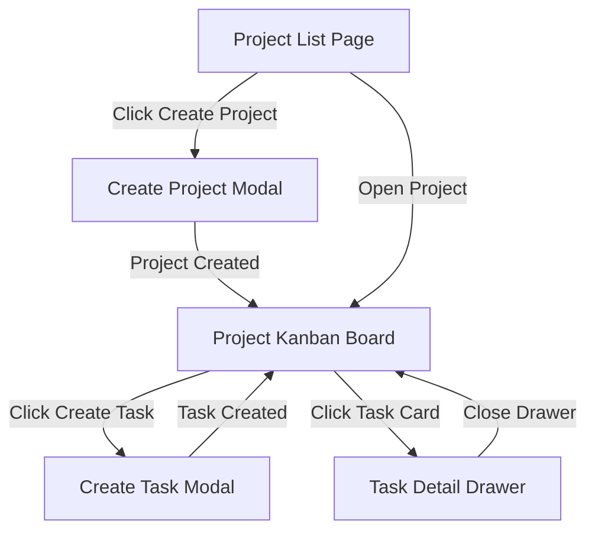

# RonFlow Core Flow Spec

## 1. 文件定位

本文件是 RonFlow 的 living spec，用來描述這個站台目前應該如何運作。

這份文件的目標是：

1. 用人類可讀的方式描述主要 flow、畫面、驗證與規則。
2. 作為開發者、測試者、產品討論時的共同對齊文件。
3. 作為驗收標準、Gherkin 與 E2E 測試的上游依據。
4. 持續隨產品演進更新，而不是綁定某個版本後封存。

若未來需要描述某一輪 release、milestone 或 vertical slice 的交付範圍，應另外建立對應文件；本文件則維持為 RonFlow 目前行為的單一真實來源。

---

## 2. 核心產品流程

RonFlow 目前的核心流程是：

1. 使用者進入 Project List Page。
2. 使用者建立 Project。
3. 系統套用 Default Workflow。
4. 使用者進入 Project Kanban Board。
5. 使用者建立 Task。
6. Task 出現在 workflow initial state 欄位。
7. 使用者可以開啟 Task Detail Drawer 查看基本資訊。

目前預設 workflow columns 為：

```text
Todo / Active / Review / Done
```

---

## 3. 文件使用原則

閱讀與維護本文件時，採以下原則：

1. 內容描述的是 RonFlow 現在應有的行為，而不是某個歷史版本曾經長怎樣。
2. 若 UI、規則、驗證或驗收方式改變，應直接更新本文件。
3. 若某功能尚未實作但已決定會納入目前產品行為，可先寫入並標記其狀態。
4. 若只是某次 release 或 milestone 暫時不做，應放在獨立的 release 文件，而不是從核心規格中刪除產品意圖。

---

## 4. 核心功能範圍

本文件描述 RonFlow 核心流程中應具備的成品行為如下：

```text
1. 使用者可以查看 Project List Page
2. 使用者可以建立 Project
3. Project 建立後會套用 Default Workflow
4. 使用者可以進入 Project Kanban Board
5. 使用者可以建立 Task
6. 新建立的 Task 會進入 workflow initial state
7. 使用者可以從 Kanban Board 開啟 Task Detail Drawer
8. 系統會提供 Project Name 與 Task Title 的基本驗證
```

本文件目前不描述以下延伸能力：

```text
1. 拖曳 Task 到其他欄位
2. TaskCompleted
3. RejectTask
4. ReopenTask
5. ChangeTaskAssignee
6. ChangeTaskPriority
7. MarkTaskUrgent / UnmarkTaskUrgent
8. Workflow Settings
9. Project Settings
10. 完整 Activity Timeline
11. 權限管理
12. 登入 / 註冊
```

---

## 5. Ubiquitous Language

| Term | Meaning in RonFlow |
|---|---|
| Project | 使用者建立並進入的一個工作空間。 |
| Default Workflow | Project 建立後系統自動套用的預設流程欄位集合。 |
| Workflow State | Kanban board 上的一個欄位，例如 Todo、Active、Review、Done。 |
| Initial State | 新建 Task 進入的第一個 Workflow State；目前為 Todo。 |
| Project Kanban Board | 顯示某個 Project workflow columns 與 tasks 的主要畫面。 |
| Task | 屬於某個 Project 的工作項目。 |
| Task Card | 顯示在 Kanban Board 欄位中的任務摘要。 |
| Task Detail Drawer | 點擊 Task Card 後開啟的側邊詳細資訊面板。 |

---

## 6. Core User Flow

### 6.1 Flow Summary

```text
1. 使用者進入 Project List Page
2. 使用者點擊 Create Project
3. 系統開啟 Create Project Modal
4. 使用者輸入 Project Name
5. 使用者送出表單
6. 系統建立 Project
7. 系統套用 Default Workflow
8. 系統導向 Project Kanban Board
9. 使用者看到預設 workflow 欄位
10. 使用者點擊 Create Task
11. 系統開啟 Create Task Modal
12. 使用者輸入 Task Title
13. 使用者送出表單
14. 系統建立 Task
15. Task 出現在 workflow initial state 欄位
16. 使用者點擊 Task Card
17. 系統開啟 Task Detail Drawer
```

### 6.2 Flow Map



---

## 7. Screen Spec

### 7.1 Project List Page

**Purpose**

讓使用者看到已有的 Projects，並開始建立新的 Project。

**Display**

```text
1. App name / logo
2. Project list
3. Project name
4. Project updated time
5. Create Project button
```

**User Actions**

```text
1. Create Project
2. Open Project
```

**Gherkin Draft**

```gherkin
Feature: 專案列表頁

  Scenario: 使用者從專案列表開始建立 Project
    Given 使用者位於 Project List Page
    When 使用者點擊 Create Project
    Then 系統應開啟 Create Project Modal
```

### 7.2 Create Project Modal

**Purpose**

讓使用者建立新的 Project。

**Fields**

```text
1. Project Name
```

**Expected Behavior**

```text
1. 使用者可以輸入 Project Name
2. 使用者可以送出或取消
3. 成功建立後會進入 Project Kanban Board
```

**Gherkin Draft**

```gherkin
Feature: 建立 Project

  Scenario: 使用者建立新的 Project
    Given 使用者已開啟 Create Project Modal
    When 使用者輸入 Project Name 為 "RonFlow Project"
    And 使用者送出表單
    Then 系統應建立 Project
    And 系統應套用 Default Workflow
    And 系統應導向 Project Kanban Board

  Scenario: 使用者未輸入 Project Name
    Given 使用者已開啟 Create Project Modal
    When 使用者直接送出表單
    Then 系統應拒絕建立 Project
    And 畫面應顯示 Project Name 必填錯誤
```

### 7.3 Project Kanban Board

**Purpose**

讓使用者在 Project 中查看 workflow 與 tasks。

**Display**

```text
1. Project name
2. Create Task button
3. Workflow columns
4. Task cards
```

**Expected Behavior**

```text
1. 顯示 Todo / Active / Review / Done 四個欄位
2. 新建 Task 出現在 Todo 欄位
3. 點擊 Task Card 可開啟 Task Detail Drawer
```

**Gherkin Draft**

```gherkin
Feature: Project Kanban Board

  Scenario: 使用者查看 Project Kanban Board
    Given 使用者已進入某個 Project Kanban Board
    Then 畫面應顯示 Project Name
    And 畫面應顯示 Todo / Active / Review / Done workflow columns

  Scenario: 使用者在看板上看到新建立的 Task
    Given 使用者已在目前 Project 建立標題為 "Build Kanban Board" 的 Task
    Then 該 Task 應顯示在 Todo 欄位
    And 該 Task 應顯示為可點擊的 Task Card
```

### 7.4 Create Task Modal

**Purpose**

讓使用者在目前的 Project 中建立 Task。

**Fields**

```text
1. Task Title
```

**Expected Behavior**

```text
1. 使用者可以輸入 Task Title
2. 使用者可以送出或取消
3. 成功建立後，Task 顯示在 Todo 欄位
```

**Gherkin Draft**

```gherkin
Feature: 建立 Task

  Scenario: 使用者建立新的 Task
    Given 使用者已位於 Project Kanban Board
    And 使用者已開啟 Create Task Modal
    When 使用者輸入 Task Title 為 "Build Kanban Board"
    And 使用者送出表單
    Then 系統應建立 Task
    And Task 應屬於目前 Project
    And Task 應進入 workflow initial state
    And Task 應顯示在 Todo 欄位

  Scenario: 使用者未輸入 Task Title
    Given 使用者已開啟 Create Task Modal
    When 使用者直接送出表單
    Then 系統應拒絕建立 Task
    And 畫面應顯示 Task Title 必填錯誤
```

### 7.5 Task Detail Drawer

**Purpose**

讓使用者查看 Task 的基本資訊。

**Minimum Display**

```text
1. Task Title
2. Current State
3. CreatedAt
4. Activity Timeline: Task created
```

**Gherkin Draft**

```gherkin
Feature: Task 詳細資訊

  Scenario: 使用者查看 Task 詳細資訊
    Given 使用者已位於 Project Kanban Board
    And 看板上存在標題為 "Build Kanban Board" 的 Task Card
    When 使用者點擊該 Task Card
    Then 系統應開啟 Task Detail Drawer
    And 畫面應顯示 Task Title 為 "Build Kanban Board"
    And 畫面應顯示 Current State 為 "Todo"
    And 畫面應顯示 Activity Timeline 包含 "Task created"
```

---

## 8. Validation And Rules

### 8.1 Project Rules

```text
1. Project Name 不可為空
2. 建立 Project 後，系統套用 Default Workflow
3. 建立 Project 後，系統導向對應的 Project Kanban Board
```

### 8.2 Task Rules

```text
1. Task Title 不可為空
2. Task 必須屬於目前 Project
3. Task 建立後進入 Workflow Initial State
4. Task 建立後顯示在 Kanban Board 的 Todo 欄位
```

### 8.3 Board Rules

```text
1. Project Kanban Board 應顯示 Project Name
2. Project Kanban Board 應顯示 Todo / Active / Review / Done
3. 每個欄位應對應一個 Workflow State
4. Initial State 欄位應可顯示新建立的 Task
```

---

## 9. Acceptance Criteria

### 9.1 Create Project

```text
1. 使用者可以從 Project List Page 開啟 Create Project Modal。
2. 使用者輸入有效 Project Name 後，可以建立 Project。
3. Project 建立後，系統會套用 Default Workflow。
4. Project 建立後，使用者會進入 Project Kanban Board。
5. 若 Project Name 為空，系統應拒絕建立。
```

### 9.2 Create Task On Board

```text
1. 使用者可以從 Project Kanban Board 開啟 Create Task Modal。
2. 使用者輸入有效 Task Title 後，可以建立 Task。
3. Task 建立後，應屬於目前 Project。
4. Task 建立後，應進入 Workflow Initial State。
5. Task 建立後，應顯示在 Kanban Board 的 Todo 欄位。
6. 若 Task Title 為空，系統應拒絕建立。
```

### 9.3 Open Task Detail

```text
1. 使用者可以點擊 Task Card 開啟 Task Detail Drawer。
2. Task Detail Drawer 應顯示 Task Title。
3. Task Detail Drawer 應顯示 Task Current State。
4. Task Detail Drawer 應顯示基本 Activity Timeline。
```

---

## 10. Test Alignment

### 10.1 Minimum E2E Scenarios

```text
1. shows the project list entry point
2. rejects an empty project name
3. user can create a project and create a task on kanban board
4. rejects an empty task title
5. opens the task detail from the kanban board
```

### 10.2 Traceability

| Test focus | Covers |
|---|---|
| Project list entry point | Project List Page 可進入、Create Project 按鈕可見 |
| Empty project validation | Project Name 必填規則 |
| Create project and task | Happy path, default workflow, task creation, task visible in Todo |
| Empty task validation | Task Title 必填規則 |
| Open task detail | Task card 與 detail drawer 的基本互動 |

---

## 11. Open Decisions

```text
1. Task Card 第一版是否顯示 Priority / Assignee / Urgent placeholder。
2. Task Detail Drawer 的 CreatedAt 顯示格式是否需要固定。
3. 後續是否需要補上 workflow state transition 規則。
```