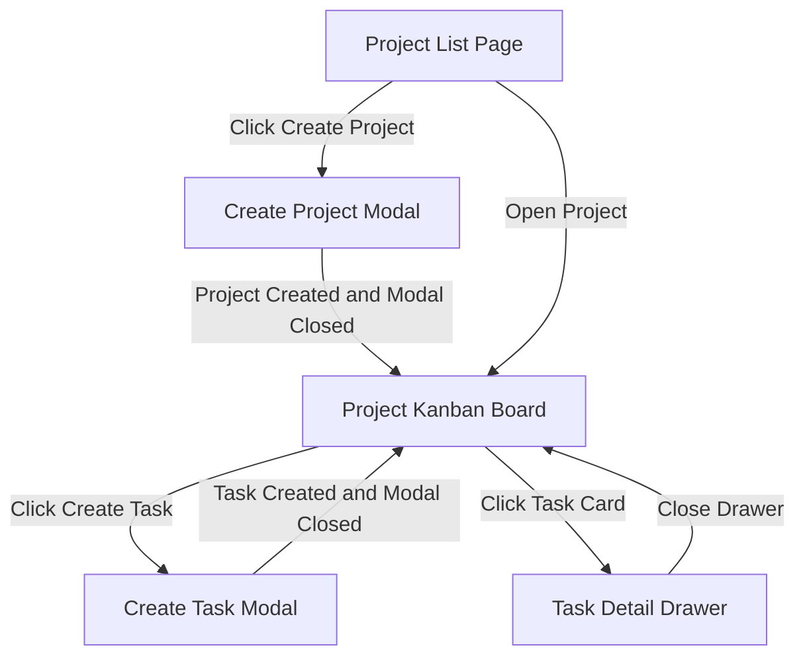

# RonFlow Core Flow Spec

## 1. 文件定位

本文件是 RonFlow 的 living spec，用來描述這個站台目前應該如何運作。

這份文件的目標是：

1. 用人類可讀的方式描述主要 flow、畫面、驗證與規則。
2. 作為開發者、測試者、產品討論時的共同對齊文件。
3. 作為驗收標準與各層測試的上游依據。
4. 持續隨產品演進更新，而不是綁定某個版本後封存。

若未來需要描述某一輪 release、milestone 或 vertical slice 的交付範圍，應另外建立對應文件；本文件則維持為 RonFlow 目前行為的單一真實來源。

---

## 2. 核心產品流程

RonFlow 目前的核心流程是：

1. 使用者進入 Project List Page。
2. 使用者建立 Project。
3. 系統套用 Default Workflow。
4. 使用者進入 Project Kanban Board。
5. 使用者建立 Task。
6. Task 出現在 workflow initial state 欄位。
7. 使用者可以開啟 Task Detail Drawer 查看基本資訊。

目前預設 workflow columns 的工程 key 與使用者可見名稱如下：

```text
Todo   -> 待處理
Active -> 進行中
Review -> 審查中
Done   -> 已完成
```

---

## 3. 文件使用原則

閱讀與維護本文件時，採以下原則：

1. 內容描述的是 RonFlow 現在應有的行為，而不是某個歷史版本曾經長怎樣。
2. 若 UI、規則、驗證或驗收方式改變，應直接更新本文件。
3. 若某功能尚未實作但已決定會納入目前產品行為，可先寫入並標記其狀態。
4. 若只是某次 release 或 milestone 暫時不做，應放在獨立的 release 文件，而不是從核心規格中刪除產品意圖。
5. 本文件描述可驗證的產品行為，但不規定必須由 E2E、integration test 或 unit test 承接。
6. 未定議題、討論中選項與暫存決策應放在其他討論文件，不保留在本 spec 中。

---

## 4. 核心功能範圍

本文件描述 RonFlow 核心流程中應具備的成品行為如下：

```text
1. 使用者可以查看 Project List Page
2. 使用者可以建立 Project
3. Project 建立後會套用 Default Workflow
4. 使用者可以進入 Project Kanban Board
5. 使用者可以建立 Task
6. 新建立的 Task 會進入 workflow initial state
7. 使用者可以從 Kanban Board 開啟 Task Detail Drawer
8. 系統會提供 Project Name 與 Task Title 的基本驗證
```

本文件目前不描述以下延伸能力：

```text
1. 拖曳 Task 到其他欄位
2. TaskCompleted
3. RejectTask
4. ReopenTask
5. ChangeTaskAssignee
6. ChangeTaskPriority
7. MarkTaskUrgent / UnmarkTaskUrgent
8. Workflow Settings
9. Project Settings
10. 完整 Activity Timeline
11. 權限管理
12. 登入 / 註冊
```

---

## 5. Ubiquitous Language 對照表

### 5.1 用語使用原則

```text
1. 畫面/元件識別名稱、資料欄位名稱、workflow state key、selector 等工程導向用語，保留英文。
2. 使用者在畫面上會看到的標題、按鈕、欄位標籤、狀態名稱、錯誤訊息，使用中文。
3. 若同一概念同時需要工程用語與介面文案，應以本對照表為準。
```

### 5.2 用語對照

| Concept | 工程/規格用語 | 使用者可見文字 | 說明 |
|---|---|---|---|
| 專案 | Project | 專案 | 使用者建立並進入的一個工作空間。 |
| 專案列表頁 | Project List Page | 專案列表 | 顯示 Project 清單的頁面。 |
| 建立專案對話框 | Create Project Modal | 建立專案 | 用來建立 Project 的 Modal。 |
| 專案名稱欄位 | Project Name | 專案名稱 | Project 的資料欄位名稱與表單 label。 |
| 預設流程 | Default Workflow | 預設流程 | Project 建立後系統自動套用的流程欄位集合。 |
| 專案看板頁 | Project Kanban Board | 專案看板 | 顯示某個 Project workflow columns 與 tasks 的主要畫面。 |
| 工作流程狀態 | Workflow State | 欄位狀態 | Kanban board 上的一個狀態欄位。 |
| 初始狀態 | Initial State | 初始狀態 | 新建 Task 進入的第一個 Workflow State。 |
| 待處理欄位 | Todo | 待處理 | 預設 workflow 的第一個欄位。 |
| 進行中欄位 | Active | 進行中 | 預設 workflow 的第二個欄位。 |
| 審查中欄位 | Review | 審查中 | 預設 workflow 的第三個欄位。 |
| 已完成欄位 | Done | 已完成 | 預設 workflow 的第四個欄位。 |
| 建立任務對話框 | Create Task Modal | 建立任務 | 用來建立 Task 的 Modal。 |
| 任務 | Task | 任務 | 屬於某個 Project 的工作項目。 |
| 任務標題欄位 | Task Title | 任務標題 | Task 的資料欄位名稱與表單 label。 |
| 任務卡片 | Task Card | 任務卡片 | 顯示在看板欄位中的任務摘要。 |
| 任務詳細資訊抽屜 | Task Detail Drawer | 任務詳細資訊 | 點擊 Task Card 後開啟的側邊面板。 |
| 目前狀態欄位 | Current State | 目前狀態 | Task 詳細資訊中的狀態欄位。 |
| 建立時間欄位 | CreatedAt | 建立時間 | Task 詳細資訊中的時間欄位。 |
| 活動紀錄 | Activity Timeline | 活動紀錄 | 顯示任務活動紀錄的區塊。 |

---

## 6. Core User Flow

### 6.1 Flow Summary

```text
1. 使用者進入 Project List Page
2. 使用者點擊 Create Project
3. 系統開啟 Create Project Modal
4. 使用者輸入 Project Name
5. 使用者送出表單
6. 系統建立 Project
7. 系統套用 Default Workflow，並立即關閉建立專案 Modal
8. 系統導向 Project Kanban Board
9. 使用者看到預設欄位「待處理 / 進行中 / 審查中 / 已完成」
10. 使用者點擊 Create Task
11. 系統開啟 Create Task Modal
12. 使用者輸入 Task Title
13. 使用者送出表單
14. 系統建立 Task
15. 系統立即關閉建立任務 Modal，Task 出現在「待處理」（Todo）欄位
16. 使用者點擊 Task Card
17. 系統開啟 Task Detail Drawer
```

### 6.2 Flow Map



---

## 7. Screen Spec

### 7.1 Project List Page

**Purpose**

讓使用者看到已有的 Projects，並開始建立新的 Project。

**Display**

```text
1. App name / logo
2. 專案清單
3. 專案名稱
4. 專案更新時間
5. 建立專案按鈕
```

**User Actions**

```text
1. 建立專案
2. 開啟專案
```

**Visible Names**

```text
1. 頁面標題：專案列表
2. 主要操作按鈕：建立專案
```

**Empty State**

```text
1. 若目前沒有任何 Project，畫面應顯示「尚未建立任何專案」。
2. 空清單狀態下仍應顯示「建立專案」按鈕。
```

**Related Rules**

1. [Project 規則](#project-rules)

**Gherkin Draft**

```gherkin
Feature: 專案列表頁

  Scenario: 使用者從專案列表開始建立 Project
    Given 使用者位於 Project List Page
    When 使用者點擊「建立專案」
    Then 系統應開啟可見名稱為「建立專案」的 Modal
```

### 7.2 Create Project Modal

**Purpose**

讓使用者建立新的 Project。

**Field Keys**

```text
1. Project Name
```

**Visible Names**

```text
1. Modal 可見名稱：建立專案
2. 欄位標籤：專案名稱
3. 主要按鈕：建立
4. 次要按鈕：取消
```

**Expected Behavior**

```text
1. 使用者可以輸入 Project Name
2. 使用者可以送出或取消
3. 成功建立後，系統會立即關閉 Modal
4. 成功建立後會進入 Project Kanban Board
```

**Validation Feedback**

```text
1. 若 Project Name 為空，畫面應顯示「專案名稱為必填欄位」。
```

**Related Rules**

1. [Project 規則](#project-rules)

**Gherkin Draft**

```gherkin
Feature: 建立專案

  Scenario: 使用者建立新的 Project
    Given 使用者已開啟可見名稱為「建立專案」的 Modal
    When 使用者輸入專案名稱為 "RonFlow Project"
    And 使用者送出表單
    Then 系統應建立 Project
    And 系統應套用 Default Workflow
    And 系統應立即關閉「建立專案」Modal
    And 系統應導向 Project Kanban Board

  Scenario: 使用者未輸入 Project Name
    Given 使用者已開啟可見名稱為「建立專案」的 Modal
    When 使用者直接送出表單
    Then 系統應拒絕建立 Project
    And 畫面應顯示「專案名稱為必填欄位」
```

### 7.3 Project Kanban Board

**Purpose**

讓使用者在 Project 中查看 workflow 與 tasks。

**Display**

```text
1. 專案名稱
2. 建立任務按鈕
3. 欄位狀態
4. 任務卡片
```

**Visible Names**

```text
1. 頁面標題應顯示目前專案名稱
2. 主要操作按鈕：建立任務
3. workflow columns 的使用者可見名稱應為「待處理 / 進行中 / 審查中 / 已完成」
```

**Expected Behavior**

```text
1. 顯示「待處理 / 進行中 / 審查中 / 已完成」四個欄位
2. 新建 Task 出現在「待處理」（Todo）欄位
3. 點擊 Task Card 可開啟 Task Detail Drawer
```

**Empty State**

```text
1. 若某個 workflow column 目前沒有任何 Task，欄位內應顯示「目前沒有任務」。
```

**Testability**

```text
1. 每個 workflow column 應提供穩定 selector，格式為 data-testid="workflow-column-{state-key}"。
2. 例如 Todo 欄位應提供 data-testid="workflow-column-todo"。
3. Task Card 應提供穩定可定位方式，可透過任務標題或其他可存取名稱識別。
4. 本文件不強制限定 Task Card 的 HTML tag。
```

**Related Rules**

1. [Board 規則](#board-rules)
2. [Task 規則](#task-rules)

**Gherkin Draft**

```gherkin
Feature: Project Kanban Board

  Scenario: 使用者查看 Project Kanban Board
    Given 使用者已進入某個 Project Kanban Board
    Then 畫面應顯示目前專案名稱
    And 畫面應顯示「待處理 / 進行中 / 審查中 / 已完成」workflow columns

  Scenario: 使用者查看空欄位
    Given 使用者已進入某個 Project Kanban Board
    And 「待處理」（Todo）欄位目前沒有任何 Task
    Then 「待處理」（Todo）欄位應顯示「目前沒有任務」

  Scenario: 使用者在看板上看到新建立的 Task
    Given 使用者已在目前 Project 建立標題為 "Build Kanban Board" 的 Task
    Then 該 Task 應顯示在「待處理」（Todo）欄位
    And 該 Task 應顯示為可點擊的 Task Card
```

### 7.4 Create Task Modal

**Purpose**

讓使用者在目前的 Project 中建立 Task。

**Field Keys**

```text
1. Task Title
```

**Visible Names**

```text
1. Modal 可見名稱：建立任務
2. 欄位標籤：任務標題
3. 主要按鈕：建立
4. 次要按鈕：取消
```

**Expected Behavior**

```text
1. 使用者可以輸入 Task Title
2. 使用者可以送出或取消
3. 成功建立後，系統會立即關閉 Modal
4. 成功建立後，Task 顯示在「待處理」（Todo）欄位
```

**Validation Feedback**

```text
1. 若 Task Title 為空，畫面應顯示「任務標題為必填欄位」。
```

**Related Rules**

1. [Task 規則](#task-rules)
2. [Board 規則](#board-rules)

**Gherkin Draft**

```gherkin
Feature: 建立任務

  Scenario: 使用者建立新的 Task
    Given 使用者已位於 Project Kanban Board
    And 使用者已開啟可見名稱為「建立任務」的 Modal
    When 使用者輸入任務標題為 "Build Kanban Board"
    And 使用者送出表單
    Then 系統應建立 Task
    And Task 應屬於目前 Project
    And Task 應進入 workflow initial state
    And 系統應立即關閉「建立任務」Modal
    And Task 應顯示在「待處理」（Todo）欄位

  Scenario: 使用者未輸入 Task Title
    Given 使用者已開啟可見名稱為「建立任務」的 Modal
    When 使用者直接送出表單
    Then 系統應拒絕建立 Task
    And 畫面應顯示「任務標題為必填欄位」
```

### 7.5 Task Detail Drawer

**Purpose**

讓使用者查看 Task 的基本資訊。

**Minimum Display**

```text
1. 任務標題
2. 目前狀態
3. 建立時間
4. 活動紀錄：已建立任務
```

**Visible Names**

```text
1. Drawer 可見名稱：任務詳細資訊
2. 關閉操作：關閉
```

**Related Rules**

1. [Task 規則](#task-rules)
2. [Board 規則](#board-rules)

**Gherkin Draft**

```gherkin
Feature: Task 詳細資訊

  Scenario: 使用者查看 Task 詳細資訊
    Given 使用者已位於 Project Kanban Board
    And 看板上存在標題為 "Build Kanban Board" 的 Task Card
    When 使用者點擊該 Task Card
    Then 系統應開啟可見名稱為「任務詳細資訊」的 Drawer
    And 畫面應顯示任務標題為 "Build Kanban Board"
    And 畫面應顯示目前狀態為 "待處理"
    And 畫面應顯示活動紀錄包含 "已建立任務"
```

---

## 8. 驗證與規則

<a id="project-rules"></a>

### 8.1 Project 規則

```text
1. Project Name 不可為空
2. 建立 Project 後，系統套用 Default Workflow
3. 建立 Project 後，系統導向對應的 Project Kanban Board
4. 建立成功後，建立專案 Modal 應立即關閉
5. Project Name 的必填錯誤訊息為「專案名稱為必填欄位」
```

<a id="task-rules"></a>

### 8.2 Task 規則

```text
1. Task Title 不可為空
2. Task 必須屬於目前 Project
3. Task 建立後進入 Workflow Initial State
4. Task 建立後顯示在 Kanban Board 的「待處理」（Todo）欄位
5. 建立成功後，建立任務 Modal 應立即關閉
6. Task Title 的必填錯誤訊息為「任務標題為必填欄位」
```

<a id="board-rules"></a>

### 8.3 Board 規則

```text
1. Project Kanban Board 應顯示 Project Name
2. Project Kanban Board 應顯示目前專案名稱
3. Project Kanban Board 應顯示「待處理 / 進行中 / 審查中 / 已完成」
4. 每個欄位應對應一個 Workflow State
5. Initial State 欄位應可顯示新建立的 Task
6. 若某個 workflow column 沒有任何 Task，欄位內應顯示「目前沒有任務」
7. 每個 workflow column 應提供穩定 selector，格式為 data-testid="workflow-column-{state-key}"
8. Task Card 應提供穩定可定位方式，但不強制限定 HTML tag
```

---

## 9. Acceptance Criteria

### 9.1 Create Project

```text
1. 使用者可以從 Project List Page 開啟 Create Project Modal。
2. 使用者輸入有效 Project Name 後，可以建立 Project。
3. Project 建立後，系統會套用 Default Workflow。
4. Project 建立後，使用者會進入 Project Kanban Board。
5. Project 建立成功後，建立專案 Modal 應立即關閉。
6. 若 Project Name 為空，系統應拒絕建立並顯示「專案名稱為必填欄位」。
```

### 9.2 Create Task On Board

```text
1. 使用者可以從 Project Kanban Board 開啟 Create Task Modal。
2. 使用者輸入有效 Task Title 後，可以建立 Task。
3. Task 建立後，應屬於目前 Project。
4. Task 建立後，應進入 Workflow Initial State。
5. Task 建立成功後，建立任務 Modal 應立即關閉。
6. Task 建立後，應顯示在 Kanban Board 的「待處理」（Todo）欄位。
7. 若 Task Title 為空，系統應拒絕建立並顯示「任務標題為必填欄位」。
```

### 9.3 Open Task Detail

```text
1. 使用者可以點擊 Task Card 開啟 Task Detail Drawer。
2. Task Detail Drawer 應顯示任務標題。
3. Task Detail Drawer 應顯示目前狀態。
4. Task Detail Drawer 應顯示基本活動紀錄。
5. Task Detail Drawer 的可見名稱應為「任務詳細資訊」。
```
