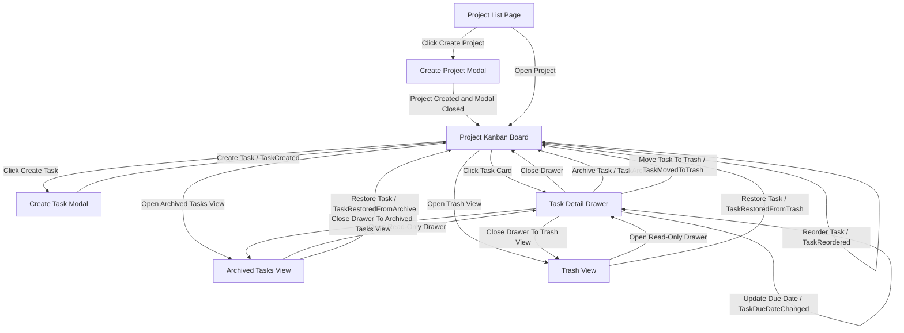

# RonFlow Core Flow Spec

## 1. 文件定位

本文件是 RonFlow 的 living spec，用來描述這個站台目前應該如何運作。

這份文件的目標是：

1. 用人類可讀的方式描述主要 flow、畫面、驗證與規則。
2. 作為開發者、測試者、產品討論時的共同對齊文件。
3. 作為驗收標準與各層測試的上游依據。
4. 持續隨產品演進更新，而不是綁定某個版本後封存。

若未來需要描述某一輪 release、milestone 或 vertical slice 的交付範圍，應另外建立對應文件；本文件則維持為 RonFlow 目前行為的單一真實來源。

---

## 2. 核心產品流程

本文件目前描述的是 authenticated single-owner 版本的 RonFlow。

也就是說：

```text
1. 除登入、註冊與 session restore 入口外，使用者必須先登入才能使用 RonFlow。
2. 使用者成功登入後，才會進入 Project List Page 與後續核心 flow。
3. 目前每位使用者只會看到屬於自己的資料，不包含多人共享 Project 或 workspace collaboration。
```

RonFlow 目前的核心流程是：

1. 使用者進入 Project List Page。
2. 使用者建立 Project。
3. 系統套用 Default Workflow。
4. 使用者進入 Project Kanban Board。
5. 使用者建立 Task。
6. Task 出現在 workflow initial state 欄位。
7. 使用者可以開啟 Task Detail Drawer 查看基本資訊。
8. 使用者可以在 Task Detail Drawer 設定與刪除提醒。

目前預設 workflow columns 的工程 key 與使用者可見名稱如下：

```text
Todo   -> 待處理
Active -> 進行中
Review -> 審查中
Done   -> 已完成
```

---

## 3. 文件使用原則

閱讀與維護本文件時，採以下原則：

1. 內容描述的是 RonFlow 現在應有的行為，而不是某個歷史版本曾經長怎樣。
2. 若 UI、規則、驗證或驗收方式改變，應直接更新本文件。
3. 若某功能尚未實作但已決定會納入目前產品行為，可先寫入並標記其狀態。
4. 若只是某次 release 或 milestone 暫時不做，應放在獨立的 release 文件，而不是從核心規格中刪除產品意圖。
5. 本文件描述可驗證的產品行為，但不規定必須由 E2E、integration test 或 unit test 承接。
6. 未定議題、討論中選項與暫存決策應放在其他討論文件，不保留在本 spec 中。
7. 若需規劃 authentication / ownership 前提在各層測試中的承接方式，請參考 [RonFlow Authentication / Ownership Test Strategy](./ronflow-auth-ownership-test-strategy.md)。

---

## 4. 核心功能範圍

本文件描述 RonFlow 核心流程中應具備的成品行為如下：

```text
1. 使用者可以查看 Project List Page
2. 使用者可以建立 Project
3. Project 建立後會套用 Default Workflow
4. 使用者可以進入 Project Kanban Board
5. 使用者可以建立 Task
6. 新建立的 Task 會進入 workflow initial state
7. 使用者可以從 Kanban Board 開啟 Task Detail Drawer
8. 使用者可以在 Kanban Board 透過 drag & drop 變更 Task 狀態
9. 使用者可以在 Task Detail Drawer 查看與編輯 Task Title、Description 與 Due Date
10. 使用者可以在同欄位內調整 Task 順序，以順序反映目前工作的優先順序
11. Task 應同時具有 Workflow State 與 Lifecycle State 兩條狀態軸線
12. 使用者可以封存 Task，讓它離開主要工作視野但保留紀錄
13. 使用者可以還原已封存的 Task
14. 使用者可以將 Task 移到垃圾桶，讓它離開主要工作視野但保留反悔機會
15. 使用者可以還原垃圾桶中的 Task
16. 系統會提供 Archived Tasks View 與 Trash View
17. Archived / Trashed Task 可開啟 read-only Task Detail Drawer 並查看活動紀錄
18. 系統會記錄 Task 的建立、內容更新、狀態推進、完成、重新開啟、排序、封存、移到垃圾桶與還原活動
19. 系統會提供 Project Name 與 Task Title 的基本驗證
20. 使用者可以在 Task Detail Drawer 為 Task 設定多個提醒
21. 系統會透過 Web Push + Service Worker 傳送提醒通知
```

### 4.1 身分與資料邊界前提

```text
1. 除 RonAuth 提供的登入、註冊與 session restore 入口外，使用者必須先登入才能使用 RonFlow。
2. RonFlow v1 採用 single-owner data boundary：Project 與其下的 Task、Reminder、Activity Timeline、Archived Tasks、Trash View 資料，都屬於建立者。
3. 使用者只可查看與操作屬於自己的資料。
4. Project List、Project Kanban Board、Task Detail Drawer、Archived Tasks View、Trash View 的資料範圍，都應以目前登入使用者為準。
5. 若使用者嘗試訪問、查看、修改、拖曳、封存、還原或以其他方式操作不屬於自己的資料，系統應拒絕該次請求，並回應 Access Denied。
6. 本文件目前不描述多人共享 Project、workspace member、tenant role 或跨使用者協作流程。
```

## 5. Ubiquitous Language 對照表

### 5.1 用語使用原則

```text
1. 畫面/元件識別名稱、資料欄位名稱、workflow state key、selector 等工程導向用語，保留英文。
2. 使用者在畫面上會看到的標題、按鈕、欄位標籤、狀態名稱、錯誤訊息，使用中文。
3. 若同一概念同時需要工程用語與介面文案，應以本對照表為準。
```

### 5.2 用語對照

| Concept | 工程/規格用語 | 使用者可見文字 | 說明 |
|---|---|---|---|
| 專案 | Project | 專案 | 使用者建立並進入的一個工作空間。 |
| 專案列表頁 | Project List Page | 專案列表 | 顯示 Project 清單的頁面。 |
| 建立專案對話框 | Create Project Modal | 建立專案 | 用來建立 Project 的 Modal。 |
| 專案名稱欄位 | Project Name | 專案名稱 | Project 的資料欄位名稱與表單 label。 |
| 預設流程 | Default Workflow | 預設流程 | Project 建立後系統自動套用的流程欄位集合。 |
| 專案看板頁 | Project Kanban Board | 專案看板 | 顯示某個 Project workflow columns 與 tasks 的主要畫面。 |
| 工作流程狀態 | Workflow State | 欄位狀態 | Kanban board 上的一個狀態欄位。 |
| 初始狀態 | Initial State | 初始狀態 | 新建 Task 進入的第一個 Workflow State。 |
| 待處理欄位 | Todo | 待處理 | 預設 workflow 的第一個欄位。 |
| 進行中欄位 | Active | 進行中 | 預設 workflow 的第二個欄位。 |
| 審查中欄位 | Review | 審查中 | 預設 workflow 的第三個欄位。 |
| 已完成欄位 | Done | 已完成 | 預設 workflow 的第四個欄位。 |
| 建立任務對話框 | Create Task Modal | 建立任務 | 用來建立 Task 的 Modal。 |
| 任務 | Task | 任務 | 屬於某個 Project 的工作項目。 |
| 任務標題欄位 | Task Title | 任務標題 | Task 的資料欄位名稱與表單 label。 |
| 任務描述欄位 | Description | 任務描述 | Task 的描述欄位，用來補充任務內容。 |
| 到期日欄位 | Due Date | 到期日 | Task 的預計完成日期欄位。 |
| 任務卡片 | Task Card | 任務卡片 | 顯示在看板欄位中的任務摘要。 |
| 任務詳細資訊抽屜 | Task Detail Drawer | 任務詳細資訊 | 點擊 Task Card 後開啟的側邊面板。 |
| 任務提醒 | Task Reminder | 提醒 | 屬於某個 Task 的提醒設定，可有多筆。 |
| 提醒時間 | Reminder DateTime | 提醒時間 | 提醒應觸發通知的日期時間。 |
| 提醒說明 | Reminder Description | 提醒說明 | 提醒的補充內容，可為空。 |
| 提醒通知 | Reminder Notification | 提醒通知 | 到達提醒時間時由系統送出的通知。 |
| 目前狀態欄位 | Current State | 目前狀態 | Task 詳細資訊中的狀態欄位。 |
| 建立時間欄位 | CreatedAt | 建立時間 | Task 詳細資訊中的時間欄位。 |
| 完成時間欄位 | CompletedAt | 完成時間 | Task 完成後顯示的時間欄位。 |
| 活動紀錄 | Activity Timeline | 活動紀錄 | 顯示任務活動紀錄的區塊。 |
| 任務生命週期狀態 | Lifecycle State | 任務生命週期 | 用來描述 Task 是否仍位於主要工作視野。 |
| 正常任務 | ActiveRecord | 正常任務 | 可出現在主要 Board / List 的 Task。 |
| 已封存任務 | Archived | 已封存 | 不出現在主要 Board，但可在封存區查看與還原。 |
| 垃圾桶任務 | Trashed | 垃圾桶 | 不出現在主要 Board，但可在垃圾桶查看與還原。 |
| 封存任務清單 | Archived Tasks View | 已封存任務 | 顯示已封存 Task 的清單畫面。 |
| 垃圾桶清單 | Trash View | 垃圾桶 | 顯示已移到垃圾桶 Task 的清單畫面。 |

### 5.3 Task State Axes

```text
1. Task 應同時具有 Workflow State 與 Lifecycle State。
2. Workflow State 代表 Task 在工作流程中的欄位狀態，例如 Todo / Active / Review / Done。
3. Lifecycle State 代表 Task 是否仍位於主要工作視野，例如 ActiveRecord / Archived / Trashed。
4. Archive / Trash 不屬於 workflow state，而屬於 lifecycle state。
5. Archived / Trashed Task 應保留原本的 workflow state，供還原時回到原欄位使用。
6. 本文件目前不包含 Permanent Delete 的產品行為。
```

---

## 6. Core User Flow

### 6.1 Flow Summary

前提：

```text
1. 使用者已完成登入，或系統已透過既有 session restore 成功還原登入狀態。
2. 使用者目前只會看到屬於自己的 Project 與 Task。
```

```text
1. 使用者進入 Project List Page
2. 使用者點擊 Create Project
3. 系統開啟 Create Project Modal
4. 使用者輸入 Project Name
5. 使用者送出表單
6. 系統建立 Project
7. 系統套用 Default Workflow，並立即關閉建立專案 Modal
8. 系統導向 Project Kanban Board
9. 使用者看到預設欄位「待處理 / 進行中 / 審查中 / 已完成」
10. 使用者點擊 Create Task
11. 系統開啟 Create Task Modal
12. 使用者輸入 Task Title
13. 使用者送出表單
14. 系統建立 Task
15. 系統立即關閉建立任務 Modal，Task 出現在「待處理」（Todo）欄位
16. 使用者點擊 Task Card
17. 系統開啟 Task Detail Drawer
18. 使用者可以在 Drawer 編輯 Task Title、Description 與 Due Date
19. 系統在 Task 更新後保留最新資料，並新增對應的活動紀錄
20. 使用者可以在 Drawer 新增多個提醒，並為每個提醒設定提醒時間與提醒說明
21. 使用者可以在 Drawer 刪除既有提醒
22. 到達提醒時間時，系統會透過 Web Push + Service Worker 傳送提醒通知，即使 RonFlow 沒有開在前景中
23. 使用者可以拖曳 Task 到其他欄位，或在同欄位內調整順序
24. Task 進入 Done 時系統記錄完成；移回非 Done 時系統記錄重新開啟
25. 使用者可以從 Task Detail Drawer 的更多操作封存 Task 或移到垃圾桶
26. 封存或移到垃圾桶成功後，系統應關閉 Drawer，並回到 Project Kanban Board
27. 已封存 / 已移到垃圾桶的 Task 不出現在 Project Kanban Board
28. 使用者可以從 Project Kanban Board 進入 Archived Tasks View 或 Trash View
29. 使用者可以在 Archived Tasks View 或 Trash View 開啟 read-only Task Detail Drawer
30. 使用者可以從 Archived Tasks View 或 Trash View 還原 Task；還原後系統回到 Project Kanban Board
```

### 6.2 Flow Map

Flow Map 應同時呈現使用者操作與對應的 domain event；若某個 domain event 完成後不會切換頁面，則以目前 page 的自我指涉表示。



---

## 7. Screen Spec

### 7.1 Project List Page

**Purpose**

讓已登入使用者看到屬於自己的 Projects，並開始建立新的 Project。

**Display**

```text
1. App name / logo
2. 專案清單
3. 專案名稱
4. 專案更新時間
5. 建立專案按鈕
```

**User Actions**

```text
1. 建立專案
2. 開啟專案
```

**Visible Names**

```text
1. 頁面標題：專案列表
2. 主要操作按鈕：建立專案
```

**UI / UX Notes**

```text
1. 使用者進入 Project List Page 的首屏時，不需捲動就應看得到「建立專案」按鈕。
2. 專案清單中的每筆 Project 至少應顯示「專案名稱」與「更新時間」，且名稱應先於更新時間出現。
3. 每筆 Project 都應提供單一步驟進入方式，使用者點擊該筆 Project 後即可進入對應的 Project Kanban Board。
4. Project List Page 顯示「選擇現有 Project」與「建立新 Project」所需資訊。
```

**Empty State**

```text
1. 若目前沒有任何 Project，畫面應顯示「尚未建立任何專案」。
2. 空清單狀態下仍應顯示「建立專案」按鈕。
```

**State Handling / Feedback**

```text
1. 當專案清單為空時，畫面仍應顯示空狀態訊息「尚未建立任何專案」與可點擊的「建立專案」按鈕；畫面不應只剩空白區域。
2. 專案列表的資料讀取 loading/error handling 依 [共用前端設計規範](../../../../CommonSpec/frontend-guidelines.md)。
3. 使用者成功建立 Project 後，系統應立即關閉 Create Project Modal，並導向新建立 Project 的 Project Kanban Board；使用者不需要重新整理頁面或重新選取該 Project。
```

**Related Rules**

1. [Project 規則](#project-rules)

**Gherkin Draft**

```gherkin
Feature: 專案列表頁

  Scenario: 使用者從專案列表開始建立 Project
    Given 使用者位於 Project List Page
    When 使用者點擊「建立專案」
    Then 系統應開啟可見名稱為「建立專案」的 Modal
```

### 7.2 Create Project Modal

**Purpose**

讓使用者建立新的 Project。

**Field Keys**

```text
1. Project Name
```

**Visible Names**

```text
1. Modal 可見名稱：建立專案
2. 欄位標籤：專案名稱
3. 主要按鈕：建立
4. 次要按鈕：取消
```

**Expected Behavior**

```text
1. 若使用者尚未登入，系統不應直接顯示 Project List Page，而應先要求完成登入或註冊。
2. 若使用者已登入，Project List Page 只顯示屬於目前登入使用者的 Projects。
3. 使用者可以輸入 Project Name
4. 使用者可以送出或取消
5. 成功建立後，系統會立即關閉 Modal
6. 成功建立後會進入 Project Kanban Board
```

**Validation Feedback**

```text
1. 若 Project Name 為空，畫面應顯示「專案名稱為必填欄位」。
```

**UI / UX Notes**

```text
1. Create Project Modal 開啟後，鍵盤輸入焦點應直接落在 Project Name 輸入欄位。
2. Modal 中唯一需要使用者輸入的欄位應為 Project Name；畫面不應額外要求 workflow 設定或其他 Project 屬性。
3. Modal 應同時提供一個主要操作「建立」與一個次要操作「取消」；使用者可直接用「建立」送出表單，用「取消」關閉 Modal。
4. 當 Project Name 驗證失敗時，錯誤訊息「專案名稱為必填欄位」應顯示在 Project Name 欄位旁或欄位下方，讓使用者不需要查看其他區域即可知道問題位置。
```

**State Handling / Feedback**

```text
1. 使用者送出建立請求後，在請求完成前，系統應阻止再次送出同一筆表單。
2. 建立成功後，系統應立即關閉 Create Project Modal，並接續進入新建立 Project 的 Project Kanban Board；畫面不應停留在成功提示狀態。
3. 若建立失敗，Create Project Modal 應維持開啟，且使用者已輸入的 Project Name 不應被清空，讓使用者可以直接修正或重新送出。
```

**Related Rules**

1. [Project 規則](#project-rules)

**Gherkin Draft**

```gherkin
Feature: 建立專案

  Scenario: 使用者建立新的 Project
    Given 使用者已開啟可見名稱為「建立專案」的 Modal
    When 使用者輸入專案名稱為 "RonFlow Project"
    And 使用者送出表單
    Then 系統應建立 Project
    And 系統應套用 Default Workflow
    And 系統應立即關閉「建立專案」Modal
    And 系統應導向 Project Kanban Board

  Scenario: 使用者未輸入 Project Name
    Given 使用者已開啟可見名稱為「建立專案」的 Modal
    When 使用者直接送出表單
    Then 系統應拒絕建立 Project
    And 畫面應顯示「專案名稱為必填欄位」
```

### 7.3 Project Kanban Board

**Purpose**

讓使用者在 Project 中查看 workflow 與 tasks。

**Display**

```text
1. 專案名稱
2. 建立任務按鈕
3. 欄位狀態
4. 任務卡片
5. 已封存任務入口
6. 垃圾桶入口
```

**User Actions**

```text
1. 建立任務
2. 開啟 Task Detail Drawer
3. 拖曳 Task 變更狀態
4. 拖曳 Task 調整順序
5. 進入 Archived Tasks View
6. 進入 Trash View
```

**Visible Names**

```text
1. 頁面標題應顯示目前專案名稱
2. 主要操作按鈕：建立任務
3. workflow columns 的使用者可見名稱應為「待處理 / 進行中 / 審查中 / 已完成」
```

**Expected Behavior**

```text
1. 使用者只可進入屬於自己的 Project Kanban Board。
2. 若使用者嘗試進入不屬於自己的 Project，系統應拒絕存取並回應 Access Denied。
3. 顯示「待處理 / 進行中 / 審查中 / 已完成」四個欄位
4. 新建 Task 出現在「待處理」（Todo）欄位
5. 點擊 Task Card 可開啟 Task Detail Drawer
6. 只有 Lifecycle State 為 ActiveRecord 的 Task 會出現在 Project Kanban Board
7. 已封存或已移到垃圾桶的 Task 不應繼續出現在 Board
8. 使用者可以從 Project Kanban Board 進入 Archived Tasks View
9. 使用者可以從 Project Kanban Board 進入 Trash View
```

**UI / UX Notes**

```text
1. 使用者進入 Project Kanban Board 後，不需捲動就應看得到目前 Project Name 與「建立任務」按鈕。
2. workflow columns 應依固定順序顯示為「待處理 / 進行中 / 審查中 / 已完成」，讓使用者不需要自行推測流程方向。
3. 每個 workflow column 至少應顯示欄位名稱、該欄位的 Task 數量，以及屬於該欄位的 Task Card 清單。
4. 「建立任務」按鈕應位於看板頁可直接操作的位置，使用者不需先打開其他選單才能建立 Task。
5. 每張 Task Card 都應同時支援兩種操作：點擊開啟 Task Detail Drawer，以及拖曳到其他 workflow column 以變更狀態。
6. Task Card 不應直接提供 Archive 或 Move To Trash 操作，避免與主要工作流互動混淆。
```

**Empty State**

```text
1. 若某個 workflow column 目前沒有任何 Task，欄位內應顯示「目前沒有任務」。
```

**State Handling / Feedback**

```text
1. 即使某個 workflow column 目前沒有任何 Task，該欄位仍應顯示欄位標題與空狀態區域；畫面不應因空欄位而少一個 column。
2. Project Kanban Board 的資料讀取 loading/error handling 依 [共用前端設計規範](../../../../CommonSpec/frontend-guidelines.md)。
```

**Testability**

```text
1. 每個 workflow column 應提供穩定 selector，格式為 data-testid="workflow-column-{state-key}"。
2. 例如 Todo 欄位應提供 data-testid="workflow-column-todo"。
3. Task Card 應提供穩定可定位方式，可透過任務標題或其他可存取名稱識別。
4. 本文件不強制限定 Task Card 的 HTML tag。
```

**Related Rules**

1. [Board 規則](#board-rules)
2. [Task 規則](#task-rules)
3. [Lifecycle 規則](#lifecycle-rules)

**Gherkin Draft**

```gherkin
Feature: Project Kanban Board

  Scenario: 使用者查看 Project Kanban Board
    Given 使用者已進入某個 Project Kanban Board
    Then 畫面應顯示目前專案名稱
    And 畫面應顯示「待處理 / 進行中 / 審查中 / 已完成」workflow columns

  Scenario: 使用者查看空欄位
    Given 使用者已進入某個 Project Kanban Board
    And 「待處理」（Todo）欄位目前沒有任何 Task
    Then 「待處理」（Todo）欄位應顯示「目前沒有任務」

  Scenario: 使用者在看板上看到新建立的 Task
    Given 使用者已在目前 Project 建立標題為 "Build Kanban Board" 的 Task
    Then 該 Task 應顯示在「待處理」（Todo）欄位
    And 該 Task 應顯示為可點擊的 Task Card
```

### 7.4 Create Task Modal

**Purpose**

讓使用者在目前的 Project 中建立 Task。

**Field Keys**

```text
1. Task Title
```

**Visible Names**

```text
1. Modal 可見名稱：建立任務
2. 欄位標籤：任務標題
3. 主要按鈕：建立
4. 次要按鈕：取消
```

**Expected Behavior**

```text
1. 使用者可以輸入 Task Title
2. 使用者可以送出或取消
3. 成功建立後，系統會立即關閉 Modal
4. 成功建立後，Task 顯示在「待處理」（Todo）欄位
```

**Validation Feedback**

```text
1. 若 Task Title 為空，畫面應顯示「任務標題為必填欄位」。
```

**UI / UX Notes**

```text
1. 使用者應可直接在 Project Kanban Board 上開啟 Create Task Modal，建立 Task 的流程不應導向其他頁面。
2. Create Task Modal 開啟後，鍵盤輸入焦點應直接落在 Task Title 輸入欄位。
3. Modal 中唯一需要使用者輸入的欄位應為 Task Title；畫面不應額外要求 workflow state、assignee 或 priority 等欄位。
4. Modal 應同時提供一個主要操作「建立」與一個次要操作「取消」；使用者可直接用「建立」送出表單，用「取消」關閉 Modal。
5. 當 Task Title 驗證失敗時，錯誤訊息「任務標題為必填欄位」應顯示在 Task Title 欄位旁或欄位下方，讓使用者不需要查看其他區域即可知道問題位置。
```

**State Handling / Feedback**

```text
1. 使用者送出建立請求後，在請求完成前，系統應阻止再次送出同一筆表單。
2. 建立成功後，系統應立即關閉 Create Task Modal，並在目前 Project Kanban Board 的「待處理」（Todo）欄位顯示新建立的 Task。
3. 若建立失敗，Create Task Modal 應維持開啟，且使用者已輸入的 Task Title 不應被清空，讓使用者可以直接修正或重新送出。
```

**Related Rules**

1. [Task 規則](#task-rules)
2. [Board 規則](#board-rules)

**Gherkin Draft**

```gherkin
Feature: 建立任務

  Scenario: 使用者建立新的 Task
    Given 使用者已位於 Project Kanban Board
    And 使用者已開啟可見名稱為「建立任務」的 Modal
    When 使用者輸入任務標題為 "Build Kanban Board"
    And 使用者送出表單
    Then 系統應建立 Task
    And Task 應屬於目前 Project
    And Task 應進入 workflow initial state
    And 系統應立即關閉「建立任務」Modal
    And Task 應顯示在「待處理」（Todo）欄位

  Scenario: 使用者未輸入 Task Title
    Given 使用者已開啟可見名稱為「建立任務」的 Modal
    When 使用者直接送出表單
    Then 系統應拒絕建立 Task
    And 畫面應顯示「任務標題為必填欄位」
```

### 7.5 Task Detail Drawer

**Purpose**

讓使用者查看與編輯 Task 的基本資訊。

**Display**

```text
1. 任務標題
2. 任務描述
3. 目前狀態
4. 到期日
5. 提醒清單
6. 建立時間
7. 完成時間（僅 Task 位於 Done 類狀態時顯示）
8. 活動紀錄
9. 任務生命週期提示（僅已封存 / 已移到垃圾桶任務時顯示）
```

**User Actions**

```text
1. 編輯任務標題
2. 編輯任務描述
3. 修改到期日
4. 新增提醒
5. 刪除提醒
6. 關閉 Drawer
7. 從更多操作封存任務
8. 從更多操作移到垃圾桶
9. 在 read-only mode 還原任務
```

**Expected Behavior**

```text
1. 使用者可以在 Drawer 查看 Task 的 Title、Description、Current State、Due Date、CreatedAt、CompletedAt 與 Activity Timeline
2. 使用者可以在 Drawer 修改 Task Title、Description 與 Due Date
3. 使用者可以在 Drawer 為同一個 Task 建立多個提醒
4. 每個提醒至少包含提醒時間與提醒說明，其中提醒時間為必填
5. 使用者可以刪除尚未觸發的提醒
6. 修改成功後，Drawer 應顯示最新資料
7. 修改成功後，Activity Timeline 應新增對應紀錄
8. Activity Timeline 至少應支援 TaskCreated、TaskTitleChanged、TaskDescriptionChanged、TaskDueDateChanged、TaskStateChanged、TaskCompleted、TaskReopened、TaskReordered、TaskArchived、TaskRestoredFromArchive、TaskMovedToTrash、TaskRestoredFromTrash
9. 當 Task 位於 ActiveRecord 時，Drawer 應允許編輯內容與管理提醒
10. 當 Task 位於 Archived 或 Trashed 時，Drawer 應以 read-only mode 顯示，且不允許編輯內容、移動狀態、排序或管理提醒
11. 當 Task 位於 Archived 或 Trashed 時，Drawer 應提供還原操作
```

**UI / UX Notes**

```text
1. Task Detail Drawer 開啟後，畫面應先顯示 Task Title，再顯示 Description、目前狀態、Due Date、建立時間與活動紀錄。
2. Task Detail Drawer 應以覆蓋看板一部分的方式呈現，讓使用者在關閉 Drawer 後可以回到原本的 Project Kanban Board 上下文。
3. 活動紀錄中的每一筆項目都應以時間先後順序顯示，讓使用者可以直接讀出 Task 的變化過程。
4. CompletedAt 只在 Task 已進入 Done 類狀態時顯示；未完成的 Task 不應顯示空白的 CompletedAt 欄位。
5. Archive 與 Move To Trash 操作應放在 Task Detail Drawer 的更多操作中，而不是放在 Task Card 或 hover 快捷操作。
6. 已封存任務的 Drawer 應顯示「此任務已封存」之類的狀態提示。
7. 位於垃圾桶的 Drawer 應顯示「此任務位於垃圾桶」之類的狀態提示。
8. 提醒清單應直接顯示在 Task Detail Drawer 中，讓使用者不需要離開目前 Task 上下文即可管理提醒。
```

**State Handling / Feedback**

```text
1. Task Detail Drawer 的資料讀取 loading/error handling 依 [共用前端設計規範](../../../../CommonSpec/frontend-guidelines.md)。
2. 若 Task 更新請求失敗，Drawer 應維持開啟，畫面應顯示錯誤訊息，且不應錯誤覆蓋原資料。
3. 封存成功後，系統應將 Task 移出主要工作視野，並可顯示 toast：「已封存任務」與「復原」。
4. 移到垃圾桶成功後，系統應將 Task 移出主要工作視野，並可顯示 toast：「已移到垃圾桶」與「復原」。
5. 使用者點擊 toast 的「復原」後，系統應還原對應 Task。
```

**Visible Names**

```text
1. Drawer 可見名稱：任務詳細資訊
2. 關閉操作：關閉
```

**Related Rules**

1. [Task 規則](#task-rules)
2. [Board 規則](#board-rules)
3. [Lifecycle 規則](#lifecycle-rules)

**Gherkin Draft**

```gherkin
Feature: Task 詳細資訊

  Scenario: 使用者查看 Task 詳細資訊
    Given 使用者已位於 Project Kanban Board
    And 看板上存在標題為 "Build Kanban Board" 的 Task Card
    When 使用者點擊該 Task Card
    Then 系統應開啟可見名稱為「任務詳細資訊」的 Drawer
    And 畫面應顯示任務標題為 "Build Kanban Board"
    And 畫面應顯示目前狀態為 "待處理"
    And 畫面應顯示活動紀錄包含 "已建立任務"

  Scenario: 使用者在 Drawer 修改任務描述
    Given 使用者已開啟標題為 "Build Kanban Board" 的 Task Detail Drawer
    When 使用者將任務描述修改為 "支援任務詳細資訊與活動紀錄"
    And 使用者送出修改
    Then Drawer 應顯示最新任務描述
    And 活動紀錄應包含 "已更新任務描述"
```

### 7.6 Move Task State On Board

**Purpose**

讓使用者可以在 Project Kanban Board 上變更 Task 的 workflow state。

**Expected Behavior**

```text
1. 使用者可以在看板上拖曳 Task Card 到另一個 workflow column
2. 放開後，系統應以放置的目標欄位作為新的 workflow state
3. 移動成功後，Task 應立即顯示在目標欄位
4. Task 從非 Done 類狀態移動到另一個非 Done 類狀態時，系統應記錄 TaskStateChanged
5. Task 從非 Done 類狀態移動到 Done 類狀態時，系統應記錄 TaskStateChanged 與 TaskCompleted
6. Task 從非 Done 類狀態移動到 Done 類狀態時，系統應記錄完成時間
7. Task 從 Done 類狀態移回非 Done 類狀態時，系統應記錄 TaskStateChanged 與 TaskReopened
8. Task 從 Done 類狀態移回非 Done 類狀態時，Task 不應繼續顯示目前的 CompletedAt
```

**UI / UX Notes**

```text
1. 狀態變更的主要互動方式應為 drag & drop；畫面不應要求使用者透過另一組「移到某欄位」按鈕完成同一件事。
2. 每張可拖曳的 Task Card 都應提供可辨識的拖曳提示，例如游標、drag handle 或等效視覺訊號，讓使用者知道這張卡片可以被移動。
3. 使用者拖曳 Task Card 期間，可放置的 workflow column 應顯示可見的 drop target 回饋，讓使用者知道目前放下去會落在哪一欄。
4. 在使用者尚未把 Task Card 放到目標欄位前，系統不應提交狀態變更，也不應提前把 Task 視為已移動成功。
5. 拖曳放置成功後，原欄位中的卡片應消失，目標欄位中應出現該卡片，讓使用者不需重新整理頁面即可看到結果。
```

**State Handling / Feedback**

```text
1. 若使用者開始拖曳 Task Card，但最後沒有放到有效的 workflow column，Task Card 應回到原本欄位與原本位置。
2. 若狀態變更請求失敗，Task Card 應回到原欄位，且畫面應顯示錯誤訊息，讓使用者知道這次拖曳未成功。
3. Task Card 在未進行拖曳操作時，仍應保留原本的點擊行為，讓使用者可以開啟 Task Detail Drawer。
```

**Testability**

```text
1. 每個 Task Card 應提供穩定可定位方式，讓測試可以抓取 drag source。
2. 每個 workflow column 應提供穩定可定位方式，讓測試可以作為 drop target。
3. 使用者必須能從畫面完成狀態移動，而不需要直接呼叫 API。
4. 規格不限制 drag & drop 必須採用哪一個前端函式庫，但互動結果必須可被自動測試驗證。
```

**Related Rules**

1. [Task 規則](#task-rules)
2. [Board 規則](#board-rules)

**Gherkin Draft**

```gherkin
Feature: Move task state on kanban board

  Scenario: User moves a task to another workflow state
    Given a project exists with a default workflow
    And a task titled "Build Kanban Board" exists in the "Todo" state
    When the user drags the task to the "Active" column
    Then the task should appear under the "Active" column
    And a TaskStateChanged event should be recorded
    And the task should not have a completed time

  Scenario: User moves a task to Done
    Given a project exists with a default workflow
    And a task titled "Build Kanban Board" exists in the "Active" state
    When the user drags the task to the "Done" column
    Then the task should appear under the "Done" column
    And a TaskStateChanged event should be recorded
    And a TaskCompleted event should be recorded
    And the task should have a completed time

  Scenario: User reopens a task from Done
    Given a project exists with a default workflow
    And a task titled "Build Kanban Board" exists in the "Done" state
    When the user drags the task to the "Active" column
    Then the task should appear under the "Active" column
    And a TaskStateChanged event should be recorded
    And a TaskReopened event should be recorded
    And the task should not show a current completed time
```

### 7.7 Reorder Task Within Column

**Purpose**

讓使用者在同一個 workflow column 內調整 Task 順序，以順序表達目前工作的優先順序。

**Expected Behavior**

```text
1. 使用者可以在同一個 workflow column 內拖曳 Task Card 調整順序
2. 排序成功後，欄位中的 Task Card 應立即反映新的順序
3. 同欄位內的 Task 順序應反映使用者目前工作的優先順序
4. 排序成功後，系統應記錄 TaskReordered
5. Activity Timeline 應保留 TaskReordered 紀錄
```

**UI / UX Notes**

```text
1. 使用者在同欄位內拖曳 Task Card 時，欄位中應提供可辨識的落點提示，讓使用者知道卡片將插入的位置。
2. 排序完成後，使用者不需重新整理頁面就應看得到最新順序。
```

**Testability**

```text
1. 同欄位排序必須能從畫面完成，而不需要直接呼叫 API。
2. 測試應能辨識排序前後的 Task Card 順序變化。
```

**Related Rules**

1. [Task 規則](#task-rules)
2. [Board 規則](#board-rules)

**Gherkin Draft**

```gherkin
Feature: Reorder task within a workflow column

  Scenario: User reorders tasks within the same column
    Given a project exists with a default workflow
    And tasks titled "Task A" and "Task B" exist in the "Todo" state
    When the user drags "Task B" above "Task A" within the "Todo" column
    Then the "Todo" column should display "Task B" before "Task A"
    And a TaskReordered event should be recorded
```

### 7.8 Archived Tasks View

**Purpose**

讓使用者查看已封存的 Task，並在需要時還原。

**Display**

```text
1. 頁面標題
2. 已封存 Task 清單
3. 任務標題
4. 所屬 Project 名稱
5. 原 workflow state
6. ArchivedAt
7. 還原操作
```

**User Actions**

```text
1. 開啟已封存 Task 的 read-only Task Detail Drawer
2. 還原已封存 Task
```

**Visible Names**

```text
1. 頁面標題：已封存任務
2. 主要操作：還原
```

**Expected Behavior**

```text
1. Archived Tasks View 只顯示目前登入使用者且 Lifecycle State 為 Archived 的 Task
2. 使用者可以從清單開啟已封存 Task 的 read-only Task Detail Drawer
3. 已封存 Task 可以被還原
4. 還原後，Task 回到原本 workflow state
5. 還原後，Task 應顯示在原 workflow column 的最後
6. 還原後，Task 不應繼續顯示在 Archived Tasks View
```

**Empty State**

```text
1. 若目前沒有任何已封存 Task，畫面應顯示「目前沒有已封存任務」。
```

**State Handling / Feedback**

```text
1. Archived Tasks View 的資料讀取 loading/error handling 依 [共用前端設計規範](../../../../CommonSpec/frontend-guidelines.md)。
2. 還原成功後，系統可顯示 toast：「已還原任務到對應欄位」或提供「前往查看」。
```

**Testability**

```text
1. Archived Tasks View 應提供穩定可定位方式，讓測試可以辨識已封存 Task 清單。
2. 每筆已封存 Task 應可透過任務標題或其他可存取名稱定位。
3. 還原操作應提供穩定可定位方式。
```

**Related Rules**

1. [Task 規則](#task-rules)
2. [Lifecycle 規則](#lifecycle-rules)

**Gherkin Draft**

```gherkin
Feature: Archived tasks view

  Scenario: 使用者查看已封存任務
    Given 目前存在已封存的 Task
    When 使用者進入 Archived Tasks View
    Then 畫面應顯示標題為「已封存任務」
    And 畫面應列出已封存 Task 的標題、所屬 Project、原 workflow state 與 ArchivedAt

  Scenario: 使用者還原已封存 Task
    Given 使用者已位於 Archived Tasks View
    And 畫面上存在標題為 "Build Kanban Board" 的已封存 Task
    When 使用者執行「還原」
    Then 該 Task 應回到原本 workflow state
    And 該 Task 應顯示在原 workflow column 的最後
    And 該 Task 不應繼續出現在 Archived Tasks View
```

### 7.9 Trash View

**Purpose**

讓使用者查看已移到垃圾桶的 Task，並在需要時還原。

**Display**

```text
1. 頁面標題
2. 垃圾桶 Task 清單
3. 任務標題
4. 所屬 Project 名稱
5. 原 workflow state
6. TrashedAt
7. 還原操作
```

**User Actions**

```text
1. 開啟垃圾桶 Task 的 read-only Task Detail Drawer
2. 還原垃圾桶 Task
```

**Visible Names**

```text
1. 頁面標題：垃圾桶
2. 主要操作：還原
```

**Expected Behavior**

```text
1. Trash View 只顯示目前登入使用者且 Lifecycle State 為 Trashed 的 Task
2. 使用者可以從清單開啟垃圾桶 Task 的 read-only Task Detail Drawer
3. 垃圾桶中的 Task 可以被還原
4. 還原後，Task 回到原本 workflow state
5. 還原後，Task 應顯示在原 workflow column 的最後
6. 還原後，Task 不應繼續顯示在 Trash View
```

**Empty State**

```text
1. 若目前沒有任何垃圾桶 Task，畫面應顯示「垃圾桶目前沒有任務」。
```

**State Handling / Feedback**

```text
1. Trash View 的資料讀取 loading/error handling 依 [共用前端設計規範](../../../../CommonSpec/frontend-guidelines.md)。
2. 還原成功後，系統可顯示 toast：「已還原任務到對應欄位」或提供「前往查看」。
```

**Testability**

```text
1. Trash View 應提供穩定可定位方式，讓測試可以辨識垃圾桶 Task 清單。
2. 每筆垃圾桶 Task 應可透過任務標題或其他可存取名稱定位。
3. 還原操作應提供穩定可定位方式。
```

**Related Rules**

1. [Task 規則](#task-rules)
2. [Lifecycle 規則](#lifecycle-rules)

**Gherkin Draft**

```gherkin
Feature: Trash view

  Scenario: 使用者查看垃圾桶任務
    Given 目前存在已移到垃圾桶的 Task
    When 使用者進入 Trash View
    Then 畫面應顯示標題為「垃圾桶」
    And 畫面應列出垃圾桶 Task 的標題、所屬 Project、原 workflow state 與 TrashedAt

  Scenario: 使用者還原垃圾桶 Task
    Given 使用者已位於 Trash View
    And 畫面上存在標題為 "Build Kanban Board" 的垃圾桶 Task
    When 使用者執行「還原」
    Then 該 Task 應回到原本 workflow state
    And 該 Task 應顯示在原 workflow column 的最後
    And 該 Task 不應繼續出現在 Trash View
```

### 7.10 Task Reminder Management

**Purpose**

讓使用者在 Task Detail Drawer 中管理 Task 的提醒。

**Display**

```text
1. 提醒清單
2. 提醒時間
3. 提醒說明
4. 新增提醒操作
5. 刪除提醒操作
```

**User Actions**

```text
1. 新增提醒
2. 輸入提醒時間
3. 輸入提醒說明
4. 刪除提醒
```

**Visible Names**

```text
1. 區塊標題：提醒
2. 欄位標籤：提醒時間
3. 欄位標籤：提醒說明
4. 主要操作：新增提醒
5. 刪除操作：刪除提醒
```

**Expected Behavior**

```text
1. 每個 Task 可以建立多個提醒
2. 每個提醒至少包含提醒時間與提醒說明，其中提醒時間為必填
3. 提醒建立成功後，Task Detail Drawer 應顯示最新的提醒清單
4. 使用者可以刪除尚未觸發的提醒
5. 提醒刪除成功後，該提醒不應繼續顯示在提醒清單中
6. 提醒被刪除後，系統不應再送出該筆提醒通知
```

**Validation Feedback**

```text
1. 若提醒時間為空，畫面應顯示「提醒時間為必填欄位」。
```

**UI / UX Notes**

```text
1. 使用者應在同一個 Task Detail Drawer 中完成提醒的新增與刪除，不需切換到其他頁面。
2. 同一個 Task 的多筆提醒應以清單方式呈現，讓使用者可快速辨識目前已設定的提醒。
3. 每筆提醒至少應可直接看到提醒時間；若有填寫提醒說明，也應一併顯示。
4. 刪除提醒的操作應對應到單一提醒，不應讓使用者誤刪其他提醒。
```

**State Handling / Feedback**

```text
1. 提醒建立或刪除請求進行中時，系統應阻止對同一筆提醒重複送出。
2. 若提醒建立失敗，Task Detail Drawer 應維持開啟，且使用者已輸入的內容不應被清空。
3. 若提醒刪除失敗，原提醒應維持顯示，並讓使用者知道刪除未成功。
```

**Related Rules**

1. [Task 規則](#task-rules)
2. [Reminder 規則](#reminder-rules)

**Gherkin Draft**

```gherkin
Feature: Task reminders

  Scenario: 使用者在 Task Detail Drawer 新增多個提醒
    Given 使用者已開啟標題為 "Build Kanban Board" 的 Task Detail Drawer
    When 使用者新增一筆提醒，提醒時間為 "2026-05-20 09:00"，提醒說明為 "提醒確認欄位狀態"
    And 使用者再新增一筆提醒，提醒時間為 "2026-05-21 15:00"，提醒說明為 "提醒追蹤審查結果"
    Then Drawer 應顯示兩筆提醒
    And 每筆提醒都應顯示對應的提醒時間

  Scenario: 使用者未輸入提醒時間
    Given 使用者已開啟標題為 "Build Kanban Board" 的 Task Detail Drawer
    When 使用者新增提醒但未輸入提醒時間
    Then 系統應拒絕建立提醒
    And 畫面應顯示「提醒時間為必填欄位」

  Scenario: 使用者刪除提醒
    Given 使用者已開啟標題為 "Build Kanban Board" 的 Task Detail Drawer
    And 該 Task 已存在提醒時間為 "2026-05-20 09:00" 的提醒
    When 使用者刪除該筆提醒
    Then 該提醒不應繼續顯示在提醒清單中
    And 系統不應再送出該筆提醒通知
```

### 7.11 Reminder Notification Delivery

**Purpose**

讓使用者在沒有持續開啟 RonFlow 前景頁面的情況下，仍可收到 Task 提醒。

**Expected Behavior**

```text
1. 到達提醒時間時，系統應透過 Web Push + Service Worker 傳送提醒通知
2. 即使使用者當下沒有開啟 RonFlow 頁面、瀏覽器位於背景，或手機上沒有正在查看網站，系統仍應可送出提醒通知
3. 提醒通知的送達前提為該裝置/瀏覽器已允許通知並完成推播訂閱
4. 若目前裝置/瀏覽器尚未具備可用的通知權限或推播訂閱，系統應明確告知提醒可能無法送達
```

**UI / UX Notes**

```text
1. 提醒通知的送達能力屬於跨頁面能力，但提醒的建立與管理仍以 Task Detail Drawer 為主要入口。
2. 提醒通知應讓使用者可辨識是哪一個 Task 觸發的提醒。
```

**State Handling / Feedback**

```text
1. 若瀏覽器通知權限被拒絕、封鎖或尚未完成推播訂閱，系統應提供可理解的狀態提示。
2. 若提醒已成功排程且目前裝置/瀏覽器具備可用推播能力，系統應讓使用者知道提醒會以通知方式送達。
```

**Related Rules**

1. [Reminder 規則](#reminder-rules)

**Gherkin Draft**

```gherkin
Feature: Reminder notification delivery

  Scenario: 使用者在未查看 RonFlow 時收到提醒
    Given 使用者已為標題為 "Build Kanban Board" 的 Task 設定提醒時間為 "2026-05-20 09:00"
    And 使用者目前裝置已允許通知並完成推播訂閱
    When 系統時間到達 "2026-05-20 09:00"
    Then 系統應透過 Web Push + Service Worker 送出提醒通知
    And 即使使用者沒有開啟 RonFlow 前景頁面，仍應可收到該通知

  Scenario: 使用者尚未完成推播訂閱
    Given 使用者已開啟標題為 "Build Kanban Board" 的 Task Detail Drawer
    And 目前裝置尚未具備可用的通知權限或推播訂閱
    When 使用者查看提醒功能狀態
    Then 畫面應明確告知提醒可能無法送達
```

---

## 8. 驗證與規則

<a id="authentication-access-rules"></a>

### 8.0 Authentication / Access 規則

```text
1. 除登入、註冊與 session restore 入口外，RonFlow 其他核心功能都要求使用者先登入。
2. 未登入使用者不應直接看到 Project List Page、Project Kanban Board、Task Detail Drawer、Archived Tasks View 或 Trash View 的資料內容。
3. Project、Task、Reminder、Archived Tasks、Trash View 與相關 read model 查詢，都應以目前登入使用者為範圍。
4. 若使用者嘗試讀取、修改、封存、還原、拖曳、排序或以其他方式操作不屬於自己的資料，系統應拒絕該次請求，並回應 Access Denied。
5. Access Denied 屬於 authorization failure，不應被視為 validation error。
6. 本文件目前描述的是 authenticated single-owner 版本，不包含跨使用者共享資料的行為。
```

<a id="project-rules"></a>

### 8.1 Project 規則

```text
1. Project Name 不可為空
2. 每個 Project 都應屬於建立它的登入使用者
3. 建立 Project 後，系統套用 Default Workflow
4. 建立 Project 後，系統導向對應的 Project Kanban Board
5. 建立成功後，建立專案 Modal 應立即關閉
6. Project Name 的必填錯誤訊息為「專案名稱為必填欄位」
```

<a id="task-rules"></a>

### 8.2 Task 規則

```text
1. Task Title 不可為空
2. Task 必須屬於目前 Project
3. 每個 Task 都應屬於其所屬 Project 的擁有者
4. Task 建立後進入 Workflow Initial State
5. Task 建立後顯示在 Kanban Board 的「待處理」（Todo）欄位
6. 建立成功後，建立任務 Modal 應立即關閉
7. Task Title 的必填錯誤訊息為「任務標題為必填欄位」
8. Task 應可在 Task Detail Drawer 中編輯 Title、Description 與 Due Date
9. Task 更新成功後，Activity Timeline 應包含對應的變更紀錄
10. Task 狀態可以從目前欄位變更到另一個 workflow state
11. Task 可在同一欄位內調整順序，且順序代表個人工作優先順序
12. Task 從非 Done 類狀態移動到另一個非 Done 類狀態時，系統應記錄 TaskStateChanged
13. Task 從 Done 類狀態移回非 Done 類狀態時，系統應另外記錄 TaskReopened
14. Task 處於非 Done 類狀態時，不應顯示目前的 CompletedAt
15. 當 Task 進入 Done 類狀態時，系統應記錄 CompletedAt
16. 當 Task 進入 Done 類狀態時，活動紀錄應包含 TaskCompleted
17. Task 調整順序後，活動紀錄應包含 TaskReordered
18. Task 可以在 Task Detail Drawer 中設定多個提醒
```

<a id="reminder-rules"></a>

### 8.3 Reminder 規則

```text
1. 每個 Task 可擁有多個提醒。
2. Reminder DateTime 為必填。
3. Reminder Description 可為空。
4. 提醒應在 Task Detail Drawer 中建立與刪除。
5. 已刪除的提醒不應繼續被送達。
6. 到達提醒時間時，系統應透過 Web Push + Service Worker 傳送提醒通知。
7. 提醒通知的送達前提為裝置/瀏覽器已允許通知並完成推播訂閱。
8. 若裝置/瀏覽器目前不具備可用的通知權限或推播訂閱，系統應明確告知提醒可能無法送達。
```

<a id="lifecycle-rules"></a>

### 8.4 Lifecycle 規則

```text
1. Task 應同時具有 Workflow State 與 Lifecycle State。
2. Archive / Trash 不屬於 workflow state，而屬於 lifecycle state。
3. ActiveRecord Task 可以出現在主要 Board / List。
4. Archived Task 不出現在 Project Kanban Board。
5. Trashed Task 不出現在 Project Kanban Board。
6. Archived Task 出現在 Archived Tasks View。
7. Trashed Task 出現在 Trash View。
8. Archive / Trash 不改變 Task 原本的 workflow state。
9. Archived / Trashed Task 可以還原。
10. 還原後，Task 回到原本 workflow state。
11. 還原後，Task 放在該 workflow column 的最後。
12. Archived / Trashed Task 的 Activity Timeline 應保留。
13. Archived / Trashed Task 可以開啟 read-only Task Detail Drawer。
14. Archived / Trashed Task 不允許編輯內容、移動狀態或排序。
15. Archive / Move To Trash 操作放在 Task Detail Drawer 的更多操作中。
16. Task Card 不直接提供 Archive / Move To Trash 操作。
17. Move To Trash 是可逆操作，不需要二次確認。
18. 系統目前不包含 Permanent Delete 的產品行為。
```

<a id="board-rules"></a>

### 8.5 Board 規則

```text
1. Project Kanban Board 應顯示 Project Name
2. Project Kanban Board 應顯示目前專案名稱
3. Project Kanban Board 應顯示「待處理 / 進行中 / 審查中 / 已完成」
4. 每個欄位應對應一個 Workflow State
5. Initial State 欄位應可顯示新建立的 Task
6. 若某個 workflow column 沒有任何 Task，欄位內應顯示「目前沒有任務」
7. 每個 workflow column 應提供穩定 selector，格式為 data-testid="workflow-column-{state-key}"
8. Task Card 應提供穩定可定位方式，但不強制限定 HTML tag
9. 使用者應可從 Project Kanban Board 透過 drag & drop 將 Task 移動到另一個 workflow column
10. 使用者應可在同一個 workflow column 內透過 drag & drop 調整 Task 順序
11. Task 移動或排序成功後，欄位中的卡片順序都應反映最新位置
12. 只有 Lifecycle State 為 ActiveRecord 的 Task 應顯示在 Board
13. Archived / Trashed Task 不應顯示在任何 workflow column
```

---

## 9. Acceptance Criteria

### 9.0 Authentication / Ownership Boundary

```text
1. 若使用者尚未登入，系統不應直接顯示 RonFlow workspace 資料，而應要求先登入或註冊。
2. 使用者登入成功後，才可以進入 Project List Page 與後續核心流程。
3. Project List 只應顯示屬於目前登入使用者的 Projects。
4. Project Kanban Board、Task Detail Drawer、Archived Tasks View 與 Trash View 只應顯示屬於目前登入使用者的資料。
5. 若使用者嘗試訪問或操作不屬於自己的 Project 或 Task，系統應拒絕該次請求，並回應 Access Denied。
6. Access Denied 應適用於讀取、編輯、拖曳、排序、封存、移到垃圾桶與還原等操作。
```

### 9.1 Create Project

```text
1. 使用者可以從 Project List Page 開啟 Create Project Modal。
2. 使用者輸入有效 Project Name 後，可以建立 Project。
3. Project 建立後，系統會套用 Default Workflow。
4. Project 建立後，使用者會進入 Project Kanban Board。
5. Project 建立成功後，建立專案 Modal 應立即關閉。
6. 若 Project Name 為空，系統應拒絕建立並顯示「專案名稱為必填欄位」。
```

### 9.2 Create Task On Board

```text
1. 使用者可以從 Project Kanban Board 開啟 Create Task Modal。
2. 使用者輸入有效 Task Title 後，可以建立 Task。
3. Task 建立後，應屬於目前 Project。
4. Task 建立後，應進入 Workflow Initial State。
5. Task 建立成功後，建立任務 Modal 應立即關閉。
6. Task 建立後，應顯示在 Kanban Board 的「待處理」（Todo）欄位。
7. 若 Task Title 為空，系統應拒絕建立並顯示「任務標題為必填欄位」。
```

### 9.3 Open Task Detail

```text
1. 使用者可以點擊 Task Card 開啟 Task Detail Drawer。
2. Task Detail Drawer 應顯示任務標題。
3. Task Detail Drawer 應顯示任務描述。
4. Task Detail Drawer 應顯示目前狀態。
5. Task Detail Drawer 應顯示建立時間與基本活動紀錄。
6. Task 若已設定 Due Date，Task Detail Drawer 應顯示到期日。
7. Task Detail Drawer 的可見名稱應為「任務詳細資訊」。
```

### 9.4 Edit Task Detail In Drawer

```text
1. 使用者可以在 Task Detail Drawer 修改 Task Title、Description 與 Due Date。
2. 修改成功後，Drawer 應顯示最新資料。
3. 修改成功後，Activity Timeline 應新增對應紀錄。
4. 修改失敗時，畫面應顯示錯誤訊息，且不應錯誤覆蓋原資料。
```

### 9.5 Move Task State To Another Workflow State

```text
1. 使用者可以從 Project Kanban Board 拖曳指定 Task 到另一個 workflow state。
2. Task 從「待處理」（Todo）拖曳到「進行中」（Active）後，應顯示在「進行中」欄位。
3. Task 的活動紀錄應顯示 TaskStateChanged。
4. Task 不應顯示目前的 CompletedAt。
```

### 9.6 Move Task State To Done

```text
1. 使用者可以將位於「進行中」（Active）的 Task 拖曳到「已完成」（Done）欄位。
2. Task 移動後，應顯示在「已完成」（Done）欄位。
3. Task 應顯示 CompletedAt。
4. Task 的活動紀錄應顯示 TaskStateChanged 與 TaskCompleted。
```

### 9.7 Reopen Task From Done

```text
1. 使用者可以將位於「已完成」（Done）的 Task 拖曳回非 Done workflow state。
2. Task 重新開啟後，應顯示在目標欄位。
3. Task 重新開啟後，不應繼續顯示目前的 CompletedAt。
4. Task 的活動紀錄應顯示 TaskStateChanged 與 TaskReopened。
5. Activity Timeline 應保留先前的 TaskCompleted 與 TaskReopened 紀錄。
```

### 9.8 Reorder Task Within Column

```text
1. 使用者可以在同一個 workflow column 內拖曳 Task 調整順序。
2. 排序成功後，欄位中的 Task 應以新的順序顯示。
3. 同欄位內的 Task 順序應反映目前工作的優先順序。
4. Task 的活動紀錄應顯示 TaskReordered。
```

### 9.9 Archive Task

```text
1. 使用者可以從 Task Detail Drawer 的更多操作中封存 Task。
2. Task Card 不應直接顯示封存操作。
3. 封存後，Task 不應出現在 Project Kanban Board。
4. 封存後，Task 應出現在 Archived Tasks View。
5. 封存後，Activity Timeline 應包含 TaskArchived。
6. 封存後，系統可顯示 toast：「已封存任務」與「復原」。
```

### 9.10 Restore Archived Task

```text
1. 使用者可以從 Archived Tasks View 還原 Task。
2. 還原後，Task 應回到原本 workflow state。
3. 還原後，Task 應顯示在該 workflow column 的最後。
4. 還原後，Task 不應繼續出現在 Archived Tasks View。
5. 還原後，Activity Timeline 應包含 TaskRestoredFromArchive。
```

### 9.11 Move Task To Trash

```text
1. 使用者可以從 Task Detail Drawer 的更多操作中將 Task 移到垃圾桶。
2. Task Card 不應直接顯示移到垃圾桶操作。
3. 第一層操作文案應為「移到垃圾桶」，不應只顯示「刪除」。
4. 移到垃圾桶前不需要二次確認。
5. 移到垃圾桶後，Task 不應出現在 Project Kanban Board。
6. 移到垃圾桶後，Task 應出現在 Trash View。
7. 移到垃圾桶後，Activity Timeline 應包含 TaskMovedToTrash。
8. 移到垃圾桶後，系統可顯示 toast：「已移到垃圾桶」與「復原」。
```

### 9.12 Restore Trashed Task

```text
1. 使用者可以從 Trash View 還原 Task。
2. 還原後，Task 應回到原本 workflow state。
3. 還原後，Task 應顯示在該 workflow column 的最後。
4. 還原後，Task 不應繼續出現在 Trash View。
5. 還原後，Activity Timeline 應包含 TaskRestoredFromTrash。
```

### 9.13 Archived / Trashed Read-Only Drawer

```text
1. 使用者可以從 Archived Tasks View 或 Trash View 開啟 Task Detail Drawer。
2. 當 Task 處於 Archived 或 Trashed 時，Drawer 應以 read-only mode 顯示。
3. Drawer 應顯示任務標題、目前狀態、相關時間欄位與 Activity Timeline。
4. Drawer 應顯示對應的生命週期提示，例如「此任務已封存」或「此任務位於垃圾桶」。
5. Drawer 不應允許編輯內容、移動狀態或排序。
6. Drawer 應提供還原操作。
```

### 9.14 Manage Task Reminders

```text
1. 使用者可以在 Task Detail Drawer 為同一個 Task 新增多個提醒。
2. 每個提醒都應包含必填的 Reminder DateTime。
3. Reminder Description 可選填。
4. 提醒建立成功後，Task Detail Drawer 應立即顯示最新提醒清單。
5. 若 Reminder DateTime 為空，系統應拒絕建立並顯示「提醒時間為必填欄位」。
6. 使用者可以刪除尚未觸發的提醒。
7. 提醒刪除成功後，該提醒不應繼續顯示在提醒清單中。
8. 提醒刪除成功後，系統不應再送出該筆提醒通知。
```

### 9.15 Deliver Reminder Notification Via Web Push

```text
1. 到達提醒時間時，系統應透過 Web Push + Service Worker 送出提醒通知。
2. 即使使用者沒有開啟 RonFlow 前景頁面、瀏覽器位於背景，或手機上沒有正在查看網站，仍應可收到提醒通知。
3. 提醒通知的送達前提為該裝置/瀏覽器已允許通知並完成推播訂閱。
4. 若目前裝置/瀏覽器不具備可用的通知權限或推播訂閱，畫面應明確告知提醒可能無法送達。
```
