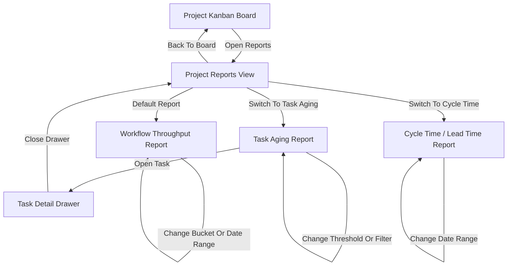

# RonFlow Reporting / Projection Spec

## 1. 文件定位

本文件是 RonFlow 的 reporting / projection companion spec，用來描述使用者在 RonFlow 中應如何進入報表畫面、查看報表、切換條件，以及從報表回到既有的專案工作流。

這份文件的目標是：

1. 用人類可讀的方式描述 RonFlow 報表功能的頁面、操作、顯示與規則。
2. 作為開發者、測試者、產品討論時的共同對齊文件。
3. 作為 reporting / projection acceptance 與各層測試的上游依據。
4. 持續隨 RonFlow 報表功能演進更新，而不是綁定某個版本後封存。

本文件屬於 companion spec，和 [ronflow-core-flow-spec.md](./ronflow-core-flow-spec.md) 共用同一套 Project / Task domain truth。若 core flow spec 未來調整 Project Kanban Board、Task Detail Drawer、workflow state 或相關共用資料邊界，且會影響報表功能入口、內容或使用方式，應同批更新本文件。

本文件描述的是「報表功能應該怎麼被看見與使用」。若要說明 reporting / projection 的技術落地方式，例如 reporting model、outbox、background consumer、projection rebuild 或其他實作細節，應另外寫在 `docs/ronflow-tech/`。

## Related Acceptance Tests

這份 spec 目前已有第一批 acceptance baseline，可優先從下列測試切面承接：

1. API integration tests：`ReportingProjectionApiIntegrationTests`，驗證 workflow throughput 報表的 daily / weekly bucket、completed / reopened 統計。
2. frontend screen acceptance tests：`project-reports.screen.acceptance.spec.ts`，驗證使用者可從 Project Kanban Board 進入報表畫面。
3. frontend behavior acceptance tests：`project-reports.behavior.acceptance.spec.ts`，驗證 task workflow 流轉後，工作流量報表會顯示對應統計。
4. API integration tests：`ReportingProjectionApiIntegrationTests`，也應承接 Task Aging 報表的 threshold 過濾與 open task 規則。
5. frontend behavior acceptance tests：`project-reports.behavior.acceptance.spec.ts`，也應承接 Task Aging 報表的 threshold 調整與從報表開啟 Task Detail Drawer。

這份對照是目前入口，不代表 coverage 已完整。實際評估進度時，仍應逐段比對 spec、acceptance tests 與實作是否一一承接，尤其是 Cycle Time / Lead Time 仍待後續補齊。

---

## 2. 核心產品流程

本文件目前描述的是 authenticated collaborative-project 版本的 RonFlow 報表功能。

也就是說：

```text
1. 使用者必須先登入才能查看 RonFlow 報表。
2. 報表以 Project 為查詢邊界，不提供跨 Project 的全域統計首頁。
3. 只有可存取該 Project 的使用者，才能查看該 Project 的報表。
4. 報表是 Project Kanban Board 的延伸檢視，不是獨立於 Project 之外的系統首頁。
```

RonFlow 目前規劃的核心報表為：

```text
1. Workflow Throughput 報表
2. Task Aging 報表
3. Cycle Time / Lead Time 報表
```

目前第一批交付順序為：

```text
1. 先提供 Workflow Throughput 報表
2. 接著提供 Task Aging 報表
3. Cycle Time / Lead Time 報表保留為後續延伸
```

---

## 3. 文件使用原則

閱讀與維護本文件時，採以下原則：

1. 內容描述的是使用者在 RonFlow 看到與操作報表時，系統現在應有的行為。
2. 若報表入口、畫面、篩選方式、欄位或驗收方式改變，應直接更新本文件。
3. 若某個報表已決定納入 RonFlow，但尚未完整實作，可先寫入並標示交付順序。
4. 本文件收錄的是報表功能的 intended behavior，不收錄 outbox、consumer、projection table 等技術落地細節。
5. 與 Project、Task、Workflow State、Lifecycle State、權限與資料邊界相關的共享產品定義，仍以 [ronflow-core-flow-spec.md](./ronflow-core-flow-spec.md) 為主；本文件只承接報表功能專屬規則。

---

## 4. 核心功能範圍

本文件描述 RonFlow 報表功能中應具備的成品行為如下：

```text
1. 使用者可以從 Project Kanban Board 進入該 Project 的報表畫面。
2. 使用者可以在報表畫面查看 Workflow Throughput、Task Aging、Cycle Time / Lead Time 三種報表。
3. 使用者可以在報表畫面切換報表種類，而不需離開目前 Project。
4. 使用者可以調整報表條件，例如時間粒度、日期範圍或閾值條件。
5. 使用者可以從報表內容回到 Task 或 Project 的既有工作畫面。
6. 報表畫面應遵守 Project 權限邊界。
7. 目前至少要讓使用者可在畫面中查看 Workflow Throughput 與 Task Aging 報表。
```

### 4.1 資料邊界前提

```text
1. 報表以目前 Project 為範圍，不應混入其他 Project 的資料。
2. 若使用者無權限進入該 Project，看板與報表都不應顯示。
3. 報表只應呈現使用者對該 Project 原本就可見的 Task 相關統計。
```

### 4.2 使用前提

```text
1. 使用者必須先進入某個 Project，才可查看該 Project 的報表。
2. 報表功能屬於 Project Kanban Board 的延伸功能，而不是 Project List 的直接入口。
3. 報表畫面應保留明確方式讓使用者返回 Project Kanban Board。
```

---

## 5. Core User Flow

### 5.1 Flow Summary

前提：

```text
1. 使用者已完成登入。
2. 使用者已進入某個可存取的 Project Kanban Board。
3. 該 Project 已有或未來可累積對應的 Task 統計資料。
```

```text
1. 使用者位於 Project Kanban Board。
2. 使用者點擊 Reports 入口。
3. 系統進入該 Project 的 Reports View。
4. 系統預設顯示 Workflow Throughput 報表。
5. 使用者可以切換日 / 週粒度與日期區間。
6. 使用者可以切換到 Task Aging 報表。
7. 使用者可以查看目前卡住過久的 Task 清單。
8. 使用者可以切換到 Cycle Time / Lead Time 報表。
9. 使用者可以查看平均值、median、p90 等統計摘要。
10. 使用者可以從報表畫面返回 Project Kanban Board。
11. 使用者可以從 Task Aging 報表中的 task 項目開啟該 Task Detail Drawer。
```

### 5.2 Flow Map

Flow Map 應呈現使用者如何從既有 Project 工作畫面進入報表畫面，以及如何在各報表之間切換。



---

## 6. Screen Spec

### 6.1 Reports Entry on Project Kanban Board

**Purpose**

讓使用者在 Project Kanban Board 中找到進入報表頁的入口。

**Display**

```text
1. Reports 入口
2. 入口可見名稱
3. 入口所在區域
```

**User Actions**

```text
1. 點擊 Reports 入口
```

**Visible Names**

```text
1. 入口名稱：報表
```

**UI / UX Notes**

```text
1. Reports 入口應位於 Project Kanban Board 的主操作區，讓使用者不需先開啟次層選單才能進入報表頁。
2. Reports 入口應與看板主要導覽操作放在同一視覺區塊，讓使用者理解它屬於目前 Project 的延伸檢視。
3. 使用者從 Reports Page 返回看板後，仍應回到同一個 Project Kanban Board。
```

**Expected Behavior**

```text
1. 使用者在 Project Kanban Board 點擊「報表」後，系統應進入目前 Project 的 Project Reports Page。
2. 若使用者無權限進入該 Project，則不應看見可操作的 Reports 入口。
```

### 6.2 Project Reports View

**Purpose**

讓使用者在不離開目前 Project 的前提下，查看與該 Project 相關的報表與統計摘要。

**Display**

```text
1. 頁面標題
2. 返回 Project Kanban Board 的入口
3. 報表切換區
4. 目前 Project 名稱
5. 目前選取報表的主要內容區
6. 時間範圍或條件篩選區
```

**User Actions**

```text
1. 返回 Project Kanban Board
2. 切換報表種類
3. 調整目前報表的篩選條件
4. 查看目前報表的圖表、統計或清單
```

**Visible Names**

```text
1. 頁面標題：專案報表
2. 返回入口：回到看板
3. 報表切換名稱：工作流量 / 任務停留 / 週期時間
```

**UI / UX Notes**

```text
1. 使用者從看板進入 Reports View 後，應明確知道自己仍位於同一個 Project。
2. Reports View 應讓使用者在不捲動過多的情況下看見目前報表名稱與主要內容。
3. 報表切換區應固定使用同一組命名與順序，避免不同報表之間的定位成本過高。
```

**Empty State**

```text
1. 若目前尚無可顯示的報表資料，畫面應顯示「目前尚無報表資料」。
2. 空狀態下仍應保留報表切換與返回看板入口。
```

**State Handling / Feedback**

```text
1. 切換報表或篩選條件時，畫面應顯示 loading / empty / error state，而不是停留在不明確的空白區域。
2. 若報表資料尚未更新到最新 Task 操作，可接受短暫延遲，但畫面不應誤導為已即時同步。
3. 若使用者無權限查看該 Project，Reports View 不應顯示任何該 Project 的報表內容。
```

**Related Rules**

1. [Project 規則](./ronflow-core-flow-spec.md#project-rules)

### 6.3 Workflow Throughput Report

**Purpose**

讓使用者知道這個 Project 的 workflow 最近是否真的有流動。

**Display**

```text
1. 報表標題
2. bucket 切換（日 / 週）
3. 日期區間篩選
4. 每個 bucket 的 created count
5. 每個 bucket 的 moved to Active count
6. 每個 bucket 的 moved to Review count
7. 每個 bucket 的 completed count
8. 每個 bucket 的 reopened count
```

**User Actions**

```text
1. 切換日 / 週粒度
2. 調整日期區間
3. 查看某個 bucket 的統計值
```

**Visible Names**

```text
1. 報表名稱：工作流量
2. 粒度切換：每日 / 每週
```

**Expected Behavior**

```text
1. 系統應依使用者選取的日 / 週粒度顯示 throughput 統計。
2. 系統應顯示指定日期區間內每個 bucket 的統計資料。
3. 若某個 bucket 沒有任何資料，仍可顯示 0，而不是直接省略該 bucket。
```

### 6.4 Task Aging Report

**Purpose**

讓使用者知道目前有哪些尚未完成的 Task 在目前狀態停留過久。

**Display**

```text
1. 報表標題
2. state 對應閾值條件
3. 超過閾值的 task 清單
4. 每筆 task 的標題
5. 每筆 task 的目前狀態
6. 每筆 task 的停留時間
```

**User Actions**

```text
1. 查看不同 state 的卡住 task
2. 調整閾值條件
3. 點擊 task 項目開啟 Task Detail Drawer
```

**Visible Names**

```text
1. 報表名稱：任務停留
2. 預設閾值：Todo 超過 7 天 / Active 超過 3 天 / Review 超過 2 天
```

**Expected Behavior**

```text
1. 報表只顯示目前尚未完成的 task。
2. 報表應依目前 workflow state 與停留時間判斷是否列入清單。
3. 使用者點擊 task 後，系統應開啟該 task 的 Task Detail Drawer，而不需先返回看板。
```

### 6.5 Cycle Time / Lead Time Report

**Purpose**

讓使用者知道 Task 從建立到完成、以及從進入 Active 到 Done 所花的時間。

**Display**

```text
1. 報表標題
2. 日期區間篩選
3. average
4. median
5. p90
6. 目前統計樣本數
```

**User Actions**

```text
1. 切換日期區間
2. 查看不同指標的統計值
```

**Visible Names**

```text
1. 報表名稱：週期時間
2. 指標名稱：平均值 / 中位數 / p90
```

**Expected Behavior**

```text
1. 系統應區分「建立到完成」與「進入 Active 到 Done」兩種時間統計。
2. 系統應明確標示目前統計使用的日期區間與樣本數。
3. 若目前樣本不足，畫面應明確顯示資料不足，而不是顯示誤導性的 0。
```

---

## 7. 第一批交付順序

這份 spec 目前同時收錄三張報表，但第一批實作順序如下：

```text
1. 先讓使用者可從 Project Kanban Board 進入 Reports View。
2. 先完成 Workflow Throughput 報表。
3. 接著完成 Task Aging 報表。
4. Cycle Time / Lead Time 先保留在 spec，待後續版本承接。
```

這代表目前版本完成後，使用者至少應能進入報表畫面並查看 Workflow Throughput 與 Task Aging；Cycle Time / Lead Time 仍可先保留入口、占位或規劃位置，但不要求同批完成所有統計內容。