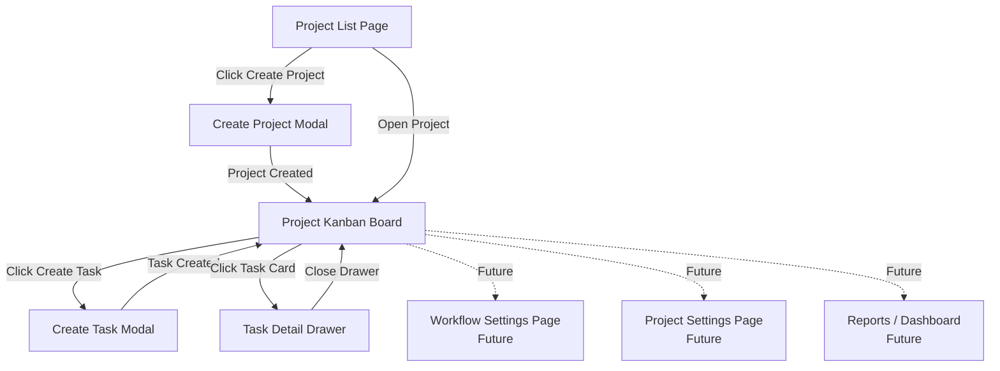
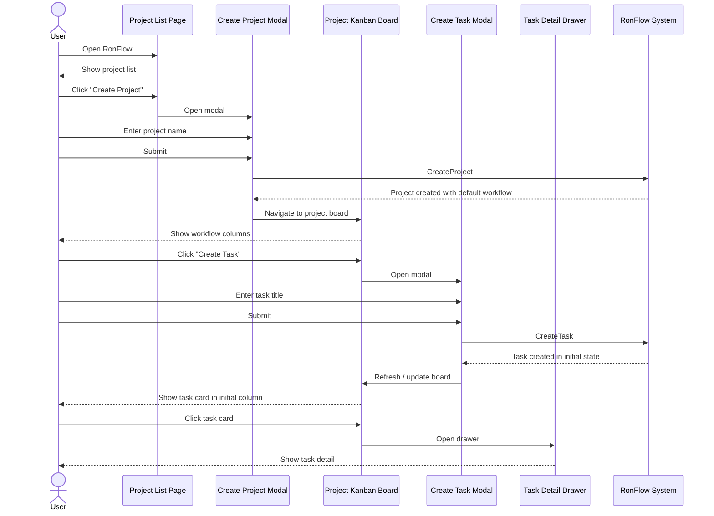
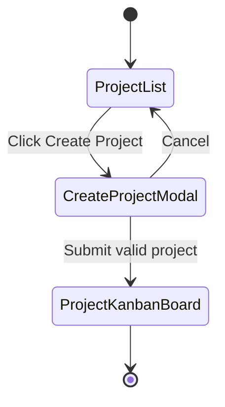
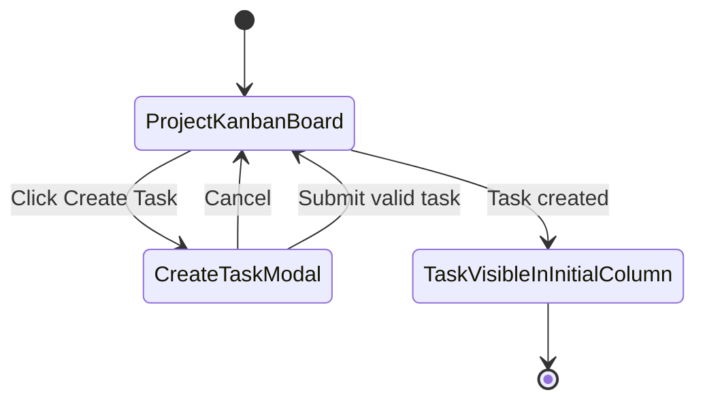
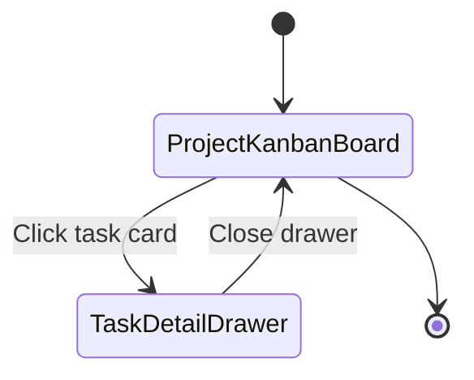
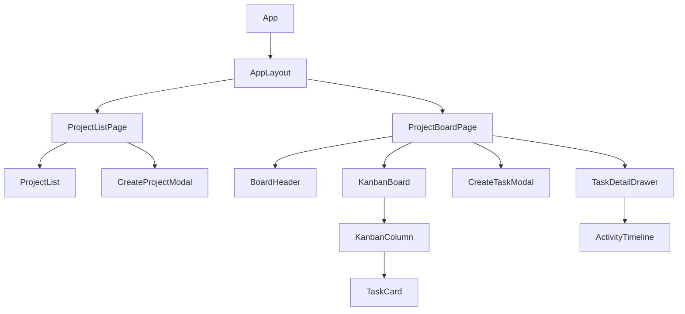
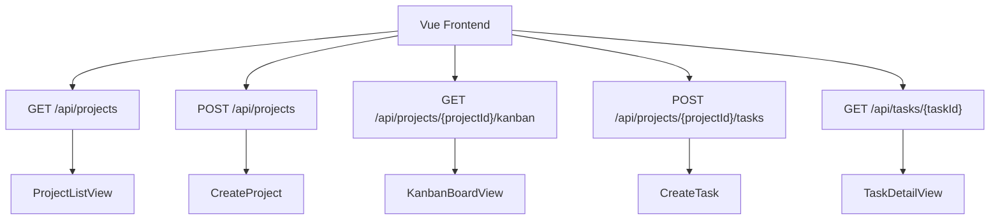

# RonFlow v0.1 UI / UX Flow 草案

## 1. 文件目的

本文件用來整理 RonFlow v0.1 的第一版 UI / UX 設計方向。

本階段不追求精美視覺設計，而是先釐清：

```text
1. 系統有哪些主要畫面
2. 使用者如何在畫面之間移動
3. 第一條 Vertical Slice 的操作流程
4. 每個畫面需要顯示哪些資訊
5. 後續 Gherkin / Playwright 驗收測試應如何對應
```

---

# 2. RonFlow v0.1 設計目標

RonFlow v0.1 的目標是：

> 使用者可以建立 Project，系統套用 Default Workflow，使用者進入 Project Kanban Board，建立 Task，並看到 Task 出現在 Workflow 的初始欄位。

第一條核心流程暫定為：

```text
Project List
→ Create Project
→ Project Kanban Board
→ Create Task
→ Task 出現在初始欄位
→ 開啟 Task Detail
```

---

# 3. v0.1 主要畫面清單

## 3.1 Main Screens

```text
1. Project List Page
2. Project Kanban Board
```

## 3.2 Secondary UI

```text
1. Create Project Modal
2. Create Task Modal
3. Task Detail Drawer
```

## 3.3 Future Screens

以下不納入第一條 Vertical Slice，但可留待 v0.1 後續或 v0.2：

```text
1. Workflow Settings Page
2. Project Settings Page
3. My Tasks Page
4. Urgent Tasks Page
5. Activity Dashboard
6. Sprint Board
7. Reports Page
```

---

# 4. System Map



---

# 5. First Vertical Slice

## 5.1 User Goal

使用者想要建立第一個專案，並在專案看板上建立第一個任務。

---

## 5.2 Flow Summary

```text
1. 使用者進入 Project List Page
2. 使用者點擊 Create Project
3. 系統開啟 Create Project Modal
4. 使用者輸入 Project Name
5. 使用者送出表單
6. 系統建立 Project
7. 系統套用 Default Workflow
8. 系統導向 Project Kanban Board
9. 使用者看到預設 Workflow 欄位
10. 使用者點擊 Create Task
11. 系統開啟 Create Task Modal
12. 使用者輸入 Task Title
13. 使用者送出表單
14. 系統建立 Task
15. Task 出現在 Workflow Initial State 欄位
16. 使用者點擊 Task Card
17. 系統開啟 Task Detail Drawer
```

---

## 5.3 Flow Diagram



---

# 6. Information Architecture

## 6.1 Project List Page

### Purpose

讓使用者看到目前已有的 Projects，並建立新的 Project。

### Display Data

```text
1. App name / logo
2. Project list
3. Project name
4. Project updated time
5. Create Project button
```

### Actions

```text
1. Create Project
2. Open Project
```

---

## 6.2 Create Project Modal

### Purpose

讓使用者建立一個新的 Project。

### Fields

```text
1. Project Name
```

### Actions

```text
1. Submit
2. Cancel
```

### Rules

```text
1. Project Name 不可為空
2. 建立成功後，系統套用 Default Workflow
3. 建立成功後，導向 Project Kanban Board
```

---

## 6.3 Project Kanban Board

### Purpose

讓使用者在 Project 中查看 Task，並依 WorkflowState 管理任務狀態。

### Display Data

```text
1. Project name
2. Create Task button
3. Workflow columns
4. Task cards
5. Task title
6. Assignee
7. Priority
8. Urgent marker
```

### Actions

```text
1. Create Task
2. Open Task Detail
3. Move Task State
```

第一條 Vertical Slice 暫時只要求：

```text
1. 顯示 workflow columns
2. 顯示 task card
3. 建立 task 後出現在 initial state column
```

拖曳或移動狀態可放到下一條 Vertical Slice。

---

## 6.4 Create Task Modal

### Purpose

讓使用者在 Project Kanban Board 中建立 Task。

### Fields

```text
1. Task Title
```

### Optional Fields for Later

```text
1. Description
2. Assignee
3. Priority
4. Urgent
```

### Actions

```text
1. Submit
2. Cancel
```

### Rules

```text
1. Task Title 不可為空
2. Task 必須屬於目前 Project
3. Task 建立後進入 Workflow.InitialState
4. Task 建立後顯示在 Kanban Board 的初始欄位
```

---

## 6.5 Task Detail Drawer

### Purpose

讓使用者查看 Task 的完整資訊。

### Display Data

```text
1. Task Title
2. Current State
3. Priority
4. Urgent
5. Assignee
6. CreatedAt
7. UpdatedAt
8. Activity Timeline
```

第一版可以先顯示基本資訊：

```text
1. Task Title
2. Current State
3. CreatedAt
```

Activity Timeline 可先顯示：

```text
1. Task created
```

---

# 7. Low-Fidelity Wireframes

## 7.1 Project List Page

```text
+----------------------------------------------------------------+
| RonFlow                                                        |
+----------------------------------------------------------------+
| Projects                                              [+ New]  |
+----------------------------------------------------------------+
|                                                                |
|  Project Name        Updated At                                |
|  ------------------------------------------------------------  |
|  RonFlow v0.1        2026-05-01                                |
|  Personal Board      2026-05-01                                |
|                                                                |
+----------------------------------------------------------------+
```

---

## 7.2 Create Project Modal

```text
+------------------------------------------+
| Create Project                           |
+------------------------------------------+
| Project Name                             |
| [ RonFlow v0.1                         ] |
|                                          |
|                         [Cancel] [Save] |
+------------------------------------------+
```

---

## 7.3 Project Kanban Board

```text
+--------------------------------------------------------------------------------+
| RonFlow / Project: RonFlow v0.1                                  [+ Create Task]|
+--------------------------------------------------------------------------------+
|                                                                                |
| Todo                 Active               Review               Done             |
| -------------------  -------------------  -------------------  --------------- |
| [Build Kanban Board]                                                            |
| Priority: 100                                                                  |
| Assignee: -                                                                    |
|                                                                                |
+--------------------------------------------------------------------------------+
```

---

## 7.4 Create Task Modal

```text
+------------------------------------------+
| Create Task                              |
+------------------------------------------+
| Task Title                               |
| [ Build Kanban Board                   ] |
|                                          |
|                         [Cancel] [Save] |
+------------------------------------------+
```

---

## 7.5 Task Detail Drawer

```text
                                      +----------------------------------+
                                      | Task Detail                      |
                                      +----------------------------------+
                                      | Title                            |
                                      | Build Kanban Board               |
                                      |                                  |
                                      | State                            |
                                      | Todo                             |
                                      |                                  |
                                      | Priority                         |
                                      | 100                              |
                                      |                                  |
                                      | Urgent                           |
                                      | No                               |
                                      |                                  |
                                      | Assignee                         |
                                      | -                                |
                                      |                                  |
                                      | Activity Timeline                |
                                      | - Task created                   |
                                      |                                  |
                                      |                         [Close]  |
                                      +----------------------------------+
```

---

# 8. UI State Transitions

## 8.1 Create Project



---

## 8.2 Create Task



---

## 8.3 Open Task Detail



---

# 9. Component Candidate Map

## 9.1 Frontend Components



---

## 9.2 Suggested Component Responsibilities

| Component | Responsibility |
|---|---|
| `ProjectListPage` | 顯示 Project 清單，控制 Create Project Modal |
| `CreateProjectModal` | 建立 Project 表單 |
| `ProjectBoardPage` | Project 看板主頁，載入 board data |
| `KanbanBoard` | 顯示所有 workflow columns |
| `KanbanColumn` | 顯示某個 state 下的 tasks |
| `TaskCard` | 顯示任務摘要 |
| `CreateTaskModal` | 建立 Task 表單 |
| `TaskDetailDrawer` | 顯示 Task 詳細資料 |
| `ActivityTimeline` | 顯示任務活動紀錄 |

---

# 10. API Candidate Map



---

# 11. First Playwright Test Target

第一個 Playwright 測試應該對應這條流程：

```text
使用者建立 Project，進入 Kanban Board，建立 Task，Task 出現在初始欄位。
```

建議測試名稱：

```text
user can create a project and create a task on kanban board
```

---

# 12. Gherkin Draft

```gherkin
Feature: Create task on kanban board

  Scenario: User creates a task in a new project
    Given the user is on the project list page
    When the user creates a project named "RonFlow v0.1"
    Then the user should be redirected to the project kanban board
    And the board should show the default workflow columns

    When the user creates a task titled "Build Kanban Board"
    Then the task should appear under the workflow initial state
    And the task should be visible on the kanban board

    When the user opens the task detail
    Then the task detail should show title "Build Kanban Board"
    And the task detail should show the current state as the workflow initial state
```

---

# 13. Acceptance Criteria

## 13.1 Create Project

```text
1. 使用者可以從 Project List Page 開啟 Create Project Modal。
2. 使用者輸入有效 Project Name 後，可以建立 Project。
3. Project 建立後，系統會套用 Default Workflow。
4. Project 建立後，使用者會進入 Project Kanban Board。
5. 若 Project Name 為空，系統應拒絕建立。
```

---

## 13.2 Project Kanban Board

```text
1. Project Kanban Board 應顯示 Project Name。
2. Project Kanban Board 應顯示 Default Workflow 的欄位。
3. 每個欄位應對應一個 WorkflowState。
4. InitialState 欄位應可顯示新建立的 Task。
```

---

## 13.3 Create Task

```text
1. 使用者可以從 Project Kanban Board 開啟 Create Task Modal。
2. 使用者輸入有效 Task Title 後，可以建立 Task。
3. Task 建立後，應屬於目前 Project。
4. Task 建立後，應進入 Workflow.InitialState。
5. Task 建立後，應顯示在 Kanban Board 的 initial state column。
6. 若 Task Title 為空，系統應拒絕建立。
```

---

## 13.4 Task Detail

```text
1. 使用者可以點擊 Task Card 開啟 Task Detail Drawer。
2. Task Detail Drawer 應顯示 Task Title。
3. Task Detail Drawer 應顯示 Task Current State。
4. Task Detail Drawer 應顯示基本 Activity Timeline。
```

---

# 14. Out of Scope for First Vertical Slice

以下功能不放進第一條 Vertical Slice：

```text
1. 拖曳 Task 到其他欄位
2. TaskCompleted
3. RejectTask
4. ReopenTask
5. ChangeTaskAssignee
6. ChangeTaskPriority
7. MarkTaskUrgent
8. UnmarkTaskUrgent
9. Workflow Settings
10. Project Settings
11. 完整 Activity Timeline
12. 權限管理
13. 登入 / 註冊
```

---

# 15. Open Questions

```text
1. Project 建立成功後，是否直接導向 Project Kanban Board？
   暫定：是。

2. Default Workflow 欄位名稱要使用哪一組？
   候選 A：Todo / Active / Review / Done
   候選 B：Backlog / Ready / Active / Review / Done

3. 第一條 Vertical Slice 是否包含 Task Detail Drawer？
   暫定：包含最簡版。

4. Create Task Modal 是否只需要 Title？
   暫定：是。

5. Task Card 第一版是否顯示 Priority / Assignee / Urgent？
   暫定：可以顯示 placeholder，但不支援修改。

6. 第一條 Playwright 是否測 Task Detail？
   暫定：可以測最基本的 title / state。
```

---

# 16. Suggested Next Step

完成本文件後，下一步是：

```text
1. 決定 Default Workflow 欄位名稱
2. 建立 Gherkin feature file
3. 建立第一個 Playwright spec
4. 讓 Playwright 測試先失敗
5. 從 UI shell 開始逐步實作
```

建議第一個開發目標：

```text
讓 Project List Page 出現，並顯示 Create Project 按鈕。
```
