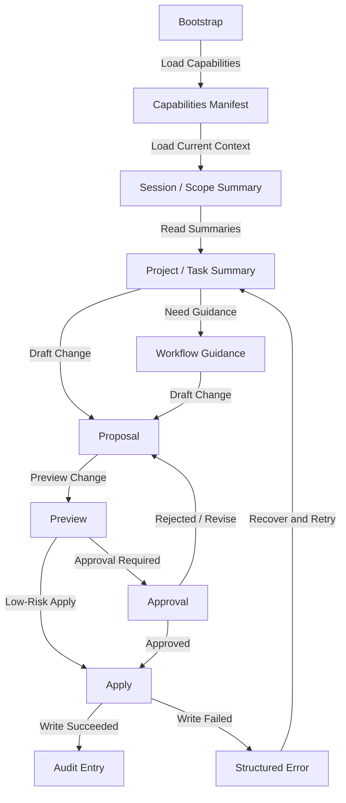

# RonFlow v0.3：讓 AI 可以順暢使用系統

## 1. 文件定位

本文件是 RonFlow v0.3 的 AI agent 專屬 spec，用來描述 AI actor 應如何發現、理解、查詢與操作 RonFlow。

這份文件的目標是：

1. 用 AI agent 可消化的方式描述 RonFlow 的 AI-facing interaction surface。
2. 作為 AI bootstrap、agent evaluation、產品討論與後續實作的共同對齊文件。
3. 作為 AI 專屬 acceptance / evaluation 的上游依據。
4. 讓 RonFlow 在不污染人類使用者 core flow spec 的前提下，仍能把 AI actor 的 intended behavior 寫清楚。

本文件不取代 `ronflow-core-flow-spec.md`。凡是屬於人類使用者的畫面、流程、角色差異與驗證方式，仍以 `ronflow-core-flow-spec.md` 為主；只有當 interaction surface 明確屬於 AI agent，且其操作方式已與人類使用者顯著不同時，才在本文件描述。

## Related Evaluation Baseline

這份 spec 對應的是 RonFlow v0.3 的 AI evaluation baseline。做 spec / agent evaluation 差異比對時，可優先從下列能力切面開始：

1. AI bootstrap：新的 AI agent 是否能在短 bootstrap 後知道 RonFlow 的存在、定位與基本工作原則。
2. capability discovery：AI 是否能知道有哪些 read / write / high-risk write 能力可用。
3. session / scope awareness：AI 是否能在進入工作前判斷目前 session 與 active scope。
4. read-first summary：AI 是否能在寫入前先理解 project、task、proposal 的摘要上下文。
5. proposal / preview / approval：AI 是否能在高風險操作前產生提案、預覽並等待批准。
6. structured error recovery：AI 是否能依錯誤碼與 recovery hint 決定下一步。
7. auditability：人類是否能追查 AI 做了什麼、為什麼做、是否經過批准。

這份對照是 v0.3 的主要驗收入口，不代表後續 evaluation coverage 已完整。實際評估進度時，仍應逐段比對 spec、agent evaluation 與實作是否一一承接。

---

## 2. v0.3 產品定位

RonFlow v0.3 定位為：

> 人類與 AI 都可以順暢使用的專案管理工具。

v0.1 解的是「個人可用」。

v0.2 解的是「多人協作可用」。

v0.3 要解的是：

```text
一個新的 AI agent，在拿到最小必要 bootstrap 後，能不能安全地讀取 RonFlow 的工作上下文、理解主要名詞、查詢目前狀態、提出下一步、並在批准後完成必要操作？
```

這代表 RonFlow 從「給人用的工具」往前走一步，變成「人與 AI 都能共享的工作系統」。

### 2.1 AI Actor 定義

本文件中的 AI agent 指的是：

```text
1. 一個可被識別、可被審計、可被約束的 RonFlow actor。
2. 它可以代表特定人類使用者工作，也可以是獨立的 AI actor identity。
3. 它與人類使用者共享同一套 domain truth，但不共享相同的 interaction surface。
4. 它不得繞過 authentication、authorization、session、scope 與 approval 規則。
```

### 2.2 v0.3 核心判斷標準

RonFlow v0.3 是否完成，應以以下問題判斷：

```text
一個新的 AI agent，在沒有讀完整份核心 spec 的前提下，是否能憑藉 RonFlow 提供的 bootstrap、能力清單、摘要查詢與 proposal / approval flow，順利接手目前工作並避免高風險誤操作？
```

也就是說，v0.3 至少應讓 AI 可以完成以下事情：

```text
1. 知道 RonFlow 的存在、定位與基本使用原則
2. 知道目前有哪些可用操作，而不是靠猜 API 或猜 UI
3. 知道主要領域名詞與它們之間的關係
4. 在寫入前先讀取目前 project / task / session / scope 的摘要
5. 提出變更提案，並在需要時等待人類批准
6. 執行單筆或小範圍變更，且能回報結果與影響
7. 在失敗時看懂錯誤原因，知道該重試、修正參數，還是回頭問人
8. 讓人類可以追查「哪個 AI 在什麼上下文下做了什麼事」
```

---

## 3. 文件使用原則

閱讀與維護本文件時，採以下原則：

1. 內容描述的是 RonFlow 對 AI actor 的 intended behavior，而不是某個 AI agent 暫時剛好做得到什麼。
2. 若 AI interaction surface、approval policy、summary contract 或驗收方式改變，應直接更新本文件。
3. 若某能力尚未實作但已決定納入 v0.3，應先寫入本文件，並據此安排 evaluation 與實作。
4. 若某能力只是版本探索中的選項或暫存設計，不應留在本文件，應移到其他討論文件。
5. 本文件描述可驗證的 AI 行為，但不規定必須由 agent evaluation、integration test、manual rehearsal 或其他方式承接。
6. 與 Project、Task、Workflow State、Lifecycle State、ownership、authorization 等共享 domain truth 相關的產品定義，仍以 `ronflow-core-flow-spec.md` 為主；本文件只補 AI actor 專屬規則。
7. 本文件不應把 AI prompt 視為唯一產品契約；真正的系統能力仍應由正式 contract、policy 與 audit 機制承擔。

---

## 4. 核心功能範圍

本文件描述 RonFlow v0.3 中 AI actor 應具備的成品行為如下：

```text
1. AI 可以透過 bootstrap 知道 RonFlow 的存在與基本工作原則
2. AI 可以查詢 capabilities manifest，知道有哪些可用操作
3. AI 可以讀取 AI 專用 glossary，理解核心領域名詞
4. AI 可以查詢目前 session 是否有效、是否已 activate、目前 active scope 是什麼
5. AI 可以在進入工作前，讀取 project / task / proposal 的摘要資訊
6. AI 可以針對高風險變更先建立 proposal 與 preview
7. AI 可以等待明確 approval，再執行高風險寫入
8. AI 可以在低風險條件下完成小範圍、可歸責的直接寫入
9. AI 可以收到結構化錯誤與 recovery hint
10. 系統會記錄 AI 的操作意圖、批准鏈與實際變更結果
11. AI 可以讀取 workflow guidance，知道 RonFlow 期待的工作方式
12. AI 不得繞過 core flow spec 中已定義的 domain 規則、ownership 邊界與 authorization 規則
```

### 4.1 AI Actor 與 Interaction Surface 前提

```text
1. RonFlow v0.3 同時承認兩種歧異度明顯不同的 actor：human user 與 AI agent。
2. human user 相關 flow 仍以 `ronflow-core-flow-spec.md` 為主。
3. AI agent 相關 flow 以本文件為主，並透過 bootstrap、manifest、summary query、proposal / approval、audit trail 等 interaction surface 完成工作。
4. AI agent 不應被期待用與人類完全相同的 UI 操作路徑去驗證所有規格。
5. AI agent 的 interaction surface 仍必須與 RonFlow 的 domain truth 對齊，不得形成另一套平行規則。
```

### 4.2 身分、資料邊界與批准前提

```text
1. AI agent 必須以可識別的 actor identity 進入 RonFlow，不得匿名操作。
2. AI agent 的每次讀取與寫入，都應能追溯 actor type、actor identity，以及若存在 delegation 時的上游授權來源。
3. AI agent 可讀取與操作的資料範圍，仍應以目前有效的身份、權限與 project scope 為準。
4. 若 AI agent 不是該 Project 的 Owner、Member，或不具對應授權，系統應拒絕其讀寫請求。
5. AI agent 不得透過 prompt 或 workflow guidance 取得超出正式 policy 的權限。
6. 對高風險寫入，系統應要求 explicit approval；approval 是正式產品行為，不是聊天中的默契。
7. AI agent 的寫入結果必須可審計，且可回溯其依據的 proposal、approval 與作用範圍。
```

### 4.3 v0.3 Included

```text
1. AI bootstrap
2. AI 專用 glossary / ubiquitous language
3. 可發現的 capabilities manifest
4. session / scope awareness
5. read-first 的摘要查詢
6. proposal / preview / approval 工作流
7. 低風險直接寫入與高風險受控寫入
8. 結構化且可恢復的錯誤語意
9. AI 操作審計與 explainability
10. 第一批 AI-native workflow guidance
```

### 4.4 v0.3 Excluded

```text
1. 讓 AI 必須透過視覺辨識人類 UI 才能使用 RonFlow
2. 讓 AI 在沒有 bootstrap 與 manifest 的前提下自行猜測所有能力
3. 全自動、無人批准的大範圍資料修改
4. 用 prompt 取代正式 contract、policy 與 audit trail
5. 把所有人類 flow 與 AI flow 強制塞進同一份細節規格中
```

---

## 5. Ubiquitous Language 對照表

### 5.1 用語使用原則

```text
1. 與 Project、Task、Workflow State、Lifecycle State 相關的核心名詞，沿用 core flow spec 的定義。
2. AI 專用 interaction surface 的工程用語可保留英文，例如 bootstrap、manifest、proposal、approval、audit entry。
3. 若同一概念在 human flow 與 AI flow 中都存在，應盡量共用同一個 domain term，避免形成雙重語彙。
4. 若某名詞只在 AI interaction surface 中存在，應在本對照表中定義其責任與邊界。
```

### 5.2 用語對照

| Concept | 工程/規格用語 | AI 可見用語 | 說明 |
|---|---|---|---|
| AI 代理 | AI Agent | AI agent | 可被識別、可被審計的 RonFlow actor。 |
| Actor 類型 | Actor Type | actor type | 至少區分 human 與 AI。 |
| 啟動資訊 | Bootstrap | bootstrap | AI 進入 RonFlow 時的最小必要說明。 |
| 能力清單 | Capabilities Manifest | capabilities manifest | 描述 AI 可用 read / write 能力與前置條件的契約。 |
| 能力項目 | Capability | capability | manifest 中的一個可用操作單位。 |
| 工作摘要 | Summary Query | summary | 讓 AI 低成本理解上下文的查詢結果。 |
| 啟用中的範圍 | Active Scope | active scope | AI 目前聚焦的 Project 或其他工作範圍。 |
| 工作提案 | Proposal | proposal | AI 預計執行的變更意圖與理由。 |
| 變更預覽 | Preview | preview | 系統根據 proposal 算出的實際影響。 |
| 批准 | Approval | approval | 人類對高風險提案的正式同意。 |
| 套用 | Apply | apply | 把已確認的變更正式寫入系統。 |
| 恢復提示 | Recovery Hint | recovery hint | 發生錯誤後系統建議 AI 採取的下一步。 |
| 審計紀錄項目 | Audit Entry | audit entry | 記錄 AI 行為、理由、批准鏈與結果的紀錄單位。 |
| 工作指引 | Workflow Guidance | workflow guidance | 告訴 AI 在 RonFlow 中應如何遵循既有工作方式。 |
| 高風險寫入 | High-Risk Write | high-risk write | 需要 explicit approval 才能執行的變更。 |
| 低風險寫入 | Low-Risk Write | low-risk write | 在明確條件下可直接執行的小範圍寫入。 |

---

## 6. AI Agent Core Flow

### 6.1 Flow Summary

前提：

```text
1. AI agent 已取得 RonFlow bootstrap 或等價入口。
2. AI agent 具備可識別的 actor identity，且目前 session 為有效狀態。
3. AI agent 若要進入某個 Project 或工作範圍，需先知道目前 active scope 或能請求切換 scope。
4. 與 Project、Task、ownership、authorization 有關的核心規則，沿用 core flow spec。
```

```text
1. AI agent 收到與工作管理相關的任務
2. AI 先讀取 bootstrap，確認 RonFlow 是可使用的工作系統
3. AI 讀取 capabilities manifest 與 AI glossary
4. AI 查詢目前 session / active scope 摘要
5. AI 讀取 project、task、proposal 或 workflow guidance 的摘要資訊
6. AI 判斷下一步是繼續查詢、建立 proposal，還是執行低風險直接寫入
7. 若操作屬於高風險，AI 先建立 proposal，並要求 preview
8. 系統回傳 preview，列出實際會影響的欄位、task、scope 與風險等級
9. 若該 proposal 需要 approval，AI 等待明確批准
10. 批准後，AI 執行 apply
11. 系統回傳結果、差異、audit entry 與必要的 recovery hint
12. 若操作失敗，AI 應依錯誤碼決定補參數、重試、改成 proposal，或回頭詢問人類
```

### 6.2 Flow Map

Flow Map 應同時呈現 AI agent 的操作與系統回應；若某步驟只是在同一 interaction surface 中補充資訊，則以目前節點的自我指涉表示。



---

## 7. Interaction Surface Spec

### 7.1 AI Bootstrap

**Purpose**

讓新的 AI agent 在不讀完整份 core flow spec 的前提下，知道 RonFlow 是什麼、何時該使用它，以及第一步應去哪裡讀更多資訊。

**Content Requirements**

```text
1. RonFlow 是什麼
2. RonFlow 主要處理哪些工作物件（project / board / task / session / scope）
3. AI 的基本工作原則：先讀後寫、先摘要後深入、遇高風險操作先提案
4. 可用能力入口：capabilities manifest、glossary、workflow guidance、summary query
5. 明確 escalation 規則：哪些情況必須先問人
```

**Expected Behavior**

```text
1. AI 讀完 bootstrap 後，應知道 RonFlow 是可被使用的工作系統，而不是只把工作散落在聊天內容中。
2. AI 讀完 bootstrap 後，應知道自己應先讀 manifest / glossary / summary，而不是直接進行寫入。
3. bootstrap 應足夠短，讓新的 AI agent 可以快速載入；不應變成完整產品手冊。
4. bootstrap 應明確指出高風險操作需要 proposal / approval。
```

**State Handling / Feedback**

```text
1. 若 bootstrap 版本已過期，系統應能讓 AI 知道還有更新版本可讀。
2. 若 bootstrap 提到的能力入口目前不可用，系統應回傳可理解的 fallback 訊息，而不是讓 AI 猜測替代路徑。
```

**Testability**

```text
1. 新的 AI agent 應能僅靠 bootstrap 找到 manifest、summary 與 guidance 入口。
2. 測試不應要求 AI 先讀完整份 core flow spec 才能開始操作。
```

**Related Rules**

1. [Bootstrap 規則](#bootstrap-rules)

**Gherkin Draft**

```gherkin
Feature: AI bootstrap

	Scenario: 新的 AI agent 透過 bootstrap 知道如何開始
		Given 一個新的 AI agent 尚未讀取 RonFlow 的其他規格
		When AI 讀取 RonFlow bootstrap
		Then AI 應知道 RonFlow 是可被使用的工作系統
		And AI 應知道下一步應先查 capabilities manifest 或 summary query
```

### 7.2 Capabilities Manifest

**Purpose**

讓 AI 可以發現 RonFlow 目前有哪些可用能力，而不是靠猜 API、猜畫面或猜欄位。

**Contract Fields**

```text
1. capability id
2. capability name
3. capability purpose
4. risk level（read / low-risk write / high-risk write）
5. prerequisites
6. required inputs
7. expected output shape
8. possible error codes
9. 是否需要 active scope
10. 是否需要 approval
```

**Expected Behavior**

```text
1. AI 應能從 manifest 看出目前有哪些 read / write 能力可用。
2. AI 應能從 manifest 知道某能力是否需要 active scope、approval 或額外前置條件。
3. manifest 不應把多個能力混成模糊敘述；每個 capability 應有穩定識別方式。
4. 若某能力暫時停用，manifest 應能明確表達其不可用狀態。
```

**State Handling / Feedback**

```text
1. 當能力版本變更時，manifest 應能讓 AI 看出目前版本與已廢棄能力。
2. 若 AI 嘗試使用 manifest 中不存在的 capability，系統應回傳明確錯誤，而不是靜默失敗。
```

**Testability**

```text
1. 測試應能驗證 AI 不靠猜測，也能發現目標能力。
2. 測試應能驗證 manifest 是否正確揭露 risk level、prerequisites 與 errors。
```

**Related Rules**

1. [Manifest 規則](#manifest-rules)

**Gherkin Draft**

```gherkin
Feature: Capabilities manifest

	Scenario: AI 從 manifest 發現某個寫入能力需要 approval
		Given AI 已載入 RonFlow capabilities manifest
		When AI 查看某個 high-risk write capability
		Then manifest 應標示該能力需要 approval
		And manifest 應列出必要前置條件與可能錯誤碼
```

### 7.3 Session / Scope Awareness

**Purpose**

讓 AI 在真正開始工作前，知道自己目前是否具有有效 session、是否已 activate，以及目前 active scope 是什麼。

**Display / Output**

```text
1. session status
2. actor identity
3. actor type
4. active scope
5. available scopes 或可請求的 scope
6. session invalidation 或 approval blocking 狀態
```

**Expected Behavior**

```text
1. AI 應能在工作開始前查到目前 session 是否有效。
2. AI 若尚未有 active scope，系統應明確指出，而不是默默套用錯誤的預設範圍。
3. AI 應能明確請求 activate 某個 scope，並能知道 scope 切換結果。
4. 當 session 已失效時，系統應阻止後續寫入與需要 scope 的讀取。
```

**State Handling / Feedback**

```text
1. 若 session 已失效，系統應回傳 session invalidated 類型訊號，而不是 generic unauthorized。
2. 若 scope 不存在、不可達或 actor 無權進入，系統應回傳對應錯誤與 recovery hint。
3. 若 AI 已離開某個 scope，系統應可反映 active scope 已釋放。
```

**Testability**

```text
1. 測試應能驗證 AI 在沒有 active scope 時，不會誤以為自己已在某個 Project 中。
2. 測試應能驗證失效 session 下的寫入會被阻止。
```

**Related Rules**

1. [Session 與 Scope 規則](#session-scope-rules)

**Gherkin Draft**

```gherkin
Feature: Session and scope awareness

	Scenario: AI 在沒有 active scope 時查詢工作上下文
		Given AI 具有有效 session
		And AI 目前沒有 active scope
		When AI 查詢 session / scope summary
		Then 系統應明確回傳目前沒有 active scope
		And 系統不應假設任何預設 Project
```

### 7.4 Read-First Summary Query

**Purpose**

讓 AI 在寫入前，先以低 token 成本理解目前工作上下文。

**Supported Summary Types**

```text
1. workspace / project summary
2. task summary
3. proposal summary
4. approval summary
5. audit summary
6. workflow guidance summary
```

**Expected Behavior**

```text
1. summary 回應應優先提供目前狀態、最近活動、下一步與限制，而不是把所有原始資料完整展開。
2. AI 應能從 summary 快速知道目前有哪些 open tasks、in-progress tasks、blocked tasks。
3. AI 應能從 task summary 知道目前狀態、最近活動、是否已有未完成 proposal 或 approval。
4. 若查詢需要 active scope，系統應先驗證 scope，再回傳 summary。
```

**State Handling / Feedback**

```text
1. 若 summary 的依據資料已過期或 scope 已切換，系統應能讓 AI 看出資料新鮮度與適用範圍。
2. 若目標資源不存在，系統應回傳 ResourceNotFound，而不是空白成功回應。
```

**Testability**

```text
1. 測試應能驗證 AI 在寫入前，能只靠 summary 理解上下文。
2. 測試應能驗證 summary 的輸出足夠精簡，但仍包含下一步判斷所需資訊。
```

**Related Rules**

1. [Summary Query 規則](#summary-query-rules)

**Gherkin Draft**

```gherkin
Feature: Read-first summary query

	Scenario: AI 在寫入前先讀取 task summary
		Given AI 已進入某個有效的 Project scope
		And 目前存在一筆 Task
		When AI 讀取該 Task 的 summary
		Then 回應應包含目前狀態、最近活動與下一步限制
		And 回應不應只是整筆原始資料的無差別展開
```

### 7.5 Proposal / Preview / Approval

**Purpose**

讓 AI 在高風險操作前，先提出變更意圖，再由系統計算實際影響，並由人類進行正式批准。

**Contract Elements**

```text
1. proposal intent
2. target object / target scope
3. requested change
4. rationale
5. risk level
6. preview diff
7. approval status
8. rejection / revision reason
```

**Expected Behavior**

```text
1. proposal 應能記錄 AI 想做什麼、為什麼做、預計影響哪個範圍。
2. preview 應顯示實際會改哪些欄位、哪些 task、哪些 scope，而不是只重述 proposal。
3. 若操作屬於 high-risk write，preview 後應要求 approval，不能直接 apply。
4. 人類可以 approve、reject 或要求 revise proposal。
5. proposal 應可辨識自己是否已過期、已被較新 proposal 取代，或不再適用於當前資料狀態。
```

**State Handling / Feedback**

```text
1. 若 preview 階段發現資料已變動，系統應阻止舊 proposal 直接 apply。
2. 若 approval 已過期、被撤回或 scope 已改變，apply 應被拒絕。
3. 若 proposal 被 reject，系統應保留 rejection reason，供 AI revise。
```

**Testability**

```text
1. 測試應能驗證高風險變更會先經過 proposal / preview / approval。
2. 測試應能驗證 preview 與實際 apply 結果一致。
```

**Related Rules**

1. [Proposal 與 Approval 規則](#proposal-approval-rules)

**Gherkin Draft**

```gherkin
Feature: Proposal preview approval

	Scenario: AI 針對高風險操作建立 proposal 並等待批准
		Given AI 已讀取目標 scope 與 task 的摘要
		When AI 針對高風險變更建立 proposal
		Then 系統應產生 preview
		And 系統應要求 explicit approval
		And 在 approval 前不得直接 apply
```

### 7.6 Apply Operation

**Purpose**

讓 AI 在低風險條件下直接寫入，或在高風險條件下依據已批准的 proposal 正式套用變更。

**Expected Behavior**

```text
1. apply 前，系統應再次驗證 session、scope、權限、資料新鮮度與 approval 狀態。
2. low-risk write 可在明確條件下直接 apply，但仍需留下 audit entry。
3. high-risk write 若無對應 approval，不得 apply。
4. apply 成功後，系統應回傳實際變更結果、差異摘要與對應 audit entry。
5. 若 apply 失敗，系統應回傳結構化錯誤與 recovery hint。
```

**State Handling / Feedback**

```text
1. 若 apply 時資料已變更，系統應回傳 stale / conflict 類型錯誤，而不是悄悄覆蓋。
2. 若 apply 成功，但部分副作用仍待後續處理，系統應區分主要變更成功與後續處理狀態。
```

**Testability**

```text
1. 測試應能驗證 low-risk write 與 high-risk write 的 apply 條件不同。
2. 測試應能驗證 apply 回應中有可追蹤的 diff 與 audit id。
```

**Related Rules**

1. [Apply 規則](#apply-rules)

**Gherkin Draft**

```gherkin
Feature: Apply operation

	Scenario: AI 套用已批准的 proposal
		Given AI 已取得一筆已批准且仍有效的 proposal
		When AI 執行 apply
		Then 系統應正式寫入變更
		And 系統應回傳變更結果與 audit entry
```

### 7.7 Structured Errors and Recovery

**Purpose**

讓 AI 在操作失敗時，知道錯在哪裡，以及接下來應採取什麼恢復動作。

**Error Types**

```text
1. Unauthorized
2. Forbidden
3. SessionNotActivated
4. ScopeRequired
5. ValidationFailed
6. InvalidStateTransition
7. ConcurrencyConflict
8. ApprovalRequired
9. ResourceNotFound
10. ProposalStale
11. ApprovalExpired
```

**Expected Behavior**

```text
1. 每個錯誤都應有 machine-readable code。
2. 每個錯誤都應有 human-readable message。
3. 每個錯誤都應帶 recovery hint，讓 AI 知道應補參數、改切 scope、重新讀 summary、改成 proposal，或回頭問人。
4. 系統不應把不同類型的失敗都壓成 generic bad request。
```

**State Handling / Feedback**

```text
1. 若錯誤與權限、批准或 scope 有關，recovery hint 不應建議 AI 繞過正式規則。
2. 若錯誤與 stale data 有關，recovery hint 應明確要求重新讀 summary 或重新產生 preview。
```

**Testability**

```text
1. 測試應能驗證 AI 是否能依錯誤碼選擇合理的下一步。
2. 測試應能驗證不同失敗情境是否真的回傳不同 error code。
```

**Related Rules**

1. [Error 與 Recovery 規則](#error-recovery-rules)

**Gherkin Draft**

```gherkin
Feature: Structured errors and recovery

	Scenario: AI 使用過期 approval 套用變更
		Given AI 持有一筆已過期的 approval
		When AI 執行 apply
		Then 系統應回傳 ApprovalExpired
		And 回應應包含 recovery hint，提示 AI 重新取得有效 approval
```

### 7.8 Audit Trail and Explainability

**Purpose**

讓人類可以追查 AI 做了什麼、為什麼做、是否經過批准，以及變更結果是什麼。

**Audit Fields**

```text
1. actor type
2. actor identity
3. delegated-by / sponsor（若存在）
4. timestamp
5. target object / target scope
6. proposal reference
7. approval reference
8. requested change
9. actual diff
10. result status
11. recovery note（若失敗）
```

**Expected Behavior**

```text
1. AI 的每次寫入都應留下 audit entry。
2. 重要的 read-to-write 決策鏈，至少應能追溯到對應 proposal / approval。
3. 人類應能從 audit entry 看出 AI 的行動理由與結果，不需再回頭讀整段對話。
4. audit entry 不應只記錄「成功 / 失敗」，而應保留必要上下文。
```

**State Handling / Feedback**

```text
1. 若某次操作失敗，audit entry 仍應保留失敗原因與 recovery note。
2. 若某次 apply 為低風險直接寫入，audit entry 應標示其未經 approval 的原因，例如 risk level 為 low-risk。
```

**Testability**

```text
1. 測試應能驗證每次 AI 寫入都會產生可查詢的 audit entry。
2. 測試應能驗證 audit entry 是否足以重建 proposal / approval 鏈。
```

**Related Rules**

1. [Audit 規則](#audit-rules)

**Gherkin Draft**

```gherkin
Feature: Audit trail for AI actions

	Scenario: AI 完成一筆已批准的高風險寫入
		Given AI 已成功套用一筆已批准的 proposal
		Then 系統應建立 audit entry
		And audit entry 應包含 actor identity、proposal reference、approval reference 與 actual diff
```

### 7.9 Workflow Guidance

**Purpose**

讓 AI 知道 RonFlow 期待的工作方式，而不是只知道某個 API 可不可以呼叫。

**Display / Output**

```text
1. 目前建議的工作順序
2. 在 RonFlow 中該先讀什麼、先提案什麼、先驗證什麼
3. 高風險操作的 escalation 原則
4. 與 spec-first / acceptance-first workflow 對齊的建議
```

**Expected Behavior**

```text
1. workflow guidance 應幫助 AI 遵循 RonFlow 的工作文化，而不是繞過它。
2. guidance 應偏向規範工作順序與判斷原則，不應取代正式權限與 contract。
3. AI 應能從 guidance 理解何時該先整理 spec、何時該先建立 proposal、何時該先讀摘要。
```

**State Handling / Feedback**

```text
1. 若 guidance 與正式 contract 發生衝突，應以正式 contract 為準。
2. 若 guidance 已過期，系統應能區分它是建議資訊，而不是執行時事實來源。
```

**Testability**

```text
1. 測試應能驗證 AI 是否能依 guidance 採用正確工作順序。
2. 測試應能驗證 guidance 不會讓 AI 繞過正式規則。
```

**Related Rules**

1. [Workflow Guidance 規則](#workflow-guidance-rules)

**Gherkin Draft**

```gherkin
Feature: Workflow guidance

	Scenario: AI 透過 workflow guidance 知道先讀後寫
		Given AI 已進入 RonFlow 的 AI interaction surface
		When AI 讀取 workflow guidance
		Then guidance 應告知 AI 先讀摘要、再決定 proposal 或 apply
		And guidance 不應允許 AI 跳過 approval 規則
```

---

## 8. 驗證與規則

<a id="shared-domain-alignment-rules"></a>

### 8.0 Shared Domain Alignment 規則

```text
1. 與 Project、Task、Workflow State、Lifecycle State、ownership、authorization 有關的核心產品真相，沿用 core flow spec。
2. AI spec 不得定義另一套與 core flow spec 相互衝突的 domain 規則。
3. AI actor 可以有不同 interaction surface，但不得因此繞過 core flow spec 中已存在的資料邊界與產品限制。
```

<a id="bootstrap-rules"></a>

### 8.1 Bootstrap 規則

```text
1. bootstrap 必須短小、可快速載入。
2. bootstrap 必須告訴 AI：RonFlow 是什麼、何時該使用它、下一步去哪裡查更多資訊。
3. bootstrap 不應塞入完整 API 或完整 domain 細節。
4. bootstrap 必須明確指出高風險操作需要 proposal / approval。
```

<a id="manifest-rules"></a>

### 8.2 Manifest 規則

```text
1. capabilities manifest 必須穩定揭露 read / write / high-risk write 的能力差異。
2. 每個 capability 都必須有穩定識別方式、前置條件、輸入、輸出與錯誤碼。
3. manifest 不得依賴 AI 自己猜測風險等級。
4. 停用或廢棄的能力，必須在 manifest 中明確標示。
```

<a id="session-scope-rules"></a>

### 8.3 Session 與 Scope 規則

```text
1. AI actor 必須在有效 session 下工作。
2. 需要 scope 的查詢與寫入，必須先確認 active scope。
3. 若目前沒有 active scope，系統應明確回應，而不是偷偷猜一個預設範圍。
4. session 失效後，AI 不得再執行需要有效 session 的操作。
```

<a id="summary-query-rules"></a>

### 8.4 Summary Query 規則

```text
1. AI 在寫入前，應先讀取對應 summary。
2. summary 應優先提供目前狀態、限制、最近活動與下一步，而不是無差別輸出全部資料。
3. summary 應標示資料適用範圍與新鮮度。
4. summary 不應在資源不存在時回傳模糊成功結果。
```

<a id="proposal-approval-rules"></a>

### 8.5 Proposal 與 Approval 規則

```text
1. high-risk write 預設必須先經過 proposal、preview 與 approval。
2. proposal 必須描述目標範圍、預計變更與理由。
3. preview 必須描述實際影響，而不是只重述 proposal。
4. approval 必須是正式、可追溯的產品狀態，而不是對話中的默契。
5. proposal、preview、approval 任一項過期或失效，都不應允許直接 apply。
```

<a id="apply-rules"></a>

### 8.6 Apply 規則

```text
1. apply 前必須再次驗證 session、scope、權限、資料新鮮度與 approval 狀態。
2. low-risk write 可直接 apply，但仍需留下 audit entry。
3. high-risk write 沒有有效 approval 時不得 apply。
4. apply 不得靜默覆蓋 stale data 或 concurrency conflict。
```

<a id="error-recovery-rules"></a>

### 8.7 Error 與 Recovery 規則

```text
1. 系統必須回傳 machine-readable error code。
2. 系統必須回傳 human-readable message 與 recovery hint。
3. 權限、批准、scope、stale data、validation 等不同失敗類型，不得全部壓成 generic bad request。
4. recovery hint 不得鼓勵 AI 繞過正式規則。
```

<a id="audit-rules"></a>

### 8.8 Audit 規則

```text
1. AI 的每次寫入必須留下 audit entry。
2. audit entry 必須可追溯 actor type、actor identity、target、理由、批准鏈與實際結果。
3. 失敗的寫入也必須留下足夠資訊，供人類追查。
4. audit entry 不應只記錄成功 / 失敗，而應保留必要上下文。
```

<a id="workflow-guidance-rules"></a>

### 8.9 Workflow Guidance 規則

```text
1. workflow guidance 的責任是引導 AI 採用正確工作順序，而不是取代正式 contract。
2. workflow guidance 不得賦予 AI 額外權限。
3. workflow guidance 應與 RonFlow 的 spec-first / acceptance-first workflow 對齊。
```

---

## 9. Acceptance Criteria

### 9.0 Discover RonFlow Through Bootstrap

```text
1. 新的 AI agent 可以只靠 bootstrap 知道 RonFlow 是可被使用的工作系統。
2. AI 讀完 bootstrap 後，知道下一步要查 manifest、summary query 與 workflow guidance。
3. bootstrap 會明確告知高風險變更需要 proposal / approval。
```

### 9.1 Discover Capabilities From Manifest

```text
1. AI 可以從 manifest 找到目前可用的 read、low-risk write 與 high-risk write。
2. manifest 會明確標示 capability 的前置條件、輸入、輸出與錯誤碼。
3. manifest 會明確標示是否需要 active scope 與 approval。
```

### 9.2 Understand Session And Scope Before Work

```text
1. AI 可以查到目前 session 是否有效。
2. AI 可以查到目前是否已有 active scope。
3. 若沒有 active scope，系統會明確回覆，而不會默默猜測預設 Project。
4. session 失效時，AI 不得繼續執行需要有效 session 的操作。
```

### 9.3 Read Summary Before Write

```text
1. AI 可以在寫入前讀取 project / task / proposal 的摘要資訊。
2. summary 回應應包含目前狀態、最近活動、限制與下一步。
3. summary 應足夠精簡，不應只是完整原始資料的機械展開。
```

### 9.4 Create Proposal And Preview High-Risk Change

```text
1. AI 可以針對高風險操作建立 proposal。
2. 系統可以回傳對應 preview，指出實際受影響的欄位、task 與 scope。
3. preview 若與 proposal 或當前資料狀態不一致，系統應阻止直接 apply。
```

### 9.5 Require Approval For High-Risk Write

```text
1. high-risk write 在沒有有效 approval 前不得 apply。
2. approval 必須是正式產品狀態，可被拒絕、撤回或過期。
3. approval 失效後，舊 proposal 不得繼續直接 apply。
```

### 9.6 Apply Low-Risk And Approved Changes Safely

```text
1. AI 可以在 low-risk 條件下完成小範圍直接寫入。
2. AI 可以在已批准條件下 apply high-risk write。
3. apply 成功後，系統應回傳實際結果、差異與 audit entry。
4. apply 不得靜默覆蓋 stale data 或 concurrency conflict。
```

### 9.7 Recover From Structured Errors

```text
1. AI 操作失敗時，系統應回傳 machine-readable error code。
2. 回應應包含 human-readable message 與 recovery hint。
3. AI 可以根據不同錯誤型別，決定補參數、重讀 summary、重做 preview、切換 scope，或回頭詢問人類。
```

### 9.8 Audit AI Actions End-To-End

```text
1. AI 的每次寫入都會產生可查詢的 audit entry。
2. audit entry 應包含 actor identity、目標範圍、proposal / approval reference 與實際 diff。
3. 人類可以只讀 audit entry，就理解這次 AI 行動做了什麼與為什麼做。
```

### 9.9 Follow Workflow Guidance

```text
1. AI 可以透過 workflow guidance 理解 RonFlow 期待的工作順序。
2. workflow guidance 會強化先讀後寫、先提案後高風險寫入的工作方式。
3. workflow guidance 不會讓 AI 繞過正式規則。
```

---

## 10. v0.3 交付物

RonFlow v0.3 至少應交付以下產物：

```text
1. 一份 AI bootstrap 文件或等價入口
2. 一份 capabilities manifest
3. 一份 AI 專用 glossary / ubiquitous language 文件
4. 一組 session / scope awareness contract
5. 一組 read-first summary 查詢能力
6. 一組 proposal / preview / approval contract
7. 一組 low-risk apply 與 high-risk apply 規則
8. 一組 structured error / recovery contract
9. 一組 AI action audit trail 設計
10. 一份對應的 acceptance / evaluation checklist
```

---

## 11. 驗收問題清單

v0.3 驗收時，至少應能回答以下問題：

```text
1. 新的 AI agent 是否能在短 bootstrap 後找到 RonFlow 的正確入口？
2. AI 是否能在不讀完整份 core spec 的前提下，查到自己需要的能力與名詞定義？
3. AI 是否能先用摘要查詢理解上下文，而不是直接進行寫入？
4. AI 在高風險操作前，是否會被導向 proposal / preview / approval 流程？
5. AI 是否能區分 low-risk write 與 high-risk write 的 apply 條件？
6. AI 操作失敗時，是否能依結構化錯誤找到下一步？
7. 人類是否能追查 AI 做了哪些操作、為什麼做、是否經過批准？
```

若這些問題仍無法回答「是」，就代表 RonFlow 還沒有真正到達「AI 可順暢使用」的程度。