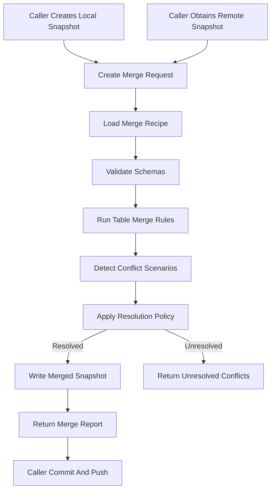

# DbMerger Core Spec

## 1. 文件定位

本文件是 DbMerger supporting domain 的 living spec，用來描述資料庫語意合併目前應該如何運作。

DbMerger 的目標是：

1. 將 database snapshot 合併問題從呼叫端系統中抽離，形成可重用的 supporting domain。
2. 用 domain-level contract 描述 database merge session、merge recipe、conflict scenario 與 conflict resolution policy。
3. 讓呼叫端可以決定 conflict 應採 local-win、remote-win 或未來其他策略，而不是由 DbMerger 寫死。
4. 產生可被呼叫端 commit / push / restore 的 merged database artifact。
5. 避免呼叫端直接依賴 Git 對 SQLite binary file 做不可靠的自動合併。

DbMerger 不屬於 RonFlow core domain。RonFlow 可以透過 project reference、function call、CLI 或未來其他 adapter 使用 DbMerger，但 RonFlow 的 Project / Task 商業規則不應洩漏到 DbMerger core model。RonFlow-specific table recipe 應是 DbMerger 的一組 recipe / adapter，而不是 DbMerger domain 的硬編碼前提。

若本文件定義的 merge contract 改變，使用 DbMerger 的呼叫端也應同步更新其 sync / backup / recovery spec，避免呼叫端以舊語意呼叫新的 merge 行為。

---

## 2. 核心問題

SQLite database file 是 binary artifact。當 local database 與 remote database 都有變更時，Git 只能看到同一個 binary file 被兩邊修改，無法理解資料列、aggregate、projection 或 delete semantics。

DbMerger 要處理的是：

```text
1. local database snapshot 中有呼叫端尚未成功推送的資料。
2. remote database snapshot 中有其他執行環境已推送的資料。
3. 呼叫端需要合併兩份 snapshot，產生一份 merged snapshot。
4. 合併過程必須保留可自動處理的資料，並明確回報無法安全自動處理的 conflict。
5. conflict 的處理策略應由呼叫端透過 policy 決策，而不是由 DbMerger 永久寫死。
```

DbMerger 的第一個落地使用情境是 RonFlow SQLite-to-GitHub sync。RonFlow 啟動或 mutation 後，可以先取得 local / remote snapshots，呼叫 DbMerger 合併，然後將 merged snapshot commit + push。

---

## 3. 文件使用原則

閱讀與維護本文件時，採以下原則：

1. 本文件描述 DbMerger domain contract，不描述某個特定 UI flow。
2. 本文件描述目前應支援的 merge behavior，而不是一次性資料救援腳本。
3. Recipe-specific 規則應清楚標示所屬 product recipe，例如 RonFlow recipe。
4. 若新增 conflict scenario，應同步定義 resolution policy 的輸入、輸出與 acceptance criteria。
5. 若某種 conflict 無法可靠自動處理，spec 應明確要求停止並回報，而不是默默覆蓋。
6. DbMerger 不應直接 push GitHub；commit / push 是呼叫端 sync adapter 的責任。
7. DbMerger 不應直接開啟 production runtime database；呼叫端應先提供 snapshot path 或 stream。

---

## 4. 核心功能範圍

DbMerger 目前應具備的能力如下：

```text
1. 接收 local database snapshot、remote database snapshot 與 merge recipe。
2. 驗證兩份 snapshot 都符合 recipe 要求的 schema。
3. 依 table merge rule 讀取、比對與合併資料。
4. 依 conflict resolution policy 處理可決策 conflict。
5. 產生 merged database snapshot。
6. 產生 merge report，列出 inserted、updated、unchanged、resolved conflicts 與 unresolved conflicts。
7. 在存在 unresolved conflict 時，依 caller option 決定拒絕輸出 merged database 或輸出 partial merged database。
8. 保證不修改 input snapshots。
```

DbMerger 目前不處理：

```text
1. Git clone / pull / commit / push。
2. runtime database lock 管理。
3. SQLite schema migration。
4. RonAuth identity canonicalization。
5. 多寫入者即時協作。
6. UI conflict resolution workflow。
7. 任意 SQL diff / patch 語言。
```

---

## 5. Ubiquitous Language 對照表

| Concept | 工程/規格用語 | 說明 |
|---|---|---|
| 本地資料庫快照 | Local Snapshot | 呼叫端目前本機 runtime database 的一致性副本。 |
| 遠端資料庫快照 | Remote Snapshot | 呼叫端從外部來源取得的 database snapshot，例如 GitHub database repo。 |
| 合併後快照 | Merged Snapshot | DbMerger 依 recipe 與 policy 產出的 database snapshot。 |
| 合併工作階段 | Merge Session | 一次 local / remote / recipe / policy 合併操作。 |
| 合併配方 | Merge Recipe | 定義 schema validation、table merge rule 與 record identity 的 recipe。 |
| 資料表規則 | Table Merge Rule | 單一 table 的讀取、identity、merge、conflict detection 與 write rule。 |
| 記錄識別 | Record Identity | 判斷兩筆資料是否代表同一 domain record 的 key。 |
| 衝突情境 | Conflict Scenario | local 與 remote 對同一 record 或 semantic identity 產生不一致變更的情境。 |
| 衝突決策策略 | Conflict Resolution Policy | 呼叫端指定的 conflict 處理方式。 |
| Local-Win | Local-Win | 發生可決策 conflict 時採用 local record。 |
| Remote-Win | Remote-Win | 發生可決策 conflict 時採用 remote record。 |
| Latest-Win | Latest-Win | 發生可決策 conflict 時採用 timestamp 較新的 record。 |
| Unresolved Conflict | Unresolved Conflict | DbMerger 無法依 policy 安全處理的 conflict。 |
| Merge Report | Merge Report | DbMerger 回傳的合併摘要、統計與 conflict 明細。 |
| Product Recipe | Product Recipe | 針對特定產品資料庫 schema 的 recipe，例如 RonFlow recipe。 |

---

## 6. Core Merge Flow

### 6.1 Flow Summary

前提：

```text
1. 呼叫端已建立 local database snapshot。
2. 呼叫端已取得 remote database snapshot。
3. 呼叫端已選擇 product recipe。
4. 呼叫端已提供 conflict resolution policy。
5. DbMerger 對 input snapshots 只有讀取權。
```

流程：

```text
1. 呼叫端建立 Merge Request。
2. DbMerger 驗證 local snapshot path、remote snapshot path 與 output path。
3. DbMerger 載入 merge recipe。
4. DbMerger 驗證 local / remote schema 是否符合 recipe。
5. DbMerger 建立 merged database staging area。
6. DbMerger 依 recipe 順序執行 table merge rules。
7. 每個 table rule 讀取 local records 與 remote records。
8. Table rule 依 record identity 對齊資料。
9. Table rule 對新增、相同、可自動合併與 conflict records 做分類。
10. Table rule 對 conflict 呼叫 conflict resolution policy。
11. DbMerger 將 resolved records 寫入 merged database。
12. DbMerger 收集 unresolved conflicts。
13. 若存在 unresolved conflicts 且 request 要求 fail on unresolved conflict，DbMerger 拒絕完成並保留 input snapshots 不變。
14. 若沒有 blocking conflict，DbMerger 輸出 merged snapshot。
15. DbMerger 回傳 Merge Report。
16. 呼叫端決定是否 commit / push merged snapshot。
```

### 6.2 Flow Map



---

## 7. Domain Contract

### 7.1 Merge Request

Merge Request 至少應包含：

```text
1. Local snapshot path。
2. Remote snapshot path。
3. Output merged snapshot path。
4. Product recipe id。
5. Conflict resolution policy。
6. Fail-on-unresolved-conflict option。
7. Optional correlation id for diagnostics。
```

### 7.2 Merge Result

Merge Result 至少應包含：

```text
1. Status: Succeeded / Failed / CompletedWithUnresolvedConflicts。
2. Output merged snapshot path, if produced。
3. Merge report。
4. Diagnostics messages。
5. Blocking error, if failed。
```

### 7.3 Merge Report

Merge Report 至少應包含：

```text
1. Recipe id。
2. Local snapshot identity。
3. Remote snapshot identity。
4. Per-table inserted count。
5. Per-table updated count。
6. Per-table unchanged count。
7. Per-table resolved conflict count。
8. Per-table unresolved conflict count。
9. Conflict entries。
10. StartedAt / CompletedAt。
```

### 7.4 Conflict Entry

Conflict Entry 至少應包含：

```text
1. Table name。
2. Record identity。
3. Conflict scenario。
4. Local summary。
5. Remote summary。
6. Applied resolution policy。
7. Resolution outcome。
8. Message for operator or caller log。
```

---

## 8. Conflict Resolution Policy

### 8.1 Policy Scope

Conflict Resolution Policy 是呼叫端輸入 DbMerger 的決策物件。DbMerger 可以提供 built-in policies，但不應把某個 policy 寫死在 product recipe 中。

第一版應支援：

```text
1. LocalWinPolicy。
2. RemoteWinPolicy。
3. LatestWinPolicy, only when recipe can provide comparable timestamp。
4. FailPolicy。
```

呼叫端也應可提供 custom policy。Custom policy 可以用 interface、delegate 或 strategy object 實作；具體形式由 src 實作決定，但 spec contract 必須保持穩定。

### 8.2 Policy Input

Conflict policy input 至少應包含：

```text
1. Product recipe id。
2. Table name。
3. Record identity。
4. Conflict scenario。
5. Local record summary。
6. Remote record summary。
7. Local timestamp, if available。
8. Remote timestamp, if available。
9. Recipe-provided safe choices。
```

### 8.3 Policy Output

Conflict policy output 應為下列其中一種：

```text
1. UseLocal。
2. UseRemote。
3. UseMergedRecord。
4. MarkUnresolved。
5. FailMerge。
```

Policy 不應直接寫入 database。Policy 只決定 outcome，實際 write 由 table merge rule 執行。

---

## 9. Conflict Scenarios

DbMerger 第一版應至少整理並支援下列 conflict scenario。

### 9.1 Same Identity Different Content

```text
1. local 與 remote 擁有相同 record identity。
2. record content 不同。
3. recipe 無法判定兩者只是可交換順序差異。
4. DbMerger 應呼叫 conflict resolution policy。
```

### 9.2 Same Semantic Identity Different Technical Identity

```text
1. local 與 remote primary key 不同。
2. 但 recipe 判斷它們代表同一 semantic identity。
3. 例如 KnownUsers 中 email 相同但 UserId 不同。
4. DbMerger 應回報 identity drift conflict。
5. 第一版不應自動 remap foreign keys，除非 recipe 明確提供 safe remap rule。
```

### 9.3 Local Delete Remote Update

```text
1. local 缺少某筆 record。
2. remote 有該 record。
3. recipe 可以辨識該 record 曾存在於 local base。
4. 這代表 local delete 與 remote update 或 remote keep 的衝突。
5. 若沒有 base snapshot，第一版不得把缺少 record 一律視為 delete。
```

### 9.4 Remote Delete Local Update

```text
1. remote 缺少某筆 record。
2. local 有該 record。
3. recipe 可以辨識該 record 曾存在於 remote base。
4. 這代表 remote delete 與 local update 或 local keep 的衝突。
5. 若沒有 base snapshot，第一版不得把缺少 record 一律視為 delete。
```

### 9.5 Child Collection Conflict

```text
1. local 與 remote 的 aggregate root 相同。
2. child collection 內存在同 id child 的不同內容。
3. recipe 應先對 child identity 做 union。
4. 同 child identity 不同內容時，應呼叫 conflict resolution policy。
```

### 9.6 Projection Conflict

```text
1. local 與 remote 都保存 derived projection。
2. projection record 可能由 source events / outbox 重新計算。
3. 若 recipe 支援 rebuild projection，應優先 rebuild 而不是 merge counter。
4. 若 recipe 不支援 rebuild，projection conflict 應標示為 unresolved 或採 caller policy。
```

---

## 10. Table Merge Rule Types

DbMerger 第一版應支援下列 table rule 類型。

### 10.1 Keyed Union Rule

適用於 append-like 或 upsert-like table。

```text
1. 以 primary key 或 recipe-defined key 對齊 records。
2. 只存在 local 的 record 寫入 merged snapshot。
3. 只存在 remote 的 record 寫入 merged snapshot。
4. 兩邊都存在且 content 相同時寫入任一方。
5. 兩邊都存在但 content 不同時呼叫 conflict policy。
```

### 10.2 Aggregate Json Rule

適用於 JSON aggregate table，例如 RonFlow Projects / Tasks。

```text
1. 以 aggregate id 對齊 root record。
2. root scalar 欄位依 recipe 規則比較。
3. child collection 依 child id union。
4. child collection 同 id 不同內容時呼叫 conflict policy。
5. recipe 可提供 root timestamp extractor。
6. recipe 可提供 normalize function，避免 JSON property order 造成 false conflict。
```

### 10.3 Derived Projection Rule

適用於 projection / read model。

```text
1. 若 recipe 可從 source records 重建 projection，應重建。
2. 若無法重建，才依 keyed union 或 caller policy 合併。
3. counter 類 projection 不應在沒有 source basis 時直接相加。
```

### 10.4 Caller-Owned Rule

適用於 DbMerger core 不理解的 table。

```text
1. Recipe 可以把 table 標記為 caller-owned。
2. Caller-owned table 必須提供 custom merge callback。
3. 若沒有 callback，該 table 應視為 unsupported schema。
```

---

## 11. RonFlow Recipe 初版規則

RonFlow recipe 是 DbMerger 的第一個 product recipe。它應放在 DbMerger src 中的 recipe / adapter 區域，不應污染 DbMerger core contract。

### 11.1 RonFlow Tables

RonFlow recipe 第一版應承接下列表：

| Table | Rule Type | Identity | 初版合併策略 |
|---|---|---|---|
| KnownUsers | Keyed Union Rule | UserId | UserId union；同 email 不同 UserId 回報 identity drift conflict。 |
| Projects | Aggregate Json Rule | id | root 用 updatedAt 判斷 latest；members / invitations / subtaskTemplates 依 id union。 |
| Tasks | Aggregate Json Rule | id | root 用 activityTimeline 最大 occurredAt 作為 latest timestamp；reminders / subtasks / activityTimeline 依 id 或 normalized event key union。 |
| PushSubscriptions | Keyed Union Rule | Endpoint | 第一版依 caller policy 處理同 endpoint 不同 Data；無 base snapshot 時不推論 delete。 |
| WorkflowThroughputOutbox | Keyed Union Rule | MessageId | union；同 MessageId 不同內容視為 conflict。 |
| WorkflowThroughputBuckets | Derived Projection Rule | ProjectId + BucketType + BucketStart | 優先由 merged outbox / tasks 重建；未實作重建前標為 unsupported 或 caller-owned。 |
| AiAuditOutbox | Keyed Union Rule | MessageId | union；同 MessageId 不同內容視為 conflict。 |
| AiAuditReadModel | Keyed Union Rule | AuditEntryId | union；同 AuditEntryId 不同內容依 ProjectedAt 或 caller policy。 |

### 11.2 RonFlow Delete Semantics

RonFlow 目前多數 core records 採保留式 lifecycle，而不是 physical delete。

```text
1. Task archive / trash 不應被視為 delete。
2. Project / Task table 的缺少 record 在沒有 base snapshot 時不應被視為 delete。
3. PushSubscriptions 可能 physical delete；無 base snapshot 時不應自動把另一側保留的 subscription 刪除。
4. 若未來 RonFlow 加入 permanent delete，recipe 必須新增 tombstone 或 base snapshot 機制後才能安全 merge delete。
```

### 11.3 RonFlow Identity Drift

RonFlow database 保存 OwnerId、Member UserId 與 KnownUsers。若 RonAuth identity 在不同環境不一致，會造成 project visibility 漂移。

```text
1. KnownUsers email 相同但 UserId 不同時，應產生 IdentityDrift conflict。
2. Project ownerEmail / member email 與 KnownUsers UserId 不一致時，應產生 IdentityReference conflict。
3. 第一版 DbMerger 不應自動改寫 OwnerId / Member UserId。
4. 若呼叫端選擇 custom identity remap policy，必須明確輸出 remap report。
```

---

## 12. Failure And Safety Rules

```text
1. DbMerger 不得修改 local snapshot。
2. DbMerger 不得修改 remote snapshot。
3. DbMerger 寫 output path 時應使用 staging file，完成後再 atomic replace。
4. Schema validation 失敗時不得輸出 merged snapshot。
5. Recipe missing required table 時應失敗，除非 recipe 明確標示該 table optional。
6. Unresolved conflict 預設應使 merge failed。
7. 若 caller 允許 completed with unresolved conflicts，Merge Report 必須列出每筆 unresolved conflict。
8. DbMerger 不應吞掉 conflict；任何自動選擇都必須出現在 Merge Report。
9. DbMerger 不應直接讀取 production runtime DB；呼叫端應提供 snapshot。
10. DbMerger 不應直接呼叫 git。
```

---

## 13. Acceptance Criteria

### 13.1 Basic Snapshot Merge

```text
1. 給定 local snapshot 有 record A、remote snapshot 有 record B。
2. A 與 B identity 不同。
3. DbMerger 應輸出同時包含 A 與 B 的 merged snapshot。
4. Merge Report 應記錄 inserted / unchanged 統計。
```

### 13.2 Local-Win Conflict

```text
1. 給定 local 與 remote 有相同 identity 但不同 content。
2. Caller 使用 LocalWinPolicy。
3. DbMerger 應在 merged snapshot 寫入 local record。
4. Merge Report 應記錄該 conflict 由 LocalWinPolicy resolved。
```

### 13.3 Remote-Win Conflict

```text
1. 給定 local 與 remote 有相同 identity 但不同 content。
2. Caller 使用 RemoteWinPolicy。
3. DbMerger 應在 merged snapshot 寫入 remote record。
4. Merge Report 應記錄該 conflict 由 RemoteWinPolicy resolved。
```

### 13.4 Identity Drift Conflict

```text
1. 給定 local KnownUsers 與 remote KnownUsers 存在相同 email 但不同 UserId。
2. RonFlow recipe 應產生 IdentityDrift conflict。
3. 第一版 built-in LocalWinPolicy / RemoteWinPolicy 不應自動 remap foreign keys。
4. 若 caller 設定 fail on unresolved conflict，DbMerger 應失敗且不輸出 merged snapshot。
```

### 13.5 Projection Rebuild

```text
1. 給定 recipe 標示某 projection table 可重建。
2. DbMerger 應使用 merged source records 重建 projection。
3. DbMerger 不應直接相加 local / remote counter。
4. Merge Report 應記錄 projection rebuilt。
```

### 13.6 Input Snapshot Immutability

```text
1. Merge session 執行前後，local snapshot content 不應改變。
2. Merge session 執行前後，remote snapshot content 不應改變。
3. 所有輸出只應寫入 output merged snapshot path 與 diagnostics/report artifact。
```

---

## 14. Implementation Notes

第一版 implementation 可採用 .NET class library，讓 RonFlow 以 project reference / function call 直接使用。

建議 project structure：

```text
support-domain/DbMerger
- docs
  - db-merger-core-spec.md
- src
  - DbMerger.Domain
  - DbMerger.Infrastructure.Sqlite
  - DbMerger.Recipes.RonFlow
  - DbMerger.Tests
```

實作時應優先建立 domain-level tests，再建立 SQLite integration tests。RonFlow API tests 不應直接斷言 DbMerger 內部 table merge details；RonFlow 只需驗證 sync flow 不會覆蓋既有 local database，並可使用 merged database snapshot。

---

## 15. Open Questions

```text
1. DbMerger 第一版是否需要 base snapshot，才能安全處理 physical delete？
2. RonFlow WorkflowThroughputBuckets 應由 outbox 重建，還是由 Tasks + ActivityTimeline 重建？
3. Task aggregate 同 id conflict 是否只用 latest activity timestamp，或需更細的 field-level merge？
4. Project subtaskTemplates 同 id 不同內容時，是否可 latest-win，或必須 caller policy？
5. Identity drift 是否要另拆 IdentityReconciler supporting domain？
6. Merge Report 是否需要 machine-readable JSON artifact，供 UI 或 CLI 顯示？
```
